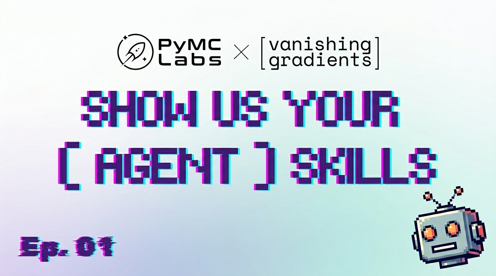

What are people at the top of the game building with AI agents, and how are
they doing it?

Are they Claudemaxxing with 8 terminals open at once? Or adversarially
testing Opus 4.7 generated code with OpenAI Codex? Do they define suites
and swarms of sub-agents, or use AGENTS.md and agent skills?

What do they love about building with agents? What do they hate? What tips
and tricks do they use to supercharge their workflows?

Thomas Wiecki (PyMC Labs) and Hugo Bowne-Anderson (Vanishing Gradients) are
on a mission to find out. Think Excel World Championships meets Eurovision.

This repo turns each episode into browsable, forkable artifacts: markdown
skills, workflow writeups, and tool references you can read, copy, and
adapt to your own setup.

## Episode 1: Wes McKinney, Jeremiah Lowin, Randy Olson

[Watch on YouTube](https://youtube.com/live/Pq3xuChdwxQ)

| Skill | What it does | Guest | Watch |
|-------|--------------|-------|-------|
| [explain](skills/explain) | Agent narrates what it just did, like a teammate handing off. | Jeremiah Lowin (Prefect, FastMCP) | [00:46:14](https://youtube.com/live/Pq3xuChdwxQ?t=2774) |
| [github-reply](skills/github-reply) | Replies to GitHub contributors in your voice, no "Great work, but rejected" sandwiches. | Jeremiah Lowin (Prefect, FastMCP) | [00:54:08](https://youtube.com/live/Pq3xuChdwxQ?t=3248) |
| [ship-it](skills/ship-it) | Re-trains "ship it" to mean *open a PR*, not merge. | Jeremiah Lowin (Prefect, FastMCP) | [00:54:52](https://youtube.com/live/Pq3xuChdwxQ?t=3292) |
| [high-signal-chart-workflow](skills/high-signal-chart-workflow) | Turns a one-line idea into a Tufte-style chart, with an LLM-as-judge verifier loop. | Randy Olson (Goodeye Labs, r/dataisbeautiful) | [01:12:37](https://youtube.com/live/Pq3xuChdwxQ?t=4357) |

Workflow writeups are coming next, starting with Wes McKinney's stack:

- **Agents reviewing agents.** A daemon reads every commit your agents make, so by the time a PR merges, code has been read by agents 4–5 times.
- **A fleet of long-running sessions.** 4–5 Superpowers projects spec'd and implementing in parallel, unattended; one plan ran 14 hours and 45 tasks without him touching it.
- **"Off the rails?" review.** No line-level reading. The only question Wes asks is whether the agent strayed structurally or chased scope creep.

## Upcoming episodes

Register on Luma to join live, or get the recording after.

### Episode 2: Hilary Mason, Bryan Bischof, Eric Ma, Tomasz Tunguz

[Register on Luma](https://luma.com/7kfkk6wb)

Joined by Hilary Mason (CEO, HiddenDoor), Bryan Bischof (Theory Ventures), Eric Ma (leads Research DS in the DS/AI group at Moderna Therapeutics), and Tomasz Tunguz (Theory Ventures).

### Episode 3: Matthew Honnibal & Ines Montani, Eleanor Berger, Alan Nichol, Vincent Warmerdam

[Register on Luma](https://luma.com/le3m0pni)

Joined by Matthew Honnibal & Ines Montani (spaCy, Explosion AI), Eleanor Berger (Elite AI-Assisted Coding), Alan Nichol (Rasa), and Vincent Warmerdam (marimo).

## More from us

Vanishing Gradients is a podcast, workshop series, blog, and newsletter focused on what you can build with AI right now. Over 70 episodes with expert practitioners from Google DeepMind, Netflix, Stanford, and elsewhere. Hundreds of hours of free, hands-on workshops. All independent, all free. [Subscribe on Substack](https://hugobowne.substack.com/).
