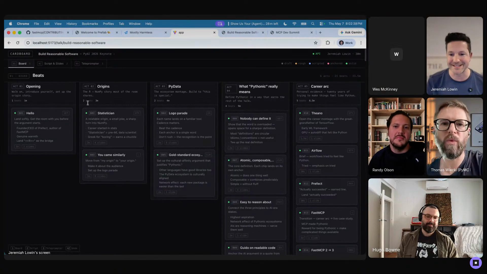

# Jeremiah Lowin - Episode 1 field notes

Jeremiah Lowin, founder and CEO of [Prefect](https://www.prefect.io/), uses agents as a memory substrate, a coding partner, a maintainer assistant, and a way to make private software exactly fit the way he works. His segment starts with agents as a second brain, captured in the repo as the [`second-brain`](https://github.com/hugobowne/show-us-your-agent-skills/tree/main/workflows/second-brain) workflow, and then keeps returning to the same operating principle: the useful agent setup is the one whose memory, harness, skills, APIs, and interfaces match the human who has to live with the result.

He says, *"I use it as a second brain, and so I have big expectations about the information that I put in at a moment coming back out later."* [\[00:35:50\]](https://youtube.com/live/Pq3xuChdwxQ?t=2150) That expectation sits inside a broader personal-software habit: he customizes OpenClaw memory, records morning voice memos, writes skills that encode his vocabulary and tone, keeps [FastMCP](https://github.com/prefecthq/fastmcp) maintenance deliberately human-gated, and builds tools like [Prefab](https://prefab.prefect.io/docs/welcome) and Cardboard around APIs that agents can drive over time.

Jeremiah shows Cardboard's board view, with acts, beats, and slide cards laid out for a talk. He later explains that he drives it through voice, agents, an API, and an MCP server. <a href="https://youtube.com/live/Pq3xuChdwxQ?t=3664">[01:01:04]</a>, <a href="https://youtube.com/live/Pq3xuChdwxQ?t=3733">[01:02:13]</a>

## On working with agents

### What he loves: agents as second brain

Jeremiah's answer to the opening question is memory. He wants ideas, meeting traces, and small observations to become available later when an agent is working with him: *"I use it as a second brain, and so I have big expectations about the information that I put in at a moment coming back out later."* [\[00:35:50\]](https://youtube.com/live/Pq3xuChdwxQ?t=2150)

That leads him toward customized personal software. He uses OpenClaw because he can *"go muck around with its memory in a way that works for me."* [\[00:36:02\]](https://youtube.com/live/Pq3xuChdwxQ?t=2162) The larger theme is *"custom software or just-in-time software"* [\[00:36:14\]](https://youtube.com/live/Pq3xuChdwxQ?t=2174), where the harness is shaped around the user's memory, style, and long-running projects.

### What he finds most frustrating: agents accept framework PRs too readily

Jeremiah's pet peeve comes from maintaining frameworks. Agent code review tends to assume the PR should get in after some changes, which is exactly the wrong default for a framework maintainer: *"the way agents review code, for whatever reason, seems to have a bias that the PR should be accepted."* [\[00:39:42\]](https://youtube.com/live/Pq3xuChdwxQ?t=2382)

His rule for frameworks is stricter: *"Frameworks should not be modified unless whatever's coming in is so overwhelmingly useful to an overwhelming majority of users that the framework should take it on."* [\[00:39:55\]](https://youtube.com/live/Pq3xuChdwxQ?t=2395) He sees this in Prefect and especially [FastMCP](https://github.com/prefecthq/fastmcp), where people build useful and cool things that still do not belong in the framework. [\[00:40:07\]](https://youtube.com/live/Pq3xuChdwxQ?t=2407)

The failure mode is a technically good contribution that violates the framework's purpose. *"How do you say no to something that is technically good but not aligned with the purpose of your framework? So agents turn out to be really bad at that."* [\[00:41:30\]](https://youtube.com/live/Pq3xuChdwxQ?t=2490)

### What would worry him if agent conversations leaked: the same second brain

Jeremiah's leak concern is the inverse of what he loves. The memory store is useful because it contains everything, which also makes it sensitive: *"it's the same second brain that I love so much."* [\[00:42:38\]](https://youtube.com/live/Pq3xuChdwxQ?t=2558)

He jokes about personal fears, but the underlying concern is broad context leakage: *"It's all there, right? All my deepest and darkest fears and how I hate spiders and all that is probably in the brain of this thing."* [\[00:42:40\]](https://youtube.com/live/Pq3xuChdwxQ?t=2560) His blunt summary is that leaked agent memory would be *"worse than my internet history."* [\[00:43:00\]](https://youtube.com/live/Pq3xuChdwxQ?t=2580)

## Workflows

### Feed OpenClaw memory with daily voice notes

Jeremiah uses voice notes to give OpenClaw the personal context that would otherwise stay in his head. The recurring habit is a nearly daily voice memo: *"I record a voice memo almost every morning of what I'm thinking about, what I wanna do."* [\[00:37:01\]](https://youtube.com/live/Pq3xuChdwxQ?t=2221)

On a commute, he may have 30 minutes to talk through the day; at home, it is shorter. In older terms, he says, *"That's my system prompt for the day."* [\[00:37:22\]](https://youtube.com/live/Pq3xuChdwxQ?t=2242)

The same intake loop catches small ideas before they disappear. *"It'll be like I'm walking down the street and I'm like, 'Oh, here's an idea. Oh, we should name it that. Oh, we should do this.'"* [\[00:37:42\]](https://youtube.com/live/Pq3xuChdwxQ?t=2262) Those notes can go in immediately or during the morning ritual. The result is that he has *"teed up my agents"* [\[00:37:57\]](https://youtube.com/live/Pq3xuChdwxQ?t=2277) and can later work to retrieve what he poured in. [\[00:38:00\]](https://youtube.com/live/Pq3xuChdwxQ?t=2280)

### Review FastMCP contributions with agents, then decide by hand

Jeremiah showed the [FastMCP](https://github.com/prefecthq/fastmcp) repository and its contributing posture. The headline from the [contributing doc](https://github.com/prefecthq/fastmcp/blob/main/CONTRIBUTING.md) is simple: *"The best contribution is a great issue."* [\[00:44:07\]](https://youtube.com/live/Pq3xuChdwxQ?t=2647)

He credits Bill Eastin, a FastMCP maintainer, with pushing the idea further in a blog post whose stance was effectively *"We do not accept PRs."* [\[00:43:52\]](https://youtube.com/live/Pq3xuChdwxQ?t=2632) FastMCP did not go that far, but Jeremiah frames the question as one of maintainer alignment: *"What skills have I put in? What biases have I put into it?"* [\[00:44:41\]](https://youtube.com/live/Pq3xuChdwxQ?t=2681) Hugo also linked Jeremiah's [An Open-Source Maintainer's Guide to Saying No](https://jlowin.dev/blog/oss-maintainers-guide-to-saying-no) in Discord during this part of the segment.

The workflow is agent-driven and deliberately manual. *"I will spin up agents to both write my code and review others' code, but ultimately, I will step in, and I will look at it, and I will work on it."* [\[00:45:30\]](https://youtube.com/live/Pq3xuChdwxQ?t=2730)

He accepts the slower pace because he does not trust an army of agents to maintain the framework on his behalf. *"The code base is a lot better off as a result."* [\[00:45:48\]](https://youtube.com/live/Pq3xuChdwxQ?t=2748)

### Use OpenClaw for memory and desktop agents for code

Jeremiah separates OpenClaw's personal-memory role from bounded code work. OpenClaw is his main personal interface because of memory customization, while Claude Desktop and Codex Desktop are for coding. *"When I'm working on code, I use Claude Desktop and Codex, Codex Desktop, which I migrated to from the CLIs mostly because of how much better it is at managing parallel sessions."* [\[01:03:19\]](https://youtube.com/live/Pq3xuChdwxQ?t=3799)

He describes OpenClaw as *"my memory absorber for more asynchronous work."* [\[01:03:40\]](https://youtube.com/live/Pq3xuChdwxQ?t=3820)

### Plan talks in Cardboard by talking to agents

Cardboard extends the second-brain pattern into talk preparation. Jeremiah can feed in an idea for a PyData London talk, close the session, talk to the agent about many other things, then return because OpenClaw's memory substrate carries the state forward. [\[01:02:42\]](https://youtube.com/live/Pq3xuChdwxQ?t=3762)

The actual interaction loop is voice and agent-driven: *"recording a mini voice memo, putting it into an agent, seeing the changes here, reacting in voice, and I can't edit this if I wanted to."* [\[01:02:22\]](https://youtube.com/live/Pq3xuChdwxQ?t=3742)

## Skills

### Explain skill

The [explain skill](https://github.com/hugobowne/show-us-your-agent-skills/tree/main/skills/explain) is Jeremiah's most important skill. He calls it *"a minor, stupid natural language prompt for the agent"* [\[00:46:30\]](https://youtube.com/live/Pq3xuChdwxQ?t=2790), but says one sentence does almost all the work: *"Talk to me like you're explaining this to your colleague who knows about your project but wants to understand what you just did."* [\[00:46:43\]](https://youtube.com/live/Pq3xuChdwxQ?t=2803)

Jeremiah uses it as the handoff between parallel agents and his own attention. When he returns to a project, the skill tells the agent to catch him up at the right altitude instead of giving line-level trivia or a generic codebase summary. The target output is technical context in a *"necessarily technical but not overly verbose way."* [\[00:47:21\]](https://youtube.com/live/Pq3xuChdwxQ?t=2841)

He uses it everywhere: *"It is referenced in every other skill I have."* [\[00:47:59\]](https://youtube.com/live/Pq3xuChdwxQ?t=2879) Of all his skills, it is *"the one that I probably couldn't do without."* [\[00:48:11\]](https://youtube.com/live/Pq3xuChdwxQ?t=2891)

### GitHub Reply skill

The [GitHub Reply skill](https://github.com/hugobowne/show-us-your-agent-skills/tree/main/skills/github-reply) exists to shape how agent-drafted replies sound when Jeremiah is responding to contributors. It encodes tone and clarity. *"I'm usually pretty obvious if I'm using an LLM to draft the reply. It's because I think there's a right way to treat people, and the LLM doesn't do it."* [\[00:54:27\]](https://youtube.com/live/Pq3xuChdwxQ?t=3267)

One concrete rule: *"don't say, 'Great work,' followed by a rejection."* [\[00:54:20\]](https://youtube.com/live/Pq3xuChdwxQ?t=3260)

### Ship this skill

Jeremiah's [`ship this` skill](https://github.com/hugobowne/show-us-your-agent-skills/tree/main/skills/ship-it) maps his phrase to his desired workflow. *"It means open a PR. It does not mean merge the code."* [\[00:55:01\]](https://youtube.com/live/Pq3xuChdwxQ?t=3301)

The skill exists because models interpret the phrase differently than he does. *"I wanna write the words ship it and have the right outcome happen, and this skill is my bridge to ensuring that."* [\[00:55:28\]](https://youtube.com/live/Pq3xuChdwxQ?t=3328)

### Skill creation skill

Jeremiah showed a skill for creating skills, assembled from things he found online. He treats that as part of the living-documents loop: *"this is how we make living documents, and so this skill is how to write an effective skill."* [\[00:55:45\]](https://youtube.com/live/Pq3xuChdwxQ?t=3345)

### Living skills

Jeremiah sees skills as editable local documents that evolve as the work exposes failures. *"I like to think of skills as living documents."* [\[00:53:48\]](https://youtube.com/live/Pq3xuChdwxQ?t=3228)

His skills change when behavior misses the mark: *"Most of these skills are changing as I'm like, 'Oh, this didn't work.'"* [\[00:54:02\]](https://youtube.com/live/Pq3xuChdwxQ?t=3242)

## Tools / projects he showed

### FastMCP

[FastMCP](https://github.com/prefecthq/fastmcp) is the live framework example behind Jeremiah's maintainer workflow. Thomas credits Jeremiah with making MCP usable through FastMCP, and Jeremiah later shows the FastMCP repository and describes himself as its core maintainer. [\[00:45:06\]](https://youtube.com/live/Pq3xuChdwxQ?t=2706)

The core maintenance problem is that FastMCP attracts useful extensions that may still be wrong for the framework. *"They're doing a lot of really cool things with it that don't belong in the framework itself."* [\[00:40:15\]](https://youtube.com/live/Pq3xuChdwxQ?t=2415)

The [FastMCP contributing docs](https://github.com/prefecthq/fastmcp/blob/main/CONTRIBUTING.md) carry the maintainer posture Jeremiah wants contributors and agents to understand. The headline he points to is *"The best contribution is a great issue."* [\[00:44:07\]](https://youtube.com/live/Pq3xuChdwxQ?t=2647)

### OpenClaw

OpenClaw is Jeremiah's main personal interface because he can customize its memory. Early in the segment he says he uses it so he can adjust memory *"in a way that works for me."* [\[00:36:02\]](https://youtube.com/live/Pq3xuChdwxQ?t=2162)

At the end, he makes the division explicit: *"I use OpenClaw as my main personal interface because of how I've customized its memory."* [\[01:03:12\]](https://youtube.com/live/Pq3xuChdwxQ?t=3792)

### Claude and ChatGPT

Jeremiah still uses [Claude](https://claude.ai/) and [ChatGPT](https://chatgpt.com/) as convenient, especially mobile, ways to answer questions or investigate something. For substantial work, though, he wants memory that accumulates over weeks or months: *"most of the real things I wanna know about or work on, I have trickled information in over weeks or months."* [\[00:36:33\]](https://youtube.com/live/Pq3xuChdwxQ?t=2193)

### Claude Desktop and Codex Desktop

For code work, Jeremiah uses [Claude Desktop](https://claude.ai/download) and [Codex Desktop](https://openai.com/index/introducing-the-codex-app/). The reason he gives for moving from CLIs is session management: *"how much better it is at managing parallel sessions."* [\[01:03:25\]](https://youtube.com/live/Pq3xuChdwxQ?t=3805)

### ClawHub

[ClawHub](https://github.com/openclaw/clawhub) appears as the skills repository for OpenClaw. Jeremiah uses it as an example of uneven skill value and popularity: *"huge power law in popularity in those skills."* [\[00:57:02\]](https://youtube.com/live/Pq3xuChdwxQ?t=3422)

He also describes asking OpenClaw whether it wants a skill and getting the answer that the skill is garbage because it already knows the behavior. [\[00:57:13\]](https://youtube.com/live/Pq3xuChdwxQ?t=3433)

### Prefab

[Prefab](https://prefab.prefect.io/docs/welcome) is the Python DSL project Jeremiah showed for MCP apps and generative interactive UIs. It began as a mini project inside FastMCP and became its own thing shortly before the episode. [\[00:57:55\]](https://youtube.com/live/Pq3xuChdwxQ?t=3475)

The motivation is MCP apps in Python without a conventional backend: *"I desperately wanted to create MCP apps in Python, and that meant I needed a Python front-end framework that didn't require a back end."* [\[00:57:39\]](https://youtube.com/live/Pq3xuChdwxQ?t=3459)

He describes the output as *"a Python DSL that generates these generative interactive UIs"* [\[00:58:13\]](https://youtube.com/live/Pq3xuChdwxQ?t=3493), aimed at *"interactive dashboards that can stream from an agent's brain and don't have to be hand-coded."* [\[00:58:34\]](https://youtube.com/live/Pq3xuChdwxQ?t=3514)

Jeremiah shows a LinkedIn post because he cannot find the original website link during the segment. Anders, who works at dbt Labs, had included Prefab in a dashboard overview and styled Prefab with MySpace and Windows themes. *"I just love this. And this is just base Prefab underneath."* [\[01:00:04\]](https://youtube.com/live/Pq3xuChdwxQ?t=3604)

### Cardboard

Cardboard is Jeremiah's custom slide and talk software. It lays out conference talks as cards on a board, using his personal vocabulary of acts, beats, and slides. *"This is the latest version of a piece of software that I call Cardboard, which is for laying out my conference talks as cards."* [\[01:00:42\]](https://youtube.com/live/Pq3xuChdwxQ?t=3642)

The software exists because he wants speaker notes and talk structure in his own format. *"This has been really fun to have a piece of software that exactly makes talks the way I want them, the way I like to give them."* [\[01:01:50\]](https://youtube.com/live/Pq3xuChdwxQ?t=3710)

Its UI is mostly read-only. *"I interact with this entirely over an API or an MCP server, talking to it from any agent I want that can connect to it."* [\[01:02:13\]](https://youtube.com/live/Pq3xuChdwxQ?t=3733)

Jeremiah uses a PyAI Conference keynote as the Cardboard example. The board shows acts, beats, and mocked slides for that talk. [\[01:01:09\]](https://youtube.com/live/Pq3xuChdwxQ?t=3669)

The PyData London talk is his example of why OpenClaw memory matters for Cardboard. He can feed in something now, leave it alone, talk to the agent about many other things, and return to the talk later because of the memory substrate. [\[01:02:42\]](https://youtube.com/live/Pq3xuChdwxQ?t=3762)

### An Open-Source Maintainer's Guide to Saying No

Jeremiah names his blog post about rejecting technically good but misaligned contributions: *"An Open Source Maintainer's Guide to Saying No."* [\[00:41:05\]](https://youtube.com/live/Pq3xuChdwxQ?t=2465)

The [post](https://jlowin.dev/blog/oss-maintainers-guide-to-saying-no) came from the same imbalance he describes on stream: code is cheap to produce, but maintainer attention and framework coherence are still scarce. [\[00:41:07\]](https://youtube.com/live/Pq3xuChdwxQ?t=2467)

### Mostly Harmless: Truly Artificial Intelligence

Hugo names Jeremiah's blog as [Mostly Harmless: Truly Artificial Intelligence](https://jlowin.dev/) and says everyone should check out Jeremiah's work there. [\[00:41:47\]](https://youtube.com/live/Pq3xuChdwxQ?t=2507) Hugo had messaged Jeremiah before the show that it should be called Mostly Harness, and Jeremiah jokes that he meant to rename it before the stream but ran out of time. [\[00:41:56\]](https://youtube.com/live/Pq3xuChdwxQ?t=2516)

## Principles and explainers

### Framework maintenance needs a high acceptance bar

Jeremiah distinguishes framework maintenance from application maintenance. A framework is a substrate for other applications, so useful code can still be a bad framework change. *"I agree, it is useful, it is cool, but I don't want it to go in the framework."* [\[00:40:24\]](https://youtube.com/live/Pq3xuChdwxQ?t=2424)

The maintainer's hard problem is saying no without punishing contributors for the economics of cheap generated code. *"Now that code is so cheap and it's just kinda getting lobbed over, there's this real imbalance as a maintainer."* [\[00:41:17\]](https://youtube.com/live/Pq3xuChdwxQ?t=2477)

### Skills steer behavior

Jeremiah's crisp distinction is that skills change the agent's behavior, while MCPs distribute logic. *"Skills are awesome ways to steer behavior."* [\[00:48:57\]](https://youtube.com/live/Pq3xuChdwxQ?t=2937)

They work because they enter the same channel as user instructions: *"They go into the agent's brain in the exact same way that a message from you does."* [\[00:49:02\]](https://youtube.com/live/Pq3xuChdwxQ?t=2942)

### Skills use progressive disclosure

Jeremiah walks through the anatomy of a skill: name and description in front matter, with the description always visible to the agent. [\[00:51:05\]](https://youtube.com/live/Pq3xuChdwxQ?t=3065)

The rest of the skill is loaded only if the agent invokes it: *"Everything down here is only seen by the agent if and when it decides to invoke the skill."* [\[00:51:17\]](https://youtube.com/live/Pq3xuChdwxQ?t=3077) That is why descriptions matter and why he calls progressive disclosure *"the magic of skills."* [\[00:51:40\]](https://youtube.com/live/Pq3xuChdwxQ?t=3100)

### A skill is a polite note to the agent

Jeremiah gives the limit plainly. A skill can include scripts and other business logic in more complicated zip forms, but the core is still instruction.

His shorthand is even simpler: *"it's a polite note to your agent, and usually it does what the skill says."* [\[00:52:14\]](https://youtube.com/live/Pq3xuChdwxQ?t=3134)

### MCP versus CLI is a distribution debate

Jeremiah's MCP explanation is centered on the MCP versus CLI debate and who needs the business logic distributed from where. *"MCPs are great ways to distribute business logic from a central place."* [\[00:49:09\]](https://youtube.com/live/Pq3xuChdwxQ?t=2949)

For individuals, he says MCP versus CLI is a matter of preference. For enterprises, he says it is settled by operations: *"We're not installing a bunch of CLIs on people's machines. We never have. We never will. It's a nightmare. We're gonna distribute the business logic centrally."* [\[00:49:30\]](https://youtube.com/live/Pq3xuChdwxQ?t=2970)

Jeremiah argues that public discussion overrepresents third-party MCP servers. *"Overwhelmingly, the use case for MCP is distributing internal business logic to internal teams in enterprises."* [\[00:49:56\]](https://youtube.com/live/Pq3xuChdwxQ?t=2996)

That mismatch explains why the MCP versus CLI debate can make sense to a single IDE user working with a third-party GitHub MCP server, while sounding strange to internal enterprise MCP users. [\[00:50:03\]](https://youtube.com/live/Pq3xuChdwxQ?t=3003)

### Personal software is also personal harness design

Jeremiah accepts Thomas's idea of prompt-reviewed GitHub repos because it fits his broader view: *"I'm into personal software basically in the most true sense."* [\[00:56:33\]](https://youtube.com/live/Pq3xuChdwxQ?t=3393)

That also means the way people achieve personal software differs. The base substrate might be OpenClaw, Pi, Claude, or something else, and *"the way people pile on functionality, features, customize it, skills, is deeply personal."* [\[00:56:47\]](https://youtube.com/live/Pq3xuChdwxQ?t=3407)

### MCP apps and generative UIs fit internal dashboards

Prefab connects Jeremiah's MCP enterprise argument to UI generation. Since MCP already fits internal enterprise distribution, he says MCP apps also fit *"data dashboards and distributing information internally."* [\[00:58:01\]](https://youtube.com/live/Pq3xuChdwxQ?t=3481)

The goal is an agent-driven dashboard surface, where a UI can stream from the agent's state and still be interactive without requiring a hand-coded app for every case. [\[00:58:34\]](https://youtube.com/live/Pq3xuChdwxQ?t=3514)

### Agent-facing software can be read-only for humans

Cardboard's UI is deliberately read-only for Jeremiah. The agent writes through an API or MCP server, while Jeremiah views the output, reacts in voice, and lets the agent make the changes. [\[01:02:07\]](https://youtube.com/live/Pq3xuChdwxQ?t=3727)

That mechanism is why Cardboard fits the segment's larger pattern: personal software plus memory plus agent-addressable interfaces.

## Additional quotations

- On context accumulated over time: *"most of the real things I wanna know about or work on, I have trickled information in over weeks or months."* [\[00:36:33\]](https://youtube.com/live/Pq3xuChdwxQ?t=2193)

- On the payoff from memory: *"that's been a huge unlock for me and it's been a really valuable habit to fall into."* [\[00:37:33\]](https://youtube.com/live/Pq3xuChdwxQ?t=2253)

- On what he loves: *"just pouring information in and then working to get it out."* [\[00:38:00\]](https://youtube.com/live/Pq3xuChdwxQ?t=2280)

- On agent-reviewed framework contributions: *"this thing will come in and the code's fantastic, but what it does is not something that belongs in the larger framework."* [\[00:40:33\]](https://youtube.com/live/Pq3xuChdwxQ?t=2433)

- On the blog-name joke: Hugo says he had messaged Jeremiah that [Mostly Harmless](https://jlowin.dev/) should be called Mostly Harness, and Jeremiah replies, *"I meant to do it just for you before this, but I ran out of time."* [\[00:41:56\]](https://youtube.com/live/Pq3xuChdwxQ?t=2516)

- On agent-aligned style: *"not that much, but just enough that it's stylistically aligned in a way that's gonna make it easy to maintain the code later."* [\[00:44:45\]](https://youtube.com/live/Pq3xuChdwxQ?t=2685)

- On the skill not being perfect: *"a lot of times I have to say use your explain skill even when I say, 'Explain this to me.'"* [\[00:52:37\]](https://youtube.com/live/Pq3xuChdwxQ?t=3157)

- On LLM-authored skills: *"it has all the little telltale negative contrasts and all of that."* [\[00:53:43\]](https://youtube.com/live/Pq3xuChdwxQ?t=3223)

- On saying no in GitHub replies: *"No, we have to politely say no."* [\[00:54:45\]](https://youtube.com/live/Pq3xuChdwxQ?t=3285)

- On Prefab's invitation: *"very open invitation here to come play and contribute."* [\[00:58:42\]](https://youtube.com/live/Pq3xuChdwxQ?t=3522)

- On Cardboard's possible release: *"Maybe if folks wanna see it, we'll get it out."* [\[01:04:01\]](https://youtube.com/live/Pq3xuChdwxQ?t=3841)

## Live reactions and follow-ups

### Discord links: Jeremiah's segment supplied the source trail

The Discord chat filled in the links around Jeremiah's segment:

- [An Open-Source Maintainer's Guide to Saying No](https://jlowin.dev/blog/oss-maintainers-guide-to-saying-no)
- [FastMCP](https://github.com/prefecthq/fastmcp)
- [Prefab docs](https://prefab.prefect.io/docs/welcome)
- [Show Us Your Agent Skills repo](https://github.com/hugobowne/show-us-your-agent-skills), where Hugo said the skills or links to them would land

### Discord question: the second-brain stack was the live curiosity

During Jeremiah's segment, the chat asked for more detail on his second-brain stack, especially what sits beyond OpenClaw and how memory modifications are shared. Another question asked whether the skill file he showed was public. Those questions underline the same curiosity the segment created around his memory setup and shareable skills.

### Randy and Hugo's follow-up: living skills and harnesses

Randy later backed Jeremiah's point that skills should keep changing: *"I completely agree with Jeremiah here, you should treat your skills as a living artifact."* [\[01:18:17\]](https://youtube.com/live/Pq3xuChdwxQ?t=4697)

Hugo then tied that to harness design. When you add a skill or MCP server, it becomes part of the harness around the model: *"the idea of iterating constantly on a skill is part of the mental model of continually building and rebuilding your harness."* [\[01:19:28\]](https://youtube.com/live/Pq3xuChdwxQ?t=4768)

### Jeremiah's eval follow-up: repeated runs reveal variation

Near the end, Randy asks Jeremiah about agents gaming evaluators and verifiers. Jeremiah's answer comes from Marvin and early LLM-judge work: *"that variation really plays out in a way that you don't notice in a one-off conversation."* [\[01:40:16\]](https://youtube.com/live/Pq3xuChdwxQ?t=6016)

His practical conclusion is to tune eval use to the precision required: *"I think you just have to temper it for the precision you require in your outcome."* [\[01:41:00\]](https://youtube.com/live/Pq3xuChdwxQ?t=6060)
