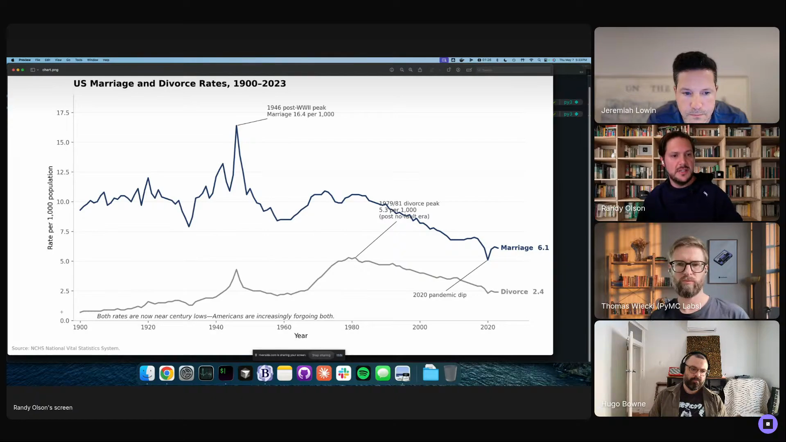

# Randy Olson - Episode 1 field notes

Randy Olson, co-founder and CTO of [Goodeye Labs](https://goodeyelabs.com), longtime AI/ML researcher, data visualization legend, and longtime moderator of [r/dataisbeautiful](https://www.reddit.com/r/dataisbeautiful/), used his Episode 1 segment to show how he turns data visualization judgment into an agent skill. He walked through skill design first: connect useful data sources, set up the environment before work begins, keep long instructions behind progressive disclosure, write exact commands where determinism helps, and improve the skill after each run.

Then he showed the chart workflow running in [Claude Code](https://www.anthropic.com/claude-code): the agent starts from an idea, searches for reliable data, builds a dataset, tries chart variants, checks the output with code and an LLM-as-judge verifier, and opens `chart.png` for Randy to review. Randy built the workflow after a generic prompt failed: *"What popped out was honestly unimpressive. And then that's when I realized, oh, I have to encode still what makes for a good data visualization, at least in my opinion."* [\[01:25:21\]](https://youtube.com/live/Pq3xuChdwxQ?t=5121)

The agent handles the slow search and rendering work. Randy reviews taste, annotation overlap, and whether the chart is worth publishing. *"I run this skill every single morning, and that's how I make that post series."* [\[01:33:24\]](https://youtube.com/live/Pq3xuChdwxQ?t=5604)

Randy shows the marriage and divorce rate chart generated by the workflow. The output has the right data story and a remaining annotation-overlap problem for the human review pass. <a href="https://youtube.com/live/Pq3xuChdwxQ?t=5517">[01:31:57]</a>

## On working with agents

### What he loves: capacity, thought partnership, and stepping away

Randy loves the capacity jump because it removes the old limit between having an idea and building it. *"I'm a builder at heart. I love building things. I have so many ideas, and I've always been limited by capacity in the past."* [\[01:07:10\]](https://youtube.com/live/Pq3xuChdwxQ?t=4030)

He also uses agents as a thought partner. He pairs a growing memory base with a digital twin context so the agent understands he wants pushback rather than agreement: *"I want someone who's not necessarily harsh, but won't just agree with me, but will push back."* [\[01:07:44\]](https://youtube.com/live/Pq3xuChdwxQ?t=4064)

The third benefit is being able to leave the keyboard while work continues. With multiple background sessions running, he can go outside or spend time with family while still checking in. *"Working while being outside touching grass. That's also been really nice."* [\[01:08:02\]](https://youtube.com/live/Pq3xuChdwxQ?t=4082)

### What he finds most frustrating: agents are too agreeable by default

Randy's frustration is the same default posture Jeremiah had been describing: agents assume yes. *"I think it is the natural tendency for them to be extremely agreeable."* [\[01:10:08\]](https://youtube.com/live/Pq3xuChdwxQ?t=4208)

He says that tendency has to be actively countered. *"They're too agreeable by default, and you really have to fight them to get them to not be agreeable."* [\[01:10:28\]](https://youtube.com/live/Pq3xuChdwxQ?t=4228) He has written about prompting agents into constructive disagreement and thinks post-training is starting to improve the behavior, but calls it an ongoing frustration.

### What would worry him if agent conversations leaked: personal details and prompt quirks

Randy's first answer is personal detail leakage: *"of course, all the personal detail stuff. I put a lot in there, too."* [\[01:11:07\]](https://youtube.com/live/Pq3xuChdwxQ?t=4267)

He then turns to the funny residue of repeated agent work: the little prompt tics that show up over and over. *"One of my most typed phrases is probably, 'Be concise and unambiguous.'"* [\[01:11:26\]](https://youtube.com/live/Pq3xuChdwxQ?t=4286) He jokes that he should turn that phrase into a skill.

## Workflows

### Load a digital twin so agents challenge his ideas

Randy keeps a growing memory base where he throws ideas and tracks them. He loads that context into an agent so it knows he wants a critical collaborator: *"When I load an AI agent with what I call a digital twin, it knows I want someone who's not necessarily harsh, but won't just agree with me, but will push back."* [\[01:07:38\]](https://youtube.com/live/Pq3xuChdwxQ?t=4058)

The mechanism is prompting plus personal context. He does not rely on the base model to be naturally critical, because most LLMs still tend toward sycophancy.

### Run slow agent work in parallel while stepping away

Randy uses the same slow background agent pattern that Wes had shown earlier. *"You can have four tabs running in the background and be like, 'You know what? It's beautiful out. It's time to go for a walk.' And you're still getting stuff done."* [\[01:08:12\]](https://youtube.com/live/Pq3xuChdwxQ?t=4092)

Randy describes himself as a workaholic and hyper-focused. Background agents let him leave the 12-hour code tunnel without stopping every task.

### Give agents the data and tools they need to act

Randy's first practical recommendation is to connect the agent to the systems it needs. *"I highly recommend connecting as many data sources as you can to it."* [\[01:14:15\]](https://youtube.com/live/Pq3xuChdwxQ?t=4455)

Access expands what the agent can do: *"The more information you give to your AI agent, whether that's through MCPs, CLIs, whatever, the more it's going to be able to do on your behalf."* [\[01:14:21\]](https://youtube.com/live/Pq3xuChdwxQ?t=4461) His example is an agent that can read a codebase, check the day's changes, and write a Slack report automatically, with colleague permission and IT-approved access.

### Build skills with setup, progressive disclosure, deterministic steps, and reflection

Randy recommends an explicit setup phase before the agent starts writing code. *"Make sure that you have a phase at the start of the skill that your environment is actually set up."* [\[01:15:25\]](https://youtube.com/live/Pq3xuChdwxQ?t=4525)

The failure mode is predictable: without that phase, the agent tries to write Python, crashes, and has to figure out missing dependencies on the fly. A setup phase makes the run smoother because the skill installs or verifies the libraries it needs up front.

Randy decomposes long skills into references so the agent loads only the part it needs. *"Design your skill as actually like a thin driver."* [\[01:16:13\]](https://youtube.com/live/Pq3xuChdwxQ?t=4573)

He ties that to progressive disclosure: each phase can live in a separate markdown file, and a run that starts at phase four does not need to carry phases one through three in context. The skill remains the entry point, while the heavier instructions stay out of context until needed.

He also treats a skill plus an LLM as a kind of program. *"The more specific you can be in your skill, the more repeatable it is in the future."* [\[01:17:23\]](https://youtube.com/live/Pq3xuChdwxQ?t=4643)

His examples include exact steps, exact commands, and exact code snippets. Hugo describes that as deterministic scripts at certain points, and Randy agrees that this gives the workflow degrees of agency and autonomy.

The loop ends by improving the skill itself. *"Have your own skill do a reflect and improve loop."* [\[01:18:15\]](https://youtube.com/live/Pq3xuChdwxQ?t=4695) Each run can expose a missing instruction, a brittle assumption, or a behavior worth preserving, and the skill absorbs that learning: *"Every single run, you're learning something new and putting it into the skill."* [\[01:18:56\]](https://youtube.com/live/Pq3xuChdwxQ?t=4736)

### Generate data visualizations through research, variants, verification, and human taste

Randy's data visualization workflow starts with a one-line idea and a template pulled into Claude Code. In the live demo, the prompt is to *"visualize the history of marriage and divorce in the USA"* [\[01:26:39\]](https://youtube.com/live/Pq3xuChdwxQ?t=5199), then the agent loads the workflow, sets up the environment, searches the web, and turns scattered public sources into a dataset. Randy highlights why that matters: *"It took an idea, researched the web, and then turned it into a dataset."* [\[01:28:01\]](https://youtube.com/live/Pq3xuChdwxQ?t=5281)

The skill then generates chart variants before committing to a direction. *"It creates several variants to try out different chart types. So it'll do line charts, it'll do small multiples, it'll do an area chart."* [\[01:28:29\]](https://youtube.com/live/Pq3xuChdwxQ?t=5309) After that, it runs a verifier loop because Randy does not only tell the agent what to make, he tells it how to check the image: *"You don't want to just tell it what to do, you also want to tell it how to check it."* [\[01:29:30\]](https://youtube.com/live/Pq3xuChdwxQ?t=5370)

Human taste stays at the end of the loop. The agent picked small multiples, but Randy opened the dual-line variant instead, then reviewed whether the chart told a clear story and whether annotations overlapped. He describes the daily production loop as choosing between generated options and catching last-mile visual issues: *"I run this skill every single morning, and that's how I make that post series."* [\[01:33:24\]](https://youtube.com/live/Pq3xuChdwxQ?t=5604)

## Skills

### high-signal-chart-workflow

[`high-signal-chart-workflow`](https://github.com/hugobowne/show-us-your-agent-skills/tree/main/skills/high-signal-chart-workflow) is Randy's chart-making skill. He introduces it as *"this visualization skill workflow that I want to show"* [\[01:12:40\]](https://youtube.com/live/Pq3xuChdwxQ?t=4360), then opens the skill in a terminal.

The skill uses front matter for progressive disclosure, setup instructions for required libraries, research rules that bias the agent toward more reliable data sources, chart-generation steps, and verifier code. Those pieces tell the agent how Randy wants charts researched, rendered, checked, and revised.

The reflection step belongs inside the same skill. Randy says the final phase should ask, *"How did this run go? How can we improve the skill to make it better?"* [\[01:18:47\]](https://youtube.com/live/Pq3xuChdwxQ?t=4727) Each run can feed a correction back into the next version of the workflow.

## Tools / projects he showed

### Teaching an AI Agent to Make Beautiful Charts

Randy showed his [Teaching an AI Agent to Make Beautiful Charts](https://www.randalolson.com/beautiful-charts-with-ai/) page, where he posts data visualizations made with this workflow. He connected those posts to his older public data visualization work: *"What I was always trying to do was to find something interesting or sometimes something silly and, through data visualization, make machine learning, make AI, or even just make data topics more accessible."* [\[01:24:49\]](https://youtube.com/live/Pq3xuChdwxQ?t=5089)

He names examples from that earlier mode: deadliest films by on-screen death counts, Where's Waldo or Wally search paths, optimized road trips, spurious extrapolations about the word "novel" in academic papers, and marble racing visualizations.

### Claude Code

Randy uses [Claude Code](https://www.anthropic.com/claude-code) as the runtime for the visualization prompt. In the demo, he says the displayed text is *"essentially a prompt into Claude Code"* [\[01:26:39\]](https://youtube.com/live/Pq3xuChdwxQ?t=5199), and he recommends using frontier models for the workflow.

Claude Code loads the workflow, sets up the environment, researches datasets, generates variants, runs verification, and opens the resulting chart.

### Template-pulling helper

Randy mentions a helper that pulls the template into the prompt. *"This is a tool that I use to pull it."* [\[01:26:50\]](https://youtube.com/live/Pq3xuChdwxQ?t=5210)

The tool appears as part of the Claude Code invocation: run the template, pull in the workflow, then execute the data visualization task.

### Marriage and divorce visualization demo

Randy's live demo prompt asks the workflow to visualize the history of marriage and divorce in the USA. He pre-ran it because the workflow takes time. The run researches public sources, discovers marriage and divorce rates, reads PDFs and web pages, and builds a single dataset.

Randy had made a similar chart manually before, and the data gathering took an entire weekend. In this run, the agent did the research stage in minutes: *"It literally took me an entire weekend of scraping through PDFs. This data is not cleanly organized out there, and it just did it. I think this part took maybe 5 or 10 minutes."* [\[01:28:17\]](https://youtube.com/live/Pq3xuChdwxQ?t=5297)

The workflow creates multiple chart variants before choosing a direction. *"It creates several variants to try out different chart types. So it'll do line charts, it'll do small multiples, it'll do an area chart."* [\[01:28:29\]](https://youtube.com/live/Pq3xuChdwxQ?t=5309)

Randy describes this as the first act of visualization: look at the data, understand distributions, find useful forms, and then move forward with one option. In the shown run, the agent chose small multiples, while Randy chose to open the dual line variant.

The demo's verifier loop includes code checks and an LLM-as-judge image evaluation. He calls out the principle directly: *"You don't want to just tell it what to do, you also want to tell it how to check it."* [\[01:29:30\]](https://youtube.com/live/Pq3xuChdwxQ?t=5370)

The verifier encodes Tuftean principles and looks directly at the generated image. *"I also use LLM as a judge or evals that encode certain Tuftean principles to actually look directly at the image and then say pass or fail."* [\[01:29:44\]](https://youtube.com/live/Pq3xuChdwxQ?t=5384)

Randy opens `chart.png`, the final image from the workflow. The chart shows marriage and divorce rates over time in the United States, with a post-World War II peak, long-term decline, minimalist annotation, labeled axes, minimal background detail, and no chart junk.

He describes the output as decent and useful: *"It got that data. It shows an interesting story. It calls out interesting aspects."* [\[01:31:24\]](https://youtube.com/live/Pq3xuChdwxQ?t=5484)

### Secretariat chart run

Hugo, not Randy, shows a separate run of Randy's skill using the idea "No horse has broken Secretariat's 1973 Kentucky Derby record." He says he ran the skill after Randy sent it to him and found that it worked well.

Hugo's run found data, generated three parallel variants, used a verifier loop, and surfaced a Randy Olson CSV before choosing Wikipedia instead. The chart was good but still had label overlap, which led back to Randy's daily review role.

## Principles and explainers

### Skills can evolve where models and harnesses are fixed

Randy agrees with Hugo's harness framing and gives skills a specific role inside it. Models are largely fixed unless you run your own, and harnesses are often fixed unless you build your own. *"Whereas the skills are really the thing that can evolve with you, and they can guide the harness plus the model and everything around it towards what you actually want it to do."* [\[01:21:05\]](https://youtube.com/live/Pq3xuChdwxQ?t=4865)

His shorthand is memorable: *"They're just text files. It's great."* [\[01:21:20\]](https://youtube.com/live/Pq3xuChdwxQ?t=4880)

### Skill traces can become training data

When Hugo brings up the idea that newer models may absorb more of the old harness work, Randy says it still makes sense to keep building harnesses and skills because those traces can teach the next model generation: *"That actually can just become training data for the frontier model."* [\[01:22:32\]](https://youtube.com/live/Pq3xuChdwxQ?t=4952)

His ideal outcome is that the model eventually learns the behavior well enough that the skill becomes unnecessary: *"I would love it if they trained on my skill and then we didn't need the skill anymore."* [\[01:22:42\]](https://youtube.com/live/Pq3xuChdwxQ?t=4962)

### Encoding data visualization taste into an agent

Randy's data visualization taste comes from years of making data topics accessible. He cites Edward Tufte as an influence and names the criteria he wants the agent to carry: no chart junk, a clear story, clear annotations, and straightforward use of color.

The skill turns those principles into a working process: *"What if I encoded that principle into an AI agent?"* [\[01:25:56\]](https://youtube.com/live/Pq3xuChdwxQ?t=5156) The agent then has to research, tell a valid data story, and render a chart that satisfies the style checks.

### Dataset discovery is part of the visualization work

In Randy's workflow, dataset discovery is agent work rather than a manual prelude. *"It took an idea, researched the web, and then turned it into a dataset."* [\[01:28:01\]](https://youtube.com/live/Pq3xuChdwxQ?t=5281)

He biases the workflow toward CDC, government, and educational sources so the chart starts from reliable data instead of a random dataset that happens to fit the prompt.

### Verifier loops act as guardrails on open-ended generation

The verifier loop narrows the huge space of possible charts. *"These are basically guardrails on the skill, right? Because what I've told it to do is it opened up this massive realm of possibility."* [\[01:30:12\]](https://youtube.com/live/Pq3xuChdwxQ?t=5412)

The loop uses code checks for things like DPI and LLM-as-judge feedback for visual criteria that are hard to programmatically assess. If the image fails, the judge gives feedback and the agent keeps fixing.

### Annotation overlap remains the hard visual QA problem

Hugo spots the remaining defect in the generated chart: an annotation overlaps a line. Randy immediately names the failure: *"It's this freaking overlap."* [\[01:33:00\]](https://youtube.com/live/Pq3xuChdwxQ?t=5580)

Image-related overlap is still hard for AI systems to detect consistently. Randy's daily role is often choosing between generated options and catching this kind of last-mile visual issue.

### Encoding judgment starts with data scientist habits

When Hugo asks how many judgment loops can be encoded, Randy says he is trying to push that boundary every day. His method is experimentation: *"I really approach it like a data scientist."* [\[01:37:12\]](https://youtube.com/live/Pq3xuChdwxQ?t=5832)

For the Tufte test, he started with known principles, asked an LLM to apply them to images, tried more examples, built sets of good and bad visualizations, and kept tuning. The eval itself becomes a living document.

### Imperfect evals can still be directionally useful

Randy's answer to evaluator gaming and reliability depends on context. If a guardrail prevents something that absolutely cannot happen, he wants something more deterministic. For many other loops, an imperfect eval still helps: *"It's still directionally valuable."* [\[01:41:37\]](https://youtube.com/live/Pq3xuChdwxQ?t=6097)

He has seen the Tufte test judge things wrong, but says it catches obvious issues and saves his attention: *"That's one less time that I have to spend my thought tokens. I'd much rather spend Claude's thought tokens."* [\[01:41:52\]](https://youtube.com/live/Pq3xuChdwxQ?t=6112)

## Additional quotations

- On instant capacity: *"Fire up a new chat, fire up a new tab, boom, you can build that in an hour."* [\[01:07:15\]](https://youtube.com/live/Pq3xuChdwxQ?t=4035)

- On digital twin behavior: *"You can induce that by prompting LLMs."* [\[01:07:51\]](https://youtube.com/live/Pq3xuChdwxQ?t=4071)

- On remote check-ins: *"You can even check in remotely while you're off on a walk or you're spending time with family."* [\[01:08:17\]](https://youtube.com/live/Pq3xuChdwxQ?t=4097)

- On repeated prompt tics: *"I should just turn that into a skill."* [\[01:11:35\]](https://youtube.com/live/Pq3xuChdwxQ?t=4295)

- On the terminal demo: *"This is the actual skill, which we can also make available after this as well."* [\[01:13:49\]](https://youtube.com/live/Pq3xuChdwxQ?t=4429)

- On skill anatomy: *"You have your basic front matter that is used for progressive disclosure."* [\[01:13:57\]](https://youtube.com/live/Pq3xuChdwxQ?t=4437)

- On deterministic commands: *"If you need an environment set up, you can just tell it, 'Run these commands.'"* [\[01:17:42\]](https://youtube.com/live/Pq3xuChdwxQ?t=4662)

- On compounding skills: *"It's compounding, and I think that is a super powerful thing about skills in particular."* [\[01:19:00\]](https://youtube.com/live/Pq3xuChdwxQ?t=4740)

- On the old data viz motivation: *"I was in grad school, so I was looking for any excuse to do anything other than work on my PhD."* [\[01:23:22\]](https://youtube.com/live/Pq3xuChdwxQ?t=5002)

- On source quality: *"I've biased it towards certain sources, the CDC, government and educational institutions, for more reliable data."* [\[01:27:17\]](https://youtube.com/live/Pq3xuChdwxQ?t=5237)

- On the generated chart: *"It got that data. It shows an interesting story."* [\[01:31:24\]](https://youtube.com/live/Pq3xuChdwxQ?t=5484)

- On the secret of his daily prompts: *"You assume I'm typing genius stuff into my prompts, but actually I'm like, 'Looks good. Let's proceed.'"* [\[01:33:43\]](https://youtube.com/live/Pq3xuChdwxQ?t=5623)

## Live reactions and follow-ups

### Discord links: Randy's chart workflow landed in chat

The Discord chat supplied the core links around Randy's demo:

- [Teaching an AI Agent to Make Beautiful Charts](https://www.randalolson.com/beautiful-charts-with-ai/)
- [Building Effective AI Agents](https://www.anthropic.com/engineering/building-effective-agents), linked by Hugo when he connected Randy's generator-evaluator loop to Anthropic's agent workflow taxonomy.
- [Mastering Agentic Data Science](https://www.pymc-labs.com/courses/agentic-ai-data-science), linked by Thomas in response to a live question about conversational analytics and data-science agents.

### Discord reaction: the Tufte-test eval

Corey wrote, *"Love the Tufte-test eval idea!"* after Hugo linked Randy's chart series and the Anthropic post. Another viewer closed the segment with, *"This is insane....I learned so much."*

### Hugo's follow-up: turning judgment into intelligence

Hugo showed his own Secretariat chart run after Randy's demo. The agent found data, generated variants, used the verifier loop, and produced a good chart with the same last-mile overlap issue. Hugo then asked Randy how he approaches taking judgment that normally lives in the human review loop and encoding it into a skill and verifier. [\[01:36:22\]](https://youtube.com/live/Pq3xuChdwxQ?t=5782)
