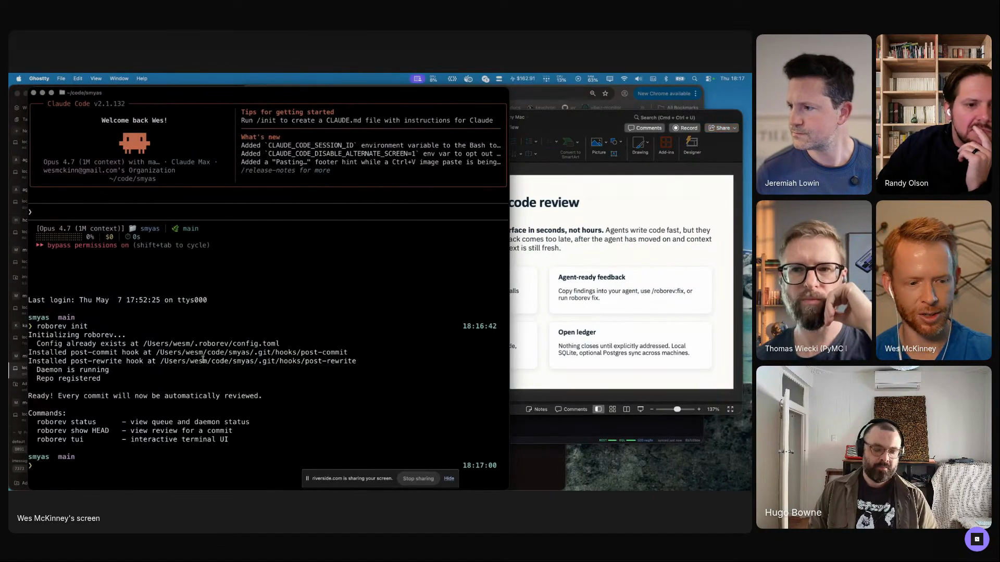

# Wes McKinney - Episode 1 field notes

Wes McKinney, an entrepreneur/software developer focused on analytical computing, came to Episode 1 with a review-centered production loop for high-volume agent coding. The repo captures that pattern as the [`agentic-software-factory`](https://github.com/hugobowne/show-us-your-agent-skills/tree/main/workflows/agentic-software-factory) workflow. He uses a Jesse Vincent line to name what that system is for: *"The difference between vibe coding and agentic engineering is planning, architecture, and caring about the output."* [\[00:11:47\]](https://youtube.com/live/Pq3xuChdwxQ?t=707)

In the previous six months, Wes had *"probably generated on the order of a million lines of code across a dozen projects or so"* [\[00:09:52\]](https://youtube.com/live/Pq3xuChdwxQ?t=592), and in the prior week he was averaging roughly *"1.3, 1.4 billion tokens per day."* [\[00:11:06\]](https://youtube.com/live/Pq3xuChdwxQ?t=666) He used Spicy Takes as a demo target and showed RoboRev, AgentsView, Middleman, kata, Superset, and his Claude Code/Codex setup as pieces of one system: agents commit every turn, RoboRev reviews every commit in the background, agents drain review feedback through fix skills, and Wes uses the surrounding tools to search sessions, triage PRs, track issues, and move between worktrees.

That loop changes what Wes reviews. RoboRev reads *"every line of code that is generated"* [\[00:27:26\]](https://youtube.com/live/Pq3xuChdwxQ?t=1646), and by merge time *"the code has all been read by agents four or five times minimum."* [\[00:27:47\]](https://youtube.com/live/Pq3xuChdwxQ?t=1667) Wes's attention moves to product judgment: whether the software is too complex, has scope creep, or is doing the wrong thing. [\[00:27:52\]](https://youtube.com/live/Pq3xuChdwxQ?t=1672)

Wes is choosing maximum agent productivity while accepting weaker safety boundaries: *"I'm just YOLO mode all the time."* His mitigations are backups and avoiding sensitive data in his home directory, and he frames the choice directly: *"do you wanna be productive or do you wanna be safe?"* [\[00:31:11\]](https://youtube.com/live/Pq3xuChdwxQ?t=1871) His conclusion is blunt: *"to be maximally productive with agents requires you to be a little bit unsafe."* [\[00:31:38\]](https://youtube.com/live/Pq3xuChdwxQ?t=1898)

Wes shows the review-centered agent stack: RoboRev running beside Claude Code and Codex, with usage metrics visible in the demo. <a href="https://youtube.com/live/Pq3xuChdwxQ?t=974">[00:16:14]</a>

## On working with agents

### What he loves: relief from writing code

Wes has loved writing code for decades, so his answer surprised even him: *"I guess not having to write code anymore."* [\[00:05:18\]](https://youtube.com/live/Pq3xuChdwxQ?t=318) Agents now handle *"a lot of the boilerplate and tedium that's involved with building and delivering software projects."* [\[00:05:44\]](https://youtube.com/live/Pq3xuChdwxQ?t=344)

He said the shift produced *"a little bit of a personal identity crisis last year"* [\[00:06:04\]](https://youtube.com/live/Pq3xuChdwxQ?t=364) after he had been tuned out of LLMs through 2023 and 2024 because *"they weren't that good."* [\[00:06:14\]](https://youtube.com/live/Pq3xuChdwxQ?t=374)

### What he finds most frustrating: unreliable instruction following

Wes's frustration is blunt: *"they don't listen, they lie"* and *"they make the same mistakes over and over again."* [\[00:06:44\]](https://youtube.com/live/Pq3xuChdwxQ?t=404)

He connected that frustration to day-to-day model variance in Claude Code: *"each day you wake up and you fire up Claude Code, it's what kind of Claude am I going to get today? Is it going to be smart Claude or dumb Claude?"* [\[00:07:17\]](https://youtube.com/live/Pq3xuChdwxQ?t=437)

### What would worry him if agent conversations leaked: private project context

Wes's first concern was private project context becoming public: *"mostly the private personal projects that I work on becoming public."* [\[00:07:54\]](https://youtube.com/live/Pq3xuChdwxQ?t=474) He clarified that the concern was mundane but real, because those sessions contain *"a lot of private details of my personal life"* and *"non-public information about things that I don't publish on the internet."* [\[00:08:11\]](https://youtube.com/live/Pq3xuChdwxQ?t=491)

He separated that from broader ChatGPT or Claude.ai privacy, where people ask about health and other sensitive topics. His joke-level mitigation for a total leak was to delete public profiles and go *"off the internet."* [\[00:08:36\]](https://youtube.com/live/Pq3xuChdwxQ?t=516)

## Workflows

### Run multiple agent jobs at once

Wes's stack is built for parallel software production. He described *"developing lots of projects in parallel"* while maintaining observability, quality assurance, and development pipeline control. [\[00:12:57\]](https://youtube.com/live/Pq3xuChdwxQ?t=777)

The work has moved beyond experiments: *"I've been building a lot of stuff with AI the last six months or so"* [\[00:09:46\]](https://youtube.com/live/Pq3xuChdwxQ?t=586) and has produced *"on the order of a million lines of code across a dozen projects or so."* [\[00:09:52\]](https://youtube.com/live/Pq3xuChdwxQ?t=592)

Wes runs multiple Superpowers planning sessions across projects during the day: *"I work on four or five projects during the day, I'll run parallel spec interviews with Superpowers."* He participates in those interviews, builds an implementation spec, then sets it implementing. [\[00:20:36\]](https://youtube.com/live/Pq3xuChdwxQ?t=1236)

The process can run for a long time. He said one Superpowers spec *"ran for fourteen hours without stopping,"* which creates enough code that review must be part of the workflow rather than a final manual pass. [\[00:21:23\]](https://youtube.com/live/Pq3xuChdwxQ?t=1283)

### Make agents leave reviewable checkpoints

Wes asks agents to commit constantly: *"I ask my agents to commit every turn, that's a hard rule that's in all of my Claude.md or Agents.md."* [\[00:15:49\]](https://youtube.com/live/Pq3xuChdwxQ?t=949) Those commits give the rest of the system something concrete to inspect.

The checkpoint rule applies whether an agent is working turn by turn or implementing a larger Superpowers plan: *"agents generate code. It gets committed when the turn is over or while the Superpowers plan is implementing."* [\[00:16:51\]](https://youtube.com/live/Pq3xuChdwxQ?t=1011)

### Use RoboRev to turn code review into an agent loop

RoboRev reviews generated code in the background. Wes described it as *"a daemon that runs in the background that reviews all of the code that your agents generate."* [\[00:15:24\]](https://youtube.com/live/Pq3xuChdwxQ?t=924)

RoboRev review feedback lives in a queue or ledger. Wes can explicitly close reviews, and agents can apply review feedback later: *"it will look in the ledger, pick up all the open reviews, fix them, and then commit the fixes."* [\[00:19:37\]](https://youtube.com/live/Pq3xuChdwxQ?t=1177)

For large plans, he has Superpowers pause periodically: *"invoke the RoboRev fix skill every five tasks"* so accumulated issues are handled before they pile up too far. [\[00:21:12\]](https://youtube.com/live/Pq3xuChdwxQ?t=1272)

By merge time, the generated code has been reviewed repeatedly: *"the code has all been read by agents four or five times minimum."* [\[00:27:47\]](https://youtube.com/live/Pq3xuChdwxQ?t=1667)

### Keep parallel agent work easy to see

Wes uses local tools to keep parallel agent work easy to see. [AgentsView](https://www.agentsview.io/) gives him full-text search and analytics across agent sessions, so he can find previous work and inspect token use. [\[00:19:51\]](https://youtube.com/live/Pq3xuChdwxQ?t=1191)

Middleman gives him a local view across GitHub activity: *"a single pane of glass across all of your projects."* [\[00:22:03\]](https://youtube.com/live/Pq3xuChdwxQ?t=1323) Its activity feed shows pushes, comments, commits, and RoboRev reviews across pull requests, and it can fold those reviews back into agent sessions. [\[00:22:17\]](https://youtube.com/live/Pq3xuChdwxQ?t=1337)

After frustration with Beads and GitHub issues, Wes built [kata](https://github.com/wesm/kata) as a simpler local issue tracker. He described it as *"a local replacement for Beads that's a lot simpler"* [\[00:25:16\]](https://youtube.com/live/Pq3xuChdwxQ?t=1516) and useful for *"having your agents keep track of things in a local issue tracker."* [\[00:25:31\]](https://youtube.com/live/Pq3xuChdwxQ?t=1531)

Wes uses [Superset](https://superset.sh/) to move among worktrees, each with the same agent stack: *"every Git worktree has a stack of terminals"* [\[00:25:55\]](https://youtube.com/live/Pq3xuChdwxQ?t=1555) and *"my typical stack is I have Claude Code and/or Codex and RoboRev basically running in every Git worktree."* [\[00:25:59\]](https://youtube.com/live/Pq3xuChdwxQ?t=1559)

## Skills

### RoboRev fix skill

A literal agent skill that consumes the RoboRev review ledger. Wes described invoking it during implementation so it can pick up asynchronous code reviews, fix the issues, apply the fixes, and commit them. *"You can ask the agents while they're implementing or while they're executing to periodically invoke the RoboRev fix skill."* [\[00:17:02\]](https://youtube.com/live/Pq3xuChdwxQ?t=1022)

For larger Superpowers plans, he has the implementation process call it repeatedly: *"invoke the RoboRev fix skill every five tasks"* to keep review debt from accumulating. [\[00:21:12\]](https://youtube.com/live/Pq3xuChdwxQ?t=1272)

### Superpowers sub-agent driven development skill

Wes named [Superpowers](https://github.com/obra/superpowers)' implementation skill as *"sub-agent driven development."* It takes a detailed plan and hands work to sub-agents after the planning phase. [\[00:21:01\]](https://youtube.com/live/Pq3xuChdwxQ?t=1261)

He showed the tradeoff: *"Superpowers generates amazing software, but it also takes a long time to generate very detailed implementation plans."* The planning is intentional because it *"doesn't really trust leaving that much up to the agent"* and tries to decide implementation details up front before handing stages to sub-agents. [\[00:26:33\]](https://youtube.com/live/Pq3xuChdwxQ?t=1593)

## Tools / projects he showed

### Spicy Takes

Wes showed [Spicy Takes](https://www.spicytakes.org/), a site he made to help people read across blogs when they do not have time for long-form posts. [\[00:10:15\]](https://youtube.com/live/Pq3xuChdwxQ?t=615) He described the system as using AI to *"summarize and pull the spiciest quotes out of 11,773 blog posts across 34 different blogs"* from people he follows online. [\[00:10:33\]](https://youtube.com/live/Pq3xuChdwxQ?t=633)

On screen, he browsed several author pages and posts, then used the project as the target for a generated dashboard demo. [\[00:10:43\]](https://youtube.com/live/Pq3xuChdwxQ?t=643)

### Token maxing leaderboard

Wes showed a token maxing leaderboard and identified himself as *"quite the token maxer."* [\[00:11:06\]](https://youtube.com/live/Pq3xuChdwxQ?t=666) In the prior week, he estimated that he averaged *"1.3, 1.4 billion tokens per day."* [\[00:11:16\]](https://youtube.com/live/Pq3xuChdwxQ?t=676)

### Superpowers Skills Framework

Wes's agentic productivity stack *"basically centers around the Superpower Skills Framework,"* created by Jesse Vincent. [\[00:12:37\]](https://youtube.com/live/Pq3xuChdwxQ?t=757)

That framework is the backdrop for the rest of the demo: Wes then said he has been building systems around agentic engineering. [\[00:11:47\]](https://youtube.com/live/Pq3xuChdwxQ?t=707)

### Claude Code

Claude Code is one of Wes's core coding agents. He uses it alongside Codex, and his work over the previous 30 days was about *"three-quarters Claude Code and one-quarter Codex."* [\[00:16:08\]](https://youtube.com/live/Pq3xuChdwxQ?t=968)

It is also the object of his model-variance complaint: *"what kind of Claude am I going to get today?"* [\[00:07:17\]](https://youtube.com/live/Pq3xuChdwxQ?t=437)

### Codex

Wes uses Codex both as a development agent and as a reviewer. In RoboRev, the review prompt shown on screen used Codex Exec with GPT 5.5 and high reasoning. Wes said, *"I found that Codex is the strongest code reviewer out there, at least GPT 5.5."* [\[00:18:42\]](https://youtube.com/live/Pq3xuChdwxQ?t=1122)

### RoboRev

[RoboRev](https://www.roborev.io/) is Wes's background review daemon and terminal UI. He described it as *"a daemon that runs in the background that reviews all of the code that your agents generate."* [\[00:15:24\]](https://youtube.com/live/Pq3xuChdwxQ?t=924)

He initialized it in the Show Me Your Agent Skills repository with post-commit hooks. [\[00:15:41\]](https://youtube.com/live/Pq3xuChdwxQ?t=941) He then generated a trivial README commit and showed the review queue. The UI supports hiding and unhiding closed reviews, keeping a ledger of feedback, and letting agents later fix queued issues. [\[00:17:28\]](https://youtube.com/live/Pq3xuChdwxQ?t=1048)

### macOS token usage widget

Wes showed a small macOS widget tracking his agent work over the last 30 days, with a split of roughly Claude Code and Codex. [\[00:16:08\]](https://youtube.com/live/Pq3xuChdwxQ?t=968) If he paid API rates, he said, *"I'd be paying about $21,000 a month in tokens."* [\[00:16:13\]](https://youtube.com/live/Pq3xuChdwxQ?t=973)

### Show Me Your Agent Skills repository

Wes used the episode's own repository as a demo target and initialized RoboRev there. [\[00:15:41\]](https://youtube.com/live/Pq3xuChdwxQ?t=941) After generating and committing a minimal README placeholder, he asked an agent to *"make a simple dashboard showing frequency of recent spicy takes on the spicytakes.org repository."* [\[00:17:52\]](https://youtube.com/live/Pq3xuChdwxQ?t=1072)

### AgentsView

[AgentsView](https://www.agentsview.io/) is Wes's session database for agent work. He described it as *"a fancy agent session database that provides full text search, analytics on all your agent sessions."* [\[00:19:51\]](https://youtube.com/live/Pq3xuChdwxQ?t=1191)

He did not open his own instance because it contained private project data, but he showed the website and said it supports many agents, plus web and desktop applications. [\[00:20:24\]](https://youtube.com/live/Pq3xuChdwxQ?t=1224)

### Middleman

[Middleman](https://github.com/wesm/middleman) is Wes's local GitHub dashboard. He described it as *"a fancy local GitHub dashboard"* [\[00:21:53\]](https://youtube.com/live/Pq3xuChdwxQ?t=1313) built because GitHub is slow and because it is hard to get *"a single pane of glass across all of your projects."* [\[00:22:03\]](https://youtube.com/live/Pq3xuChdwxQ?t=1323)

The key view is a threaded activity feed across pull requests: *"at a glance see all the activity, the pushes, the comments, the commits that are happening on different pull requests."* [\[00:22:17\]](https://youtube.com/live/Pq3xuChdwxQ?t=1337) It also lets him fold RoboRev reviews back into agent sessions [\[00:22:44\]](https://youtube.com/live/Pq3xuChdwxQ?t=1364) and merge pull requests directly without visiting GitHub. [\[00:23:15\]](https://youtube.com/live/Pq3xuChdwxQ?t=1395)

### kata

[kata](https://github.com/wesm/kata) is Wes's local issue tracker. He initialized it with `kata init` [\[00:24:52\]](https://youtube.com/live/Pq3xuChdwxQ?t=1492) and showed that the repository had no issues yet. [\[00:24:55\]](https://youtube.com/live/Pq3xuChdwxQ?t=1495)

The intended use is agent-friendly project management: he can ask an agent to read the kata quick start and create issues. [\[00:25:07\]](https://youtube.com/live/Pq3xuChdwxQ?t=1507) He positioned it as a simpler local replacement for Beads. [\[00:25:16\]](https://youtube.com/live/Pq3xuChdwxQ?t=1516)

### Superset

[Superset](https://superset.sh/) is a third-party terminal workspace manager. Wes said, *"It creates Git worktrees"* [\[00:25:37\]](https://youtube.com/live/Pq3xuChdwxQ?t=1537) and lets him flip between different projects and worktrees. [\[00:25:46\]](https://youtube.com/live/Pq3xuChdwxQ?t=1546)

In his setup, every worktree has a terminal stack with Claude Code or Codex plus RoboRev. [\[00:25:55\]](https://youtube.com/live/Pq3xuChdwxQ?t=1555) From the right worktree, he can inspect remaining issues and invoke the fix skill. [\[00:26:20\]](https://youtube.com/live/Pq3xuChdwxQ?t=1580)

### Beads

Beads appears as the tool kata is replacing in Wes's local workflow. He said he had been *"burned by Beads"* and that Beads had destroyed some of his Git repositories. He also noted that he had heard it had improved now that it was on Dolt. [\[00:13:23\]](https://youtube.com/live/Pq3xuChdwxQ?t=803)

## Principles and explainers

### Agentic engineering as planning, architecture, and output care

Wes uses Jesse Vincent's line to separate agentic engineering from vibe coding: agentic engineering depends on planning, architecture, and caring about the output. [\[00:11:47\]](https://youtube.com/live/Pq3xuChdwxQ?t=707)

His own version is practical: opening Claude Code and typing prompts stops working once quality and scale matter. He asks, *"how do we manage all this at scale?"* especially when working on multiple projects in parallel. [\[00:12:14\]](https://youtube.com/live/Pq3xuChdwxQ?t=734)

### The observable software factory

Wes's stack treats parallel agent development as a factory that needs observability, quality assurance, pipeline management, and issue tracking. His core question is, *"how do you observe the software factory that you're producing?"* [\[00:13:14\]](https://youtube.com/live/Pq3xuChdwxQ?t=794)

That explains why his projects are peripheral systems around agent work rather than a single coding assistant: RoboRev observes code quality, AgentsView observes sessions and token use, Middleman observes repository activity, kata tracks local issues, and Superset organizes worktrees.

### Code review as production infrastructure

Wes is spending serious token budget on review: *"I've been burning a tremendous amount of tokens to make sure that it's reviewed very thoroughly."* [\[00:29:50\]](https://youtube.com/live/Pq3xuChdwxQ?t=1790)

The economics are visible in the widget, where API-rate usage would be about $21,000 per month. [\[00:16:13\]](https://youtube.com/live/Pq3xuChdwxQ?t=973) The reason is confidence: RoboRev catches *"quite a lot of the most serious issues"* and lets him sleep better from a code-correctness standpoint. [\[00:29:26\]](https://youtube.com/live/Pq3xuChdwxQ?t=1766)

### Superpowers planning before sub-agent execution

Wes explained Superpowers as a planning-heavy system. It *"generates amazing software,"* but detailed plans take time because it tries to decide implementation details before delegating to sub-agents. [\[00:26:33\]](https://youtube.com/live/Pq3xuChdwxQ?t=1593)

His interpretation: the framework *"doesn't really trust leaving that much up to the agent"* and therefore figures out more up front before handing stages to sub-agents. [\[00:26:42\]](https://youtube.com/live/Pq3xuChdwxQ?t=1602)

### Wes decides whether the software is doing the right thing

Wes no longer spends most of his attention reading code line by line. He reviews structure and behavior: *"does it look right? Is it too complex? Does it need to be simplified? Does it have scope creep that's inappropriate?"* [\[00:27:52\]](https://youtube.com/live/Pq3xuChdwxQ?t=1672)

He remains involved in product judgment: *"I'm very engaged in what does the software do? Is it doing the right thing? Is it doing too much? Does it need to be pared back?"* [\[00:28:06\]](https://youtube.com/live/Pq3xuChdwxQ?t=1686)

That judgment is also the limit on the system. Wes wants to push toward *"more of an automated software factory"* [\[00:30:01\]](https://youtube.com/live/Pq3xuChdwxQ?t=1801), but he is already in multiple spec interviews and says, *"I'm already at my decision-making bandwidth. I can't make any more decisions."* [\[00:30:16\]](https://youtube.com/live/Pq3xuChdwxQ?t=1816)

### Productivity, sandboxing, and supply-chain risk

Wes gave a clear security explainer from the builder's side: *"we're all just walking honeypots with our agent sessions."* [\[00:31:28\]](https://youtube.com/live/Pq3xuChdwxQ?t=1888)

The tradeoff is unresolved. He believes maximum productivity currently requires some unsafe behavior, and the field still needs ergonomic sandboxing. [\[00:31:38\]](https://youtube.com/live/Pq3xuChdwxQ?t=1898) Prompt injection and supply-chain attacks become more serious as agents become more capable. [\[00:32:15\]](https://youtube.com/live/Pq3xuChdwxQ?t=1935)

## Additional quotations

- On being late to LLMs: *"I was kind of tuned out of LLMs for all of 2023 and 2024. I was just like, F this."* [\[00:06:14\]](https://youtube.com/live/Pq3xuChdwxQ?t=374)

- On the earlier state of coding models: *"They weren't that good. Yeah, they weren't that good."* [\[00:06:32\]](https://youtube.com/live/Pq3xuChdwxQ?t=392)

- On Spicy Takes: *"people don't have time to read blog posts anymore, and I actually really like reading blog posts."* [\[00:10:20\]](https://youtube.com/live/Pq3xuChdwxQ?t=620)

- On token use: *"I'm burning quite a lot of tokens."* [\[00:11:22\]](https://youtube.com/live/Pq3xuChdwxQ?t=682)

- On GitHub UX: *"GitHub is in leagues with big scroll."* [\[00:24:20\]](https://youtube.com/live/Pq3xuChdwxQ?t=1460)

- On Middleman's benefit: *"to be able to do development and not have to go to GitHub and deal with their flaky mess is pretty great."* [\[00:23:28\]](https://youtube.com/live/Pq3xuChdwxQ?t=1408)

- On nuking bad agent output: *"sometimes the agents will go off the rails and build something that's completely inappropriate. And so then you have to nuke that."* [\[00:28:16\]](https://youtube.com/live/Pq3xuChdwxQ?t=1696)

- On the remaining limit: *"Don't ask me another question. I can't make another decision today."* [\[00:30:17\]](https://youtube.com/live/Pq3xuChdwxQ?t=1817)

- On agent security: *"let me not be prompt injected."* [\[00:32:10\]](https://youtube.com/live/Pq3xuChdwxQ?t=1930)

- On signing off: *"look forward to seeing you all in the Token Mines."* [\[00:32:40\]](https://youtube.com/live/Pq3xuChdwxQ?t=1960)

## Live reactions and follow-ups

### Discord links: Wes's stack landed in chat

The Discord chat filled in the concrete links around Wes's demo while the segment was running:

- [Spicy Takes](https://www.spicytakes.org/)
- [RoboRev](https://www.roborev.io/)
- [AgentsView](https://www.agentsview.io/)
- [Middleman](https://github.com/wesm/middleman)
- [Superpowers](https://github.com/obra/superpowers)

### Discord reaction: token maxing and RoboRev cost

The token numbers became part of the live reaction. Thomas posted, *"Wes is our current tokenmaxxer no. 1!"* in Discord after Wes showed the usage widget. Later, chat asked how token-hungry RoboRev and Middleman were. Hugo relayed a clarification from Wes: Middleman was not token hungry, RoboRev was *"pretty reasonable,"* and Wes kept an OpenAI $200 plan dedicated to it with some plan review on the side.

### Hugo's follow-up: judgment becoming intelligence

Wes's discussion of decision bandwidth came back near the end of the episode during Randy's verifier segment. Hugo framed Randy's work by saying, *"we talked with Wes briefly earlier about encoding, turning judgment into intelligence,"* then connected that to skills and verifier loops that turn repeated human judgment into reusable agent checks. [\[01:36:22\]](https://youtube.com/live/Pq3xuChdwxQ?t=5782)
