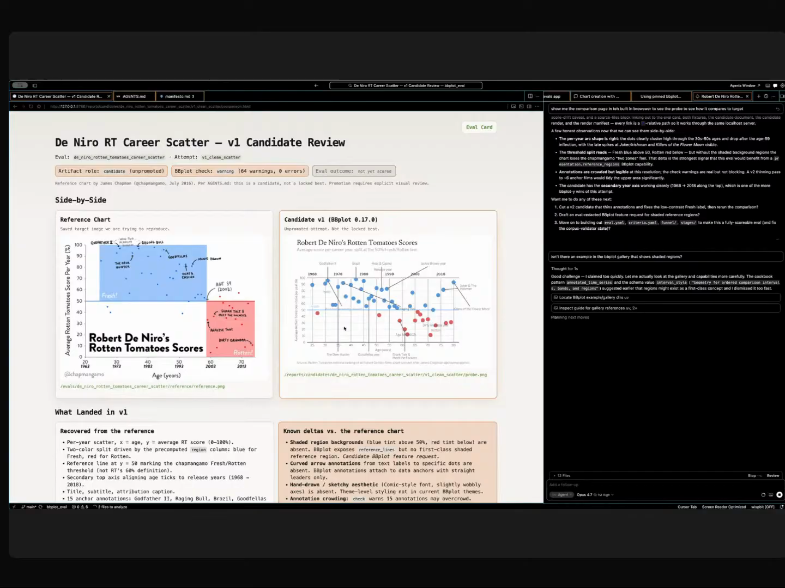

# Bryan Bischof - Episode 2 field notes

Bryan Bischof leads AI at [Theory Ventures](https://theoryvc.com/team-members/bryan-bischof), after AI, data, and ML work at [Hex](https://hex.tech/blog/magic-public-beta/), [Blue Bottle Coffee](https://bluebottlecoffee.com/), [Stitch Fix](https://www.stitchfix.com/), [Weights & Biases](https://wandb.ai/), [O'Reilly](https://www.oreilly.com/), and [Rutgers](https://www.rutgers.edu/). His Episode 2 segment is about turning chart-making with agents from a fragile [Matplotlib](https://matplotlib.org/) conversation into a spec, gallery, eval, and release loop where the chart carries the human's intent along with the rendering instructions.

He starts from a personal shift in ambition: *"I feel like it raises my level of ambition."* [\[01:21:27\]](https://youtube.com/live/l37PR-OkYKA?t=4887) BBPlot is the project that came out of that ambition. Bryan likes charts, wants to make more of them with agents, and is trying to design a grammar of graphics for agent collaboration: *"What would be the grammar of graphics for the agent age?"* [\[01:24:55\]](https://youtube.com/live/l37PR-OkYKA?t=5095)

The demo joins two projects. BBPlot is the static chart package. BBPlot Eval is the separate repo that tests whether fresh agents can use BBPlot to recreate target charts without peeking at the implementation. The repo captures this as the [`eval-driven-charts`](https://github.com/hugobowne/show-us-your-agent-skills/tree/main/workflows/eval-driven-charts) workflow. Bryan's core move is to package context with chart specs, generate variance where requirements are ambiguous, use scene graphs so rendered charts can explain layout problems, and let eval failures drive the package's development. His working loop in [Cursor](https://cursor.com/) has BBPlot Eval on one side, BBPlot on the other, an in-app browser for comparisons, local [DuckDB](https://duckdb.org/) traces, and agent instructions that were hardened after repeated failures.

Bryan returns near the end of the episode with a BBPlot Eval candidate for Robert De Niro's Rotten Tomatoes scores. The first attempt is not promoted because the eval criteria are not satisfied. <a href="https://youtube.com/live/l37PR-OkYKA?t=8095">[02:14:55]</a>

## On working with agents

### What he loves: agents raise his level of ambition

Bryan says agents make him attempt work he would previously have postponed or narrowed. He used to look at ideas and think, *"There's no way I'm gonna have time to do that."* [\[01:21:32\]](https://youtube.com/live/l37PR-OkYKA?t=4892) The new operating mode is more willing to try: *"YOLO. Let's see what happens."* [\[01:21:42\]](https://youtube.com/live/l37PR-OkYKA?t=4902)

That answer explains why BBPlot exists. Chart tooling, eval harnesses, galleries, feature matrices, release ratchets, and agent workflows are too much for a casual charting experiment, but agents made the larger system feel worth attempting.

### What he finds most frustrating: consistency and forgotten context

Bryan's frustration is agent memory across turns. *"I get really frustrated when I tell an agent something, and then two turns later it's completely forgotten what we talked about."* [\[01:22:11\]](https://youtube.com/live/l37PR-OkYKA?t=4931)

He says the failure is strong enough to break the desire to use the tool: *"It drives me nuts. It makes me wanna not use the agent at all, and it makes me very sad."* [\[01:22:18\]](https://youtube.com/live/l37PR-OkYKA?t=4938) BBPlot's context-in-spec design responds directly to the forgotten-context problem, and his later instruction files show the same concern with keeping agent behavior reliable.

### What would worry him if agent conversations leaked: typing and spelling

Bryan's leak concern is comic and mundane: *"Wow, he's really bad at typing."* [\[01:22:39\]](https://youtube.com/live/l37PR-OkYKA?t=4959) He adds the follow-up version: *"Wow. He can't spell anything."* [\[01:22:43\]](https://youtube.com/live/l37PR-OkYKA?t=4963)

Hugo asks whether his spelling-name issue includes accidentally spelling Bryan with an I. Bryan keeps the joke going: *"Not today, but some days."* [\[01:22:50\]](https://youtube.com/live/l37PR-OkYKA?t=4970)

## Workflows

### Preserve human chart choices for later agent work

Bryan built BBPlot because agent chart iteration loses context and breaks layouts. He says agents can get close, then one requested change can break the chart or erase the legend. *"It's very hard to iterate. It's hard to say, here's the vision I have for the chart."* [\[01:24:20\]](https://youtube.com/live/l37PR-OkYKA?t=5060)

The workflow is to make a static chart through a human-agent conversation, then keep the rendering choices and human-provided context in the chart spec. Bryan frames the design question as: *"What if all the charts you wanted to make you were making through a human agent conversation?"* [\[01:25:24\]](https://youtube.com/live/l37PR-OkYKA?t=5124)

Bryan's first manifesto rule is that the spec must describe the chart and the human context. *"A chart spec should enumerate how to render the chart and what context has been provided by the human."* [\[01:26:23\]](https://youtube.com/live/l37PR-OkYKA?t=5183)

The spec also preserves choices across variants and handoffs. He says human choices should live in the chart artifact: *"Every choice that's been made explicit by a human should be codified in the spec."* [\[01:26:33\]](https://youtube.com/live/l37PR-OkYKA?t=5193) Ambiguity becomes a reason to generate options rather than collapse early to one answer. Bryan borrows the Midjourney pattern, where *"you'd ask it for an image, and it would give you four"* [\[01:27:31\]](https://youtube.com/live/l37PR-OkYKA?t=5251), then connects it to recommender-system diversity: *"I'm top K. K does not need to equal one."* [\[01:28:27\]](https://youtube.com/live/l37PR-OkYKA?t=5307)

### Document an agent-facing library with executable examples

Bryan treats the gallery as documentation for agents. *"Every single feature must be demonstrated as part of the gallery with the spec and the image."* [\[01:31:10\]](https://youtube.com/live/l37PR-OkYKA?t=5470)

He then enforces that discipline with a feature matrix. *"Features are linted for. If a new feature is introduced and that is not in this feature matrix with a one in one of these rows, it fails linting."* [\[01:37:58\]](https://youtube.com/live/l37PR-OkYKA?t=5878)

This keeps documentation coupled to working examples. BBPlot's gallery is the only path BBPlot Eval agents are allowed to inspect, so every new capability needs both a spec and a rendered image that an agent can learn from.

### Let eval failures drive feature development

Bryan says the DSL should be optimized for agents, but rejects guessing what agents want. *"As a human, I don't actually know what agents want."* [\[01:31:31\]](https://youtube.com/live/l37PR-OkYKA?t=5491) BBPlot Eval is how he replaces intuition with measurement: a separate repo tests what fresh agents can build with BBPlot's documented examples, then feeds generalized failures back into the package.

The separation is deliberate. Bryan says, *"In BBPlot Eval, you are not allowed to look at BBPlot's code."* [\[01:33:12\]](https://youtube.com/live/l37PR-OkYKA?t=5592) BBPlot is pinned and external, so the eval-side agent must work from examples rather than implementation details.

Eval cards define the target chart, prompt, requirements, failure funnels, and predicted ways the agent could fail. Bryan says the goal is not ranking high: *"The goal is not to score high on a benchmark. The goal is to generate information about gaps."* [\[01:34:11\]](https://youtube.com/live/l37PR-OkYKA?t=5651)

When the eval-side builder agent fails, it writes a failure report. Bryan hands the generalized request to the builder agent in BBPlot: *"That is what I hand off to the builder agent in BBPlot, which then is trying to satisfy its requests."* [\[01:35:00\]](https://youtube.com/live/l37PR-OkYKA?t=5700) Versions then ratchet forward. *"We're not allowed to move forward until we have continually ratcheted. We're not always getting better, but we're never getting worse."* [\[01:35:34\]](https://youtube.com/live/l37PR-OkYKA?t=5734)

### Run the package and eval harness as a two-repo loop

Bryan develops in Cursor with BBPlot Eval on the left and BBPlot on the right. *"I primarily use Cursor. I have BBPlot Eval on the left and BBPlot on the right."* [\[01:40:11\]](https://youtube.com/live/l37PR-OkYKA?t=6011)

The usual loop is to talk to the agent, have it open examples in the in-app browser, run evals, and iterate from the results. Bryan can inspect a failure, copy markdown from BBPlot Eval, and paste it into the other builder agent so the package-side work starts from a concrete failure report.

The live return demo shows the same loop on unseen targets. During Tom's segment, Hugo sends Bryan chart images to run through BBPlot Eval. Bryan returns with a Robert De Niro Rotten Tomatoes chart result and shows the first prompt: *"I have a new chart I'd like you to add to our benchmark evals. I'll first ask you to find the data, and then let's see how well we can recreate it with BBPlot."* [\[02:15:47\]](https://youtube.com/live/l37PR-OkYKA?t=8147) The first candidate is rejected, scene graph warnings flag label crowding, and Bryan nudges the agent toward a gallery example for shaded regions.

### Improve agent behavior with instructions, traces, and reviewed notes

Bryan shows a dense set of instructions for BBPlot Eval and BBPlot. One instruction tells the agent to run from an editable install instead of a local checkout, and others define how to run the server and where to get information. He says, *"This is all trying very, very hard to keep the agents honest."* [\[01:41:20\]](https://youtube.com/live/l37PR-OkYKA?t=6080)

He also keeps local traces: *"I do have a local DuckDB instance where it's publishing all the traces and all of the iterations as we go."* [\[01:41:37\]](https://youtube.com/live/l37PR-OkYKA?t=6097) In the BBPlot repo, workflows and notes are written after failures. Bryan tells the agent, *"No, you screwed up again. Make yourself a note,"* then reviews that note. [\[01:42:17\]](https://youtube.com/live/l37PR-OkYKA?t=6137)

## Skills

### BBPlot Eval agent skills and instructions

Bryan explicitly says he has many agent skills because the agent otherwise behaves poorly. He does not name the individual skills on stream, but he shows the instruction layer he uses to keep BBPlot Eval agents honest. *"I have a lot of agent skills because I have found that otherwise the agent does not behave super well."* [\[01:40:49\]](https://youtube.com/live/l37PR-OkYKA?t=6049)

The shown capabilities are instruction-heavy, and Bryan does not name them as separate public skills. They tell the agent how to run BBPlot Eval, where to find information, what it may not do, how to run the server, and how to stay honest when BBPlot is pinned externally.

### Agent-written workflows and failure notes

Bryan shows AGENTS references and workflow files inside the BBPlot repo. He says, *"I have a workflow built. I have multiple workflows actually."* [\[01:42:09\]](https://youtube.com/live/l37PR-OkYKA?t=6129)

The workflows are partly generated by the agent after failures. Bryan does not name the workflow files on stream, but he shows the practice: he complains, tells the agent to write itself a note, then reviews that note. Because he calls these workflows and shows them as agent-facing instructions, they belong here as agent-facing workflows and instructions.

## Tools / projects he showed

### BBPlot

BBPlot is Bryan's static chart package for human-agent chart conversations. He names it as a play on ggplot: *"I decided to create a package called BBPlot instead of ggplot."* [\[01:25:01\]](https://youtube.com/live/l37PR-OkYKA?t=5101)

It is designed around a chart spec that packages rendering instructions and human context. It also emits a scene graph, uses gallery examples as documentation, supports themes, handles arbitrary functions such as a polynomial line fit, and is developed through feature requests generated from eval failures. Bryan plans to open source it when it is ready.

### BBPlot Eval

BBPlot Eval is the separate repo that determines what agents can do with BBPlot. Bryan defines it plainly: *"BBPlot Eval is a project that determines what is possible with BBPlot."* [\[01:32:40\]](https://youtube.com/live/l37PR-OkYKA?t=5560)

Its design includes pinned external BBPlot, target charts, prompts, requirements, eval cards, failure funnels, predictions, builder agents, version evaluation, ratcheting, and orchestration across agents. It is also the project Bryan used for the return demo with the Robert De Niro Rotten Tomatoes chart.

### Cursor

[Cursor](https://cursor.com/) is Bryan's primary development environment for the project. *"I primarily use Cursor,"* he says while showing BBPlot Eval on the left and BBPlot on the right. [\[01:40:11\]](https://youtube.com/live/l37PR-OkYKA?t=6011)

He also reports that he tried to build the project purely in Codex, gave up, and returned to Cursor after local file-system and image-rendering problems.

### In-app browser

Bryan uses the in-app browser as part of the development and demo loop. He says the agent presents examples in the browser, then he iterates with it and runs evals. [\[01:40:27\]](https://youtube.com/live/l37PR-OkYKA?t=6027)

In the return demo, he asks, *"Can you show it to me in the built-in browser?"* so the comparison is easier to present. [\[02:16:29\]](https://youtube.com/live/l37PR-OkYKA?t=8189)

### Local DuckDB trace store

Bryan stores eval traces locally in [DuckDB](https://duckdb.org/). *"I do have a local DuckDB instance where it's publishing all the traces and all of the iterations as we go."* [\[01:41:37\]](https://youtube.com/live/l37PR-OkYKA?t=6097)

The trace store is part of how he builds the eval data and reviews how agents behave over many iterations.

### AGENTS references and workflows

Bryan shows AGENTS files, references, and workflow instructions in both repos. He describes them as specific instructions that teach agents what they may do, where to look, and how to run the system. *"You can see quite a lot of instructions here on very specific things."* [\[01:42:01\]](https://youtube.com/live/l37PR-OkYKA?t=6121)

Some of these are written after failures and reviewed by Bryan, making them part of the system's behavior-improvement loop.

### Gallery and YAML specs

The BBPlot gallery demonstrates chart functionality through specs and rendered images. Bryan points at one example and says, *"The spec demonstrates how I'm generating this thing. And yes, it's YAML. Deal with it."* [\[01:36:34\]](https://youtube.com/live/l37PR-OkYKA?t=5794)

The gallery is also the documentation BBPlot Eval agents are allowed to inspect. In the return demo, Bryan asks the agent whether there is a gallery example showing shaded regions, and the agent uses that to attempt a fix.

### Feature matrix, linting, and feature release notes

The feature matrix enforces that every BBPlot feature is demonstrated. Bryan says a feature without a matrix entry fails linting and cannot be pushed. [\[01:37:58\]](https://youtube.com/live/l37PR-OkYKA?t=5878)

He also shows feature release notes as the way BBPlot communicates changes back to BBPlot Eval. *"It communicates the updates via feature release notes."* [\[01:38:24\]](https://youtube.com/live/l37PR-OkYKA?t=5904)

### Eval cards

Eval cards are Bryan's format for target chart examples. *"All of the examples are eval cards. Those have prompts, those have failure funnels, those have predictions on how the agent could screw up."* [\[01:34:00\]](https://youtube.com/live/l37PR-OkYKA?t=5640)

They define what the agent should try, what success requires, and where failure is likely, so failures can be generalized into feature requests.

### Feature requests

Feature requests are created from eval failures and handed back into BBPlot development. Bryan says, *"Feature requests to BBPlot are developed by generalizing failures on specific evals."* [\[01:34:21\]](https://youtube.com/live/l37PR-OkYKA?t=5661)

He shows a feature-request view where he can inspect issues, specific release versions, copy markdown, and paste it into the other builder agent. [\[01:39:39\]](https://youtube.com/live/l37PR-OkYKA?t=5979)

### Historical chart eval targets

Bryan shows historically important chart targets in BBPlot Eval, including the O-ring temperature risk review, Datasaurus, and Du Bois examples. For the O-ring chart, he says, *"On the left, you see the target. That's the chart that tells the story of the Challenger explosion."* [\[01:38:47\]](https://youtube.com/live/l37PR-OkYKA?t=5927)

On the right is the agent's attempt: *"That's what's possible with BBPlot out of the box."* [\[01:38:55\]](https://youtube.com/live/l37PR-OkYKA?t=5935)

### Robert De Niro Rotten Tomatoes chart

Hugo gives Bryan a Robert De Niro Rotten Tomatoes chart as a live BBPlot Eval target, and Bryan returns after Tom's segment with the result. He starts with the first attempt: *"You can see this is candidate V1."* [\[02:14:43\]](https://youtube.com/live/l37PR-OkYKA?t=8083)

The candidate was not promoted because BBPlot Eval judged it insufficient. It identified missing shaded backgrounds, missing curved arrow annotations, hand-drawn aesthetic mismatch, and label crowding. It also noticed that the age axis extended farther than the target chart and should be truncated around 70.

### Leonardo DiCaprio dating-age chart

Hugo also sends Bryan a Leonardo DiCaprio dating-age chart as a possible BBPlot Eval target. Bryan agrees to run evals on the supplied figures, but the return demo shown in the transcript focuses on the Robert De Niro chart. The DiCaprio chart remains a supplied target artifact rather than a demonstrated result in the captured return segment.

### Opus

Bryan uses [Opus](https://www.anthropic.com/claude) as his daily driver in the project. While discussing his move back to Cursor, he says, *"You can see I'm using Opus for my daily driver now."* [\[01:43:46\]](https://youtube.com/live/l37PR-OkYKA?t=6226)

The transcript does not give a version number for Opus in Bryan's segment.

### Codex

Bryan reports a frustrating experience trying to build BBPlot purely in [Codex](https://openai.com/codex/). He says, *"This was a project that I was trying very hard to build purely in Codex."* [\[01:43:26\]](https://youtube.com/live/l37PR-OkYKA?t=6206)

His reported issue is narrow to this project: he says Codex was unable to use a local file system reliably and kept breaking image rendering, so he gave up and returned to Cursor. [\[01:43:30\]](https://youtube.com/live/l37PR-OkYKA?t=6210)

### Matplotlib

[Matplotlib](https://matplotlib.org/) is the baseline charting library Bryan contrasts with BBPlot. He says agents are good at Matplotlib, but chart conversations around Matplotlib are fragile and lose context when handed to another person or agent.

When showing the gallery, Bryan says, *"I'm not good enough at Matplotlib to make this chart in Matplotlib. I promise you."* [\[01:36:53\]](https://youtube.com/live/l37PR-OkYKA?t=5813) BBPlot is meant to let agents make those charts through specs and examples.

### D3

[D3](https://d3js.org/) is part of Bryan's background as a chart person. He says he used to look at every D3 visualization that dropped on the internet, obsess over them, learn D3, and try to make beautiful visualizations. That background explains why the BBPlot demo cares about visual quality rather than merely producing valid charts. [\[01:23:00\]](https://youtube.com/live/l37PR-OkYKA?t=4980)

### ggplot

[ggplot2](https://ggplot2.tidyverse.org/) is the name BBPlot riffs on and the grammar-of-graphics lineage Bryan invokes. He says he decided to create BBPlot instead of ggplot, and describes himself as a grammar-of-graphics person while asking what that idea should become for the agent age. [\[01:24:50\]](https://youtube.com/live/l37PR-OkYKA?t=5090)

### Midjourney

[Midjourney](https://www.midjourney.com/) is Bryan's example of useful variance. He says it would return four subtly different images, creating a pattern where one might match the user's vision and others might explore nearby or wrong directions. [\[01:27:28\]](https://youtube.com/live/l37PR-OkYKA?t=5248)

That pattern becomes a BBPlot design principle: ambiguity should produce multiple variants before committing to one answer.

### Theory blog post with Adam

Bryan says BBPlot is connected to Theory work and to a planned blog post with Adam about packaging context with content. *"You can package the context with the content to make agents much more reliable."* [\[01:45:06\]](https://youtube.com/live/l37PR-OkYKA?t=6306)

He says the BBPlot package will appear as part of that blog post along with two other examples of making agents more effective.

## Principles and explainers

### Context belongs inside the artifact agents are building

Bryan's core reliability principle is that context should travel with the asset. *"The context should be packaged with the content."* [\[01:26:40\]](https://youtube.com/live/l37PR-OkYKA?t=5200)

He explains the failure mode: when context is separate, it gets lost or forgotten, so the agent has no durable way to preserve the human's intent. BBPlot responds by making the chart spec carry both content and context.

### Top K does not have to equal one

Bryan's recommender-system background gives him a compact rule for agent output diversity: *"K does not need to equal one."* [\[01:28:27\]](https://youtube.com/live/l37PR-OkYKA?t=5307)

He connects that to diversity in recommendation systems: *"Not getting the top K best, but getting the top K that spans the distribution is even better."* [\[01:28:57\]](https://youtube.com/live/l37PR-OkYKA?t=5337) For agents, the same principle means ambiguous requests should often produce a spread of plausible outputs.

### Rendered output needs a machine-readable account of what overlaps what

Bryan uses scene graphs because chart quality often depends on relationships among objects. *"Yes, you care about what's on the chart, but you also care about where they are and how they relate to one another."* [\[01:29:43\]](https://youtube.com/live/l37PR-OkYKA?t=5383)

The example is annotation and legend placement. A model may see an annotation or a legend, but the scene graph can expose whether labels are stacked on top of one another or the legend overlaps data.

### Documentation for agent consumers should be executable examples

Bryan expects agents to be main consumers of BBPlot documentation. *"BBPlot is not for humans. BBPlot is for humans plus agents."* [\[01:31:01\]](https://youtube.com/live/l37PR-OkYKA?t=5461)

That changes documentation into a gallery of specs and images. The agent should be able to learn functionality from demonstrated examples, and the repo should fail linting when a feature lacks a demonstrated example.

### Agent-optimized design should be discovered through evals

Bryan's hat points to evals because human guesses about agent preference are unreliable. *"There's only one way that we could ever hope to determine what agents want. And it's on my hat."* [\[01:31:49\]](https://youtube.com/live/l37PR-OkYKA?t=5509)

The principle drives the separate eval repo, builder agents, failure reports, and version ratchet. Bryan wants the DSL to evolve toward what agents can actually use.

### Separate repos help prevent eval gaming

BBPlot Eval's separation from BBPlot is a design control. Bryan says the eval agent can only look at documented examples, and Hugo reinforces that agents should not have hidden access to Git history or adjacent directories.

Bryan's answer is simple: *"That's why it's pinned."* [\[01:33:46\]](https://youtube.com/live/l37PR-OkYKA?t=5626) The package under test is external to the eval repo, so the eval exercises the same documentation path an outside agent would use.

### Benchmarks should produce information about gaps

Bryan presents BBPlot Eval as a gap finder. He says, *"The goal is to generate information about gaps."* [\[01:34:16\]](https://youtube.com/live/l37PR-OkYKA?t=5656)

That is why feature requests must generalize from specific failures. The eval tells BBPlot what class of capability is missing, while the feature request avoids overfitting to one target chart.

### Good agent systems can evolve without assuming the human knows the right implementation

Thomas describes Bryan's workflow as software steering itself through adversarial effects. Bryan agrees and explains the human role: *"I don't really know what's good. What I do know is what charts would be great to be able to produce, and I can be a very, very late backstop on this chart looks bad."* [\[01:44:20\]](https://youtube.com/live/l37PR-OkYKA?t=6260)

He lets agents and evals handle much of the pathway from failure to feature request, while he supplies the target charts and final visual judgment.

### Agent instructions need repeated iteration and review

Bryan rejects the idea that writing instructions once solves agent behavior. *"I wish I could say, I wrote down these agent instructions and they worked and everything was happy, but that is not the case."* [\[01:43:13\]](https://youtube.com/live/l37PR-OkYKA?t=6193)

He says the instructions required many iterations and produced a lot of slop. His response is to make agents write notes after failures, then review those notes so they generalize beyond the immediate file or mistake.

### Packaging context with content is a broader Theory working thesis

Bryan says BBPlot is one demonstration of a larger Theory project with Adam. They are writing about the claim that packaging context with content makes agents more reliable. [\[01:45:06\]](https://youtube.com/live/l37PR-OkYKA?t=6306)

The planned blog post will include BBPlot plus two other examples of agent work where the same context-packaging pattern improves effectiveness.

### BBPlot Eval can critique an unseen chart attempt before human feedback

The return demo shows BBPlot Eval refusing to promote the first Robert De Niro chart candidate. Bryan says, *"This has not been promoted because it doesn't think that it was good enough."* [\[02:14:47\]](https://youtube.com/live/l37PR-OkYKA?t=8087)

The agent identifies unsatisfied criteria and uses scene graph warnings for label crowding before Bryan starts giving feedback. The follow-up feedback points it toward an existing gallery example for shaded regions.

## Additional quotations

- On taking on more ambitious work with agents: *"I actually do much more ambitious things than I would've done before."* [\[01:21:47\]](https://youtube.com/live/l37PR-OkYKA?t=4907)

- On loving charts: *"I just really, really like looking at charts."* [\[01:23:00\]](https://youtube.com/live/l37PR-OkYKA?t=4980)

- On agent chart failures: *"You will make a chart, and it will be kind of close, and then you'll ask for one change, and it will somehow manage to completely break the chart."* [\[01:24:02\]](https://youtube.com/live/l37PR-OkYKA?t=5042)

- On portable chart context: *"I can dump a ton of Matplotlib on somebody else or on another agent, and all the context is lost."* [\[01:24:34\]](https://youtube.com/live/l37PR-OkYKA?t=5074)

- On the first public showing: *"This is the first time I've shown this to anyone, so we're gonna give it hell."* [\[01:25:47\]](https://youtube.com/live/l37PR-OkYKA?t=5147)

- On the manifesto: *"Like all great movements in technology or politics, I started with a manifesto."* [\[01:26:12\]](https://youtube.com/live/l37PR-OkYKA?t=5172)

- On Midjourney as a pattern: *"I think that's a great design pattern."* [\[01:27:47\]](https://youtube.com/live/l37PR-OkYKA?t=5267)

- On overexplaining recommendation diversity: *"I could ramble about this for too long, so I will move on."* [\[01:29:04\]](https://youtube.com/live/l37PR-OkYKA?t=5344)

- On BBPlot's audience: *"BBPlot is for humans plus agents."* [\[01:31:01\]](https://youtube.com/live/l37PR-OkYKA?t=5461)

- On the YAML spec: *"And yes, it's YAML. Deal with it."* [\[01:36:34\]](https://youtube.com/live/l37PR-OkYKA?t=5794)

- On chart aesthetics: *"I love charts. I wanna make beautiful charts. I don't wanna suffer in the bad place of charting."* [\[01:37:23\]](https://youtube.com/live/l37PR-OkYKA?t=5843)

- On the historical chart demos: *"I didn't make these charts. Some random agent with very little context made them."* [\[01:39:22\]](https://youtube.com/live/l37PR-OkYKA?t=5962)

- On fast handoff between projects: *"This allows me to paste it right into the other builder agent, so that workflow is very fast."* [\[01:39:57\]](https://youtube.com/live/l37PR-OkYKA?t=5997)

- On agent-written notes: *"No, you screwed up again. Make yourself a note."* [\[01:42:19\]](https://youtube.com/live/l37PR-OkYKA?t=6139)

- On the difficulty of instruction writing: *"It required an incredible number of iterations, and there's been a lot of slop."* [\[01:43:18\]](https://youtube.com/live/l37PR-OkYKA?t=6198)

- On the reported Codex experience in this project: *"I completely gave up and went back to Cursor."* [\[01:43:39\]](https://youtube.com/live/l37PR-OkYKA?t=6219)

- On open-sourcing timing: *"If it's not done by the end of this month, I'm gonna be annoyed."* [\[01:44:43\]](https://youtube.com/live/l37PR-OkYKA?t=6283)

- On the Robert De Niro return demo: *"That's what it's like to build a BBPlot."* [\[02:17:09\]](https://youtube.com/live/l37PR-OkYKA?t=8229)

## Live reactions and follow-ups

### Discord reaction: BBPlot as ggplot for agents

As Bryan introduced BBPlot, Discord picked up the name and grammar-of-graphics reference quickly. Suren wrote, "bbplot is the new ggplot," then asked whether an agent-oriented chart grammar implies a broader tidyverse-style layer for agents: "if we need ggplot for agents, do we need a dplyr(/data.table) for agents, i.e. pipes & grammar / tidyverse for agents in general."

### Discord question: source code and tinkering

Suren also asked whether someone could see the source code for a BBPlot-produced chart if they wanted to tinker with it separately. Hugo replied that Bryan had said he would open source it soon and would report back. That matched Bryan's on-stream answer that he expected to open source BBPlot once the remaining work was done. [\[01:44:43\]](https://youtube.com/live/l37PR-OkYKA?t=6283)

### Discord reaction: domain expertise and agents

Later in the chat, Seth Tam wrote, "Bryan has expert domain knowledge and that is what agents need." The comment tracks the segment's operating model: Bryan supplies chart taste, eval targets, failure interpretation, and final judgment, while the builder agents and eval harness search for the implementation path.
