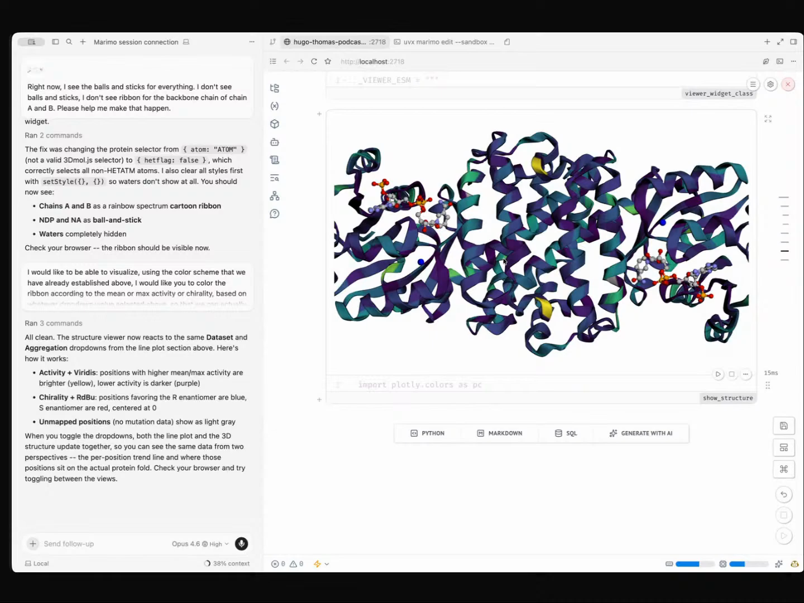

# Eric Ma - Episode 2 field notes

Eric J. Ma leads research data science and AI at [Moderna Therapeutics](https://www.modernatx.com/), and his Episode 2 segment uses agent skills to make [agentic EDA](https://github.com/hugobowne/show-us-your-agent-skills/tree/main/workflows/agentic-eda) feel like a live scientific conversation. The demo centers on responsibility: the agent writes, edits, renders, reaches into the Python kernel, and builds widgets, while Eric keeps choosing the scientific question, the next plot, and the interpretation.

His thesis for agentic data science is direct: *"I don't go into the analysis with a vague question and just ask the agent to do it all for me. That, I think, is irresponsible as a data scientist."* [\[00:23:30\]](https://youtube.com/live/l37PR-OkYKA?t=1410) In the demo, [Cursor](https://cursor.com/), [Marimo Pair](https://github.com/hugobowne/show-us-your-agent-skills/tree/main/skills/marimo-pair), Opus 4.6, [Plotly](https://plotly.com/python/), [AnyWidget](https://anywidget.dev/), [3Dmol.js](https://3dmol.csb.pitt.edu/), and a protein-engineering dataset become one working surface. Eric talks to the agent, the notebook updates, the plots change, and the protein structure becomes a spatial way to decide which mutations matter.

The result is agent work that still looks like data science. Eric asks for a heat map, corrects the color scale, asks for a correlation plot, leaves notes to himself, asks for a protein viewer, catches a visualization mistake, and then asks the notebook to write up the quantitative lack of correlation. The agent accelerates the notebook, and Eric keeps loading the data context into his head.

Eric moves from sequence-level plots into a 3D protein structure view, coloring the protein by mutational effect to see where high-performing mutations sit in space. <a href="https://youtube.com/live/l37PR-OkYKA?t=2220">[00:37:00]</a>

## On working with agents

### What he loves: boring work goes away and learning gets amplified

Eric's first answer is practical: *"A lot of the boring stuff doesn't have to be done."* [\[00:04:57\]](https://youtube.com/live/l37PR-OkYKA?t=297) He extends that into a learning claim. Agents amplify what he already knows, and they also help him notice missing knowledge when he is careful with them: *"it actually can help me amplify where I don't know what I don't know."* [\[00:05:36\]](https://youtube.com/live/l37PR-OkYKA?t=336)

He wants the agent as a thinking partner that can challenge him: *"There are ways to use AI in that way as Socrates instead of a sycophant."* [\[00:05:56\]](https://youtube.com/live/l37PR-OkYKA?t=356)

### What he finds most frustrating: intelligence is still expensive

Eric's frustration is model capability per dollar. *"I think it's the lower intelligence models keeps me frustrated,"* he says, then names the economic problem: *"I think it's the pricing and economics that's a little bit something that we have to keep dancing around. I just don't like that."* [\[00:07:28\]](https://youtube.com/live/l37PR-OkYKA?t=448)

That sends him looking for cheaper model routes: *"I would love to see intelligence for cheap for real."* [\[00:07:39\]](https://youtube.com/live/l37PR-OkYKA?t=459) He experiments with [Kimi](https://www.kimi.com/), a [GLM](https://chat.z.ai/) coding plan, [OpenRouter](https://openrouter.ai/), [Ollama](https://ollama.com/)-hosted Kimi, and local [Qwen](https://qwenlm.github.io/) models, while also checking where servers are hosted for personal-use comfort.

### What would worry him if agent conversations leaked: agent-driven Git

Eric's leak concern is funny because it is operational: *"the fact that I do commits and pushes by agent commands."* [\[00:09:50\]](https://youtube.com/live/l37PR-OkYKA?t=590) He adds, *"I don't do Git commit on the terminal anymore."* [\[00:09:56\]](https://youtube.com/live/l37PR-OkYKA?t=596)

The embarrassing private prompt is a rebase prompt: *"help me resolve merge conflicts on the PR such that I can rebase to merge later."* [\[00:10:56\]](https://youtube.com/live/l37PR-OkYKA?t=656) The point is still real: agents have taken over a Git workflow he does not want to think about.

## Workflows

### Shop for cheaper intelligence across models and harnesses

Eric works around expensive frontier intelligence by trying alternative models and routing layers. He says the pricing problem has *"motivated a lot of experimenting with alternative models to Opus and stuff."* [\[00:07:43\]](https://youtube.com/live/l37PR-OkYKA?t=463)

His setup includes Kimi, a GLM coding plan, OpenRouter access to Kimi K2.5, Ollama-hosted Kimi K2.5, local Qwen, Cursor, cmux, and opencode sessions with different models. He also verifies that some servers are hosted outside mainland China and limits those routes to personal use. [\[00:07:51\]](https://youtube.com/live/l37PR-OkYKA?t=471)

### Hand boring Git work to agents

Eric no longer treats Git commands as manual terminal work. His answer to the leak question is that he does *"commits and pushes by agent commands"* [\[00:09:50\]](https://youtube.com/live/l37PR-OkYKA?t=590), and he tells the agent to resolve merge conflicts so he can rebase and merge later. [\[00:10:56\]](https://youtube.com/live/l37PR-OkYKA?t=656)

Hugo connects this to the boring-work answer, because Git has become easier most of the time and uglier only in the rebase edge cases. Eric's workflow gives those edge cases to the agent.

### Do agentic data science in a live Marimo Pair notebook

Eric's demo shows how he wants agentic data science to work: the scientist stays in charge of the questions and interpretation, while the agent edits a live notebook, reaches into the Python kernel, renders plots, and keeps the analysis documented as it grows.

Before Marimo Pair, that workflow was script-based. For a CSV file, he would *"write a UV runnable script that is PEP 723 style inline script metadata,"* run it to produce a plot, then *"write some text into a journal.md file with my coding agent."* [\[00:12:40\]](https://youtube.com/live/l37PR-OkYKA?t=760)

That workflow existed because Jupyter notebooks gave coding agents no easy way to interact with the running kernel. The workaround was reproducible scripts, saved plots, and markdown journaling.

Eric says he learned about Marimo Pair in March after Trevor Mance from the [Marimo](https://marimo.io/) team showed it to him. He had taught people the script-and-journal workflow at work, then quickly reversed course: *"Guys, I need to take back everything I taught you because there's a better way to do this."* [\[00:13:33\]](https://youtube.com/live/l37PR-OkYKA?t=813)

The same change affected his ODSC agentic data science workshop. He had planned to teach reproducible UV scripts, plots, and `journal.md`, then threw that out and showed Marimo Pair instead. [\[00:14:00\]](https://youtube.com/live/l37PR-OkYKA?t=840)

Eric shares the Cursor agent view, starts a new Marimo session with `uvx marimo edit sandbox --no-token`, and creates a notebook named `Hugo Thomas Podcast demo.py`. [\[00:14:33\]](https://youtube.com/live/l37PR-OkYKA?t=873)

He opens the notebook in Cursor's embedded window, connects the agent to the Marimo session, and selects Opus 4.6 for the run. The notebook becomes the visual surface for live analysis while the agent edits cells and talks to the Python kernel.

Eric asks for readable notebooks as the default. When the agent starts building the protein analysis notebook, he calls out that the markdown cells are being created automatically: *"the markdown cells that document your notebook are automatically being created, and that is amazeballer."* [\[00:18:42\]](https://youtube.com/live/l37PR-OkYKA?t=1122)

His local instructions reinforce the style. One rule says to *"interleave explanatory markdown with code so that the notebook is readable and presentation ready"* [\[00:26:22\]](https://youtube.com/live/l37PR-OkYKA?t=1582), and another says to *"give every cell a unique descriptive cell name"* so cells are easy to reference in collaboration and demos. [\[00:26:31\]](https://youtube.com/live/l37PR-OkYKA?t=1591)

### Explore the data one question and one artifact at a time

Eric keeps the analysis incremental. He starts by asking for a Plotly heat map over single-point mutations, with a dropdown for activity versus chirality. Then he corrects the color map because activity lives on a zero-to-one scale while chirality uses a negative-to-positive scale. [\[00:22:03\]](https://youtube.com/live/l37PR-OkYKA?t=1323)

He describes the operating loop directly: *"I'm gaining my analysis one plot at a time."* [\[00:27:48\]](https://youtube.com/live/l37PR-OkYKA?t=1668) He asks what the next logical question is, what plot can answer it, then uses the agent to make that plot.

Eric rejects the mode where the agent owns the whole analysis. *"The human is very much in the loop. The human is there to take responsibility for the actual analysis that's happening and the interpretation that is happening."* [\[00:23:46\]](https://youtube.com/live/l37PR-OkYKA?t=1426)

He also states a rule for evidence: *"you have to have artifacts that back the claims that you have."* [\[00:28:20\]](https://youtube.com/live/l37PR-OkYKA?t=1700) In practice, that means notes, plots, correlations, heat maps, and a 3D structure view that make each scientific claim inspectable.

Eric leaves manual notes in the notebook while the agent keeps building. After seeing a scatter plot, he writes a note to self about the weak relationship between chirality and activity. He calls the setup *"treating the coding agent really as a pair programmer, not as a thing that just does the whole thing for me."* [\[00:29:12\]](https://youtube.com/live/l37PR-OkYKA?t=1752)

Thomas reads the workflow as a senior data scientist working with a junior data scientist, or a scientist working with data scientists. Eric agrees, and the voice interface makes that relationship visible. [\[00:30:00\]](https://youtube.com/live/l37PR-OkYKA?t=1800)

Eric finishes by asking the agent to write the conclusion into a markdown cell: the mutations generally occur at the interface between the two enzymes, and the notebook should calculate and interpolate the quantitative lack of correlation between chirality and activity. [\[00:37:54\]](https://youtube.com/live/l37PR-OkYKA?t=2274)

### Build custom scientific views when ordinary plots are not enough

Eric moves the analysis from a linear mutation view into a 3D protein structure. He asks the agent to build an AnyWidget viewer for the crystallized protein structure, hide waters, show the substrate as balls and sticks, and show chains A and B as a ribbon. [\[00:30:38\]](https://youtube.com/live/l37PR-OkYKA?t=1838)

He then asks the agent to color the ribbon by mean or maximum activity or chirality so he can see whether high-performing mutations are near the substrate or elsewhere. The spatial view matters because *"with the linear left to right view, it's very hard to see."* [\[00:35:37\]](https://youtube.com/live/l37PR-OkYKA?t=2137)

The 3D viewer fails on the first attempt. Eric says, *"Opus made a mistake on this one,"* because it draws balls and sticks for everything and misses the ribbon representation for chains A and B. [\[00:32:51\]](https://youtube.com/live/l37PR-OkYKA?t=1971)

He gives corrective feedback in natural language and the agent fixes the view. The live correction matters because it shows the workflow absorbing mistakes without leaving the notebook surface.

## Skills

### Marimo Pair skill

[Marimo Pair](https://github.com/hugobowne/show-us-your-agent-skills/tree/main/skills/marimo-pair) is the literal agent skill at the center of Eric's demo. He introduces the segment by saying, *"I'm gonna show a data analysis using the Marimo Pair skill, which is I think really, really cool to see."* [\[00:14:22\]](https://youtube.com/live/l37PR-OkYKA?t=862)

He explains its mechanism: *"The way Marimo Pair works is it's actually an agent skill that has both a series of markdown files, plus it also has a bash script that is used by the coding agent to reach directly into the Python runtime, into the Python kernel directly."* [\[00:16:05\]](https://youtube.com/live/l37PR-OkYKA?t=965)

### Blog writing and editing skills

Near the end, Eric says Marimo Pair is one of several skills he uses: *"I have other skills that I use for writing my blog, helping with writing and editing the blog and whatever, but this one has been mind-blowing for me."* [\[00:37:18\]](https://youtube.com/live/l37PR-OkYKA?t=2238)

He does not name those blog skills on stream, so they belong here only as unnamed literal agent skills.

## Tools / projects he showed

### Cursor

Eric runs the demo from [Cursor](https://cursor.com/)'s agent view: *"I'm gonna share the Cursor agent."* [\[00:11:38\]](https://youtube.com/live/l37PR-OkYKA?t=698) He uses Cursor as the main harness for talking to the coding agent, opening the embedded Marimo notebook, and driving the live analysis.

### Marimo Pair

[Marimo Pair](https://github.com/hugobowne/show-us-your-agent-skills/tree/main/skills/marimo-pair) is both the named workflow and the agent-facing bridge into Marimo. Eric says that before he knew about it, he was experimenting with interactive data analysis through coding agents and scripts. After Trevor Mance showed him Marimo Pair, he changed what he taught internally and at ODSC. [\[00:13:17\]](https://youtube.com/live/l37PR-OkYKA?t=797)

The key behavior is direct kernel access from the coding agent, mediated by markdown instructions and a bash script. [\[00:16:05\]](https://youtube.com/live/l37PR-OkYKA?t=965)

### AGENTS.md

Hugo notices Eric's local [`AGENTS.md`](https://github.com/hugobowne/show-us-your-agent-skills/blob/main/workflows/agentic-eda/reference/AGENTS.md), and Eric shows two rules from it. One rule asks the agent to interleave explanatory markdown with code. The other asks it to give every cell a unique descriptive name for collaboration and demos. [\[00:26:22\]](https://youtube.com/live/l37PR-OkYKA?t=1582)

Those rules explain why the generated notebook is already readable while the agent is building it.

### Opus 4.6

Eric selects Opus 4.6 for the live Marimo Pair run: *"I'll use 4.6 today."* [\[00:15:53\]](https://youtube.com/live/l37PR-OkYKA?t=953)

He also calls out an Opus mistake when the protein viewer renders incorrectly, then corrects it with another natural-language instruction. [\[00:32:51\]](https://youtube.com/live/l37PR-OkYKA?t=1971)

### cmux

Eric says he has cmux running multiple terminals, each with opencode sessions and slightly different models. [\[00:08:51\]](https://youtube.com/live/l37PR-OkYKA?t=531)

It appears as part of his multi-harness, multi-model setup.

### opencode

Eric mentions [opencode](https://opencode.ai/) sessions inside cmux, each using a different model. [\[00:08:55\]](https://youtube.com/live/l37PR-OkYKA?t=535)

The tool supports the same experimentation pattern as his alternative model routes: run multiple model-backed coding sessions and compare behavior.

### Kimi

[Kimi](https://www.kimi.com/) is one of the alternative models Eric uses while looking for cheaper intelligence. He says, *"I actually do use Kimi."* [\[00:07:48\]](https://youtube.com/live/l37PR-OkYKA?t=468)

He later mentions trying Kimi K2.5 through OpenRouter and Ollama-hosted routes.

### GLM coding plan

Eric says he has *"a GLM coding plan as well"* that gives him access to *"Opus 4.6 or 4.5 quality models at about an eighth the price."* [\[00:07:51\]](https://youtube.com/live/l37PR-OkYKA?t=471)

He frames it as part of the same search for cheaper intelligence.

### OpenRouter

[OpenRouter](https://openrouter.ai/) is another route Eric uses to access Kimi K2.5. He says he will use *"OpenRouter to try to access Kimi K2.5."* [\[00:08:15\]](https://youtube.com/live/l37PR-OkYKA?t=495)

The mention sits inside Eric's broader model-shopping workflow.

### Ollama hosted Kimi K2.5

Eric also mentions [Ollama](https://ollama.com/)'s hosted Kimi K2.5 as another powerful route he has tried. [\[00:08:15\]](https://youtube.com/live/l37PR-OkYKA?t=495)

He groups it with OpenRouter and Kimi in the search for capable lower-cost models.

### Qwen 3 model series

Eric has tried hosting an LLM directly on his laptop. *"The Qwen 3 model series, it fits generously nice on my MacBook,"* he says, because there is enough RAM for it. [\[00:09:04\]](https://youtube.com/live/l37PR-OkYKA?t=544)

He has not fully put it through its paces. He heard Qwen 3.6 is strong offline on a plane with no Wi-Fi, which he calls mind-blowing. [\[00:09:24\]](https://youtube.com/live/l37PR-OkYKA?t=564)

### Canvas Chat

Hugo mentions a previous livestream where Eric showed a tree-like conversation workflow on a canvas. Eric names it: *"Canvas chat. Yeah, that's right."* [\[00:06:59\]](https://youtube.com/live/l37PR-OkYKA?t=419)

Eric also gives the build story: *"The thing I vibe coded as slop and then had to use AI to undo that vibe coded slop as well."* [\[00:07:02\]](https://youtube.com/live/l37PR-OkYKA?t=422)

### Marimo

[Marimo](https://marimo.io/) is the notebook runtime underneath the demo. Eric describes it as *"a new notebook system"* whose premise is reactive notebooks. [\[00:14:51\]](https://youtube.com/live/l37PR-OkYKA?t=891)

He uses Marimo because cells do not go stale the way they can in Jupyter: *"your cells can go stale in Jupyter Notebooks, but they will never go stale in Marimo Notebooks."* [\[00:15:24\]](https://youtube.com/live/l37PR-OkYKA?t=924)

### Hugo Thomas Podcast demo notebook

Eric creates a new Marimo notebook for the live run and names it `Hugo Thomas Podcast demo.py`. [\[00:14:33\]](https://youtube.com/live/l37PR-OkYKA?t=873) The repo includes the finished notebook as [`demo.py`](https://github.com/hugobowne/show-us-your-agent-skills/blob/main/workflows/agentic-eda/reference/demo.py), which accumulates the analysis, markdown explanation, plots, widgets, notes, and final summary.

### uv and PEP 723 script workflow

[uv](https://docs.astral.sh/uv/) and [PEP 723](https://peps.python.org/pep-0723/) appear as the earlier workflow Eric used before Marimo Pair. For common lab CSVs, he would write a script with inline metadata, run it with uv, produce plots, and document the analysis in `journal.md`. [\[00:12:40\]](https://youtube.com/live/l37PR-OkYKA?t=760)

He later starts the live notebook with a UVX command: `uvx marimo edit sandbox --no-token`. [\[00:14:33\]](https://youtube.com/live/l37PR-OkYKA?t=873)

### Jupyter Notebooks

[Jupyter](https://jupyter.org/) appears as the notebook system whose kernel interaction and stale-cell problems pushed Eric toward Marimo. He says there is *"no good easy way to interact with the kernel from a coding agent"* in Jupyter. [\[00:12:58\]](https://youtube.com/live/l37PR-OkYKA?t=778)

The live comparison is about reliability. Marimo's reactive model prevents stale cells, a problem Eric says has burned him and colleagues before. [\[00:15:30\]](https://youtube.com/live/l37PR-OkYKA?t=930)

### Plotly

Eric asks the agent for [Plotly](https://plotly.com/python/) charts throughout the demo. The first chart is a heat map for single-point mutations, with a dropdown to choose activity or chirality. [\[00:22:03\]](https://youtube.com/live/l37PR-OkYKA?t=1323)

He then asks for a Plotly scatter plot on the joined single-point mutants shared between the activity and chirality data. [\[00:26:43\]](https://youtube.com/live/l37PR-OkYKA?t=1603)

### AnyWidget

[AnyWidget](https://anywidget.dev/) is the bridge for the custom protein viewer. Eric says Marimo supports AnyWidget, and that AnyWidget *"allows us to basically turn anything into a Jupyter widget style kind of interactive tool."* [\[00:31:30\]](https://youtube.com/live/l37PR-OkYKA?t=1890)

He uses it because the protein visualization needs custom JavaScript/ESM wrapped into a notebook component.

### 3Dmol.js

Eric asks the agent to make an AnyWidget viewer that uses [3Dmol.js](https://3dmol.csb.pitt.edu/) to visualize the crystallized protein. [\[00:31:14\]](https://youtube.com/live/l37PR-OkYKA?t=1874)

The viewer shows the substrate as balls and sticks and the protein chains as ribbons, then colors the protein by mutational effect so the analysis can move from sequence positions into structure. [\[00:36:42\]](https://youtube.com/live/l37PR-OkYKA?t=2202)

### PDB file

The protein structure comes from a PDB file in the data directory. Eric asks the agent to use it, hide waters, keep the substrate visible, and render the protein chains. [\[00:30:38\]](https://youtube.com/live/l37PR-OkYKA?t=1838)

The PDB file lets the notebook answer spatial questions that the linear mutation heat map cannot.

### Protein engineering data set

The demo data comes from a protein engineering campaign Eric worked on at Novartis. He says the paper was published and that he has the supplementary data. [\[00:16:45\]](https://youtube.com/live/l37PR-OkYKA?t=1005)

The data includes two CSV files: `002.csv` for enzyme activity and `003.csv` for enzyme chirality. Eric explains that each row is a mutation, with mutation strings encoding the original amino acid, position, and new amino acid. [\[00:17:39\]](https://youtube.com/live/l37PR-OkYKA?t=1059)

## Principles and explainers

### Reactive notebooks keep agent-edited state coherent

Eric gives a compact Marimo explainer for people who know Jupyter pain. In Jupyter, cells can go stale and variables can be redefined in ways that burn the analyst. In Marimo, he says, cells *"will never go stale."* [\[00:15:24\]](https://youtube.com/live/l37PR-OkYKA?t=924)

That reliability is why Marimo is a better live surface for agentic data analysis: the agent can edit the notebook while the reactive model keeps state coherent.

### Marimo Pair gives the agent a live Python runtime

Marimo Pair matters because it lets a coding agent reach into the Python runtime directly. Eric explains that the skill combines markdown files with a bash script used by the agent to reach the Python kernel. [\[00:16:05\]](https://youtube.com/live/l37PR-OkYKA?t=965)

That replaces the older pattern of making plots in standalone scripts and documenting them after the fact in markdown.

### Domain notation has to be taught before agents can plot correctly

Eric teaches the mutation notation before asking the agent for plots. Strings such as `A.111.C` mean the wild-type letter was A at position 111 and was mutated to C. [\[00:17:39\]](https://youtube.com/live/l37PR-OkYKA?t=1059)

Some rows are single-point mutants and others are double or quadruple mutants. That distinction becomes important because the heat map filters down to mutations with no semicolons in the mutation column.

### Eric encodes visual judgment when the agent picks the wrong scale

Eric corrects the first heat map because the scale choice changes interpretation. Activity is on a zero-to-one scale, while chirality can range from negative one to positive one. [\[00:25:20\]](https://youtube.com/live/l37PR-OkYKA?t=1520)

He asks the agent to use Viridis for activity and keep the divergent color map for chirality, then document the choice in a markdown cell above the heat map. [\[00:25:40\]](https://youtube.com/live/l37PR-OkYKA?t=1540)

### Eric keeps understanding in the human loop and gives agents routine loops

Eric divides data science activity into two large buckets. One is *"load the data context into my head kind of activity,"* and the other is *"this routine optimization thing that I need a machine to automate."* [\[00:24:19\]](https://youtube.com/live/l37PR-OkYKA?t=1459)

He says the latter is where you can go Karpathy mode or auto-research mode and let something run for 14 hours. For exploratory data analysis, the larger share is looking, staring, understanding, and making sure the scientist knows what is going on.

That distinction is what Eric wants to teach at work. He connects the demo back to Moderna by saying, *"I want them to be doing data science in this new way"* across LLM evals and molecular biology. [\[00:39:13\]](https://youtube.com/live/l37PR-OkYKA?t=2353)

### Conclusions need visible artifacts, not agent-written summaries alone

Eric uses a teaching moment for new data scientists: *"you have to have artifacts that back the claims that you have."* [\[00:28:20\]](https://youtube.com/live/l37PR-OkYKA?t=1700)

In the demo, artifacts mean the heat map, scatter plot, mean and maximum mutational-effect plot, notes, 3D protein viewer, and final markdown report. The agent produces artifacts quickly, and Eric chooses which artifact answers the next question.

### The human chooses the representation that makes the next agent task useful

Eric explains why the 3D viewer matters: *"a protein is not a linear structure. It's actually a three-dimensional fold of a polypeptide."* [\[00:30:20\]](https://youtube.com/live/l37PR-OkYKA?t=1820)

The structure view can show whether important mutations are near the substrate, outside the active site, or at the enzyme interface.

### Coding agents lower the cost of custom scientific interfaces

AnyWidget had high potential for Eric and required JavaScript and ESM, which were hard to wrangle manually. Coding agents change that cost: *"because coding agents are better at TypeScript than I am, or ESM than I am, it makes it a lot easier for me to go and try to build these custom AnyWidget viewers."* [\[00:32:09\]](https://youtube.com/live/l37PR-OkYKA?t=1929)

That is why the live notebook can grow from ordinary plots into a custom protein structure viewer during the same session.

### Human-guided plots beat vague pattern-finding prompts

Eric reveals the biological finding while the agent is building the structure coloring. *"We did find that most of the best performing mutations were actually outside of the active site."* [\[00:36:04\]](https://youtube.com/live/l37PR-OkYKA?t=2164)

He also explains an additivity question from his undergraduate days: if two positions are mutated and their effects are added, do the effects add up? In this system, he says they only add up if they are not inside or near the active site. [\[00:36:24\]](https://youtube.com/live/l37PR-OkYKA?t=2184)

## Additional quotations

- On Canvas Chat: *"The thing I vibe coded as slop and then had to use AI to undo that vibe coded slop as well."* [\[00:07:02\]](https://youtube.com/live/l37PR-OkYKA?t=422)

- On model economics: *"I would love to see intelligence for cheap for real."* [\[00:07:39\]](https://youtube.com/live/l37PR-OkYKA?t=459)

- On local models: *"Qwen 3.6 is really good offline on the plane when you have no Wi-Fi, which is mind-blowing."* [\[00:09:24\]](https://youtube.com/live/l37PR-OkYKA?t=564)

- On how the agent structures the notebook: *"I'm just gonna give you lightweight headers so it's easy to even navigate."* [\[00:19:09\]](https://youtube.com/live/l37PR-OkYKA?t=1149)

- On old notebooks: *"I have read and written too many notebooks that are just code after code after code."* [\[00:18:42\]](https://youtube.com/live/l37PR-OkYKA?t=1122)

- On the lack of activity-chirality correlation: *"I'm noticing there's not a big correlation."* [\[00:28:50\]](https://youtube.com/live/l37PR-OkYKA?t=1730)

- On an important mutation: *"This position, 220 was huge in my life back then."* [\[00:29:35\]](https://youtube.com/live/l37PR-OkYKA?t=1775)

- On the structure view: *"It's got a dimer structure. It actually looks a little bit like two hands interlocked with one another."* [\[00:33:50\]](https://youtube.com/live/l37PR-OkYKA?t=2030)

- On seeing the key mutations in 3D: *"I am a bio nerd, and this is so cool for me. This is like, 'Oh, yes! Okay, we know what to do now with this molecule.'"* [\[00:37:07\]](https://youtube.com/live/l37PR-OkYKA?t=2227)

- On Marimo's report interpolation: *"Marimo lets you interpolate stuff. It's just really cool."* [\[00:39:24\]](https://youtube.com/live/l37PR-OkYKA?t=2364)

## Live reactions and follow-ups

### Hilary's live reaction

When Eric apologized for running over because the structure viewer was too good to skip, Hilary encouraged the detour: *"I'm so enjoying watching this. It's really cool."* [\[00:33:16\]](https://youtube.com/live/l37PR-OkYKA?t=1996)

### Hugo's artifact follow-up

Hugo said he had put the show repository in Discord and wanted the notebook preserved as an artifact: *"I'm actually wondering as an artifact if you can share this notebook with us."* [\[00:38:35\]](https://youtube.com/live/l37PR-OkYKA?t=2315) The repo later captured Eric's workflow as [`agentic-eda`](https://github.com/hugobowne/show-us-your-agent-skills/tree/main/workflows/agentic-eda), with the [Marimo Pair skill](https://github.com/hugobowne/show-us-your-agent-skills/tree/main/skills/marimo-pair), [workflow writeup](https://github.com/hugobowne/show-us-your-agent-skills/tree/main/workflows/agentic-eda), [notebook](https://github.com/hugobowne/show-us-your-agent-skills/blob/main/workflows/agentic-eda/reference/demo.py), and [`AGENTS.md`](https://github.com/hugobowne/show-us-your-agent-skills/blob/main/workflows/agentic-eda/reference/AGENTS.md). Hugo replied in Discord that it was *"agentic eda with marimo pair in ep 2."*

### Discord links and color

- Hugo posted the [show repository](https://github.com/hugobowne/show-us-your-agent-skills) during the episode, then later pointed directly to the [`agentic-eda`](https://github.com/hugobowne/show-us-your-agent-skills/tree/main/workflows/agentic-eda) workflow.
- Hugo posted Marimo's [Introducing marimo pair](https://marimo.io/blog/marimo-pair) blog link after the episode.
- Bryan joked about Eric's tool taste in the live chat: *"He uses opencode, which means he also listens to music you've never heard of."*
