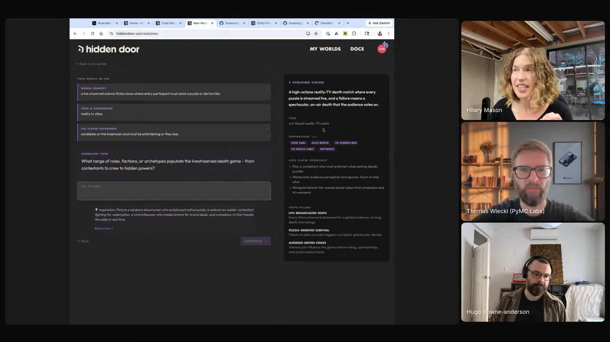

# Hilary Mason - Episode 2 field notes

Hilary Mason works on generative AI at [Hidden Door](https://www.hiddendoor.co/), and her Episode 2 segment turns creative AI work into a disciplined loop: interview the person making the thing, write down the current state, generate several risky variations, test them against editorial evals, and keep the human's taste in the center. She starts from Hidden Door's world-building product, then opens the underlying workflow in [Zed](https://zed.dev/) and [Warp](https://www.warp.dev/), showing how the same agentic software practices can be adapted for stories, prompts, game states, and deliberately odd experiments.

Her operating claim starts with Richard Hamming's distinction: *"in science, if you know what you're doing, stop. And in engineering, if you don't know what you're doing, stop"* [\[00:43:28\]](https://youtube.com/live/l37PR-OkYKA?t=2608). Hilary argues that agents make engineering more experimental and creative work more testable: *"using agents in software development, using it to build all sorts of things, is bringing the science back into the engineering and the engineering back into the science"* [\[00:43:56\]](https://youtube.com/live/l37PR-OkYKA?t=2636). Hidden Door's product problem explains the need for that loop: the models are biased, repetitive, and hesitant around creative content, so the system has to gather intent, produce real alternatives, and evaluate the result against a person's creative take.

That is why Hilary's demos move from a western startup parody into [prompt refinement](https://github.com/hugobowne/show-us-your-agent-skills/tree/main/skills/prompt-refinement), creative evals, a data-sonification package, and [weekly gremlins](https://github.com/hugobowne/show-us-your-agent-skills/tree/main/workflows/weekly-gremlins). Her segment treats agents as a way to explore weirder ideas faster, while also showing the extra process needed when the default model output is only average.

Hilary shows Hidden Door's world-builder interface updating a horror science-fiction premise into vision, tone, inspirations, and player experience while she answers prompts. <a href="https://youtube.com/live/l37PR-OkYKA?t=3470">[00:57:50]</a>

## On working with agents

### What she loves: agents bring experimentation back into building

Hilary answers with Richard Hamming's distinction between science and engineering, then connects it to agent-assisted building. Agents change her relationship to tests, product experiments, and quick prototypes because making a thing is no longer so expensive that weak ideas must be discarded before they are tangible.

She says agents help her *"make something to touch and develop an opinion about where previously the making would've taken so long that it would never be worth it to do something you might not use or build on"* [\[00:44:25\]](https://youtube.com/live/l37PR-OkYKA?t=2665). The purpose is taste: *"having a more robust understanding of taste, of what great is for whatever you're trying to do"* [\[00:44:40\]](https://youtube.com/live/l37PR-OkYKA?t=2680).

### What she loves personally: interrupted engineering work can resume

Hilary's second answer is about a CEO schedule. Agents let her set work in motion, leave for another obligation, and come back without losing the thread.

She contrasts that with earlier engineering blocks: *"I need at least four hours to get into this problem enough to make enough progress so that I don't lose it all when I have to go to a meeting or go do something else"* [\[00:45:30\]](https://youtube.com/live/l37PR-OkYKA?t=2730). Now, she says, *"I can fit my engineering work in around everything else in a way that has never been true before"* [\[00:45:43\]](https://youtube.com/live/l37PR-OkYKA?t=2743).

### What she finds most frustrating: agents are biased, repetitive, and average

Hilary's frustration is the same one she has with LLMs generally: *"they're very mid. They are super biased, they're very same-sy"* [\[00:46:18\]](https://youtube.com/live/l37PR-OkYKA?t=2778). At Hidden Door, that shows up in character generation. A generic prompt for a doctor yields repeated stereotypes, and a creative product cannot treat that as acceptable variety.

Her fix is more context and sharper intent: *"in order to get to great, you have to bring a lot of context. You have to be very sharp in what you actually want out of it"* [\[00:46:54\]](https://youtube.com/live/l37PR-OkYKA?t=2814). She praises [Superpowers](https://github.com/obra/superpowers) because it adds rigorous process and verification, then summarizes the baseline problem: *"they're aspirationally very mid"* [\[00:47:14\]](https://youtube.com/live/l37PR-OkYKA?t=2834).

### What would worry her if agent conversations leaked: context-switching confusion

Hilary says she is not especially embarrassed by her agent conversations, so she asked Claude to read the transcripts and identify the embarrassing pattern. Claude surfaced her context-switching questions: *"sometimes I ask, what were we doing? Why are we here? What did I tell you to get this output?"* [\[00:49:26\]](https://youtube.com/live/l37PR-OkYKA?t=2966)

She ties that back to the schedule benefit: the leak would reveal the same interrupted-work pattern that makes agents useful for her.

## Workflows

### Make weird ideas tangible before deciding whether they are good

Hilary likes agents because they let product and creative ideas become touchable before they deserve a long build cycle. The resulting prototype becomes evidence for taste and direction.

Her formulation is direct: agents let her *"make something to touch and develop an opinion about"* [\[00:44:25\]](https://youtube.com/live/l37PR-OkYKA?t=2665). That workflow supports bad ideas as part of exploration, because making is cheap enough that more ideas are worth judging.

Beepcopy is the concrete example. Hilary made a Python package from a typo of `deepcopy`, and the odd representation found a real issue: *"I found a bug in our game state representation because of this, because I heard this repeated refrain."* [\[01:13:09\]](https://youtube.com/live/l37PR-OkYKA?t=4389)

### Resume engineering work around a CEO schedule

Hilary's personal workflow is to start work, leave it running, and return later with the agent preserving enough context to resume. *"I have the tools to set something moving, and then I can go do something else and I can come back and I can remember where I was and what I was doing"* [\[00:44:59\]](https://youtube.com/live/l37PR-OkYKA?t=2699).

That matters because she no longer needs a half-day block to do engineering work for the company.

### Refine creative prompts with interviews, variations, and evals

Hilary's [prompt-refinement](https://github.com/hugobowne/show-us-your-agent-skills/tree/main/skills/prompt-refinement) workflow adapts agentic software practice to creative work. She starts with product context, then uses an interview, a baseline run, multiple variations, and eval criteria to decide whether a change helped.

She starts with Hidden Door itself because the creative workflow needs product context: *"I was hoping I could show you some of what we're doing at Hidden Door first because it does involve agents, and then go into how do we make it all work as useful context"* [\[00:50:44\]](https://youtube.com/live/l37PR-OkYKA?t=3044).

Behind the scenes, the workflow interviews the person doing the work before changing the prompt. Hilary rejects simply accepting the first stated preference: *"This is not trust them when they say something. It is ask questions to come at it from five different directions"* [\[01:01:15\]](https://youtube.com/live/l37PR-OkYKA?t=3675).

Then it runs against a saved baseline: *"We have a bunch of test fixtures. In our case, it's frozen game states from our game engine, but it could be anything from a story, any form of output"* [\[01:01:35\]](https://youtube.com/live/l37PR-OkYKA?t=3695). The variations are deliberately different. Hilary says, *"if you ask it at once to give you three very different versions that have different magnitudes of change and risk in the changes, you can actually get multiple variations that are somewhat more creative than if you ask for just one"* [\[01:02:18\]](https://youtube.com/live/l37PR-OkYKA?t=3738).

The eval compares each variation against the starting point. Hilary defines the criteria as: *"Here is a set of criteria that we are looking for editorially. Compare each output against this set of criteria, score it, run multiple variations"* [\[01:03:16\]](https://youtube.com/live/l37PR-OkYKA?t=3796). In the live run, she invokes the skill with a slash command, and when Hugo connects that to skills sometimes needing explicit invocation, she answers, *"Absolutely"* [\[01:08:21\]](https://youtube.com/live/l37PR-OkYKA?t=4101).

Because agent latency is unpredictable, Hilary also has a previous run ready for the live demo. *"I did run one earlier, so I can show you the output"* [\[01:08:47\]](https://youtube.com/live/l37PR-OkYKA?t=4127). That report shows the baseline, variations, diffs, eval criteria, and summary.

### Turn world-building into an interface that keeps the idea moving

In the Hidden Door game demo, Hilary adds a western modifier to a startup parody world and creates a character. She explains that examples matter because a plain text box leaves players stuck: *"if we just give you a text box, people get writer's block, and they don't know what to do"* [\[00:53:44\]](https://youtube.com/live/l37PR-OkYKA?t=3224).

The newer world-builder interface starts from a world idea and keeps updating editorial state while the user answers questions. The right side of the interface updates the vision, inspirations, tone, and summary as she types. She frames the mechanism as *"bringing an interface to this agentic looping around an idea"* [\[00:57:52\]](https://youtube.com/live/l37PR-OkYKA?t=3472). The goal is that the system produces a strong reaction: *"it is either something that is, yes, that's what I meant, or you hate it. You should not feel apathetic"* [\[00:58:36\]](https://youtube.com/live/l37PR-OkYKA?t=3516).

### Run weekly gremlins against the bad-ideas backlog

Hilary's [weekly gremlins](https://github.com/hugobowne/show-us-your-agent-skills/tree/main/workflows/weekly-gremlins) workflow collects Hidden Door's bad ideas into a file, then runs three personality-driven agents every Sunday night. *"They're not bad ideas. They're usually the ones that are just shower thoughts or maybe someday or sometimes a bad idea or two"* [\[01:15:25\]](https://youtube.com/live/l37PR-OkYKA?t=4525).

The agents pull from the list, make their own spin, pitch to each other, critique each other, and write a design doc. If the team likes one, they can tell it to build.

## Skills

### Prompt refinement skill

Hilary explicitly describes a skill for the interview-and-refine workflow: *"If we have time, I can actually show you. We have a skill for this"* [\[01:01:23\]](https://youtube.com/live/l37PR-OkYKA?t=3683). Later, while showing the just file and Python script, she says the script *"calls this skill"* [\[01:04:22\]](https://youtube.com/live/l37PR-OkYKA?t=3862). The repo captures that artifact as [`prompt-refinement`](https://github.com/hugobowne/show-us-your-agent-skills/tree/main/skills/prompt-refinement).

The skill appears to interview the human, run against existing test fixtures, audit current output, generate hypotheses, and support prompt refinement. Hilary says Claude extracted a version that others could use for prompt refinement, but it *"lost a lot of its personality"* and needs another edit [\[01:04:29\]](https://youtube.com/live/l37PR-OkYKA?t=3869).

## Tools / projects she showed

### Hidden Door

[Hidden Door](https://www.hiddendoor.co/) is Hilary's company and the main product context for the segment. She describes it as a platform for world builders: *"people who write books, but also people who make movies or just run D&D campaigns"* [\[00:51:35\]](https://youtube.com/live/l37PR-OkYKA?t=3095).

Hilary shows a world she made as a startup parody. *"It's a startup parody,"* she says, with *"the investor being an actual robot"* [\[00:51:55\]](https://youtube.com/live/l37PR-OkYKA?t=3115). She adds a western modifier, creates a coding CEO character, sees "Coding queen of the Wild West," and role-plays in a startup co-working space.

Hilary then shows an unreleased product that turns an idea into a world. She says it takes what she has learned about *"creating evals for creative work in agentic software systems"* and brings it *"into a product experience"* [\[00:54:34\]](https://youtube.com/live/l37PR-OkYKA?t=3274).

In the live example, the idea is a live-streamed horror science-fiction show where participants must solve a puzzle or die horribly. The interface updates vision, inspirations, tone, and summary while the user answers.

Hugo asks about model guardrails because the phrase "die horribly" is hard for many models. Hilary explains that Hidden Door had to solve story violence for a world based on The Crow, where the inciting incident requires murder and revenge.

Her off-the-shelf model example was absurdly evasive: *"they put the gun close to you,"* then *"closer now"* [\[00:56:49\]](https://youtube.com/live/l37PR-OkYKA?t=3409). Hidden Door solved it *"with our own guardrails and content standards and taking certain things out of the hands of the LLM"* [\[00:57:11\]](https://youtube.com/live/l37PR-OkYKA?t=3431).

### Google Sheets and Gemini

Hilary uses [Google Sheets](https://workspace.google.com/products/sheets/) and [Gemini](https://gemini.google.com/) as the example of agents pushing qualitative labor back to the user. She put roughly 1,000 player inputs and story outputs into a sheet and asked Gemini to classify repetition. Gemini refused because it considered the task qualitative.

Her response was practical: *"I don't need an LLM to do quantitative things. I can write that formula myself"* [\[00:48:47\]](https://youtube.com/live/l37PR-OkYKA?t=2927).

### Superpowers plugin

Hilary names the [Superpowers](https://github.com/obra/superpowers) plugin while discussing how to get models beyond mid output. She says, *"I'm a huge fan of the Superpowers plugin"* because *"it brings that rigorous process and verification into things"* [\[00:47:02\]](https://youtube.com/live/l37PR-OkYKA?t=2822).

In this segment, Superpowers is a reference point for process and verification rather than the main tool Hilary runs on screen.

### Zed

Hilary says she expects to get into *"probably Zed and Warp"* after the browser demo [\[00:51:03\]](https://youtube.com/live/l37PR-OkYKA?t=3063). She later discusses whether people still use IDEs and says, *"I don't want to get roasted for actually using an IDE, though I was a Vim user for so long. VS Code was good, but very heavy"* [\[01:06:40\]](https://youtube.com/live/l37PR-OkYKA?t=4000).

### Warp

[Warp](https://www.warp.dev/) is Hilary's terminal environment for the behind-the-scenes demo. She says she will move from the browser into *"Zed and Warp"* [\[00:51:03\]](https://youtube.com/live/l37PR-OkYKA?t=3063), then switches toward the terminal after the product demo.

She uses Warp while moving from the browser demo into the prompt-refinement run.

### just file

Hilary shows Hidden Door's [just](https://just.systems/) file as the place they run internal scripts from. *"We use the just file here at Hidden Door endlessly and write a bunch of scripts that get called from here"* [\[01:03:52\]](https://youtube.com/live/l37PR-OkYKA?t=3832).

The specific command she shows is the test story task, which calls the prompt-refinement skill.

### Test story task

The test story task is the LLM task Hilary opens from the just file. It monitors stories in the background and is implemented as *"actually just a little Python script"* [\[01:04:13\]](https://youtube.com/live/l37PR-OkYKA?t=3853).

The script calls the prompt-refinement skill and is the path from their internal task to a reusable example for prompt refinement.

### Scene notes task

For the live run, Hilary chooses a prompt-refinement task around scene notes: *"our scene notes task because that is one that looks at what's going on in a scene and gives an editorial take for role-playing"* [\[01:06:58\]](https://youtube.com/live/l37PR-OkYKA?t=4018).

She gives it feedback that the scene lacked specific world details for immersion, then lets the skill start its interview and audit.

### Claude

[Claude](https://claude.ai/) appears in several roles. Hilary asks Claude to read her transcripts and identify what would be embarrassing if her agent conversations leaked. Later, Claude runs the prompt-refinement task, extracts a shareable version of the skill, and appears to run the weekly bad-ideas process through what Hilary calls the *"Claude cron job thing"* [\[01:15:45\]](https://youtube.com/live/l37PR-OkYKA?t=4545).

During the live demo she says, *"we're still in slow Claude mode over here"* [\[01:08:47\]](https://youtube.com/live/l37PR-OkYKA?t=4127), then notes a previous run was much faster at 5:00 a.m. Eastern.

### Prompt-refinement report

Hilary shows the output of a previous run rather than waiting for the live one. The report includes a baseline, variations, diffs, eval criteria, and a summary.

She says the summary checks *"quality, does it meet our programmatic metrics for successful output? Does it meet our qualitative metrics for successful output?"* [\[01:10:14\]](https://youtube.com/live/l37PR-OkYKA?t=4214). The report is usually presented differently, but the live view shows the mechanics of comparison.

### Beepcopy

Hilary shows [Beepcopy](https://github.com/hmason/beepcopy), a Python package created from a typo of `deepcopy`. *"What if I could hear my data when I copied it?"* [\[01:12:43\]](https://youtube.com/live/l37PR-OkYKA?t=4363). The package does deep copy, makes a music file from the copied data, and ships with several renderers, including a techno EDM version.

The package found a bug in Hidden Door's game-state representation because Hilary heard a repeated refrain. She presents it as the kind of odd but useful project that can happen in 30 minutes between meetings.

### Nightshift

[Nightshift](https://nightshift.haplab.com/) inspires Hilary's weekly idea-running system. She describes it as a library that checks whether subscription tokens remain at the end of the week, then does useful software-engineering chores: linting, tracking when chores last ran, and finding tests that are no longer relevant.

Hilary likes the token-budget idea but wants it aimed at stranger work: *"what I want is to work on the weird stuff, all the bad ideas"* [\[01:14:54\]](https://youtube.com/live/l37PR-OkYKA?t=4494).

### Bad Ideas Slack channel

Hidden Door has a Slack channel called Bad Ideas. Hilary says people put ideas there that are often shower thoughts, maybe-someday ideas, or genuinely bad ideas. The ideas get collected into a text file in the repo.

That channel is the input queue for the weekly agents: *"we collect those up into a text file. It goes in the repo"* [\[01:15:38\]](https://youtube.com/live/l37PR-OkYKA?t=4538).

### Gremlins

Hilary's [Gremlins](https://github.com/hmason/gremlins) are three personality-driven agents that run every Sunday night against the bad-ideas file. The repo captures the pattern as [`weekly-gremlins`](https://github.com/hugobowne/show-us-your-agent-skills/tree/main/workflows/weekly-gremlins). She says, *"There are three of them. They have personalities"* [\[01:15:19\]](https://youtube.com/live/l37PR-OkYKA?t=4519).

One personality is Hilary, one is a perfectionist focused on making the codebase and product perfect, and one represents the player perspective. They pitch, critique, and write a design doc, after which the team can choose an idea and tell the agents to build it.

Hilary says she extracted a version of [Gremlins](https://github.com/hmason/gremlins) that others can run against their own codebase: *"I also extracted a hopefully working version that anyone can run against their code base"* [\[01:16:44\]](https://youtube.com/live/l37PR-OkYKA?t=4604).

She asks people to try it so more bad ideas can get out into the world.

## Principles and explainers

### Agents make taste more inspectable

Hilary's product and workflow both aim at taste. Quick prototypes, variations, and editorial evals help a person learn what they mean by good.

She says the goal of fast making is *"having a more robust understanding of taste, of what great is for whatever you're trying to do"* [\[00:44:40\]](https://youtube.com/live/l37PR-OkYKA?t=2680). Later she says the whole creative-eval loop is designed to get *"a really sharp creative take from the person doing the writing"* [\[01:11:41\]](https://youtube.com/live/l37PR-OkYKA?t=4301).

### Great creative output needs a human creative take

Hilary argues that different people should get different outputs from the same creative workflow because their taste differs. *"If you do it, if I do it, if any one of us does it, we're going to get a different output. It's not because one is better or worse, it's because we each have a different idea of what the creative work should be"* [\[01:11:55\]](https://youtube.com/live/l37PR-OkYKA?t=4315).

She calls that variability a feature, because Hidden Door's system is trying to express the maker's creative opinion rather than average it away.

### The eval tells you whether a change helped, not whether art is objectively great

Hilary defines creative evals as comparison tools, not arbiters of greatness. After describing editorial criteria, scoring, and multiple variations, she says the process *"is not going to give you an independent sense of, this is great"* [\[01:03:33\]](https://youtube.com/live/l37PR-OkYKA?t=3813).

The value is comparison against the initial eval: the team can decide whether a prompt, skill, post, or content change improved or worsened the output for the stated goal.

### Three variations beat one for creative exploration

Hilary's specific rule of thumb is to request several distinct alternatives in one prompt. Ten is rarely useful, five can help for more unusual work, and three is usually the happiest number.

Her takeaway is concise: *"if anyone is taking one thing away for creative stuff, multiple variations"* [\[01:03:02\]](https://youtube.com/live/l37PR-OkYKA?t=3782). The variations need different magnitudes of change and risk so the model explores more of the possibility space.

### Safety guardrails need product-specific control

Hidden Door's creative context requires content that generic models often avoid. The Crow example shows why the product cannot leave every story beat to an off-the-shelf LLM: the model refused to complete a required murder scene and kept moving asymptotically toward the inciting incident.

Hilary's answer is product-specific standards plus control boundaries: *"taking certain things out of the hands of the LLM"* [\[00:57:14\]](https://youtube.com/live/l37PR-OkYKA?t=3434).

### Average agents create work unless the system assigns the right labor

The Google Sheets example gives Hilary's broader critique of assistant UX. If the model refuses qualitative classification and offers only quantitative help, the human is left doing exactly the work an LLM should help with.

Her line is the explainer: *"I don't need an LLM to do quantitative things. I can write that formula myself"* [\[00:48:47\]](https://youtube.com/live/l37PR-OkYKA?t=2927).

### Weird projects can be productive because they expose hidden patterns

Hilary defends odd agent-built experiments as a way to explore the possibly interesting. The `deepcopy` music package is silly on the surface, but it exposed repeated structure in game-state data.

Her principle is, *"use the tech to explore the space of what is possibly interesting"* [\[01:13:34\]](https://youtube.com/live/l37PR-OkYKA?t=4414). She adds that a roadmap made only of obvious good ideas is boring, and teams should push ideas creatively.

### Bad ideas deserve a recurring agent process

[Weekly gremlins](https://github.com/hugobowne/show-us-your-agent-skills/tree/main/workflows/weekly-gremlins) turns stray ideas into a recurring creative process. It gives bad ideas personalities, critique, and design docs before the team decides whether to build.

Hilary explains the motivation by contrast with maintenance chores: *"what I want is to work on the weird stuff, all the bad ideas, all the stuff that nobody has the time for because it's way too out there on the distribution of things that could be productive"* [\[01:14:54\]](https://youtube.com/live/l37PR-OkYKA?t=4494).

## Additional quotations

- On loving data and cheeseburgers: *"Yes, that is one constant."* [\[00:43:01\]](https://youtube.com/live/l37PR-OkYKA?t=2581)

- On the Hidden Door product demo: *"This is what we do at Hidden Door. That's the whole thing. We are role-playing."* [\[00:54:09\]](https://youtube.com/live/l37PR-OkYKA?t=3249)

- On making the new product deliberately opinionated: *"You should not feel apathetic."* [\[00:58:43\]](https://youtube.com/live/l37PR-OkYKA?t=3523)

- On IDE shame among agent-heavy developers: *"I don't want to get roasted for actually using an IDE, though I was a Vim user for so long."* [\[01:06:40\]](https://youtube.com/live/l37PR-OkYKA?t=4000)

- On live agent speed variance: *"I was running it at 5:00 a.m. Eastern or something and it was lightning fast. It's the best time."* [\[01:09:37\]](https://youtube.com/live/l37PR-OkYKA?t=4177)

- On Beepcopy: *"What if I could hear my data when I copied it?"* [\[01:12:43\]](https://youtube.com/live/l37PR-OkYKA?t=4363)

- On the kind of projects agents enable between meetings: *"that is the kind of bullshit you can get up to when you've got 30 minutes between two meetings and a bad idea."* [\[01:13:19\]](https://youtube.com/live/l37PR-OkYKA?t=4399)

- On this show as a bad idea that became real: *"I'm sure it started as a what if and then a why not, and now here we are now, and it's super fun."* [\[01:17:10\]](https://youtube.com/live/l37PR-OkYKA?t=4630)

## Live reactions and follow-ups

### Discord links

Hugo posted the Hidden Door homepage in Discord during Hilary's segment, then followed up with the two shareable projects she showed: [Beepcopy](https://github.com/hmason/beepcopy) and [Gremlins](https://github.com/hmason/gremlins). The Beepcopy link drew a small round of chat reactions, and the Gremlins link was posted immediately after it.

### Bryan's BBPlot callback

During Bryan Bischof's later segment, Hugo tied Bryan's BBPlot demo back to Hilary's data-sonification package: *"I love that you're bringing BBPlot, and Hilary just showed us BeatCopy as well. So it's the days of the BBBs"* [\[01:25:55\]](https://youtube.com/live/l37PR-OkYKA?t=5155). The project Hilary showed is Beepcopy.

### Hilary on the Bryan game

Hilary stayed for Hugo's surprise Bryan-themed game and reacted to the noisy, silly demo. As Hugo talked about bad ideas and the silliness of gaming, she answered, *"I love it"* [\[01:19:48\]](https://youtube.com/live/l37PR-OkYKA?t=4788), then dropped off before Bryan's main segment.
