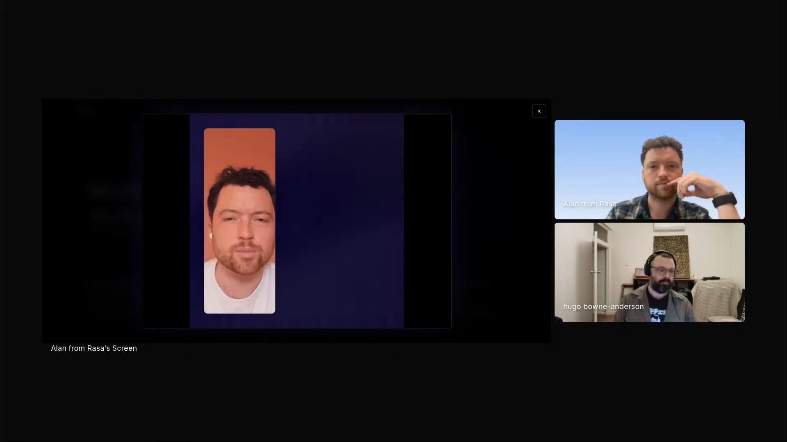

# Alan Nichol - Episode 3 field notes

Alan Nichol, co-founder and CTO of [Rasa](https://rasa.com/), used his Episode 3 segment to show how he creates product videos with a coding agent: [Claude](https://www.anthropic.com/claude) writes [Remotion](https://github.com/remotion-dev/remotion) code, [Whisper](https://github.com/openai/whisper) timestamps align the audio, generated avatar video supplies the face, and an agent skill carries Alan's visual rules. His operating thesis was blunt: *"Everything that can be code will be code."* [\[02:46:28\]](https://youtube.com/live/ud2WzkKeDZs?t=9988)

The video workflow came from the same pressure as his answer about agents more broadly. Alan spends his day context switching, and agents turn small pockets of time into finished artifacts. He can record audio in a phone booth, let the system generate the face and visuals, then keep refining the content with a collaborator that understands the technical domain. *"All the context about the actual refinement of what we want to show and what really makes sense. All of that is in there."* [\[02:50:17\]](https://youtube.com/live/ud2WzkKeDZs?t=10217)

His frustration is that taste, timing, spatial layout, and product abstraction are still hard to encode. Claude can write Remotion code without help, but Alan uses the skill to teach it focal points, text rules, animation style, layout modes, safe areas, and timing tricks. The same problem connects back to Rasa: natural language lets a user ask for a vague high-level change or a precise expert edit without learning one fixed UI abstraction first.

Alan plays a generated Rasa product video, with the screen share showing the AI avatar output and the livestream speaker tiles beside it. <a href="https://youtube.com/live/ud2WzkKeDZs?t=10074">[02:47:54]</a>

## On working with agents

### What he loves: turning dead time into useful work

Alan loves agents because they let him use the small gaps inside a context-switching day. *"I'm actually able to be productive and do something in the 20 minutes I have between meetings and quickly grabbing a cup of coffee versus that just being dead time."* [\[02:41:27\]](https://youtube.com/live/ud2WzkKeDZs?t=9687)

That makes half-day tasks small enough to launch between other commitments: *"The kind of project that would take me half a day, I can just fire off and just get done."* [\[02:41:40\]](https://youtube.com/live/ud2WzkKeDZs?t=9700) The same parallelism has a cost, because all the live threads can become addictive and distracting.

### What he finds most frustrating: prompt and pray

Alan's named frustration is "prompt and pray," because output problems often lack a systematic path from failure to improvement. *"It's so frustrating when you don't have a systematic way to say, here's the thing I didn't like about the output, how can I achieve the output that I do want?"* [\[02:42:06\]](https://youtube.com/live/ud2WzkKeDZs?t=9726)

He compares that trial-and-error loop to deep learning in 2014 and 2015, when architecture changes did not come with reliable causal guidance. *"You're throwing stuff at the wall and seeing what works."* [\[02:42:45\]](https://youtube.com/live/ud2WzkKeDZs?t=9765)

### What he misses: thinking on paper with an agent present

Alan likes to think with loose printer paper rather than a bound notebook or a computer. *"If I really want to think about a problem, I get a stack of printer paper. I clear my desk and I just sit and write things down and I draw pictures."* [\[02:42:55\]](https://youtube.com/live/ud2WzkKeDZs?t=9775)

The problem is that paper removes the agent from the early thinking loop. *"There's no good way to collaborate with your agent when you're writing on a piece of paper."* [\[02:43:28\]](https://youtube.com/live/ud2WzkKeDZs?t=9808) His desired setup is a continuous camera over the paper that can feed a multimodal model. [\[02:43:43\]](https://youtube.com/live/ud2WzkKeDZs?t=9823)

## Workflows

### Make product videos with a coding agent, skills, and rendered inspection

Alan starts from the output: short videos at [2026.rasa.com](https://2026.rasa.com/) made with Claude acting as the coding agent, Remotion as the video library, and skills as the instruction layer. *"I've been making some videos with Claude and Remotion and some skills."* [\[02:46:00\]](https://youtube.com/live/ud2WzkKeDZs?t=9960)

The work stays code-shaped because Alan does not want to learn conventional video editing software. He credits Rod from Rasa's developer relations team with seeding the first version, then describes the workflow as something he can operate from the terminal. When Hugo asks whether he built the shown video with an agent from the command line, Alan answers: *"Yep. Didn't touch a GUI."* [\[02:48:50\]](https://youtube.com/live/ud2WzkKeDZs?t=10130)

The coding agent writes the Remotion code that defines the animated text, graphics, and graphic animations. [HeyGen](https://www.heygen.com/) generates the face video from Alan's real audio. The workflow exists because it removes the production overhead around lighting, re-recording, and calendar time. *"This, I just record some audio into my computer, quickly in a phone booth or something when I have a few minutes, and then it can generate the rest."* [\[02:49:57\]](https://youtube.com/live/ud2WzkKeDZs?t=10197)

Alan values the agent because the content conversation and the video generation happen with the same collaborator. A human video collaborator may understand the craft but lack the technical domain context. Claude can discuss what the product video is trying to convey while also making the artifact.

He describes that collaborator as a sparring partner: *"It can be your sparring partner on the ideas."* [\[02:50:51\]](https://youtube.com/live/ud2WzkKeDZs?t=10251) That lets him ask whether a scene can be cut because the idea is already obvious, and those content decisions stay inside the same working context as the generated video.

Alan's skill does not teach Claude Remotion syntax. Claude can already write that code. The skill tells Claude what Alan wants: animations, style guides, text rules, layout modes, and visual behavior. *"Everything that's in the skill is me telling it what I want in there and how to do animations and style guides and rules and text."* [\[02:51:14\]](https://youtube.com/live/ud2WzkKeDZs?t=10274)

He uses the skill to correct failures he saw in earlier outputs: too many things moving at once, slow fades that drain energy, text that repeats the spoken words, literal illustrations, tiny slide-like typography, and layouts with too much white space. The skill also uses Whisper timestamps so Claude can align text or animations with the audio. *"I run Whisper on the audio so that I've got timestamps so that Claude knows exactly when the text is coming in."* [\[02:53:39\]](https://youtube.com/live/ud2WzkKeDZs?t=10419)

Alan agrees with the verification-loop principle from earlier episodes. *"Anytime you're building with an agent, it's 100 times faster and more effective if you give it a way to inspect the output that it's produced."* [\[02:59:53\]](https://youtube.com/live/ud2WzkKeDZs?t=10793)

Video makes that difficult because Claude does not take video as input in his setup. The skill asks Claude to render individual frames and inspect them. That catches some issues, but Alan still has to spell out obvious layout problems, such as a talking head in one corner, text in the opposite corner, and a mostly empty frame. [\[03:00:13\]](https://youtube.com/live/ud2WzkKeDZs?t=10813)

### Use generated videos to share Rasa's evolving product thinking

Alan used to think of thought leadership as a large essay written once or twice a year around a polished thesis. For Rasa's current product work, he prefers smaller, less polished videos that show the company's evolving thinking.

He says the videos are less about a single feature and more about showing how Rasa works: *"You're conveying more: here's how we attack problems, here's how we think about things. Here's the vibe of Rasa and the ethos of how we do things."* [\[03:06:58\]](https://youtube.com/live/ud2WzkKeDZs?t=11218)

The cost shift changes the publication threshold. Agency-style production would take weeks and cost thousands of dollars per video. Alan says his agent workflow turns them out in a couple of afternoons, which makes the videos possible at all. *"It's a 100x reduction in cost to produce these things to the point that we just wouldn't be doing it."* [\[03:05:57\]](https://youtube.com/live/ud2WzkKeDZs?t=11157)

## Skills

### Programmatic video skill

Alan shows a local skill file for making Remotion videos with Claude. The skill is the instruction artifact inside the broader audio-to-video workflow: it carries Alan's visual rules, while Claude writes the Remotion code. *"Claude needs no help whatsoever writing Remotion code."* [\[02:51:04\]](https://youtube.com/live/ud2WzkKeDZs?t=10264)

The skill captures rules for:

- one central focal point at a time
- non-verbatim animated text
- show-not-tell imagery
- layout modes such as talking head on one side and content on the other
- canvas safe areas and large text
- timing against Whisper audio timestamps
- easing, typography, and transition behavior

Alan calls judgment encoding the biggest remaining gap because he lacks some of the video vocabulary needed to specify what he wants. *"If I knew more about videography, I would be able to give much more precise instructions."* [\[03:02:43\]](https://youtube.com/live/ud2WzkKeDZs?t=10963)

### Short-form vertical video skill

Alan has also tried to make a skill that takes the raw horizontal video content and re-edits it into short-form vertical video for TikTok, Reels, and YouTube. *"I've tried to make a skill that will take this raw content and re-edit it as short form vertical video."* [\[03:07:47\]](https://youtube.com/live/ud2WzkKeDZs?t=11267)

He describes the vertical-video rules as different from the main video rules: full-screen talking head, dynamic animated subtitles over the top, illustrations overlaid on the face, and aggressive jump-cut editing. The experiment is not good enough for him to run yet, and he explicitly asks for outside help from someone who knows that craft. [\[03:08:00\]](https://youtube.com/live/ud2WzkKeDZs?t=11280)

## Tools / projects he showed

### 2026.rasa.com videos

Alan shows the Rasa videos at [2026.rasa.com](https://2026.rasa.com/), describing them as one-minute videos made with Claude, Remotion, and skills. [\[02:46:00\]](https://youtube.com/live/ud2WzkKeDZs?t=9960)

The video shown on stream is about emergent personalization: *"Memory your agent builds on its own, shared across every skill it has."* [\[02:47:54\]](https://youtube.com/live/ud2WzkKeDZs?t=10074) Alan then explains that the voice is his real audio, while the face video is generated. [\[02:49:23\]](https://youtube.com/live/ud2WzkKeDZs?t=10163)

### Claude

Claude is Alan's video collaborator and code generator. It writes Remotion code, reasons about high-level subjective feedback, and helps refine content. When Alan gives vague input like *"make this a bit more high energy"* [\[02:54:55\]](https://youtube.com/live/ud2WzkKeDZs?t=10495), Claude maps that request into video-editing choices such as easing, transitions, and animation behavior.

Alan's main limitation is not Claude's ability to write code. It is visual taste and spatial judgment. *"Claude has no taste when it comes to editing or visuals."* [\[02:51:26\]](https://youtube.com/live/ud2WzkKeDZs?t=10286)

### Remotion

[Remotion](https://github.com/remotion-dev/remotion) is the JavaScript library Alan uses for programmatic video generation. *"Remotion is a JavaScript library for programmatically generating video."* [\[02:46:08\]](https://youtube.com/live/ud2WzkKeDZs?t=9968)

Alan uses it because animated text, graphics, and graphic animations can all be defined as code. That makes video reachable through a coding agent, which fits his preference for terminal work over GUIs.

### Whisper

[Whisper](https://github.com/openai/whisper) provides timestamps for the source audio. Alan uses those timestamps so Claude can coordinate text and animation with what he is saying. *"If it wants to pop up some text or an animation as I'm saying it, it figures out the timing on its own."* [\[02:53:46\]](https://youtube.com/live/ud2WzkKeDZs?t=10426)

The timestamps are useful but not precise enough for every edit. Alan says jump cuts and dead air live at millisecond margins, so exact word-boundary trimming is still fragile. [\[03:04:48\]](https://youtube.com/live/ud2WzkKeDZs?t=11088)

### HeyGen

[HeyGen](https://www.heygen.com/) is the generated-face tool behind the shown video. Alan says the stream video used the V4 model and that the V5 model is considerably better. [\[03:08:57\]](https://youtube.com/live/ud2WzkKeDZs?t=11337)

The V4 model had a dead-air failure mode where pauses returned Alan's face to an unsettling base expression. He had to trim around those frames aggressively: *"Sometimes I would have to cut off part of a word just because I had to not show the frames."* [\[03:09:24\]](https://youtube.com/live/ud2WzkKeDZs?t=11364)

### Google video models for extracting editing vocabulary

Alan tried Google models with video input as a way to extract video-editing vocabulary from examples he liked. He uploaded videos and asked the model to describe the transitions, editing, and jargon so he could feed that into prompts.

The result did not work well: *"I wasn't able to get good output."* [\[03:01:34\]](https://youtube.com/live/ud2WzkKeDZs?t=10894) Alan found that surprising because the same class of models can generate cinematic video from prompts, but they did not capture and describe the editing mechanics he wanted.

### Rasa

[Rasa](https://rasa.com/) is the enterprise agent platform behind Alan's product examples and the videos he is making. He describes it as *"a developer platform for building AI agents"* [\[02:55:23\]](https://youtube.com/live/ud2WzkKeDZs?t=10523), with an enterprise collaboration layer on top.

The segment connects his personal video workflow back to Rasa's product bet. Natural language can let different collaborators work at their own abstraction level, from "make this agent friendlier" to precise expert changes.

### Prompt and Pray stickers

Alan shows the "prompt and pray" sticker from his LinkedIn profile, then names two other stickers: a vibe coder sticker and a "we have Opus at home" sticker. *"I go to conferences and I leave those on tables."* [\[02:44:40\]](https://youtube.com/live/ud2WzkKeDZs?t=9880)

He jokes that stickers became a LinkedIn skill: *"I put stickers as a skill on LinkedIn and people have started endorsing me for it."* [\[02:44:48\]](https://youtube.com/live/ud2WzkKeDZs?t=9888)

### Beyond Prompt and Pray

Hugo shares the O'Reilly essay [Beyond Prompt and Pray](https://www.oreilly.com/radar/beyond-prompt-and-pray/) while Alan is showing the prompt-and-pray sticker, and Alan briefly confirms the title: *"We did. We did."* [\[02:46:00\]](https://youtube.com/live/ud2WzkKeDZs?t=9960)

### Bear

[Bear](https://bear.app/) is Alan's note-taking tool. He uses a new note per week and writes into it without a heavy organization system. *"I use Bear for note taking and I have a new note per week, week of whatever the Monday is."* [\[03:13:23\]](https://youtube.com/live/ud2WzkKeDZs?t=11603)

For deeper thinking, Bear is less central than quiet time. *"My favorite thing is just to create a quiet environment and just think really hard about it for a while."* [\[03:13:39\]](https://youtube.com/live/ud2WzkKeDZs?t=11619)

## Principles and explainers

### Code-shaped artifacts are easier for agents to edit

Alan's code-first thesis is that making an artifact programmable makes it available to coding agents. *"The productivity gains from making something code and being able to work on it with a coding agent are so massive that I think nothing survives that."* [\[02:46:35\]](https://youtube.com/live/ud2WzkKeDZs?t=9995)

That is why video becomes interesting to him only when it can be expressed through Remotion and edited from the terminal. He says he will not learn video-editing software, but he can work on video if the artifact is code-shaped.

### Natural language lets collaborators work at different abstraction levels

Alan argues that product teams do not need to choose one abstraction level for every collaborator. A no-code UI may expose the same primitives as the codebase, while natural language lets users ask at whatever level they understand.

His example spans both ends of the range: *"Someone can come in and say, 'Hey, can you make this agent friendlier?' And that will produce some output."* [\[02:56:01\]](https://youtube.com/live/ud2WzkKeDZs?t=10561) A long-running expert on the project can also make a precise edit, and the same system can execute it. [\[02:56:15\]](https://youtube.com/live/ud2WzkKeDZs?t=10575)

That pushed Rasa toward a strong bet: *"No code is out, no code is dead, and vibe code is in."* [\[02:56:27\]](https://youtube.com/live/ud2WzkKeDZs?t=10587) For large customer-facing enterprise agents, Alan says time to value is not competitive when every collaborator has to learn the UI, primitives, concepts, and composition rules before they can make useful changes.

Alan frames the next product problem as giving non-coders the equivalent of a coding agent. Developers can work in branches comfortably. Non-coders working at a higher abstraction still need confidence that they understand what changed and whether they want it. His Rasa question is direct: *"How do you build the equivalent of a coding agent for someone who's not a coder?"* [\[02:57:04\]](https://youtube.com/live/ud2WzkKeDZs?t=10624)

The product requirement is concrete: *"How do you give them confidence, help them understand the changes that they've made, give them confidence in what they've done, and help them reason about whether that's what they want, and then test it and push it up for review?"* [\[02:57:20\]](https://youtube.com/live/ud2WzkKeDZs?t=10640)

### Vibe coding depends on the artifact and the verification loop

Alan accepts Hugo's distinction that not looking at code is not always vibe coding. For Alan's videos, though, he says the label fits because nobody else needs to run the code and the output is the artifact that matters. *"I only care about the video and the app because no one else needs to run this code ever. It just needs to produce one nice looking video once."* [\[02:59:37\]](https://youtube.com/live/ud2WzkKeDZs?t=10777)

That distinction matters because video can tolerate a different engineering posture from production software. The verification burden moves to rendered output, timing, layout, and whether the video communicates the idea.

### Creative domains can be explored by doing first

Alan used to pick a new framework or library once a month to regain a beginner's mindset. The video workflow gives him that same feeling in a domain he does not understand, while still letting him produce something. *"I'm in a domain that I don't know anything and I don't understand anything, but I can somehow be productive."* [\[02:58:08\]](https://youtube.com/live/ud2WzkKeDZs?t=10688)

He does not learn Remotion in the conventional sense. *"I've never written a line of Remotion code by hand."* [\[02:58:32\]](https://youtube.com/live/ud2WzkKeDZs?t=10712) He describes this as a pure vibe experience because he looks at the output, not the code, and describes what he wants.

### Visual judgment is easier when the human has the vocabulary

Alan says the biggest gap in encoding judgment is vocabulary. In domains he knows well, such as agent architectures or browser features, the agent is much more effective because he can give precise instructions. [\[03:02:43\]](https://youtube.com/live/ud2WzkKeDZs?t=10963)

Video exposes the missing vocabulary. He can say "make this more high energy," but a videographer could improve the skill faster by naming the transitions, timing, typography, and motion rules more precisely.

### One focal point beats busy animation

Alan's video skill includes concrete visual rules. *"There should only be one thing that's the central focal point at any point in time."* [\[03:03:46\]](https://youtube.com/live/ud2WzkKeDZs?t=11026)

He adds that animated text should not repeat the audio verbatim, because it distracts rather than adds value. The video should use one or two keywords or an animation, and should communicate at a higher abstraction than literal illustrations of spoken words. [\[03:03:53\]](https://youtube.com/live/ud2WzkKeDZs?t=11033)

### Timing carries energy in video

Alan says the difference between an energetic jump cut and a low-energy transition can be milliseconds. *"The difference between something that feels like a jump cut, a TikTok style almost interrupting yourself cut, and something that feels like it loses energy, it's milliseconds."* [\[03:04:48\]](https://youtube.com/live/ud2WzkKeDZs?t=11088)

That makes automatic editing hard even with Whisper timestamps. Some words get cut off, some pauses leave dead air, and Alan still treats exact timing as a human judgment problem.

### Easing gives motion personality

Alan explains easing as motion that does not move at a constant linear rate. Text can move quickly, overshoot, and then come back. *"That's really what gives it personality."* [\[03:10:07\]](https://youtube.com/live/ud2WzkKeDZs?t=11407)

He says these details are invisible until someone starts editing video. Linear movement feels strange, like a DVD logo bouncing around the screen. [\[03:10:54\]](https://youtube.com/live/ud2WzkKeDZs?t=11454)

### Good text can lead the spoken phrase

Alan uses "emergent personalization" from the shown Rasa video to explain a timing trick. Showing the words exactly as he says them is useful, but showing them slightly before the phrase makes the video feel more intentional.

He describes the rule directly: *"You want to do it just a hair before you say it."* [\[03:11:23\]](https://youtube.com/live/ud2WzkKeDZs?t=11483) That makes the video feel like it is leading and gives the viewer's brain time to engage.

### Fast idea sharing can beat polished annual essays

Alan says the market currently rewards smaller, more frequent artifacts over occasional grand essays. *"I think it's better to have maybe a little bit less polish and less here's my grand theory of everything because everything's changing all the time."* [\[03:06:25\]](https://youtube.com/live/ud2WzkKeDZs?t=11185)

For Rasa, the videos let him share nuggets of product thinking, features, and internal problem-solving style as they evolve.

### Builders should tinker and have fun

Alan's final advice is short: *"Just have fun."* [\[03:14:48\]](https://youtube.com/live/ud2WzkKeDZs?t=11688)

When Hugo says decision-making is hard because there are so many things to work on, Alan repeats the same builder stance: *"Just tinker and have fun. It's just the greatest."* [\[03:15:04\]](https://youtube.com/live/ud2WzkKeDZs?t=11704)

## Additional quotations

- On watching the other guests: *"I thought I was a power user of this stuff, and then I realized I am a little baby. I don't know anything."* [\[02:40:30\]](https://youtube.com/live/ud2WzkKeDZs?t=9630)

- On too many parallel threads: *"It can get a little addictive, and you can get distracted very easily with all your threads that you're pursuing in parallel."* [\[02:41:50\]](https://youtube.com/live/ud2WzkKeDZs?t=9710)

- On loose printer paper: *"I don't even like it to be a bound notebook. That already frustrates me. It's just got to be a stack of printer paper."* [\[02:43:10\]](https://youtube.com/live/ud2WzkKeDZs?t=9790)

- On programmatic video: *"All the animated text and the graphics and the animation of the graphics and all that stuff, that's all just defined in Remotion."* [\[02:49:05\]](https://youtube.com/live/ud2WzkKeDZs?t=10145)

- On the generated avatar: *"The voice is really my audio, but then the video is generated."* [\[02:49:23\]](https://youtube.com/live/ud2WzkKeDZs?t=10163)

- On video quality expectations: *"No one's going to watch those videos and think that they were done by Ridley Scott, but the fact that it's me solo and I'm able to produce them."* [\[02:50:05\]](https://youtube.com/live/ud2WzkKeDZs?t=10205)

- On beginner's mindset: *"It's very good to get back in that beginner's mindset."* [\[02:57:58\]](https://youtube.com/live/ud2WzkKeDZs?t=10678)

- On Remotion as vibe work: *"I haven't learned Remotion at all. It's a pure vibe experience."* [\[02:58:42\]](https://youtube.com/live/ud2WzkKeDZs?t=10722)

- On spatial reasoning: *"Visual spatial reasoning is one of the weak points of Claude."* [\[03:00:22\]](https://youtube.com/live/ud2WzkKeDZs?t=10822)

- On video vocabulary extraction: *"Give me the jargon for what's happening here, the transitions, the editing, whatever, and I wasn't able to get good output."* [\[03:01:34\]](https://youtube.com/live/ud2WzkKeDZs?t=10894)

- On vertical-video help: *"If anyone knows about this stuff and wants to help out and wants to do some consulting work, I will happily pay you to help me fix this."* [\[03:08:35\]](https://youtube.com/live/ud2WzkKeDZs?t=11315)

- On making the materials playable: *"We're publishing all of these, so people want to play around."* [\[03:12:01\]](https://youtube.com/live/ud2WzkKeDZs?t=11521)

## Live reactions and follow-ups

### Discord links: Rasa, prompt and pray, and Remotion

The Discord chat supplied the main links around Alan's segment:

- [Rasa](https://rasa.com/)
- [Beyond Prompt and Pray](https://www.oreilly.com/radar/beyond-prompt-and-pray/), posted by Hugo while Alan was showing the sticker and introducing the video workflow
- [Remotion](https://github.com/remotion-dev/remotion), posted while Alan explained programmatic video generation
- [2026.rasa.com](https://2026.rasa.com/), posted again after Alan pointed viewers to the Rasa videos

### Discord reaction: programmatic video and second brain

The chat reacted to the video workflow while Alan was presenting it. Suren called Alan's programmatic video workflow "fire" and asked whether Alan had a second-brain stack for working with agents. Hugo brought that question into the livestream, and Alan answered with a deliberately lightweight setup: Bear for weekly notes, loose writing rather than filing, and quiet thinking time before serious work. [\[03:13:14\]](https://youtube.com/live/ud2WzkKeDZs?t=11594)
