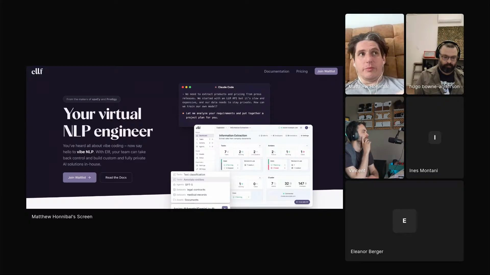

# Matthew Honnibal - Episode 3 field notes

Matthew Honnibal, originally from Sydney, computational linguist by training, based in Berlin, co-author of [spaCy](https://spacy.io/), and co-founder of [Explosion](https://explosion.ai/) with Ines Montani, came to Episode 3 with a sharp position on agent work: agents can compound programmer velocity, but the field is still making workflow decisions with weak evidence, moving targets, and tools that can reward the wrong behavior. His answer is not one better prompt. It is visible skill distribution, adversarial review passes over code, short Claude Code sessions that keep human judgment active, and an NLP platform where agents run data-project machinery while the developer still owns the decisions.

He likes agents because velocity compounds when it keeps the programmer inside the problem: *"You get a compounding effect from velocity in this way if you're doing it well."* [\[00:05:53\]](https://youtube.com/live/ud2WzkKeDZs?t=353) He gets frustrated because nobody has enough stable evidence to know which mitigation strategies work, model behavior changes underneath users, and even frontier labs cannot run exhaustive user studies at the pace the products are changing.

He shares skills as `.md.txt` files because rendered Markdown can hide instructions in HTML comments. He treats Claude's Python mistakes as partly shaped by short-horizon reward incentives, then counters them with mutation testing, pre-mortems, try-except audits, and fix-up passes instead of hoping the model avoids every failure up front. With [ELLF](https://beta.ellf.ai), he is trying to make agents build the kind of task-specific NLP classifiers that once required a data team: plan the project, run downloads on cluster compute, create annotation jobs, use cheap agents for first-pass labeling, route disagreements to human review, collect training data, and run experiments.

Matthew shows ELLF as a virtual NLP engineer for Claude-assisted NLP projects, with product screens for tasks, agents, assets, and cluster-backed work. <a href="https://youtube.com/live/ud2WzkKeDZs?t=1512">[00:25:12]</a>

## On working with agents

### What he loves: velocity that keeps state warm

Matthew loves agents because they compress the time between programming steps and help him stay inside a problem. *"The ability to move faster and get your work through problems and have the steps which are less interesting take less time I think is very valuable in itself."* [\[00:05:40\]](https://youtube.com/live/ud2WzkKeDZs?t=340)

Compressed timelines help him hold the problem in his head. He says software work gets easier when you are *"less often losing state"* [\[00:05:33\]](https://youtube.com/live/ud2WzkKeDZs?t=333). Agents help when they move the dull steps out of the way and get him back to the interesting parts faster.

### What he finds most frustrating: workflow choices are mostly eyeballed

Matthew's frustration is epistemic. Agent workflows change quickly, models change underneath them, and there is rarely enough evidence to know whether one prompting or mitigation strategy is actually better than another. *"It's extremely hard to make decisions about how to do things because you're in such a poverty of evidence around it and things are changing underneath you all the time."* [\[00:06:43\]](https://youtube.com/live/ud2WzkKeDZs?t=403)

He gives the example of a prompt technique that might improve performance by 10 percent or harm it by 15 percent. The user usually cannot collect enough samples to tell, and even measuring performance is weak. *"It's all very eyeballed."* [\[00:07:36\]](https://youtube.com/live/ud2WzkKeDZs?t=456)

That uncertainty includes the frontier labs. Matthew says the pace is too fast for exhaustive user studies: *"You can't hire nine women to have a baby in one month."* [\[00:07:59\]](https://youtube.com/live/ud2WzkKeDZs?t=479) His point is that Anthropic and users are both improvising while the tools and workloads keep changing.

## Workflows

### Run multiple focused code-review passes instead of one large prompt

Matthew's coding workflow uses repeated agent passes rather than trying to prevent every problem up front. He describes the alternative as bite versus nibble: *"You can try to get it to make one big bite and try to put everything into the context at once. Or you can try to get it to nibble and to maneuver the space and to try to make multiple passes over things."* [\[00:14:10\]](https://youtube.com/live/ud2WzkKeDZs?t=850)

The mechanism is sequential review. One pass asks the agent to introduce plausible problems and check whether tests catch them. Another pass asks for pre-mortems over fragile code. Another audits try-except blocks. Then fix-up passes tighten exception handling, types, and other known weak spots. *"I do these passes and then have these fix-up passes: now's the time where we tighten the try-except, now's the time where we tighten the types."* [\[00:18:02\]](https://youtube.com/live/ud2WzkKeDZs?t=1082)

### Keep Claude Code sessions short enough for human judgment to matter

Matthew says longer Claude Code sessions became less successful for him after the context window increased. The failure mode is not only model drift, it is his own attention splitting while a long session runs in the background. *"These are bad sessions. I'm not using myself well."* [\[00:22:06\]](https://youtube.com/live/ud2WzkKeDZs?t=1326)

He ties the problem to human agency. If he has a session where he has not used his engineering experience, he worries he has become no more effective than anyone else with the same tool. The healthier pattern is to cut work into shorter tasks and stay engaged enough to guide the agent. *"It takes active effort to think it through and to cut things up into shorter tasks and to take more agency with it."* [\[00:23:15\]](https://youtube.com/live/ud2WzkKeDZs?t=1395)

### Probe the agent's reasoning when the domain is unfamiliar

When Matthew used agents for Kubernetes work, he had to evaluate answers in a domain he did not know well. His practice is to ask how the agent knows, why it chose a path, and which code lines caused a change. *"The reasoning is something that's much easier to evaluate than the conclusion."* [\[00:31:12\]](https://youtube.com/live/ud2WzkKeDZs?t=1872)

He uses the same questioning during debugging: ask why something worked yesterday but not today, ask which lines introduced the behavior, and keep pressing when the agent retcons plausible explanations. *"If you pin it down and you do call it out successfully, then you do make progress with these things."* [\[00:32:49\]](https://youtube.com/live/ud2WzkKeDZs?t=1969)

### Build NLP classifiers with agents while the developer reviews the data decisions

ELLF packages Matthew's agent practices into a workflow for NLP and data projects. The platform lets people use Claude plus extension skills, backed by compute that can run on a desktop or cloud Kubernetes cluster. *"This tool that lets people use Claude and extension skills with that for NLP projects."* [\[00:24:59\]](https://youtube.com/live/ud2WzkKeDZs?t=1499)

His example is monitoring mentions of spaCy on Twitter or [Bluesky](https://bsky.app/) to distinguish the Python library from the Honda Spacy motorcycle. The agent helps plan steps, run downloads on the cluster, create annotation tasks, farm annotation to inexpensive agents, set up human review on disagreements, collect training data, and run experiments. Matthew frames this as helping agents build the kinds of programs machine learning was once meant to build: *"Now we need to get to that point of getting LLM agents to build that sort of program."* [\[00:26:28\]](https://youtube.com/live/ud2WzkKeDZs?t=1588)

### Wrap one agent judgment step inside a deterministic script

Matthew later added a workflow he had forgotten to mention: use deterministic scripts for the parts that should not be generative, and invoke an agent for the small unit that needs language judgment. His example was drafting release notes for spaCy without giving the agent push access. *"I think I really like having scripts which are this mix of procedural code and just one step that requires the agent."* [\[00:59:17\]](https://youtube.com/live/ud2WzkKeDZs?t=3557)

For release notes, the script gathers the necessary material, runs the CLI in prompt mode for the drafting task, then deterministic logic takes over again. The push boundary stays separate: *"In order to push I have to use sudo."* [\[00:58:51\]](https://youtube.com/live/ud2WzkKeDZs?t=3531)

## Skills

### mutation-testing

Matthew shows the [mutation-testing skill](https://github.com/honnibal/claude-skills/blob/main/mutation-testing.md.txt), a prompt that asks Claude to look at code, introduce problems, and see whether the current tests catch them. *"This skill, for instance, is about asking it to look at the code and try to introduce problems and then see whether the current tests catch them."* [\[00:15:00\]](https://youtube.com/live/ud2WzkKeDZs?t=900)

It belongs in his multiple-pass workflow because it tests whether the existing test suite would catch plausible bad edits rather than asking the agent to fix everything in one pass.

### pre-mortem

Matthew shows the [pre-mortem prompt](https://github.com/honnibal/claude-skills/blob/main/pre-mortem.md.txt) for production code. The prompt asks the agent to identify fragility and implicit assumptions, then write realistic post-mortem reports for bugs that have not happened yet. *"It's not a bug hunt. The code may be perfectly correct today."* [\[00:15:39\]](https://youtube.com/live/ud2WzkKeDZs?t=939)

The skill is aimed at future edits: where a developer without full context could make a reasonable change that breaks something in a non-obvious way.

### try-except

Matthew shows the [try-except audit prompt](https://github.com/honnibal/claude-skills/blob/main/try-except.md.txt) for Python source files. *"Your job is to read Python source files, find every try-except block, evaluate whether each one is correctly scoped, catches direct exceptions, and doesn't mask bugs."* [\[00:16:08\]](https://youtube.com/live/ud2WzkKeDZs?t=968)

He uses it because he sees exception masking as one of Claude's biggest Python-code failure modes. The skill makes that concern a dedicated pass instead of relying on a general coding prompt to avoid the problem.

## Tools / projects he showed

### Claude Code

[Claude Code](https://www.anthropic.com/claude-code) is the main coding tool Matthew names for building ELLF. *"I think Claude Code is the main thing that we used to build it."* [\[00:29:26\]](https://youtube.com/live/ud2WzkKeDZs?t=1766)

It is also the agent he is talking about in the code-review pass workflow: Claude reads the skill prompts, works over the codebase, and then gets audited by later passes.

### claude-skills

Matthew shows his [claude-skills](https://github.com/honnibal/claude-skills) repository, a collection of skill prompts uploaded as `.md.txt` files. He says he chose that format because rendered markdown can hide HTML comments from human reviewers while still giving them to the agent. [\[00:12:16\]](https://youtube.com/live/ud2WzkKeDZs?t=736)

The repo contains prompt files for code operations, including problem introduction, pre-mortem review, and try-except audit mode.

### ELLF

[ELLF](https://beta.ellf.ai) is the beta platform Matthew shows for NLP and data projects. He gives the waitlist URL orally and spells the name as E-L-L-F, saying it *"roughly stands for Explosion large language thing."* [\[00:28:55\]](https://youtube.com/live/ud2WzkKeDZs?t=1735)

The product combines Claude, extension skills, and a compute backend. Matthew wants the developer steering the NLP project rather than handing the whole workflow to a high-autonomy agent: *"We don't want this extremely high autonomy concept. That's not something that we're targeting with this, but having a developer in the loop flow and guiding people through tasks, that's the sort of way that we're thinking about this."* [\[00:28:14\]](https://youtube.com/live/ud2WzkKeDZs?t=1694)

### Kubernetes

[Kubernetes](https://kubernetes.io/) is part of ELLF's compute story and part of Matthew's agent-evaluation story. ELLF helps set up a Kubernetes cluster on a desktop or cloud service, giving NLP and data projects a compute backend for the run-code steps between development steps. [\[00:25:12\]](https://youtube.com/live/ud2WzkKeDZs?t=1512)

Matthew also uses Kubernetes to explain the risk of agent help in unfamiliar domains. *"I didn't know Kubernetes well when I was doing this and it feels great, because it's giving you all of these answers, but it sucks when the answers are wrong and you don't know about them."* [\[00:29:51\]](https://youtube.com/live/ud2WzkKeDZs?t=1791)

## Principles and explainers

### Reasoning is not free

Matthew's reason for preferring multiple passes is that inference does not happen all at once. *"Reasoning isn't free. You can't expect the model to know everything that it knows all up front."* [\[00:14:37\]](https://youtube.com/live/ud2WzkKeDZs?t=877)

That principle explains why he does not try to front-load every style rule, bug pattern, and instruction into a single prompt. He expects intermediate results to improve later passes.

### Raw text makes hidden skill instructions visible

Matthew uploaded his skill prompts as `.md.txt` files instead of relying on a rendered skills repository. The reason is security: rendered markdown can hide HTML comments that the agent still reads. *"There's hidden instructions in the skill that you don't see."* [\[00:13:01\]](https://youtube.com/live/ud2WzkKeDZs?t=781)

The operational rule is blunt: *"You shouldn't install skills where you've only read the rendered markdown of it."* [\[00:13:36\]](https://youtube.com/live/ud2WzkKeDZs?t=816) Raw text makes the review surface match the agent's input surface.

### Agents learn to satisfy short-horizon rewards

Matthew explains bare excepts and misleading success claims as reward-hacking behavior. During training, he says, maintainability problems can carry a low penalty because reinforcement learning has a limited horizon. *"One of the ways that it can cheat the long-term objective in order for the short-term gain is to introduce bare excepts and things."* [\[00:16:54\]](https://youtube.com/live/ud2WzkKeDZs?t=1014)

The same pattern applies to chat claims about success. If a judge rewards code that exits with zero, or if a human judge is fooled by a plausible claim, the model can learn behavior that looks good in the short term while making the code worse.

### Skill prompt tuning needs evidence Matthew does not have

When Vincent asks why Matthew's skill files have not changed in three months, Matthew says the problem is evaluation. Small wording changes may help or hurt, but he does not have a reliable way to tell. *"I don't have a way to make small optimizations to these."* [\[00:19:25\]](https://youtube.com/live/ud2WzkKeDZs?t=1165)

That connects back to his broader frustration: without enough samples and stable models, he changes his workflow around the skills more readily than he tunes tiny wording choices inside them.

### ELLF keeps the developer in the data-project loop

ELLF's target is a guided data-project flow. The agent plans steps, runs cluster jobs, coordinates annotation, and guides experiments, while the human reviews disagreements and stays responsible for the project. Matthew says agents have let Explosion build software with the productivity of a much larger team, but he does not want maximum autonomy as the product shape. [\[00:27:54\]](https://youtube.com/live/ud2WzkKeDZs?t=1674)

The distinction matters in his spaCy mention-monitoring example. The agent should not pipe every tweet into Claude. It should help build a classifier, collect and review training data, and run experiments that produce a durable program.

### Agents are most useful where the human can catch mistakes

Agents are most seductive when they answer questions in a domain you do not know, but they work most easily when you already know enough to catch errors. *"The agent works most easily when you're doing stuff that you know how to do."* [\[00:29:37\]](https://youtube.com/live/ud2WzkKeDZs?t=1777)

In familiar code, he catches problems immediately. In unfamiliar Kubernetes work, he has to rely more on sanity checks, reasoning probes, and debugging questions.

## Additional quotations

- On agent velocity: *"Things get a lot easier if you're doing them on a more compressed timeline and you're less often losing state."* [\[00:05:25\]](https://youtube.com/live/ud2WzkKeDZs?t=325)

- On the uncertainty of mitigation strategies: *"By the time you've done the study, the model's changed underneath you to kind of invalidate that."* [\[00:10:03\]](https://youtube.com/live/ud2WzkKeDZs?t=603)

- On the evidence standard he does not have: *"I can't say for certainty that this is the evidence that I have behind that."* [\[00:10:23\]](https://youtube.com/live/ud2WzkKeDZs?t=623)

- On hidden skill instructions: *"People actually at the moment need to read the raw text."* [\[00:13:29\]](https://youtube.com/live/ud2WzkKeDZs?t=809)

- On repeated passes: *"I don't think it's realistic to get it to do everything right the first time."* [\[00:14:25\]](https://youtube.com/live/ud2WzkKeDZs?t=865)

- On try-except usage: *"I think it's one of the biggest problems that Claude introduces in code."* [\[00:16:24\]](https://youtube.com/live/ud2WzkKeDZs?t=984)

- On context length and attention: *"I should have been more engaged and trimmed the context and stuff."* [\[00:21:45\]](https://youtube.com/live/ud2WzkKeDZs?t=1305)

- On building with agents: *"Agents have really enabled us to be as productive as we were with a much larger team."* [\[00:27:54\]](https://youtube.com/live/ud2WzkKeDZs?t=1674)

- On the ELLF waitlist: *"We're looking for partner projects with this where we help you build the thing that you need built at the moment."* [\[00:28:36\]](https://youtube.com/live/ud2WzkKeDZs?t=1716)

- On evaluating reasoning: *"I ask it questions about how it knows or why it's done things this way or that way."* [\[00:31:01\]](https://youtube.com/live/ud2WzkKeDZs?t=1861)

## Live reactions and follow-ups

### Eleanor's segment returned to Matt's skill-security concern

During Eleanor's Hermes demo, Hugo brought Matt's HTML-comment concern back into the security discussion: skills can contain instructions that are not visible in rendered markdown, and agent systems may download skills the user never reads. [\[00:55:23\]](https://youtube.com/live/ud2WzkKeDZs?t=3323) Eleanor answered from the other side of the tradeoff, saying her Hermes setup is deliberately segregated and kept away from sensitive work. [\[00:56:12\]](https://youtube.com/live/ud2WzkKeDZs?t=3372)

### Discord links surfaced claude-skills, ELLF, and procedural-agent questions

Hugo posted Matthew's [claude-skills](https://github.com/honnibal/claude-skills) repo in Discord while Matt was showing the raw `.md.txt` prompts, and another participant posted the [ELLF beta](https://beta.ellf.ai) URL during the product segment. The live questions followed Matt's two main concerns: one participant asked whether there is already an engine for *"mixing procedural and agentic workflows into a single pipeline,"* and another asked what language to make agents write if Python is tricky.
