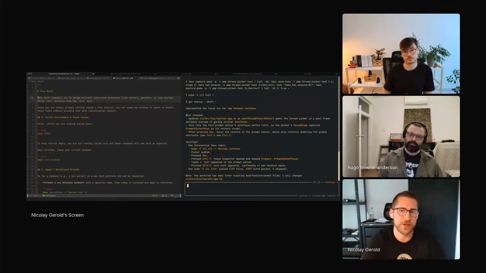

# Nico Gerold - Episode 3 field notes

Nico Gerold, a software engineer at [Sourcegraph](https://sourcegraph.com/) building [AMP](https://sourcegraph.com/amp), used his Episode 3 segment to show how AMP is pushing coding agents from local terminal sessions into background, cloud, and team workflows. The segment centered on skills, agent files, AMP threads, Tmux-driven reproduction, logs from distributed systems, a focus inspector in the CLI, and a thread postmortem skill for improving prompts and instructions.

Nico frames the ["Coding Agents are Dead"](https://ampcode.com/news/the-coding-agent-is-dead) line as a claim about product shape. [Claude Code](https://docs.anthropic.com/en/docs/claude-code/overview), [Pi](https://pi.dev/), and today's terminal agents still write and run code locally, while [Codex](https://openai.com/codex/) and AMP point toward background work where changes live elsewhere and review becomes harder. *"The product becomes something way bigger, which has to cover more than just writing code, what coding agents currently do, but how do I integrate this into the entire software development lifecycle."* [\[01:38:08\]](https://youtube.com/live/ud2WzkKeDZs?t=5888)

That shift makes feedback loops, debug views, shared context, and instruction budget central to the work. Nico's demos keep giving the agent more ways to gather evidence before it writes a fix, while the human decides which parts of the codebase deserve strict review, which repeated errors deserve tools, and which instructions should be removed.

Nico shows an AMP thread that used the Tmux skill and focus inspector to reproduce an `amp threads continue` focus bug, inspect focus state, apply a fix, and verify it in Tmux. <a href="https://youtube.com/live/ud2WzkKeDZs?t=6830">[01:53:50]</a>

## On working with agents

### What he loves: faster first versions make iteration easier

Nico says code quality usually came before and after the first writing pass: thinking through the problem in advance, then editing over the code repeatedly. Agents speed up the initial writing pass, then make the later critique loop easier because there is code to react to. *"You can get to a first version of the code way quicker and just throw something out there, look at it, and formulate why you don't like it."* [\[01:40:49\]](https://youtube.com/live/ud2WzkKeDZs?t=6049)

Agents also help with research and codebase understanding, but Nico keeps business logic and product intent as human work. *"What's really hard is understanding the business logic, the understanding and why it was written behind that."* [\[01:41:02\]](https://youtube.com/live/ud2WzkKeDZs?t=6062)

### What he finds most frustrating: generated code can look right while missing constraints

Nico names three daily frustrations. GPT 5.5 adds helper and wrapper functions where inline code would be more sensible, agents misplace logic at the wrong abstraction level, and validation is getting harder because the code now runs and looks plausible. *"They are generating functioning code, which also looks correct, but which still can have a lot of edge cases or not be correct on the business logic or the specific constraints you have."* [\[01:42:56\]](https://youtube.com/live/ud2WzkKeDZs?t=6176)

He reviews different areas with different intensity. Front-end settings pages and CLI widgets can tolerate more cleanup later, while core hot-path logic deserves stricter attention because every user touches it. *"You really have to decide which parts of the code base matter a lot and which don't."* [\[01:43:33\]](https://youtube.com/live/ud2WzkKeDZs?t=6213)

## Workflows

### Give coding agents logs, Tmux, and debug views before they fix bugs

Nico's main workflow is to give agents structured access to the data they need before asking them to change code. AMP's distributed system has an engine, a proxying server, sandboxes, and local CLI pieces, so a useful agent has to aggregate logs across services before it can debug one problem. *"How can we make it as easy as possible for the agent to access the relevant data and then just let it crunch and use as much tokens as possible to figure it out?"* [\[01:46:46\]](https://youtube.com/live/ud2WzkKeDZs?t=6406)

The local codebase stores logs from the locally running server, engine, and CLI, and the root agent file tells the agent where to find them. The agent can reproduce an issue, inspect the logs, and decide whether the reproduction worked. *"When it tries to reproduce something, it can use logs pretty strategically."* [\[01:47:41\]](https://youtube.com/live/ud2WzkKeDZs?t=6461)

The same pattern removes human copy-paste from debugging. Nico wants logs, reproduction steps, Tmux sessions, and debug panes inside the agent's own flow so it can keep iterating autonomously. *"How can we bring feedback loops into the agent or ways to gather more data about a problem and get it into the flow of the agent?"* [\[01:48:32\]](https://youtube.com/live/ud2WzkKeDZs?t=6512)

The focus-inspector demo is the concrete version of the workflow. After the agent reproduced an `amp threads continue` focus bug in Tmux but could not locate the focus state, Nico added a focus inspector to the UI. The agent then compared focus trees before and after keyboard shortcuts, found the focus tree problem, pushed a fix, and retried it in Tmux. *"It realized, the focus tree isn't being set correctly."* [\[01:53:44\]](https://youtube.com/live/ud2WzkKeDZs?t=6824)

### Reuse AMP threads so agents can apply fixes across the team

AMP threads make a teammate's work available as reusable context. Nico describes a pattern where one person fixes a bug in one thread, another person notices that the same fix applies elsewhere, then gives the thread ID to an agent. *"I can just take the thread ID, give it to the agent and tell it, hey, there was a fix in there. Apply the same fix to this file and just send it off."* [\[01:51:21\]](https://youtube.com/live/ud2WzkKeDZs?t=6681)

The agent can pull the thread data, ask questions about the thread, and continue working from the prior context. Nico says Pi has a similar pattern inside a codebase, while AMP aims to make it work across a team or enterprise. *"For us, it's enable that for your entire team, for your entire enterprise to make it more useful across the entire team."* [\[01:51:44\]](https://youtube.com/live/ud2WzkKeDZs?t=6704)

### Run thread postmortems after bad agent conversations

Nico uses a local thread postmortem skill when an agent conversation goes wrong. He asks the agent to analyze the thread, identify why it made the bad decision, and connect the failure back to system prompts, tool definitions, skills, agent files, or other context. *"Every time when I have something weird happen in a thread or in an agent conversation, I sit down and try to have the agent analyze or introspect why it did it."* [\[01:59:24\]](https://youtube.com/live/ud2WzkKeDZs?t=7164)

The workflow finds outdated documentation and bad instructions inside the codebase. *"A surprising amount of failures can be found because it's a wrong instruction."* [\[01:59:40\]](https://youtube.com/live/ud2WzkKeDZs?t=7180)

Nico then chats with the agent about the decision path and asks the postmortem skill to propose removals, edits, or additions. *"When you have something which didn't work, try to figure out why didn't it work and just chat with the agent a bit."* [\[02:00:10\]](https://youtube.com/live/ud2WzkKeDZs?t=7210)

## Skills

### G Cloud skill

Nico shows a G Cloud skill that tells the agent how to interact with [Google Cloud](https://cloud.google.com/) and how AMP's distributed system is laid out. *"One of them, for example, is just for G Cloud, which tells it how to interact with it and what the different components in our systems are."* [\[01:45:41\]](https://youtube.com/live/ud2WzkKeDZs?t=6341)

The skill prevents the agent from rediscovering service names and deployment locations every run. It tells the agent which services live in Cloud Run or Kubernetes so it can pull logs quickly and use them during local reproduction. *"It shouldn't figure out all of it for every single thread it's running."* [\[01:46:15\]](https://youtube.com/live/ud2WzkKeDZs?t=6375)

### Tmux skill

Nico calls [Tmux](https://github.com/tmux/tmux/wiki) one of his favorite skills. The skill teaches the agent how to use Tmux in AMP's codebase, start dev versions of AMP's CLI, send text, trigger shortcuts, inspect logs, and keep iterating. *"We tell it how to use Tmux correctly and spin up dev versions of AMP, of our CLI, in Tmux and send text, do certain shortcuts."* [\[01:48:04\]](https://youtube.com/live/ud2WzkKeDZs?t=6484)

That capability lets the agent reproduce a bug before writing a fix. *"It can do that and look at the logs, see whether it reproduced it, and if not iterate, iterate, and iterate to actually find a problem, find a bug, and reproduce it first."* [\[01:48:22\]](https://youtube.com/live/ud2WzkKeDZs?t=6502)

### Thread postmortem skill

Nico's thread postmortem skill is local to him and exists for agent introspection. He describes it as an `analyze the thread` capability. *"This is a thread postmortem, I call it."* [\[01:59:20\]](https://youtube.com/live/ud2WzkKeDZs?t=7160)

The skill asks the agent which instruction caused a mistake, whether an instruction was missing, conflicting, ambiguous, user-specific, or caused by the system prompt, then categorizes the failure as steering, undo, repetition, confusion, wrong tool, missing context, underagentic, or overagentic. *"I ask them to categorize it."* [\[02:01:50\]](https://youtube.com/live/ud2WzkKeDZs?t=7310)

The skill then proposes instruction changes and defaults toward removal. *"I tell it to always default to removing because agents always like to add new stuff instead of removing things."* [\[02:02:12\]](https://youtube.com/live/ud2WzkKeDZs?t=7332)

Nico scrolls through the visible skill artifact: it includes questions, failure categories, output structure, and guidance for when to add a new skill versus when to change an agent file. *"When I should add a new skill and use when the knowledge is specialized, not always needed, and should be loaded on demand."* [\[02:02:57\]](https://youtube.com/live/ud2WzkKeDZs?t=7377)

## Tools / projects he showed

### AMP

[AMP](https://sourcegraph.com/amp) is the coding agent Nico builds at Sourcegraph. He describes it as similar to Codex and Claude Code, with an enterprise and team focus. *"We are a coding agent like Codex, Claude Code, but our main focus is basically enterprises and teams."* [\[01:50:39\]](https://youtube.com/live/ud2WzkKeDZs?t=6639)

Nico is also using AMP to build AMP. In the model-variation discussion, he says his team validates major system-prompt changes carefully because AMP's own harness depends on those instructions. *"I'm mostly using AMP to build AMP and we are very careful with what we add to the system prompt."* [\[02:04:07\]](https://youtube.com/live/ud2WzkKeDZs?t=7447)

The focus inspector is an AMP debug view that shows focus state before and after keyboard shortcuts. Nico added it after a coding agent could reproduce a focus bug but could not locate where focus was going. *"What I did is I added a focus inspector to the UI where it can look at the focus tree."* [\[01:53:21\]](https://youtube.com/live/ud2WzkKeDZs?t=6801)

### AMP threads

AMP threads are shared conversations that can be visible to teammates, private when needed, and accessible in the web store. Nico presents them as a core part of AMP's team value. *"A lot of our functionality is actually around sharing threads or sharing conversations with your team."* [\[01:50:46\]](https://youtube.com/live/ud2WzkKeDZs?t=6646)

Threads also become agent context. Another person can access a thread, refer to it, and ask an agent to reuse a fix from that thread in another file.

### Codex

Nico names [Codex](https://openai.com/codex/) as an example of coding agents moving into cloud and background execution. *"Codex was probably the first completely in the background, completely in the cloud."* [\[01:37:31\]](https://youtube.com/live/ud2WzkKeDZs?t=5851)

He later names Codex again as a peer to AMP and Claude Code when explaining AMP's product category. [\[01:50:39\]](https://youtube.com/live/ud2WzkKeDZs?t=6639)

### Claude Code

[Claude Code](https://docs.anthropic.com/en/docs/claude-code/overview) is Nico's example of today's local terminal coding-agent shape. He groups it with Pi as the current iteration that mostly runs in the terminal. *"What we use today, like Claude Code, Pi as well, which is mostly in the terminal and it's running."* [\[01:37:13\]](https://youtube.com/live/ud2WzkKeDZs?t=5833)

He also names Claude Code as a comparable coding agent when describing AMP's product category. [\[01:50:39\]](https://youtube.com/live/ud2WzkKeDZs?t=6639)

### Pi

[Pi](https://pi.dev/) appears in Nico's opening comparison as part of the current local-terminal agent category. *"What we use today, like Claude Code, Pi as well, which is mostly in the terminal and it's running."* [\[01:37:13\]](https://youtube.com/live/ud2WzkKeDZs?t=5833)

Nico also compares Pi's thread-like context reuse with AMP's team-wide threads. *"Pi is something similar as well, but it's mostly in code base."* [\[01:51:36\]](https://youtube.com/live/ud2WzkKeDZs?t=6696)

### G Cloud

[Google Cloud](https://cloud.google.com/) is the cloud interface behind Nico's G Cloud skill. The agent already has general documentation knowledge, but Nico adds the team's setup details through skills. *"It has base knowledge about every single thing, about Tmux, about G Cloud, but it doesn't know about your specific setups."* [\[01:49:23\]](https://youtube.com/live/ud2WzkKeDZs?t=6563)

The relevant setup details include service names, Cloud Run, Kubernetes, and where logs live.

### Tmux

[Tmux](https://github.com/tmux/tmux/wiki) is the terminal multiplexer Nico uses to let the agent run AMP's CLI, send keystrokes, and inspect behavior. *"One of my favorite skills is Tmux."* [\[01:48:04\]](https://youtube.com/live/ud2WzkKeDZs?t=6484)

The focus demo uses Tmux twice: first to run `amp threads continue` in dev and reproduce the bug, then again after Nico adds the focus inspector so the agent can compare focus trees before and after keyboard shortcuts. [\[01:52:46\]](https://youtube.com/live/ud2WzkKeDZs?t=6766)

### AGENTS.md

Nico references the root agent file as the place where AMP's local agents learn about running logs. The file tells the agent where local server, engine, and CLI logs are stored. *"The agent knows about it from the root agent file."* [\[01:47:40\]](https://youtube.com/live/ud2WzkKeDZs?t=6460)

He also uses agent files as part of the thread postmortem skill's failure search. The skill asks whether a mistake came from the system prompt, tools, skills, local agent files, or global agent files. [\[02:01:23\]](https://youtube.com/live/ud2WzkKeDZs?t=7283)

### Coding Agents are Dead

[`Coding Agents are Dead`](https://ampcode.com/news/the-coding-agent-is-dead) is the AMP team's blog-post title that frames Nico's segment and an upcoming podcast livestream. Nico says the title is a play on the current generation of terminal-first coding agents. *"It was really a play of the current iteration of coding agents."* [\[01:37:13\]](https://youtube.com/live/ud2WzkKeDZs?t=5833)

The title points to a product shift rather than a disappearance of coding agents: agents still write code, but the product has to include design, background execution, review, and validation.

## Principles and explainers

### Coding-agent products now cover the whole development lifecycle

Nico expects coding-agent products to handle more than writing code because cloud and background execution change where review and validation happen. *"It's not editing and running locally anymore on your desktop. So the changes are completely somewhere else."* [\[01:37:48\]](https://youtube.com/live/ud2WzkKeDZs?t=5868)

That creates product work around pulling changes down, reviewing them, making review smooth, designing before the code, and validating after review. *"How do I integrate this into the entire software development lifecycle and include the steps before the design phase and the steps after the review to make sure it's valid?"* [\[01:38:18\]](https://youtube.com/live/ud2WzkKeDZs?t=5898)

### Skills are capabilities with local setup knowledge

Nico defines skills as capabilities the team wants to give the agent, usually a tool plus the codebase-specific way to use it. *"For us, our skills are more capabilities we want to give to the agent."* [\[01:49:14\]](https://youtube.com/live/ud2WzkKeDZs?t=6554)

The generic documentation is not enough for AMP's systems. The skill adds service names, local commands, context for AMP's CLI, and correct usage so the agent does not spend its first turns failing at tool setup. *"It just doesn't have to waste tokens in the beginning to first figure out how to use it and fail first for the first few turns."* [\[01:49:46\]](https://youtube.com/live/ud2WzkKeDZs?t=6586)

### Validate the agent's theory of the bug, then validate the fix

Nico separates two validation targets: whether the code works, and whether the model's explanation of the bug is true. *"Validate that it works, but also validate that the assumption the model is making about what the problem is, if you give it a bug, is also correct."* [\[01:54:59\]](https://youtube.com/live/ud2WzkKeDZs?t=6899)

He sees the wrong root cause as the bigger problem in many cases. A downstream symptom can look like the bug, so the model needs tools that expose the root cause before it writes code. *"The model assumes something is the problem which isn't the root cause or which isn't the root problem, or maybe also is a red herring."* [\[01:55:16\]](https://youtube.com/live/ud2WzkKeDZs?t=6916)

### Build debug tools for repeated agent failure modes

Nico treats repeated failure patterns as candidates for tools rather than more prompt text. Storybooks, debug panes, and focus inspectors give the model structured information about the system so it can find the root cause, produce a fix, and validate the result. *"Give it a way to actually look at more information in a structured way."* [\[01:54:07\]](https://youtube.com/live/ud2WzkKeDZs?t=6847)

The payoff is narrower review work for humans. Once root-cause guessing is reduced, the remaining review focuses more on code quality, placement, design, and architecture. *"You're eliminating one mistake the agent can make completely, and then you only have to care about other ones."* [\[01:56:02\]](https://youtube.com/live/ud2WzkKeDZs?t=6962)

He argues that an `AGENTS.md` instruction works for simple behavior, but complex repeated mistakes need an artifact the agent can operate. *"It's often better to actually give it tools or ways where it can actually really debug it and figure out what's going on."* [\[01:57:42\]](https://youtube.com/live/ud2WzkKeDZs?t=7062)

### Leave instruction budget for the user

Nico resists adding instructions because agents can only comply with so many. *"The main failure pattern is because you have too many instructions."* [\[02:04:37\]](https://youtube.com/live/ud2WzkKeDZs?t=7477)

He wants AMP's system prompts trimmed so user instructions retain space and priority. *"We want to have as much instruction budget left over for the user as possible."* [\[02:04:55\]](https://youtube.com/live/ud2WzkKeDZs?t=7495)

Every system-prompt line needs a target behavior. *"Every line in the system prompt should actually have a clear behavior it is targeting. And if it doesn't, I'm going to rip it out."* [\[02:05:09\]](https://youtube.com/live/ud2WzkKeDZs?t=7509)

### Remove bad instructions before adding new ones

Nico's postmortem skill pushes against the agent tendency to add more instructions. He defaults proposed changes toward removal because more instruction text can worsen compliance. *"Agents always like to add new stuff instead of removing things."* [\[02:02:18\]](https://youtube.com/live/ud2WzkKeDZs?t=7338)

The same principle drives AMP's system-prompt work. Nico says the team validates major changes and keeps each line tied to a behavior target, which reduces model performance variation in their own usage. *"We don't see a lot of performance variation because usually we are pretty confident that every line in the system prompt actually has a clear behavior we are targeting."* [\[02:05:19\]](https://youtube.com/live/ud2WzkKeDZs?t=7519)

### Code-review effort should follow risk and hot-path usage

Nico does not apply equal code-quality standards to every part of the codebase. He cares more about core logic on the hot path than settings pages or some CLI widgets. *"For a lot of front end stuff, for example, I don't care as much about code quality as I do, for example, in our core logic."* [\[01:43:42\]](https://youtube.com/live/ud2WzkKeDZs?t=6222)

For lower-risk areas, he can run cleanup passes later. Agents are useful for those small repeated tidyings because one improved page can become an instruction to update many similar components. *"Apply this to this 50 other components or pages."* [\[01:44:37\]](https://youtube.com/live/ud2WzkKeDZs?t=6277)

## Additional quotations

- On review becoming harder when work moves away from the local desktop: *"This also makes something like review even more challenging. How do you actually decide to really look at the changes?"* [\[01:37:55\]](https://youtube.com/live/ud2WzkKeDZs?t=5875)

- On exploratory agent instructions from Hugo that Nico agrees with: *"Don't write tests. Don't care about backwards or forwards compatibility."* [\[01:42:13\]](https://youtube.com/live/ud2WzkKeDZs?t=6133)

- On cleanup passes in lower-risk code: *"Every now and then I'm probably doing a cleanup pass because I'm noticing, this code is shit."* [\[01:44:14\]](https://youtube.com/live/ud2WzkKeDZs?t=6254)

- On the G Cloud skill's purpose: *"It can pull the logs based on what it is working on."* [\[01:45:49\]](https://youtube.com/live/ud2WzkKeDZs?t=6349)

- On distributed debugging: *"It needs to be able to pull all these logs and aggregate it together to debug a single problem."* [\[01:46:06\]](https://youtube.com/live/ud2WzkKeDZs?t=6366)

- On the agent using more thinking once it has data: *"Usually the output gets better, the more thinking the agent can actually spend on a problem, but it has to find all the relevant data."* [\[01:47:05\]](https://youtube.com/live/ud2WzkKeDZs?t=6425)

- On skills as tool usage context: *"It doesn't know about your specific setups, what services you have, or how to use Tmux in the context of our CLI."* [\[01:49:32\]](https://youtube.com/live/ud2WzkKeDZs?t=6572)

- On AMP's team focus: *"They are all accessible for other people in your team as well. If you want to, you can set them private as well."* [\[01:50:55\]](https://youtube.com/live/ud2WzkKeDZs?t=6655)

- On focus in a CLI: *"Focus means in the CLI which of the active widgets of the active UI on the screen gets the keyboard input."* [\[01:52:05\]](https://youtube.com/live/ud2WzkKeDZs?t=6725)

- On the focus bug: *"When we start up a new thread with continue, it pops up a picker of the different threads and it wouldn't focus correctly."* [\[01:52:34\]](https://youtube.com/live/ud2WzkKeDZs?t=6754)

- On the first reproduction step: *"It can reproduce it. Yes, this was the first step."* [\[01:53:07\]](https://youtube.com/live/ud2WzkKeDZs?t=6787)

- On the focus inspector result: *"It realized, the focus tree isn't being set correctly."* [\[01:53:44\]](https://youtube.com/live/ud2WzkKeDZs?t=6824)

- On validating the fix in Tmux: *"Push the fix, try it again in Tmux, whether it's correct now."* [\[01:53:57\]](https://youtube.com/live/ud2WzkKeDZs?t=6837)

- On the skill shown after the focus demo: *"A lot of my work is the tuning of the harness and the models and the tools to get the most out of them."* [\[01:58:45\]](https://youtube.com/live/ud2WzkKeDZs?t=7125)

- On model introspection: *"The models got way better in the last year at introspection."* [\[01:58:57\]](https://youtube.com/live/ud2WzkKeDZs?t=7137)

- On outdated docs causing failures: *"We had that happen a lot in our code base where we had outdated documentation in there."* [\[02:00:03\]](https://youtube.com/live/ud2WzkKeDZs?t=7203)

- On the postmortem skill's question set: *"What are the instructions that you have in your context window that led you to making these decisions?"* [\[02:01:15\]](https://youtube.com/live/ud2WzkKeDZs?t=7275)

- On system-prompt pain: *"Is the system prompt wrong, which is the biggest pain for me. I always want to get them out."* [\[02:01:42\]](https://youtube.com/live/ud2WzkKeDZs?t=7302)

- On the postmortem output format: *"A bunch of different categories of suggestions it can make and how to do them."* [\[02:03:12\]](https://youtube.com/live/ud2WzkKeDZs?t=7392)

- On token frugality in the skill output: *"I don't want to waste so much tokens."* [\[02:03:27\]](https://youtube.com/live/ud2WzkKeDZs?t=7407)

## Live reactions and follow-ups

### Discord link to AMP's blog post

Hugo posted the AMP team's ["Coding Agents are Dead"](https://ampcode.com/news/the-coding-agent-is-dead) blog post in Discord before Nico's segment, which gave the chat a direct reference for the title Nico unpacked on stream.

### Discord reaction to the postmortem skill

During Nico's thread postmortem walkthrough, Suren called out the removal-first rule: *"cool unlock about **removing** first, in Niclay's postmortem skill."* The chat reaction tracks the same instruction-budget point Nico makes later when he says system prompts should stay trimmed and every line should target a clear behavior.

### Paul's harness follow-up

Paul's later segment connects directly to Nico's coding-agent explanation. He says he is researching how to write coding agents from scratch and that *"that's why Nico's talk was interesting to me"* [\[02:15:13\]](https://youtube.com/live/ud2WzkKeDZs?t=8113). Hugo also points back to Nico while discussing brittle out-of-the-box tools: *"to Nico's point, they build their own harness around frontier models"* [\[02:12:18\]](https://youtube.com/live/ud2WzkKeDZs?t=7938).
