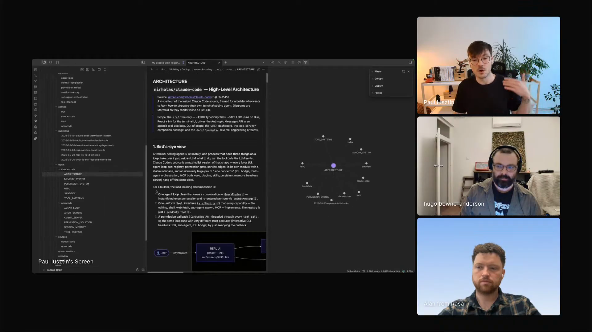

# Paul Iusztin - Episode 3 field notes

Paul Iusztin, author of the bestselling [LLM Engineer's Handbook](https://www.pauliusztin.ai/book), lead instructor of the [Agentic AI Engineering course](https://www.pauliusztin.ai/course), creator of [Decoding AI Magazine](https://www.decodingai.com/), and builder focused on helping people escape proof-of-concept purgatory, used his Episode 3 segment to show a content and knowledge workflow rather than another coding-agent demo. He walked through a personalized second brain in [Zed](https://zed.dev/ai) and [Obsidian](https://obsidian.md/), a research skill built around a custom knowledge base, a writing pipeline that turns research into machine-readable guidelines, and a feedback loop that updates writing profiles from the difference between AI output and human edits.

The segment is about making agents useful for a small publishing and AI-engineering team without letting the output drift into generic AI voice. Paul says agents let him write more code, test more ideas, and publish more, but the demo keeps returning to one constraint: agents need different amounts of freedom for different kinds of work. *"For coding, you need to be precise, but you don't need to be that precise because agents have seen a lot of code. So as long as you pin down the architectural decisions really well, they work to some extent."* [\[02:11:12\]](https://youtube.com/live/ud2WzkKeDZs?t=7872)

His research and writing system gives the agent access to repositories, Obsidian notes, [Readwise](https://readwise.io/) highlights, RSS feeds, [NotebookLM](https://notebooklm.google/), writing profiles, article outlines, and [MCP](https://modelcontextprotocol.io/)-backed writing tools. Paul still decides the article's argument, order, point of view, and final edits. The agents gather, distill, plan, draft, and look for reusable correction signals.

Paul shows the coding-agent research wiki in Zed, with Claude Code architecture notes, topic pages, and a graph view over the knowledge base. <a href="https://youtube.com/live/ud2WzkKeDZs?t=8189">[02:16:29]</a>

## On working with agents

### What he loves: agents unlock small-team output

Paul works with a small Decoding AI team that has to experiment constantly. Agents expand what he can build and publish: *"For the first time in my life, I can write a ton of code, experiment with a ton of ideas, write a lot of articles, posts."* [\[02:09:17\]](https://youtube.com/live/ud2WzkKeDZs?t=7757)

He frames the change as a capacity shift rather than a convenience feature. *"It allows me to get my full potential, because up to this point time was a big issue for me to actually build stuff, write, create content."* [\[02:09:28\]](https://youtube.com/live/ud2WzkKeDZs?t=7768)

The automation loop has become its own work. *"Now I spend more time on my automations than doing that myself, probably."* [\[02:10:15\]](https://youtube.com/live/ud2WzkKeDZs?t=7815)

### What he finds most frustrating: the right amount of freedom changes by task

Paul uses agents for content creation and coding, and the frustrating part is deciding how much structure each task needs. *"The most frustrating part is this balance between how precise you need to be and how much freedom you should give them."* [\[02:10:57\]](https://youtube.com/live/ud2WzkKeDZs?t=7857)

Coding can tolerate more autonomy when the architecture is pinned down. Writing breaks differently: *"If you leave them too much interpretation and gaps, the LLM and AI voice immediately pops out."* [\[02:11:31\]](https://youtube.com/live/ud2WzkKeDZs?t=7891)

The cost of a bad long-running agent task is emotional and practical. *"Hitting that sweet spot between how much input should I give it and how much they can do on their own is very frustrating, especially after you waited an hour or so to get the task done and you see that it's crap."* [\[02:11:52\]](https://youtube.com/live/ud2WzkKeDZs?t=7912)

### What he would trade off for control: open-source models and a custom harness

When Hugo describes brittle behavior in out-of-the-box tools, Paul says he has considered moving toward open-source models. *"Then you have your own harness and you know that it works."* [\[02:12:42\]](https://youtube.com/live/ud2WzkKeDZs?t=7962)

He also names the resource cost: building and hosting everything yourself takes money, time, and infrastructure. *"Claude Code and out-of-the-box systems are a lot more convenient in many ways, starting from money to time to everything you can think of."* [\[02:13:00\]](https://youtube.com/live/ud2WzkKeDZs?t=7980)

## Workflows

### Build a personal research wiki from repositories, notes, and trusted feeds

Paul's first live workflow is a custom version of [Karpathy's LLM Knowledge Base](https://gist.github.com/karpathy/442a6bf555914893e9891c11519de94f) on top of his second brain. He built it from scratch because the structure needs to match his own processes: *"Personally, I think that's where the magic is, because every knowledge base should be to some extent personalized on your own processes."* [\[02:14:43\]](https://youtube.com/live/ud2WzkKeDZs?t=8083)

The example topic is coding agents from scratch. Paul has been researching [Claude Code](https://www.claude.com/product/claude-code), [OpenCode](https://opencode.ai/), and [Pi](https://pi.dev/) so he can understand coding-agent architecture by reading systems directly. *"I think that the best way to do this is just to jump straight into the code. It's so much faster and so much more rewarding."* [\[02:15:35\]](https://youtube.com/live/ud2WzkKeDZs?t=8135)

The knowledge base exposes architecture, memory systems, permission systems, sandboxing, core entities, core concepts, comparisons, and question logs. *"By doing this, I can really quickly scan through the overall architecture, through the memory system, permission system, REPL sandbox, or whatever makes sense to me and I want to dive deeper."* [\[02:16:23\]](https://youtube.com/live/ud2WzkKeDZs?t=8183)

Paul runs the research skill against a repository and points it at the knowledge base. The run takes repository-specific context, adds it to the knowledge base, and produces comparisons across systems. *"After 10, 15, 20 minutes, it depends on the repository, I will get side-by-side comparison with this new harness and basically a deep dive into the repository itself, plus comparisons and concepts."* [\[02:19:49\]](https://youtube.com/live/ud2WzkKeDZs?t=8389) He uses prior questions as scaffolding for the next repository, so new code can be compared against concepts already extracted from other codebases.

Paul's research workflow is not limited to code repositories. He can ingest Obsidian material because Obsidian has a CLI, and he logs what he reads into Readwise with highlights and notes. *"It has access basically to my personal thoughts."* [\[02:20:32\]](https://youtube.com/live/ud2WzkKeDZs?t=8432)

NotebookLM extends the workflow when he wants deep research on external resources he does not already know. *"I can just put a lot of context and have a very dynamic research process to understand topics."* [\[02:20:51\]](https://youtube.com/live/ud2WzkKeDZs?t=8451)

Readwise and RSS also work as a trusted resource repository. Paul collects links from YouTube, LinkedIn, and feeds, then reads them when a project needs them. *"When I actually have a project that I need to focus on, I do that deep research and instead of looking all over the internet, which usually doesn't find good stuff, I usually treat this as a high-signal resource."* [\[02:35:20\]](https://youtube.com/live/ud2WzkKeDZs?t=9320)

### Turn a human outline and distilled research into an article draft

Paul does not pass the whole research repository to a writing agent. He writes or sketches the article first, then asks an agent to pull only relevant ideas from the wiki. *"I ask an agent just to bring from all this wiki ideas that I actually covered into that article."* [\[02:21:35\]](https://youtube.com/live/ud2WzkKeDZs?t=8495)

The output is a smaller research packet for the piece. *"I compiled it into a very distilled version of my research relevant to what I care about."* [\[02:21:44\]](https://youtube.com/live/ud2WzkKeDZs?t=8504)

Paul starts writing by dumping his own ideas into an outline in a particular order. The outline carries the argument, teaching goal, narrative, problem, solution, and idea sequence. *"I mostly think about what I want to teach, how the ideas should be connected, the narrative of the piece, the problem, the solution, basically the core of the article, which comes from me."* [\[02:24:32\]](https://youtube.com/live/ud2WzkKeDZs?t=8672)

The outline stays fast because Paul treats it as a set of references for later research retrieval. *"It takes me 15 minutes to sketch this outline if the problem itself is clear to me after I do the research, and very often I do the research and outline in parallel."* [\[02:25:09\]](https://youtube.com/live/ud2WzkKeDZs?t=8709)

The article guideline create skill takes the outline and the queryable research wiki, then creates a plan for the article. Paul says the point is machine readability: *"The intent of this is not necessarily to be human-readable. It is to be machine-readable, to contain all kinds of metadata that I want to put into the article."* [\[02:26:14\]](https://youtube.com/live/ud2WzkKeDZs?t=8774)

The guideline includes the what, why, and who of the article, theory-to-practice ratios, point of view, special instructions, and sections. Paul's review focus at this stage is order and completeness, not prose polish. *"My core focus at this step is just to put the right thoughts, the right ideas into the right order."* [\[02:26:49\]](https://youtube.com/live/ud2WzkKeDZs?t=8809)

After the guideline exists, Paul runs an article create skill that compiles it into the human version. *"It cares a lot on how it sounds, actually to be very nice to read, to follow my voice on how I would do things."* [\[02:27:22\]](https://youtube.com/live/ud2WzkKeDZs?t=8842)

The skill uses an MCP server and a local marketplace of plugins and MCP servers for writing. Paul describes the skill's role as choosing the right pieces and calling the MCP server. [\[02:27:48\]](https://youtube.com/live/ud2WzkKeDZs?t=8868)

### Update writing profiles from human edits

Paul keeps writing profiles as living instructions for how the final piece should look. After the agent writes an article, he keeps the original version, edits it, diffs the two, and asks an LLM to interpret the diff. *"See actually what I corrected from it, what I didn't like from the article, and then create basically a plan of attack on how I could apply those corrections to my profiles."* [\[02:31:16\]](https://youtube.com/live/ud2WzkKeDZs?t=9076)

The update loop exists because models and harnesses change. Paul cannot manually keep every prompt and profile current, so he looks for signals in his own work. *"I try as much as possible to find data-driven ways to keep my system on top of it, update it as much as possible and as easy as possible."* [\[02:32:01\]](https://youtube.com/live/ud2WzkKeDZs?t=9121)

His analogy is model training without touching model weights: *"It's similar to a loss function: this is how I want it to look, and this is the bad version. Do a diff between them and find what signal I can use to improve my skills instead of the model's weight."* [\[02:32:28\]](https://youtube.com/live/ud2WzkKeDZs?t=9148)

## Skills

### research skill

Paul's core [research skill](https://github.com/hugobowne/show-us-your-agent-skills/tree/main/skills/research) ingests new data into the knowledge base and queries it. The skill includes a [`SKILL.md`](https://github.com/hugobowne/show-us-your-agent-skills/blob/main/skills/research/SKILL.md), [data contract](https://github.com/hugobowne/show-us-your-agent-skills/blob/main/skills/research/CONVENTIONS.md), [subagent briefs](https://github.com/hugobowne/show-us-your-agent-skills/tree/main/skills/research/agents), and [supporting scripts](https://github.com/hugobowne/show-us-your-agent-skills/tree/main/skills/research/scripts). He introduces it after opening the coding-agent research project: *"I have this research skill that allows me to ingest new data into the knowledge base and also query it."* [\[02:18:46\]](https://youtube.com/live/ud2WzkKeDZs?t=8326)

He says the skill itself was vibe coded and then versioned. *"I was really lazy and this is vibe coded, so the skill itself is vibe coded."* [\[02:17:25\]](https://youtube.com/live/ud2WzkKeDZs?t=8245)

Paul's maintenance rule is pragmatic: *"If it works, it works. If it doesn't, I try to make it work, and then I manually go in and fix stuff only when things break, not when bootstrapping."* [\[02:17:39\]](https://youtube.com/live/ud2WzkKeDZs?t=8259)

### research distillation skill

Paul has a skill that distills a large research repository into article-relevant context. It sits on top of the research phase and keeps the writing agent from receiving the whole wiki. *"For writing, I don't want to pass all of this into my writing agent."* [\[02:21:24\]](https://youtube.com/live/ud2WzkKeDZs?t=8484)

The skill pulls ideas that match the article sketch and compiles them into a smaller research artifact for the writing pipeline.

### wiki introspection skill

Paul also uses a research-linked introspection skill to inspect the wiki for quality problems. *"It's an introspection skill to find errors into the wiki, for example, if some ideas are repeated or there are some clashes into ideas."* [\[02:21:54\]](https://youtube.com/live/ud2WzkKeDZs?t=8514)

The same skill can extract more ideas from the research base when the existing wiki is incomplete.

### render skill

Paul briefly shows a render-related capability for visualizations. *"For render, to see some beautiful visualizations, which I haven't played that much with those, to be honest."* [\[02:22:12\]](https://youtube.com/live/ud2WzkKeDZs?t=8532)

He does not demo the render output deeply, so it remains a supporting capability in the research environment.

### article guideline create skill

The article guideline create skill turns Paul's outline and research wiki into a structured article plan. *"This article guideline create skill takes my research, my wiki research, which is queryable right through the research skill."* [\[02:25:38\]](https://youtube.com/live/ud2WzkKeDZs?t=8738)

The skill lets the agent dynamically query the wiki as it needs and then place the required research into the outline's order.

### article create skill

The article create skill compiles the machine-readable guideline into a prose draft. *"I have an article create skill which transforms this, compiles this into the human version of it."* [\[02:27:12\]](https://youtube.com/live/ud2WzkKeDZs?t=8832)

The skill uses an MCP server and Paul's writing tools marketplace to pick the right writing resources and produce a draft in his voice.

### profile update skill

Paul shows a skill that compares the original agent-written article with his edited version and proposes profile updates. *"After every article, I apply this skill and try to find, how can I improve my work?"* [\[02:31:37\]](https://youtube.com/live/ud2WzkKeDZs?t=9097)

It looks for rules that should be removed, rules that now apply, and profile changes that keep the system aligned with Paul's current edits.

## Tools / projects he showed

### Personalized LLM knowledge base

Paul's custom knowledge base is the main project in the research demo. It is modeled after Karpathy's LLM Knowledge Base and built on top of Paul's second brain. *"Everything is from scratch because it's very coupled with my way of doing things, with my processes."* [\[02:14:37\]](https://youtube.com/live/ud2WzkKeDZs?t=8077)

The knowledge base stores repository research, questions, concepts, comparisons, and cross-pollinated ideas. It is personal enough to support Paul's writing later instead of producing generic internet summaries.

### Zed

Paul shares his screen from [Zed](https://zed.dev/ai) and says he switched a couple of weeks before the episode. *"I just switched to Zed a couple of weeks ago and I'm still figuring out how everything works."* [\[02:13:51\]](https://youtube.com/live/ud2WzkKeDZs?t=8031)

Zed is where he codes and writes when he wants a snappy, minimal interface. *"Zed is mostly I use it for coding and writing."* [\[02:33:13\]](https://youtube.com/live/ud2WzkKeDZs?t=9193)

### Obsidian

[Obsidian](https://obsidian.md/) is the core of Paul's second brain and one source for the research pipeline. He can ingest from Obsidian because it has a CLI. [\[02:20:21\]](https://youtube.com/live/ud2WzkKeDZs?t=8421)

Paul keeps Obsidian because it works well across devices and has stronger visuals. *"Obsidian is really good if you want to use it on your phone, on your iPad, or whatever. It's more platform independent and the visuals are nicer."* [\[02:33:28\]](https://youtube.com/live/ud2WzkKeDZs?t=9208)

### Claude Code

Paul uses [Claude Code](https://www.claude.com/product/claude-code) in the demo and as one of the coding-agent systems he is studying. He has ingested the Claude Code repository into his knowledge base, and he also names Claude Code as the convenient out-of-the-box path compared with running open-source models yourself. [\[02:16:14\]](https://youtube.com/live/ud2WzkKeDZs?t=8174)

He also uses Claude with his second-brain setup for research and writing. *"I use Claude and my second brain setup to also research a lot and then also for writing."* [\[02:14:02\]](https://youtube.com/live/ud2WzkKeDZs?t=8042)

### OpenCode repository

Paul has also ingested the [OpenCode](https://opencode.ai/) repository into the same coding-agent research knowledge base. [\[02:16:17\]](https://youtube.com/live/ud2WzkKeDZs?t=8177)

The repository gives him another implementation to compare against Claude Code and Pi as he studies coding-agent architecture.

### Pi harness

Paul starts a live research run on the [Pi](https://pi.dev/) harness during the segment. *"Today I wanted to start digging into the Pi harness and how it works."* [\[02:16:53\]](https://youtube.com/live/ud2WzkKeDZs?t=8213)

The run does not finish before the segment ends. Paul later says, *"I have this deep research on Pi, which is not done yet."* [\[02:36:35\]](https://youtube.com/live/ud2WzkKeDZs?t=9395)

### Readwise

[Readwise](https://readwise.io/) is Paul's capture layer for things he reads, highlights, and notes. *"I also log everything that I read into Readwise and do highlights and notes."* [\[02:20:32\]](https://youtube.com/live/ud2WzkKeDZs?t=8432)

He also uses it as a project-specific research source. A deep research algorithm looks inside the Readwise repository, finds archived or unread resources, and moves relevant items into the project context. [\[02:34:49\]](https://youtube.com/live/ud2WzkKeDZs?t=9289)

### RSS feed repository

Paul keeps an RSS feed repository with trusted feeds and sources. *"I create a living repository of everything, of resources that I trust, and sources that I trust."* [\[02:35:45\]](https://youtube.com/live/ud2WzkKeDZs?t=9345)

When the research system finds something there, he treats it as a stronger source than a broad web search result.

### NotebookLM

[NotebookLM](https://notebooklm.google/) is attached to Paul's research process for external resources. *"When I want to do deep research on external resources that I'm not really aware about, I can plug that into as well."* [\[02:20:44\]](https://youtube.com/live/ud2WzkKeDZs?t=8444)

It acts as another context source the research phase can pull from when Paul's own notes are not enough.

### Writing profiles

Paul shows writing profiles that explain how a final piece should look. The profiles are markdown-backed domain knowledge and style knowledge for different content types. *"Here I have these shared profiles where everything is content type dependent. They're good rules on how you actually want to write in your style."* [\[02:29:09\]](https://youtube.com/live/ud2WzkKeDZs?t=8949)

He also has article-specific profiles with instructions for article guidelines, article structure, and introductions. *"I'm super specific on how I want an article to look."* [\[02:29:51\]](https://youtube.com/live/ud2WzkKeDZs?t=8991)

### Writing plugin and MCP server marketplace

Paul maintains his own repository of plugins and MCP servers for writing. *"This repository is my own marketplace of plugins and MCP servers that I use for writing."* [\[02:28:05\]](https://youtube.com/live/ud2WzkKeDZs?t=8885)

The article create skill uses this marketplace through an MCP server so the agent can call the right writing resources.

### Article outline

The live writing demo starts with a test outline for an article Paul is working on that day. The outline is Paul's human-authored structure for what the piece should teach and how the ideas should connect. [\[02:24:07\]](https://youtube.com/live/ud2WzkKeDZs?t=8647)

The outline can ignore typos and final wording because later steps handle research retrieval, structure metadata, and prose.

### Machine-readable article guideline

The article guideline is the machine-readable plan produced from the outline and research wiki. It includes metadata, sections, point of view, theory-practice ratios, and special instructions. [\[02:26:14\]](https://youtube.com/live/ud2WzkKeDZs?t=8774)

Paul uses it to separate idea order from prose quality, so the drafting step can focus on sounding like him.

### Decoding AI Magazine

[Decoding AI Magazine](https://www.decodingai.com/) is the publishing surface behind Paul's writing workflow. Hugo introduces it as the magazine Paul created to help builders escape proof-of-concept purgatory, and Paul then shows the research, outline, guideline, drafting, and profile-update machinery behind that content work. [\[02:07:43\]](https://youtube.com/live/ud2WzkKeDZs?t=7663)

## Principles and explainers

### Personal research systems should fit the builder's process

Paul argues that a useful knowledge base should be personalized. The point is not only storing more files, but structuring research around the questions, comparisons, and concepts that match the builder's own workflow. *"Every knowledge base should be to some extent personalized on your own processes."* [\[02:14:52\]](https://youtube.com/live/ud2WzkKeDZs?t=8092)

That principle explains why he built the knowledge base from scratch rather than treating Karpathy's knowledge-base structure as a drop-in fit.

### Coding and writing need different instruction density

Paul's frustration answer becomes a rule of thumb. Coding agents can fill in details when the architecture is clear because they have seen enough code. Writing agents need much tighter guidance because ambiguity produces generic AI phrasing.

He describes the writing failure as empty compliance with a prompt's shape: *"You can see these phrases that have no meaning and they're just there to be there, just to comply with word count requirements that you added."* [\[02:11:39\]](https://youtube.com/live/ud2WzkKeDZs?t=7899)

### Adapt the workflow to the model instead of fighting it

Paul's response to brittle agent behavior is to adapt the workflow instead of treating the model as an adversary. *"You shouldn't fight LLMs. You should find new ways to get into some symbiosis with them."* [\[02:18:33\]](https://youtube.com/live/ud2WzkKeDZs?t=8313)

His system reflects that stance: agents do research, distillation, plan creation, drafting, diff interpretation, and profile updates, while Paul supplies taste, article intent, and correction signals.

### Research anchored in personal questions produces less generic writing

Paul contrasts his wiki-backed writing workflow with dumping static internet files into a writing agent. The research base is built from his questions and thoughts, so the article starts from his understanding. *"Then your articles will be anchored in your thought process and not in something super generic from the internet."* [\[02:23:41\]](https://youtube.com/live/ud2WzkKeDZs?t=8621)

That is why the research phase comes before and beside outlining, and why distillation is tied to the article sketch.

### Machine-readable plans can separate content quality from prose quality

Paul's guideline step deliberately avoids optimizing for reader-facing prose. It stores what belongs in the piece, why it belongs there, how theory and practice should balance, and how sections should fit together.

The separation lets him judge one thing at a time. At the guideline stage, he cares about research and ordering. At the article-create stage, the agent works on voice, readability, and style.

### Writing systems have to keep changing with models and harnesses

Paul treats profiles as living artifacts because models and harnesses change. *"Those harnesses and LLMs on themselves are a living being and they constantly get updated."* [\[02:31:50\]](https://youtube.com/live/ud2WzkKeDZs?t=9110)

He uses diffs between generated drafts and edited drafts to keep the profiles current without manually revisiting every rule after every model change.

### Keep the second-brain stack simple when agents do the heavy lifting

Paul answers the stack question by keeping the surface small: Obsidian plus an IDE he likes. *"You need Obsidian plus an IDE that you love and enjoy using."* [\[02:33:52\]](https://youtube.com/live/ud2WzkKeDZs?t=9232)

Because he does almost everything agentically, he cares about speed and simplicity more than decorative tooling. *"The thing that I care most about is have a minimalistic interface and everything to be snappy fast."* [\[02:34:00\]](https://youtube.com/live/ud2WzkKeDZs?t=9240)

### Live agent demos can go sideways

Paul's two live workflows do not finish cleanly before handoff. The Pi deep research run is still running, and the writing workflow behaves unexpectedly by writing the article during the demo. Paul names the failure directly: *"Of course on the demo, it went rogue and somehow it wrote the article."* [\[02:36:44\]](https://youtube.com/live/ud2WzkKeDZs?t=9404)

He closes by giving the system a current-confidence estimate rather than claiming completion. *"They're not yet there, but 80-90%, I think. I'm very bullish on this."* [\[02:37:29\]](https://youtube.com/live/ud2WzkKeDZs?t=9449)

## Additional quotations

- On the intro song: *"I never sang so good in my life."* [\[02:08:46\]](https://youtube.com/live/ud2WzkKeDZs?t=7726)

- On the segment choice: *"I just assumed that you had a few agentic coding use cases so far, so I would like to show you my content creation and knowledge workflows."* [\[02:13:17\]](https://youtube.com/live/ud2WzkKeDZs?t=7997)

- On adapting to agents: *"We have to wire our brains a lot to adapt to this new way of building things."* [\[02:09:53\]](https://youtube.com/live/ud2WzkKeDZs?t=7793)

- On automation uncertainty: *"You're not sure if you're doing more good than bad at some point."* [\[02:10:37\]](https://youtube.com/live/ud2WzkKeDZs?t=7837)

- On the coding-agent research topic: *"Now I'm deep into the rabbit hole and understanding how they work."* [\[02:15:13\]](https://youtube.com/live/ud2WzkKeDZs?t=8113)

- On repository-specific research output: *"Here are cross-pollinated ideas, and here you go into that particular repository."* [\[02:20:11\]](https://youtube.com/live/ud2WzkKeDZs?t=8411)

- On watching agent thought streams: *"You can learn a lot yourself on all of this. Unfortunately, when you have eight terminals running parallel, it's a bit harder."* [\[02:23:08\]](https://youtube.com/live/ud2WzkKeDZs?t=8588)

- On article sketches: *"These are more like references on what then should be brought from the research."* [\[02:24:51\]](https://youtube.com/live/ud2WzkKeDZs?t=8691)

- On domain-specific writing profiles: *"It's very baked into my particular domain knowledge."* [\[02:30:00\]](https://youtube.com/live/ud2WzkKeDZs?t=9000)

- On profile upkeep: *"To be honest, for me, it's impossible to do that manually all the time."* [\[02:32:14\]](https://youtube.com/live/ud2WzkKeDZs?t=9134)

- On the second-brain stack: *"I try to keep it as simple as possible, but sometimes it's hard with so many tools around there."* [\[02:33:01\]](https://youtube.com/live/ud2WzkKeDZs?t=9181)

- On trusted feeds: *"If you find something here, good to go. Let's just move on with this."* [\[02:35:51\]](https://youtube.com/live/ud2WzkKeDZs?t=9351)

- On Readwise: *"I'm not sponsored by Readwise."* [\[02:36:10\]](https://youtube.com/live/ud2WzkKeDZs?t=9370)

## Live reactions and follow-ups

### Discord question: Zed and the second-brain stack

Suren asked whether Paul's "Z" meant Zed and whether it worked with Obsidian. Hugo replied in Discord with the [Zed AI page](https://zed.dev/ai), and another viewer described it as a text editor written in Rust. The question anticipated Paul's later stack answer: Obsidian is the durable knowledge base, while Zed is the snappy editor where he codes and writes.

### Discord question: where the agent actually runs

Suren also asked whether Paul's second-brain stack was "all inside Claude Code," naming Zed, Obsidian, Hermes, OpenClaude, and local-file access. Paul answered on stream with the simple version: he uses Obsidian plus an IDE he likes, Claude Code, Readwise, and trusted feeds, with the notes accessible through his local research workflow. [\[02:33:01\]](https://youtube.com/live/ud2WzkKeDZs?t=9181)

### Discord reaction: thorough and cool

After Paul's segment, Suren wrote, "thanks to Paul, very thorough (and cool setup)." The reaction fits the shape of the demo: the Pi research run and article run did not finish cleanly, but the audience still got a detailed look at the stack, source flow, writing profiles, and correction loop.
