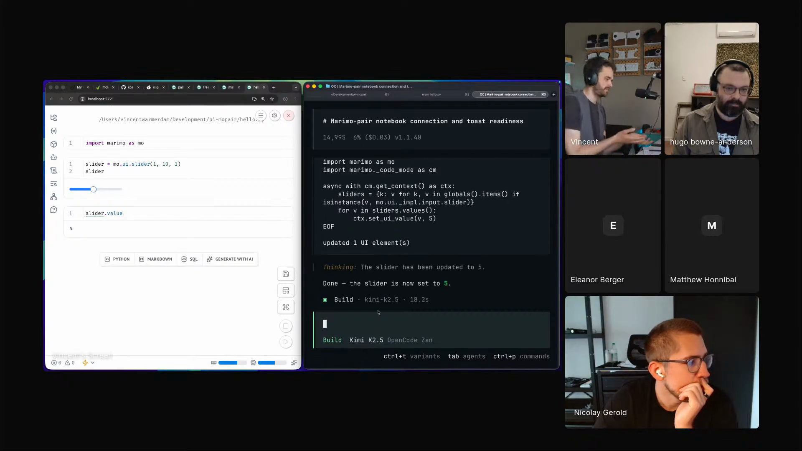

# Vincent - Episode 3 field notes

Vincent, an engineer at [marimo](https://marimo.io/) who has worked with Matt Honnibal and Ines Montani on [spaCy](https://spacy.io/), has worked with [Rasa](https://rasa.com/), maintains [Wiggly Stuff](https://koaning.github.io/wigglystuff/), and is associated with [CalmCode](https://calmcode.io/), uses his Episode 3 segment to show notebooks as a shared surface for human understanding and agent work. His demos keep returning to one operating model: the notebook should expose live state, interactive controls, docs, and runtime variables in a way that both the human and the coding agent can act on.

His thesis lands early while he zooms and watches a notebook cell update from an interactive widget: *"We can really look at the notebook more like a canvas."* [\[01:12:45\]](https://youtube.com/live/ud2WzkKeDZs?t=4365) Wiggly Stuff provides the Lego-brick widgets, marimo gives him the reactive notebook surface, [marimo pair](https://marimo.io/blog/marimo-pair) gives an agent access to live Python variables, and [Pi](https://pi.dev/) plus [MoLab](https://molab.marimo.io/) point toward sandboxed agent work where local file access can be narrowed when the code runs in a proper cloud sandbox.

The segment also argues for human understanding as the goal. Vincent likes agents because they let a small idea become a working artifact quickly, but he keeps the learning burden on himself: *"The whole point of a notebook is that I eventually understand something and that's not something the agent can do for me."* [\[01:14:02\]](https://youtube.com/live/ud2WzkKeDZs?t=4442)

Vincent shows marimo pair giving a coding agent access to live notebook state, including a slider value the agent can read and change. <a href="https://youtube.com/live/ud2WzkKeDZs?t=5164">[01:26:04]</a>

## On working with agents

### What he loves: agents let small ideas become artifacts quickly

Vincent loves the way agents make daydreaming operational. A stray idea can become a prototype fast enough to teach him whether it is worth following. *"They allow me to dream during the day a bit differently."* [\[01:31:05\]](https://youtube.com/live/ud2WzkKeDZs?t=5465)

His Game of Life widget is the example: he wondered whether a front-end drawing surface plus an asynchronous loop could become something more interesting, then the agent helped bootstrap it. *"The fact that an agent allows me to quickly bootstrap things like that, that's a huge creative unlock."* [\[01:31:30\]](https://youtube.com/live/ud2WzkKeDZs?t=5490)

### What he finds most frustrating: hype makes calm learning hard

Vincent's frustration is the culture around agent tools. He uses Hermes as the example of something he would like to understand plainly: *"Could I just have a calm video that explains to me what Hermes agent really is?"* [\[01:31:54\]](https://youtube.com/live/ud2WzkKeDZs?t=5514)

The problem, for him, is that ideas get shared as performance instead of notes from practice. *"I just want normal boring people to exchange notes."* [\[01:32:12\]](https://youtube.com/live/ud2WzkKeDZs?t=5532) He says the current incentive makes people *"pretend to be a guru instead of being a boring person that just says, I tried a bunch of stuff. It kind of works."* [\[01:32:26\]](https://youtube.com/live/ud2WzkKeDZs?t=5546)

## Workflows

### Build reusable notebook widgets with agent-readable docs

Vincent's Wiggly Stuff workflow starts with small interactive widgets that can be clicked together with Python code. The library gives him 3D widgets, graph widgets, a Paint-like drawing surface, and docs that agents can read. *"The really nice philosophy with this Wiggly Stuff library is it's just a Lego brick and you can click it together with the rest of your code."* [\[01:11:47\]](https://youtube.com/live/ud2WzkKeDZs?t=4307)

He makes each widget's docs available in Markdown and provides `llms.txt` so coding agents and search tools can discover how the library works. *"If you have an agent that needs to know how to add this to a Jupyter notebook or a Marimo notebook or what have you, the docs can just get you here."* [\[01:12:01\]](https://youtube.com/live/ud2WzkKeDZs?t=4321)

The same component shape helps agents extend the library. Wiggly Stuff already contains many examples, so when Vincent asks Claude to build a new widget, it can search similar widgets and copy the local style. *"It will just see the way that I like things to be and it will just follow that."* [\[01:22:48\]](https://youtube.com/live/ud2WzkKeDZs?t=4968)

### Use interactive notebooks so the human can play with agent-built explanations

Vincent's notebook demos make abstract behavior inspectable. A Paint-like widget lets the user draw pixels, Python reacts every second, and the front end updates asynchronously. Then he switches the same surface into Conway's Game of Life, where drawing a straight line versus an arc changes the resulting growth. *"If you understand, you're going to understand the game of life way better."* [\[01:16:07\]](https://youtube.com/live/ud2WzkKeDZs?t=4567)

The agent helps him assemble these experiments, but the learning comes from manipulating the system. *"Something about reading the code and being able to change the code to see what happens makes me better at understanding the thing than if I were just to read it from a book."* [\[01:16:39\]](https://youtube.com/live/ud2WzkKeDZs?t=4599)

### Script agent workspaces so demos are always runnable

Vincent uses Conductor to wrap coding agents and script the workspace around them. A `conductor.json` setup command installs dependencies, and a run command starts every demo notebook in the library. *"When a workspace sets up, I want you to run this one install command."* [\[01:22:03\]](https://youtube.com/live/ud2WzkKeDZs?t=4923)

The recurring loop is simple: start a fresh workspace, let the agent iterate, then open the notebook and inspect whether the demos still work. *"Whenever it's done an iteration, I can just open the notebook and see if it did the right thing."* [\[01:22:25\]](https://youtube.com/live/ud2WzkKeDZs?t=4945)

### Pair a live notebook with a coding agent that can inspect and change runtime state

Vincent uses marimo pair with [OpenCode](https://opencode.ai/) to connect a coding agent to a live notebook. The scratch pad gives the agent access to notebook variables, and the agent can interact with UI elements such as a slider. *"It can read every single Python variable here, but you can also ask it to interact with UI elements."* [\[01:25:36\]](https://youtube.com/live/ud2WzkKeDZs?t=5136)

That removes a common debugging loop where the agent has to print intermediate steps to the terminal to discover state. *"You just have a way to give Claude or whatever access to every single Python variable."* [\[01:26:30\]](https://youtube.com/live/ud2WzkKeDZs?t=5190)

### Constrain notebook-paired agents with cloud sandboxes and local file rules

Vincent sketches a cloud-sandbox workflow with MoLab and Pi. The code runs in a cloud sandbox, a local agent connects from the terminal, and Pi listens for tool-call events so local file access can be narrowed. *"If the tool call is of type read, then you can say you're only allowed to read the Marimo Pair files because everything else has to happen in the cloud."* [\[01:28:08\]](https://youtube.com/live/ud2WzkKeDZs?t=5288)

He also suggests checking a file hash before allowing access. The point is a custom agent whose local permissions match the sandboxed notebook task. *"You can really narrow down what Pi is allowed to touch."* [\[01:28:20\]](https://youtube.com/live/ud2WzkKeDZs?t=5300)

## Skills

### Marimo Pair

Vincent introduces [marimo pair](https://marimo.io/blog/marimo-pair) as effectively a skill, then Hugo recognizes the demo from Eric Ma's Episode 2 segment. Vincent continues the explanation: *"This is the new Marimo Pair thing. It's effectively a skill that opens up a scratch pad that Claude can write into the notebook."* [\[01:24:25\]](https://youtube.com/live/ud2WzkKeDZs?t=5065)

The skill matters because the scratch pad can see live notebook variables. Vincent uses that access to ask the agent for the current slider value and then to change the slider without him touching the keyboard.

### Marimo skills

Vincent says he maintains the marimo skills and treats them as files that deserve manual inspection before use. *"I maintain the Marimo skills, and I do my best to make sure that they don't have any tomfoolery in them."* [\[01:30:35\]](https://youtube.com/live/ud2WzkKeDZs?t=5435)

His security warning is practical: the file is still handed to an agent, so users should control where it comes from and whether it was altered. *"Be careful where you get that file from, and make sure it's not tampered with as you download it."* [\[01:30:46\]](https://youtube.com/live/ud2WzkKeDZs?t=5446)

## Tools / projects he showed

### Wiggly Stuff

[Wiggly Stuff](https://koaning.github.io/wigglystuff/) is Vincent's widget library for notebooks. *"It's all this wiggly stuff that you can put in a notebook, because Python notebooks got a whole lot better."* [\[01:11:03\]](https://youtube.com/live/ud2WzkKeDZs?t=4263)

He shows widgets for 3D, graphs, zooming, a Paint-like drawing surface, and Game of Life. He also shows that the widgets can run in notebooks hosted fully in Wasm, so users can try them without downloading anything. *"These widgets will also host on notebooks that are running fully in Wasm."* [\[01:11:38\]](https://youtube.com/live/ud2WzkKeDZs?t=4298)

Wiggly Stuff also carries the agent-readable docs story. Vincent makes each widget's docs available in Markdown and says the library exposes an `llms.txt` file so OpenCode can figure out how the Lego bricks fit together.

### AnyWidget

[AnyWidget](https://docs.anywidget.dev/) is the specification Vincent credits for bridging Python notebooks and JavaScript interactivity. *"This guy called Trevor who made this specification called AnyWidget. And this will work in every single Python notebook."* [\[01:13:33\]](https://youtube.com/live/ud2WzkKeDZs?t=4413)

Vincent says discovering it addressed the missing interactivity in notebooks: he could run a cell, but the resulting image was barely interactive, and building custom D3 around it did not click the way he wanted.

### Marimo

[marimo](https://marimo.io/) is the notebook system behind Vincent's segment and his employer in the bio Hugo gives. Vincent says part of his work is convincing people how useful marimo is, and that the argument demos better when he has a widget library attached to the work. [\[01:13:45\]](https://youtube.com/live/ud2WzkKeDZs?t=4425)

He uses Marimo as the surface where Python cells, widgets, UI state, and agent scratch pads can all coexist.

### remember.cards

[remember.cards](https://remember.cards/) is Vincent's flashcard app. *"This is the flashcard app that I made and used. So I made it very hard to forget. So it's called remember.cards."* [\[01:16:59\]](https://youtube.com/live/ud2WzkKeDZs?t=4619)

He uses it to show why agent generation is not the same as learning. The LLM can make a deck quickly, but Vincent still writes cards by hand when the goal is to remember.

In his thank-you-card example, the LLM creates plausible cards for Danish, Swedish, and Romanian, then also creates a useless card asking how to say thank you in English. *"The LLM has no way of understanding that's a useless card to have."* [\[01:17:47\]](https://youtube.com/live/ud2WzkKeDZs?t=4667)

### Conductor

[Conductor](https://docs.conductor.build/) is the coding-agent wrapper Vincent uses to make widgets. *"I definitely do a lot of things with coding agents. I like to use this thing called Conductor."* [\[01:21:17\]](https://youtube.com/live/ud2WzkKeDZs?t=4877)

He describes it as a wrapper around Codex or Claude, with a terminal option for other coding agents. Its value in the demo is the scriptable workspace setup and run command.

Vincent shows `conductor.json` as the config file that captures those commands. *"I can actually script this conductor.json thing."* [\[01:21:52\]](https://youtube.com/live/ud2WzkKeDZs?t=4912)

### OpenCode

[OpenCode](https://opencode.ai/) appears twice in Vincent's segment. First, he says the search engine OpenCode uses looks for `llms.txt`, which helps the agent learn Wiggly Stuff documentation. [\[01:12:18\]](https://youtube.com/live/ud2WzkKeDZs?t=4338)

Later he uses OpenCode for the Marimo Pair notebook demo: *"Let me use OpenCode for this."* [\[01:24:18\]](https://youtube.com/live/ud2WzkKeDZs?t=5058)

### Claude

[Claude](https://claude.ai/) is Vincent's example coding agent for extending Wiggly Stuff and for the Marimo Pair scratch pad. In Wiggly Stuff, it searches existing widgets and follows his style. *"If I give it a command to make a specific widget, it will just look for similar widgets."* [\[01:22:49\]](https://youtube.com/live/ud2WzkKeDZs?t=4969)

In Marimo Pair, the scratch pad is the place Claude can write into the notebook and inspect variables.

### Codex

[Codex](https://openai.com/codex/) is one of the coding agents Conductor can wrap. Vincent describes Conductor as *"just a wrapper around Codex or Claude"* [\[01:21:35\]](https://youtube.com/live/ud2WzkKeDZs?t=4895), and later says the marimo pair pattern can work with Claude, Codex, or another coding agent.

### MoLab

[MoLab](https://molab.marimo.io/) is the cloud-sandbox project Vincent says is being worked on. He does not demo the unreleased version, but he describes the direction: *"You can also use a sandbox on MoLab and connect to that instead."* [\[01:27:27\]](https://youtube.com/live/ud2WzkKeDZs?t=5247)

He describes it as Colab-like but using Marimo, with sandboxes users can reach through MoLab.

### Pi

[Pi](https://pi.dev/) is the TypeScript agent library Vincent uses to discuss sandbox safeguards. It can listen to a tool-call event and restrict what the agent is allowed to read. *"With Pi you can actually, because it's TypeScript, that means JavaScript, instead of having this, then that you would do in Python, you could just listen to an event."* [\[01:27:53\]](https://youtube.com/live/ud2WzkKeDZs?t=5273)

He also notes that Pi can customize the UI, including a startup mascot, but the main use in the segment is permission control for a notebook-paired agent.

### Hermes agent

Hermes agent appears in Vincent's frustration answer. He has not used it, but he uses it as an example of a tool he would like explained calmly. *"I've never used Hermes before, but what I would like to learn is Hermes agent."* [\[01:31:47\]](https://youtube.com/live/ud2WzkKeDZs?t=5507)

For Vincent, Hermes is a proxy for a broader information problem: agent ideas often arrive through hype-shaped media rather than plain exchange of working notes.

## Principles and explainers

### Interactivity helps the human understand what the agent cannot

Vincent's notebook philosophy separates generation from understanding. The agent can build and explain, but the human still has to form the mental model. *"The whole point of a notebook is that I eventually understand something and that's not something the agent can do for me."* [\[01:14:02\]](https://youtube.com/live/ud2WzkKeDZs?t=4442)

Interactivity matters because it lets the human poke at the problem from another direction. *"If the chart is also interactive, you tend to learn way quicker."* [\[01:14:19\]](https://youtube.com/live/ud2WzkKeDZs?t=4459)

### Generated artifacts must stay subordinate to human understanding

Vincent's remember.cards example gives the principle its sharpest form: the LLM can make cards, but it cannot know whether the cards help him remember. He still writes flashcards by hand because the goal is memory, not card count. *"The LLM can do thinking, but it cannot do understanding."* [\[01:17:52\]](https://youtube.com/live/ud2WzkKeDZs?t=4672)

The same rule applies to agent-made explanations. If Vincent wants to understand the Game of Life, he wants a canvas that gives feedback while he changes it, not a passive artifact that lets him pretend he learned.

### Faster weaker models can keep the human engaged

Vincent agrees with Hugo's summary that sometimes a slightly weaker model can be useful because the user trusts it less. He says the best model can push the human into a back-burner role, while a worse model keeps them alert and often responds faster. *"If you use a worse model, besides the fact that it's actually a whole lot quicker usually, you have to be on your toes a little bit more."* [\[01:20:26\]](https://youtube.com/live/ud2WzkKeDZs?t=4826)

The speed matters because long delays encourage context switching. *"Having a quote unquote dumb model, but one that's really quick, that definitely is something that can really help."* [\[01:20:54\]](https://youtube.com/live/ud2WzkKeDZs?t=4854)

### Live notebook state helps agents debug without print loops

Vincent says the most important help for a notebook-paired agent is access to live Python variables. That lets the agent inspect state directly instead of asking the user to print every intermediate value. *"All those things basically go away because you just have a way to give Claude or whatever access to every single Python variable."* [\[01:26:27\]](https://youtube.com/live/ud2WzkKeDZs?t=5187)

He also points to object representations as future instruction manuals for agents, where custom objects could carry API docs or usage guidance inside their representation.

### Agent skill files need provenance and tamper checks

Vincent agrees that sandboxing helps only under the right boundary. Locally, an agent that can read through the notebook still has access to disk unless the sandbox is real. *"This only works if you have a very proper sandbox at the moment."* [\[01:30:17\]](https://youtube.com/live/ud2WzkKeDZs?t=5417)

The file itself remains a risk surface. *"It remains a file, and it remains the fact that you give that to an agent."* [\[01:30:44\]](https://youtube.com/live/ud2WzkKeDZs?t=5444)

### Boring science beats hype when demand outruns evidence

Vincent closes with a story about 1800s weather prediction: demand for prediction was high, the supply was weak, and people still found a market. *"Even though the supply was bullshit, boy, was there supply because this demand was so high."* [\[01:33:40\]](https://youtube.com/live/ud2WzkKeDZs?t=5620)

His agent-world lesson is to test claims calmly instead of imitating hype. *"The only reason you could get out of that is by just doing the boring science. You would just check, does the thing work? Yes, no."* [\[01:34:42\]](https://youtube.com/live/ud2WzkKeDZs?t=5682)

### Going slow can be the right agent practice

Vincent's final practical rule connects his frustration with hype back to his notebook demos. Calm learning can require resisting the fastest or loudest artifact. *"It's okay to go slow if it means you understand it better."* [\[01:35:35\]](https://youtube.com/live/ud2WzkKeDZs?t=5735)

He points people toward quieter practitioners: *"Sometimes you want to follow the boring person, not the person with the ridiculous freaking thumbnail."* [\[01:35:39\]](https://youtube.com/live/ud2WzkKeDZs?t=5739)

## Additional quotations

- On Wiggly Stuff's usefulness: *"I maintain this library on the side that basically has all of these widgets that are suspiciously useful, and it feels weird that people are sleeping on this."* [\[01:11:28\]](https://youtube.com/live/ud2WzkKeDZs?t=4288)

- On docs for agents: *"Every single widget, the docs are also fully available in Markdown as well on the site."* [\[01:11:53\]](https://youtube.com/live/ud2WzkKeDZs?t=4313)

- On the missing bridge in notebooks: *"There's not a convenient bridge between Python and JavaScript land."* [\[01:13:28\]](https://youtube.com/live/ud2WzkKeDZs?t=4408)

- On the Paint-like widget: *"I made a widget that's very much like Microsoft Paint, but it's something that you could use from inside of a notebook."* [\[01:14:43\]](https://youtube.com/live/ud2WzkKeDZs?t=4483)

- On agent-readable widget docs: *"Agents can read the entire docs of this thing very easily."* [\[01:16:21\]](https://youtube.com/live/ud2WzkKeDZs?t=4581)

- On passive content: *"I prefer to have something of a canvas that also gives me feedback than if I were just to passively sit here and watch content and pretend that that's something that actually teaches me anything."* [\[01:18:25\]](https://youtube.com/live/ud2WzkKeDZs?t=4705)

- On starting from scratch: *"It is also good to be able to start from scratch yourself."* [\[01:19:44\]](https://youtube.com/live/ud2WzkKeDZs?t=4784)

- On weaker models keeping attention active: *"You have to be on your toes a little bit more, and that also means you're in the loop more."* [\[01:20:35\]](https://youtube.com/live/ud2WzkKeDZs?t=4835)

- On Conductor's run command: *"This is going to run all the notebooks that are in my demos folder."* [\[01:22:11\]](https://youtube.com/live/ud2WzkKeDZs?t=4931)

- On the notebook-agent canvas: *"You can inspect the variables, so can the agent, and the agent can also make changes."* [\[01:26:05\]](https://youtube.com/live/ud2WzkKeDZs?t=5165)

- On MoLab: *"It's like Colab, but it uses Marimo."* [\[01:29:21\]](https://youtube.com/live/ud2WzkKeDZs?t=5361)

- On Wiggly Stuff's name: *"Annoyingly I did pick a name that sounds like a Pokemon."* [\[01:29:29\]](https://youtube.com/live/ud2WzkKeDZs?t=5369)

- On skill security: *"Be careful where you get that file from, and make sure it's not tampered with as you download it."* [\[01:30:46\]](https://youtube.com/live/ud2WzkKeDZs?t=5446)

- On the internet: *"The internet could use a good linter."* [\[01:35:30\]](https://youtube.com/live/ud2WzkKeDZs?t=5730)

## Live reactions and follow-ups

### Nico picked up the Pi and cloud-agent thread

When Hugo welcomed Nico and Paul, he immediately tied Nico's next segment to Vincent's Pi demo: *"It was wonderful that Vincent showed Py."* [\[01:36:34\]](https://youtube.com/live/ud2WzkKeDZs?t=5794) Nico then connected that direction to coding agents moving away from local terminal-only sessions and toward cloud or background execution, where review and product boundaries become larger parts of the tool. [\[01:37:22\]](https://youtube.com/live/ud2WzkKeDZs?t=5842)

### Discord links filled in marimo pair, Pi, and Vincent's side projects

During the episode window, Hugo posted [marimo pair](https://marimo.io/blog/marimo-pair) and [Pi](https://pi.dev/) in Discord. Earlier, Vincent shared his [Conductor, I Am In LÖVE](https://www.youtube.com/watch?v=FDcNTlB9BUQ) video with the note, "Maybe the best skill ... is to find a framework that doesn't need one ..." A viewer also asked what agentic tool Vincent used to build his GitHub profile [README](https://github.com/koaning/koaning/blob/main/README.md), traced it to [readme.py](https://github.com/koaning/koaning/blob/main/readme.py), and Vincent later answered, "That is simply written by hand."

### Hugo later returned to Vincent's calm-builder advice

Near the end of the episode, Hugo recalled a recent podcast exchange with Vincent and summarized the line as "be calm." The follow-up kept Vincent's anti-hype point in view: Hugo paraphrased him as saying he could not remember creativity coming from serious stress, then asked Alan what builders should do more of in their own practice. [\[03:13:59\]](https://youtube.com/live/ud2WzkKeDZs?t=11639)
