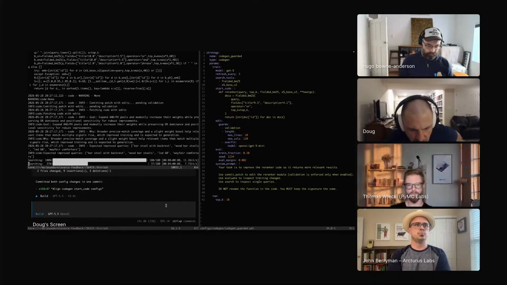

# Doug Turnbull - Episode 4 field notes

Doug Turnbull led search teams at [Shopify](https://www.shopify.com/), [Reddit](https://www.reddit.com/), and [Wikipedia](https://www.wikipedia.org/), wrote [*Relevant Search*](https://www.manning.com/books/relevant-search) and [*AI-Powered Search*](https://www.manning.com/books/ai-powered-search), advised more than 100 organizations, teaches [Maven courses](https://maven.com/softwaredoug/build-enterprise-agents), and works on search, retrieval, agentic search, and auto research. His Episode 4 segment turns that search background into a live agent workflow: use agents to propose ranking-code changes, let evals measure them, and keep validation data hidden so the agent cannot simply overfit the visible examples.

Doug says agents are useful because he can point one at work and it will usually move the work forward: *"I can just point that at a problem and it generally solves a problem."* [\[01:20:55\]](https://youtube.com/live/XaYQFtca798?t=4855) In search optimization, that same capability needs constraints. His auto-research setup asks whether an agent can find *"a slightly better way of doing the keyword matching"* [\[01:35:52\]](https://youtube.com/live/XaYQFtca798?t=5752) on [MS MARCO](https://microsoft.github.io/msmarco/) by patching a [BM25](https://en.wikipedia.org/wiki/Okapi_BM25)-like reranker, running evals, and accepting changes only when they improve holdout validation.

Doug explains the search substrate while he shows the agent loop: keyword search, vector databases, Elasticsearch-style backends, BM25, inverse document frequency, term-frequency saturation, MS MARCO, OpenCode model switching, custom patch tools, and LLM-judge feedback for agentic search. Agents try known human-corpus ideas, and Doug keeps the search engineer's work in eval design, holdout structure, and scale.

Doug shows the auto-research setup: reranker code, a codegen configuration, live agent output, and validation activity around a BM25-style search experiment. <a href="https://youtube.com/live/XaYQFtca798?t=4978">[01:22:58]</a>

Related workflow: [`auto-research-agentic-search`](../../workflows/auto-research-agentic-search/) turns Doug's BM25 demo into a reusable loop for giving an agent bounded patch tools, exposing training-query feedback, and accepting changes only when hidden validation improves.

## On working with agents

### What he loves: agents bring compressed human knowledge to work

Doug loves agents because they usually follow his instructions, do useful work, and bring a broad prior into a problem. *"They mostly do what I tell them to do. They get a lot of work done and they come with a pre-built encyclopedia of a compressed version of the entire human knowledge."* [\[01:20:38\]](https://youtube.com/live/XaYQFtca798?t=4838)

Auto research uses that compressed prior to try ideas the model may already know, then relies on evaluation machinery to decide whether an idea helped.

### What he finds most frustrating: agents swing between timidity and overconfidence

Doug's frustration is inconsistency. Some days the agent asks permission for tiny steps, and other days it acts too confidently inside the codebase. *"It can't decide if it's very timid, it needs to walk on eggshells around me, or if it needs to go crazy and just remove and go hog wild in my code base."* [\[01:21:34\]](https://youtube.com/live/XaYQFtca798?t=4894)

His day-to-day work is steering that boundary: *"Okay, yes, you can do that, you're okay, but don't go farther than this line."* [\[01:21:51\]](https://youtube.com/live/XaYQFtca798?t=4911)

## Workflows

### Run auto research as an eval-gated patch loop

Doug's main workflow asks an agent to improve a BM25-like ranking function against MS MARCO. The agent proposes code patches, runs search evals, inspects query behavior, and tries to save code changes. Doug describes the question as: *"Could I ask an agent to propose patches to this code? And given I have an eval set, can I then evaluate whether or not that change produces a higher eval score on this MS MARCO dataset?"* [\[01:34:55\]](https://youtube.com/live/XaYQFtca798?t=5695)

Doug keeps the code-editing interface small. One tool call finds a snippet of code, finds the other end of the code, deletes that region, and replaces it with new text. *"It's not that hard if you've played around with agents and you feel comfortable building an MCP or your own tools."* [\[01:36:57\]](https://youtube.com/live/XaYQFtca798?t=5817)

The agent gets a few core actions:

- `run rerank` to evaluate ranking behavior.
- Single-query inspection with labeled top results when eval labels exist.
- `revert` to undo changes.
- `tryout patch` to sandbox a reranker edit.
- `apply patch`, also named around commit semantics, to submit a candidate change.

Doug lets the agent explore visible training queries, then tests candidate patches against holdout validation. *"I will either accept it or reject it based on whether this change improved the holdout validation or didn't improve the holdout validation."* [\[01:41:16\]](https://youtube.com/live/XaYQFtca798?t=6076)

Doug uses progressive disclosure because a naive coding-agent prompt overfits ranking code. He says students in his agentic search course often want to open Claude Code and ask it to make search better, but that tends to produce brittle query-specific behavior: *"What almost always happens with that is you get this overfit if it's this query, return this set of results."* [\[01:38:35\]](https://youtube.com/live/XaYQFtca798?t=5915)

Doug splits the data like a machine-learning problem. The agent can dig deeply into training queries and see detailed before-and-after behavior, while the validation set remains hidden until a patch is applied. *"Training data exists to let the agent really, really introspect on the behavior of those specific queries."* [\[01:39:29\]](https://youtube.com/live/XaYQFtca798?t=5969)

Doug gives the agent room to work until a metric increases, then uses evals, guardrails, and process to decide what survives. He calls auto research *"an extreme example of trusting agents to go nuts and just work on a problem until some metric increases."* [\[01:45:03\]](https://youtube.com/live/XaYQFtca798?t=6303)

### Run auto-research rounds serially, then branch or combine promising ideas

Doug does not expect one long agent run to solve the whole ranking problem. One round runs with code, tools, and measurement, then returns a summary and a new reranker. Doug takes that output and starts another round: *"I don't expect the agent to go and do everything in one pass."* [\[01:47:43\]](https://youtube.com/live/XaYQFtca798?t=6463)

He currently serializes rounds, but the live discussion points toward a more genetic workflow. *"Could you fork them somehow? Could you go in different directions? It's a very genetic aspect to it, too, of could you get the best part of different ideas to combine?"* [\[01:48:15\]](https://youtube.com/live/XaYQFtca798?t=6495)

### Feed LLM-judge feedback to a search agent as a user message

Doug's agentic search experiments use a search agent, search tools, and feedback from an LLM judge. He defines the setup directly: *"Agentic search loosely defined is an agent using some search tools to solve a user's search problem."* [\[01:55:24\]](https://youtube.com/live/XaYQFtca798?t=6924)

After one search pass, a naive LLM judge labels whether returned products are relevant, then that judgment goes back to the agent as a user message. Doug finds the feedback surprisingly effective: *"It's oddly amazing how much that improves search."* [\[01:56:36\]](https://youtube.com/live/XaYQFtca798?t=6996)

The agent adjusts more strongly to feedback delivered as a user message than to its own private reasoning. Doug asks, *"Will agents take reasoning more seriously if it comes in the form of a user message?"* [\[01:57:20\]](https://youtube.com/live/XaYQFtca798?t=7040)

## Tools / projects he showed

### OpenCode

Doug runs the demo inside [OpenCode](https://opencode.ai/) and uses it heavily. He says, *"OpenCode is a coding agent"* [\[01:23:04\]](https://youtube.com/live/XaYQFtca798?t=4984), then explains why it fits his setup: he likes switching among model types and trying open models. [\[01:23:12\]](https://youtube.com/live/XaYQFtca798?t=4992)

OpenCode is the visible agent harness around the auto-research session: the screen shows a task description, agent activity, and a live cost counter while Doug explains the ranking experiment.

### Autoresearching BM25 on MSMarco

[Autoresearching BM25 on MSMarco](https://softwaredoug.com/blog/2026/05/17/autoresearching-a-better-msmarco-bm25) is the article Doug uses for the visible ranking-code example. The search target is dataset-specific: Doug is not claiming to beat BM25 universally. He says, *"For this dataset, which almost every search team just cares about their dataset that they work with at their job, could I find a better retrieval function?"* [\[01:35:39\]](https://youtube.com/live/XaYQFtca798?t=5739)

The article contains the visible reranker code and the auto-research experiment Doug is explaining. Doug uses that experiment to work through agent workflow design: *"I find auto research such an amazing place to learn about this stuff."* [\[01:42:49\]](https://youtube.com/live/XaYQFtca798?t=6169)

### search-experiments repo

Doug says the bulk of his [search-experiments repo](https://github.com/softwaredoug/search-experiments/blob/main/notebooks/codegen/codegen_minimarco.ipynb) is about hacking agentic search. *"That is the other side and probably the bulk of that search experiments repo is hacking agentic search."* [\[01:55:10\]](https://youtube.com/live/XaYQFtca798?t=6910)

The repo puts his agentic search work beside the BM25 and auto-research ideas: agents call search tools, inspect results, receive judge feedback, and adapt their behavior.

### BM25

[BM25](https://en.wikipedia.org/wiki/Okapi_BM25) is the ranking baseline Doug uses as the code substrate. He explains it as keyword matching over terms such as `red shoes`: *"It's the optimal way that people figured out decades ago for doing keyword matching."* [\[01:26:06\]](https://youtube.com/live/XaYQFtca798?t=5166)

Doug still treats BM25 as a serious baseline because it is fast and strong. *"You can spin up a lexical index and get BM25 search working really fast."* [\[01:26:25\]](https://youtube.com/live/XaYQFtca798?t=5185)

### MS MARCO

[MS MARCO](https://microsoft.github.io/msmarco/) is the question-answering dataset Doug uses for the ranking experiment. He describes it as *"a set of questions"* [\[01:31:17\]](https://youtube.com/live/XaYQFtca798?t=5477) in a corpus that he estimates at roughly 10 million passages, with each question tied to an answer passage identifier.

Doug uses it as both a training and evaluation substrate. *"This test set exists, which is great. It's an amazing corpus that helps us evaluate question answering systems."* [\[01:32:07\]](https://youtube.com/live/XaYQFtca798?t=5527)

### SearchArray

Doug's BM25 code uses [SearchArray](https://pypi.org/project/searcharray/), which he describes as *"a lexical search pandas extension that I use called search array."* [\[01:33:27\]](https://youtube.com/live/XaYQFtca798?t=5607)

In the shown snippet, SearchArray provides the corpus representation and term statistics around the reranker code that the agent edits.

### Desmos

Doug opens [Desmos](https://www.desmos.com/calculator) while explaining BM25 term-frequency saturation. He shows a curve he says he probably made 10 years earlier while learning the math. [\[01:29:19\]](https://youtube.com/live/XaYQFtca798?t=5359)

The curve shows why raw TF-IDF is not enough: five matches of `Skywalker` are not suddenly much more relevant than four, while the zero-to-one jump matters more.

### Vespa

Doug mentions [Vespa.ai](https://vespa.ai/) near the end as a search engine company with a forthcoming post that improves further on his BM25 work. *"They have a blog article coming out that improves further on what I did using some of their own features and auto-researching some of the cool things you can do."* [\[01:54:20\]](https://youtube.com/live/XaYQFtca798?t=6860)

He points to proximity-style features, such as how close matching terms are in a passage or phrase, as examples of search features that can be auto-researched.

## Principles and explainers

### Retrieval systems come in multiple families

Doug explains search systems by analogy to databases. Different backends serve different retrieval needs, and none of the major families are obsolete. *"We have these different backends, these different ways of retrieving information from potentially petabytes of information out there."* [\[01:24:41\]](https://youtube.com/live/XaYQFtca798?t=5081)

He names keyword search, [Elasticsearch](https://www.elastic.co/elasticsearch)-style search engines, vector databases, embeddings, and RAG-era vector search as retrieval families that still matter.

### BM25 is a fast lexical baseline because it makes fewer training assumptions

Doug contrasts BM25 with embedding models. Embeddings are trained artifacts, and users need to know what data and task shaped them. BM25 is not trained in the same way: *"BM25, you don't have to assume that at all. It just works."* [\[01:27:39\]](https://youtube.com/live/XaYQFtca798?t=5259)

He explains BM25 as a TF-IDF-like method that scores matches by term frequency and document frequency. That makes it a fast, strong lexical baseline for search work.

### Inverse document frequency captures term specificity

Doug uses `Luke Skywalker` to explain document frequency. `Skywalker` appears mainly in Star Wars contexts, while `Luke` appears across many contexts. *"Skywalker is way more specific to the user's intent."* [\[01:28:27\]](https://youtube.com/live/XaYQFtca798?t=5307)

That specificity becomes inverse document frequency: terms that occur in fewer documents carry more ranking weight because they reveal more about what the user meant.

### Term frequency should saturate

Doug uses a Desmos curve to explain why raw term counts are not enough. BM25's term-frequency insight is saturation: a document does not become dramatically more relevant because it has a fifth match instead of a fourth. *"That zero to one step change is actually what's really important."* [\[01:30:15\]](https://youtube.com/live/XaYQFtca798?t=5415)

People found useful search heuristics by trying them against open datasets, and Doug now lets agents try similar corpus-grounded ideas under eval constraints.

### Agents can rediscover obvious search ideas that still score better

Doug's auto-research agent found stop-word removal and a small bigram boost. He does not present those as magical discoveries. *"Removing stop words from question answering is a very common thing to do in lexical search, and probably also doing little phrase or bigram boosts."* [\[01:43:28\]](https://youtube.com/live/XaYQFtca798?t=6208)

Doug asks whether an optimization loop can try ideas from the existing human corpus rather than waiting for a breakthrough: *"Could I set up an optimization process that is more or less trying ideas that are in some ways existing?"* [\[01:43:39\]](https://youtube.com/live/XaYQFtca798?t=6219)

### Auto research forces process, evals, and guardrails

Doug says auto research forced him to think about the full process. The agent idea is not the hard part by itself. *"All the gotchas are really about process. They're not necessarily about the idea that the agent had."* [\[01:45:38\]](https://youtube.com/live/XaYQFtca798?t=6338)

That process includes choosing training examples, deciding what the agent can inspect, preserving holdout validation, and making acceptance depend on an eval rather than the agent's confidence.

### Memory is another search problem

When the discussion turns to memory, Doug makes the search connection explicit: *"It's yet another search problem."* [\[01:50:24\]](https://youtube.com/live/XaYQFtca798?t=6624)

His own logs-and-traces experiment did not solve memory. He still has to decide what to store, how to retrieve it, and how to feed it back into the next run.

Doug has tried giving the auto-research agent search over logs and traces from previous runs. The experiment has not yet produced dramatic results. *"I did experiment with giving it a search tool over the logs and traces of the past agentic runs."* [\[01:49:23\]](https://youtube.com/live/XaYQFtca798?t=6563)

He does not think raw grep is enough for durable agent memory. Doug says *"grep probably isn't great"* [\[01:49:41\]](https://youtube.com/live/XaYQFtca798?t=6581) as an agentic memory finder, which is why people are building actual agentic memory architectures.

### Grep plus an agent can be competitive on small corpora

Doug has benchmarked agents with grep against BM25. On relatively small datasets, he says the pairing can work surprisingly well: *"If you have an agent and grep, it will perform at or slightly better than if you were to just use BM25 directly with no agent."* [\[01:58:14\]](https://youtube.com/live/XaYQFtca798?t=7094)

He adds the scale limit: around 100,000 documents or fewer, he is not worried that everyone will simply grep everything. Grep becomes more appealing when an agent is already in the loop and can use it cheaply. [\[01:58:31\]](https://youtube.com/live/XaYQFtca798?t=7111)

## Additional quotations

- On still learning search: *"I was bit by the bug in 2012. I'm still in that labyrinth trying to find my way out."* [\[01:20:11\]](https://youtube.com/live/XaYQFtca798?t=4811)

- On the day's demo: *"I'm going to talk about auto research and some of the fun stuff I do."* [\[01:22:04\]](https://youtube.com/live/XaYQFtca798?t=4924)

- On the demo screen: *"This is what we're going to talk about today, this matrix concoction I have going on here."* [\[01:22:40\]](https://youtube.com/live/XaYQFtca798?t=4960)

- On retrieval families: *"None of them are obsolete. They're all really important."* [\[01:24:52\]](https://youtube.com/live/XaYQFtca798?t=5092)

- On BM25 speed: *"It's very fast."* [\[01:26:23\]](https://youtube.com/live/XaYQFtca798?t=5183)

- On MS MARCO: *"It's the original chunked dataset when we talk about RAG and chunking."* [\[01:31:26\]](https://youtube.com/live/XaYQFtca798?t=5486)

- On ranking-code overfit: *"You need to actually think really carefully about the optimization flow."* [\[01:38:56\]](https://youtube.com/live/XaYQFtca798?t=5936)

- On the agent's sandbox tool: *"`tryout patch`: that's its little sandbox way of evaluating things."* [\[01:39:41\]](https://youtube.com/live/XaYQFtca798?t=5981)

- On the first auto-research result: *"It came up with the idea of removing stop words."* [\[01:42:11\]](https://youtube.com/live/XaYQFtca798?t=6131)

- On future genetic workflows: *"Could you get the best part of different ideas to combine?"* [\[01:48:30\]](https://youtube.com/live/XaYQFtca798?t=6510)

- On agent memory: *"I haven't cracked that nut yet."* [\[01:50:07\]](https://youtube.com/live/XaYQFtca798?t=6607)

- On agentic search feedback: *"The agent really adjusts its behavior to account for that in a way it doesn't adjust its behavior from its own reasoning."* [\[01:57:02\]](https://youtube.com/live/XaYQFtca798?t=7022)

## Live reactions and follow-ups

### Discord links: post, notebook, and agent course

During Doug's segment, Hugo linked the [BM25 auto-research post](https://softwaredoug.com/blog/2026/05/17/autoresearching-a-better-msmarco-bm25), the [search-experiments notebook](https://github.com/softwaredoug/search-experiments/blob/main/notebooks/codegen/codegen_minimarco.ipynb), and the [Building AI agents for the enterprise](https://maven.com/softwaredoug/build-enterprise-agents) course he is teaching with Doug. The post and notebook point directly to the BM25 experiment Doug showed, while the course link gives the episode's search-heavy agent-course context.

### Discord reaction: git, markdown, and grep as memory

Marius suggested *"grep+git gets relatively far for autoresearch"* and later proposed git, markdown, and grep as a memory substrate for auto research. Doug answered *"I hadn't thought of git!"* and then *"Absolutely."* The live thread added files, diffs, and grep as a possible baseline before more elaborate agent-memory systems.
