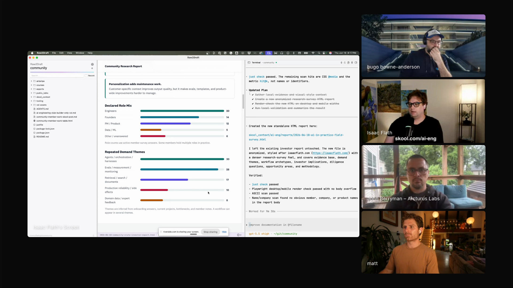

# Isaac Flath - Episode 5 field notes

Isaac Flath showed Raw2Draft, a personal writing and communication app built around Codex, local files, markdown, HTML, diagrams, and skills. Hugo introduced him as an AI and product engineer who builds systems for private knowledge and real workflows, has taught RAG and AI-assisted development, and has worked with teams including AnkiHub, SpecStory, Travel + Leisure, and General Mills.

The segment keeps returning to the same product constraint: Isaac wants AI to create a strong starting point while leaving him a clean place to finish the work by hand. His app turns agent output into editable HTML, renders D3, D2, Mermaid, and slide decks locally, runs visual checks before he reviews diagrams, and supports voice critique over active text. He uses those pieces because AI-generated writing and visuals often reach the point where a human needs to make the last edits. *"It's ninety percent of the way there. Let me do the last ten percent manually."* [\[01:26:35\]](https://youtube.com/live/6zju7hyCFl0?t=5195)

Isaac shows Raw2Draft, a local app that combines editable generated artifacts, file context, and Codex-driven skills for writing and communication work. <a href="https://youtube.com/live/6zju7hyCFl0?t=4480">[01:14:40]</a>

## On working with agents

### What he loves: agents smooth the on-ramp into new skills

Isaac likes agents because they reduce the steep initial climb into unfamiliar work. Building a text editor, learning video editing, or trying a new creative format used to require a long fundamentals phase before he could make anything useful. With AI, he still expects to be bad at first, but the early path is less blocked. *"The on ramp is just a lot smoother for just about anything I want to try and do."* [\[01:09:08\]](https://youtube.com/live/6zju7hyCFl0?t=4148)

He answers Hugo's warning about outsourcing learning by separating things worth learning from things worth automating. He leaves [FFmpeg](https://ffmpeg.org/) syntax for timestamped screenshots to agents and spends his learning energy on [DaVinci Resolve](https://www.blackmagicdesign.com/products/davinciresolve) because it interests him. *"There are some things that are valuable to just automate and move on with your life."* [\[01:10:08\]](https://youtube.com/live/6zju7hyCFl0?t=4208)

### What he finds most frustrating: agent apps still lean too hard on chat

Isaac says his frustration lands more on agent app UX than on agent behavior. He wants the extensibility and customization people expect from VS Code, but agent products still often expose a full chat interface where richer UI would fit better. *"Instead of just returning a chat, it returns a widget."* [\[01:12:41\]](https://youtube.com/live/6zju7hyCFl0?t=4361)

His example is a travel booking response. A chat wall with a transaction number and booking text is less useful than an interactive calendar widget that lets the user add the event while staying in the agent flow. *"I want a little widget with a calendar that I could click and I can hit add to calendar and write in the agent and have a little bit more interactivity."* [\[01:12:56\]](https://youtube.com/live/6zju7hyCFl0?t=4376)

## Workflows

### Draft in markdown, render richer artifacts, then edit the result directly

Isaac's writing loop usually starts in markdown, then uses [Codex](https://openai.com/codex/) and skills to generate richer outputs such as HTML reports, slide decks, blog diagrams, and presentation pages. The key design choice is that the generated artifact remains editable. In his app, any text inside a generated HTML file can be double-clicked, changed, saved back to the HTML, and returned to normal display mode. *"I can have it create HTML, I can have it create this nice interface, but I can also manually edit it."* [\[01:15:53\]](https://youtube.com/live/6zju7hyCFl0?t=4553)

The mechanism solves a practical review problem. When Isaac creates something for a presentation or something he plans to share, he often wants to manually fix labels, numbers, or text after the agent has produced the layout. *"I often want to at some point start manually fixing labels and text."* [\[01:16:06\]](https://youtube.com/live/6zju7hyCFl0?t=4566)

### Let agents generate diagrams, then make them pass visual checks

Isaac uses agents for [D3](https://d3js.org/) because he wants the benefit of D3 slides without writing D3 by hand. He describes the desired visual result, lets Codex create the code, and gives feedback on what the slide should look like. *"I really don't want to write D3 code."* [\[01:17:49\]](https://youtube.com/live/6zju7hyCFl0?t=4669)

His app renders D3, [D2](https://d2lang.com/), [Mermaid](https://mermaid.js.org/), and other inline code blocks. When a code block changes, the app mirrors it to a local PNG, then a skill checks the rendered file and image for overlapping labels and other criteria before Isaac looks at it. *"It looks for overlapping labels and a whole bunch of other criteria and does a little bit of a feedback loop to get it closer before I look at it."* [\[01:21:20\]](https://youtube.com/live/6zju7hyCFl0?t=4880)

### Turn spoken thoughts and voice critique into cleaner drafts

Isaac uses a voice review feature near the end of his writing process, when he is moving from AI-assisted drafting toward manual editing. He starts a recording, highlights text, speaks critique while pointing at the relevant passage, then sends the resulting markdown review back to the active file. *"It's like a point and talk interface."* [\[01:27:33\]](https://youtube.com/live/6zju7hyCFl0?t=5253)

The critique can name specific edits: cut throat clearing, start with the point, remove repetitive colon-list patterns, and apply the spoken review to the active file. *"This is throat clearing. We don't need it. You can just start with the point."* [\[01:28:17\]](https://youtube.com/live/6zju7hyCFl0?t=5297)

Isaac often begins a blog post from a long video or transcription of himself rambling. The agent helps organize that raw material, but his editing taste pushes toward deletion, simplicity, and a clean base that he can finish himself. *"I often start my writing from a very long transcription, maybe twenty minutes of transcription, just a big block of text of all my thoughts."* [\[01:31:55\]](https://youtube.com/live/6zju7hyCFl0?t=5515)

He says AI writing can often be cut in half without losing meaning. *"You can take something that AI wrote and cut fifty percent of it and it'll still say the same thing, just clearer."* [\[01:30:22\]](https://youtube.com/live/6zju7hyCFl0?t=5422)

## Skills

### Communication critique skill

Isaac shows a communication critique skill that applies different editorial lenses depending on the problem he sees in the draft. It asks what to cut and how to critique, then can invoke particular authors or editors as references. *"Depending on what I want to do or what I feel like the problem is, I invoke a particular author or editor."* [\[01:29:19\]](https://youtube.com/live/6zju7hyCFl0?t=5359)

The skill is connected to Isaac's anti-throat-clearing style. Hugo names Zinsser and throat clearing as ideas he learned from Isaac, especially for removing sentences such as "this is the load-bearing point" when the sentence itself does no work.

### Writing style skill

Isaac's writing style skill is personal. It encodes his preference for cuts, clarity, and plainness, while leaving taste for the human pass. He says some writing rules are universal, such as avoiding vague openings like "in today's fast-paced environment," but the boundary between universal writing advice and personal taste is unclear. *"There are some universal things, but the boundary is very unclear."* [\[01:51:46\]](https://youtube.com/live/6zju7hyCFl0?t=6706)

When John asks how Isaac handles taste, Isaac says he does not try to make the model produce the finished style. He wants the agent to simplify the draft enough that he can take over. *"I'm trying to get it to cut as much out as possible and be as plain as possible, because I'm gonna add the taste in."* [\[01:52:45\]](https://youtube.com/live/6zju7hyCFl0?t=6765)

### Presentation build skill

Isaac's presentation workflow includes a build skill that turns a markdown presentation into a deployable presentation. The source markdown can contain talking points, D3 diagrams, links, and code, while the built output is a single HTML file that can be published as a static site. *"There's a skill that does build step basically, and that build step turns the presentation into a presentation."* [\[01:19:02\]](https://youtube.com/live/6zju7hyCFl0?t=4742)

The same pattern appears in blog publishing. A deploy skill renders embedded D2 or D3 diagrams, uploads them to Isaac's public S3 bucket, and swaps the rendered assets into the post. *"Once I deploy it, it has a skill that knows how to deploy it, which will turn all these, render them, upload them to my public S3 bucket."* [\[01:18:39\]](https://youtube.com/live/6zju7hyCFl0?t=4719)

### Transcription skill

Isaac's transcription skill uses [AssemblyAI](https://www.assemblyai.com/). He switched from a previous transcription provider because AssemblyAI gives word-level timestamps, which helps a coding agent target cuts to filler words more precisely. *"I switched to AssemblyAI because you can actually get word-level timestamps through it."* [\[01:30:45\]](https://youtube.com/live/6zju7hyCFl0?t=5445)

The timestamp detail matters when Codex or Claude Code needs to cut ums and ahs from a video. *"That's really helpful if you're trying to do something like use Codex or Claude Code to cut out ahs and ums."* [\[01:30:58\]](https://youtube.com/live/6zju7hyCFl0?t=5458)

### Screenshot and visual critique skills

Isaac has a skill that can take one or multiple screenshots from a video at particular points. He also uses [Gemini](https://gemini.google.com/) for visual critique, where a skill can take a screenshot or inspect a diagram and send it to Gemini for feedback. *"This can take a screenshot from any particular point or multiple screenshots."* [\[01:31:11\]](https://youtube.com/live/6zju7hyCFl0?t=5471)

The video critique loop fits the same review pattern as his diagram checks: produce a visual, inspect it with another model, then use the critique before the human final pass. *"Often it'll take a screenshot or it'll look at a diagram and it sends it to Gemini to critique it."* [\[01:31:20\]](https://youtube.com/live/6zju7hyCFl0?t=5480)

### Diagram creation skill

Isaac shows a diagram creation skill that captures his preferred D3 style. Color is one of its constraints because he wants color to carry meaning instead of decoration. *"Color's a big deal for me because it's like, what's a bad job? Don't use it for decoration. Color should have a semantic meaning."* [\[01:31:34\]](https://youtube.com/live/6zju7hyCFl0?t=5494)

The skill includes simple scripts that provide constraints and report common errors. That local structure keeps the agent from relying only on prose instructions.

### Marimo Pair

Isaac names [Marimo Pair](https://marimo.io/blog/marimo-pair) as a shareable skill that improved through real use. He says the first attempt at using skills to run Marimo was poor, but iteration made it his favorite AI notebook workflow. *"They iterated and it got better and now it's really good. It's my favorite way of using AI in a notebook."* [\[01:50:29\]](https://youtube.com/live/6zju7hyCFl0?t=6629)

He uses it as an example of a skill that can become broadly useful because the shared task is concrete. Even then, it still took real-world iteration to handle the live environment and back-and-forth communication. *"It just takes a lot of iteration on real world use."* [\[01:50:43\]](https://youtube.com/live/6zju7hyCFl0?t=6643)

## Tools / projects he showed

### Raw2Draft local writing and communication app

Isaac's main demo is Raw2Draft, a local app he built for himself. It is partly a text editor and partly [Codex](https://openai.com/codex/) running with skills and local context. It knows the active file, handles visual rendering, and supports the writing workflows Isaac uses every day. *"This is an app that I built for myself."* [\[01:14:42\]](https://youtube.com/live/6zju7hyCFl0?t=4482)

He describes the core as Codex plus skills rather than a separate agent architecture. *"This is just pretty much running Codex with a bunch of skills in it."* [\[01:14:42\]](https://youtube.com/live/6zju7hyCFl0?t=4482)

Isaac shows an HTML research report generated from community material. The app lets him double-click text anywhere in the report, including tables, labels, and numbers, then save the edit back into the HTML. *"Any text anywhere in here, I can edit and change."* [\[01:15:40\]](https://youtube.com/live/6zju7hyCFl0?t=4540)

The implementation uses the browser's `contenteditable` behavior only during the edit. *"It adds a content editable HTML attribute on it, lets me edit it, saves back to the HTML and removes that back."* [\[01:16:20\]](https://youtube.com/live/6zju7hyCFl0?t=4580)

Isaac's everyday writing surface is a markdown editor with fonts and spacing matched to his blog and deployment targets. He uses it for blog posts and presentations because it keeps the source simple while supporting richer embedded output. *"Mostly the most common thing I do is I work in a markdown file."* [\[01:17:18\]](https://youtube.com/live/6zju7hyCFl0?t=4638)

For presentations, the markdown source can include slide content, talking points, diagrams, code, and links. For sharing notes, he can publish the markdown file directly.

Isaac's app renders [D3](https://d3js.org/), [D2](https://d2lang.com/), [Mermaid](https://mermaid.js.org/), and other inline code blocks from markdown. D3 is the primary presentation tool because it gives him attractive diagrams without requiring him to know D3 deeply. *"No, and I still don't. I just describe what I want and it comes out okay."* [\[01:20:29\]](https://youtube.com/live/6zju7hyCFl0?t=4829)

He also tried full HTML, but the feedback loop was slower because HTML files were bigger and the agent would change layouts he wanted to preserve. *"It would be like, you want this. Hey, there's a better, here's a two-column layout for your text. And I'm like, I don't want that."* [\[01:22:38\]](https://youtube.com/live/6zju7hyCFl0?t=4958)

The voice review feature records Isaac's spoken critique, transcribes it with [AssemblyAI](https://www.assemblyai.com/), pairs it with the highlighted text, and writes the result to a markdown file. The app then asks the agent to read the voice review and apply it to the active file. *"Once I send it, it's just writing this to a markdown file."* [\[01:28:35\]](https://youtube.com/live/6zju7hyCFl0?t=5315)

Isaac says the feature works for him even though it is difficult to discover. Later, when explaining why the app is far from a public product, he says the same feature is hidden behind a tiny button and starts live transcription with no instructions. *"There's no way anyone would discover that feature naturally."* [\[01:48:00\]](https://youtube.com/live/6zju7hyCFl0?t=6480)

### Isaac's blog posts on writing and AI editing

Isaac points viewers to his blog posts about writing process, AI writing, and editing AI output. He says much of the work is deletion: identifying common problems and cutting them. *"Largely it's like how do I delete this stuff?"* [\[01:13:42\]](https://youtube.com/live/6zju7hyCFl0?t=4422)

He also shows a post written in a style where every sentence starts on a new line. The style came from a book he read and was meant to make each sentence communicate one idea as clearly as possible. *"Try and make one sentence communicate one idea, kill all the rhythm, and then just write it as clear as possible."* [\[01:35:28\]](https://youtube.com/live/6zju7hyCFl0?t=5728)

### Front-end design skill on skills.sh

Isaac uses a popular front-end design skill from [skills.sh](https://www.skills.sh/) as a cautionary example. He says he read it and found it too broad, especially because it recommends unpredictable layouts and surprising hover states for front-end design generally. *"If I'm building an invoice page, there's no way I want surprising hover states."* [\[01:33:46\]](https://youtube.com/live/6zju7hyCFl0?t=5626)

His criticism is partly about maintenance. He says the skill had about 450,000 downloads and had never been updated, which makes him skeptical that it incorporates real feedback from use. *"What possible thing that you've ever deployed will you have four hundred and fifty thousand downloads and not have a single piece of feedback that can make it better?"* [\[01:34:11\]](https://youtube.com/live/6zju7hyCFl0?t=5651)

## Principles and explainers

### Personal software can be excellent before it is productizable

Isaac's local app is valuable because it is built around his own directories, blog structure, presentation style, environment variables, and hidden workflows. That same specificity makes it hard to turn into a usable product for others. *"It's great for me, but it's super idiomatic."* [\[01:47:54\]](https://youtube.com/live/6zju7hyCFl0?t=6474)

The product gap includes discovery, configuration, permissions, and workflow flexibility. His own app can read local environment variables for AssemblyAI, but a public app would need explicit permission and an interface for secrets. *"People probably don't want an app that they're going to open to reach inside their environment and grab all their secrets without them explicitly giving permission to this app."* [\[01:48:33\]](https://youtube.com/live/6zju7hyCFl0?t=6513)

### Shareable skills need real-world iteration

Isaac separates personal skills from skills that can serve many users. [Marimo Pair](https://marimo.io/blog/marimo-pair) works as a broadly useful skill because the task is clear and the maintainers iterated against real notebook use. *"It just takes a lot of iteration on real world use."* [\[01:50:43\]](https://youtube.com/live/6zju7hyCFl0?t=6643)

The same logic explains why private writing skills are hard to share. Some rules generalize, but many style and taste decisions depend on the writer, the artifact, and the reader.

### Read the prompt before using a skill

When Matt describes turning writing lessons from Williams and Bizup into a skill, Isaac gives the practical rule for adopting prompts and skills. *"If you're gonna use a prompt, you should at least read it."* [\[01:37:21\]](https://youtube.com/live/6zju7hyCFl0?t=5841)

The point applies to skills that look polished or popular. Isaac's skepticism of the front-end design skill comes from reading the actual instructions and deciding they are wrong for many UI contexts.

### Style has to fit the job the artifact does

Isaac objects to broad design instructions that make every UI surprising or decorative. An invoice page needs a different style than a landing page, and a writing tutorial should not sound like poetry. *"I don't need my tutorial to sound like poetry."* [\[01:53:09\]](https://youtube.com/live/6zju7hyCFl0?t=6789)

He applies the same principle to visuals. Animations can create excitement, but they may hide a content problem when the piece is trying to show too much at once. *"Why am I not introducing one idea at a time?"* [\[01:22:05\]](https://youtube.com/live/6zju7hyCFl0?t=4925)

### AI should leave a clean starting point for human taste

Isaac's answer to taste is to keep the model plain. If he asks for style, the model adds clever titles and poetic language that make tutorials worse. *"I just want it to pare back and be as simple and as bland as possible because that's the best starting point for me."* [\[01:53:29\]](https://youtube.com/live/6zju7hyCFl0?t=6809)

That rule matches the rest of his app design. Codex, skills, rendering checks, and Gemini critique help produce and inspect drafts, while Isaac keeps the last-mile judgment over wording, labels, diagrams, layouts, and taste.

## Additional quotations

- On what AI changes at the beginning of a project: *"Getting that initial base competency and learning a new thing can happen a lot smoother and faster."* [\[01:09:13\]](https://youtube.com/live/6zju7hyCFl0?t=4153)

- On the tradeoff between learning and automation: *"I don't need to learn how to do a compiler. I can just benefit from it."* [\[01:10:26\]](https://youtube.com/live/6zju7hyCFl0?t=4226)

- On using agents for boring glue: *"I don't need to memorize how to take a screenshot at a particular timestamp with FFmpeg."* [\[01:11:01\]](https://youtube.com/live/6zju7hyCFl0?t=4261)

- On the frustration category: *"I actually don't really get frustrated with the agents."* [\[01:11:44\]](https://youtube.com/live/6zju7hyCFl0?t=4304)

- On D3: *"No, and I still don't."* [\[01:20:29\]](https://youtube.com/live/6zju7hyCFl0?t=4829)

- On animations: *"Most of the time, animations are fancy but don't always add to the clarity of the piece."* [\[01:21:37\]](https://youtube.com/live/6zju7hyCFl0?t=4897)

- On editable generated assets: *"It's not always generated and created in a way where that last ten percent is seamless for me to jump in and start doing the final tweaks."* [\[01:26:35\]](https://youtube.com/live/6zju7hyCFl0?t=5195)

- On AI writing bloat: *"You can cut a lot."* [\[01:30:31\]](https://youtube.com/live/6zju7hyCFl0?t=5431)

- On popular skills: *"If you're using a skill that everyone else uses and that's where primarily your design thinking is coming from, then your designs probably aren't gonna stand out."* [\[01:35:56\]](https://youtube.com/live/6zju7hyCFl0?t=5756)

- On public app complexity: *"It's like night and day difference in terms of how difficult and how much time that takes."* [\[01:49:14\]](https://youtube.com/live/6zju7hyCFl0?t=6554)

## Live reactions and follow-ups

### Discord linked the Marimo Pair reference

During the later shareability discussion, Hugo posted the [Marimo Pair announcement](https://marimo.io/blog/marimo-pair) in Discord. The link matched Isaac's point that a broadly useful skill takes iteration against real notebook use before it becomes reliable for many people.

### Discord asked about Isaac's generated presentation

After the episode, a Discord participant linked Isaac's [public-talks HTML presentation](https://github.com/Isaac-Flath/public-talks/blob/main/2026-06-02-tool-architectures-public-talk.html) and asked what tool he used to make it. That follow-up tracked the strongest visual thread in Isaac's demo: markdown and code-backed artifacts that can become shareable HTML.
