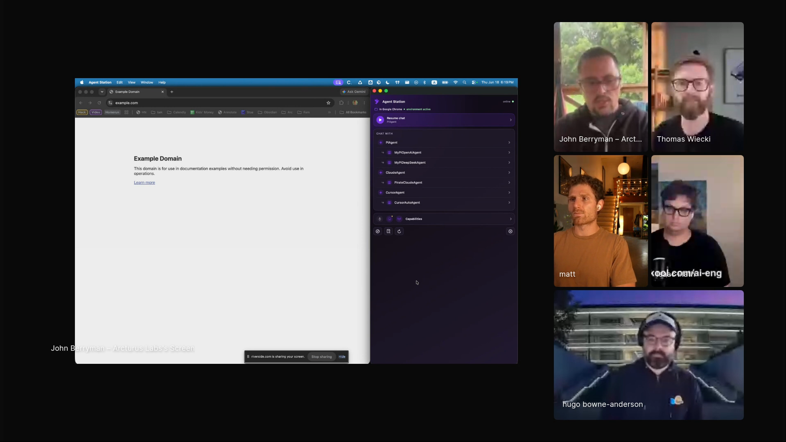

# John Berryman - Episode 5 field notes

John Berryman, AI product and engineering consultant and founder of Arcturus Labs, came to Episode 5 with a personal-agent prototype called Rook and a larger argument about where agents should live. He starts with his work on early GitHub Copilot at GitHub, when a 2,048-token completion model required pseudo-documents and context-packing tricks, then moves into a demo of an agent that follows him across applications, websites, and eventually physical places.

John's thesis is that the agent harness is still too constrained by terminals and coding work. *"By and large, our agent harness lives in the terminal and works on code."* [\[00:13:51\]](https://youtube.com/live/6zju7hyCFl0?t=831) Rook is his attempt to break that pattern: a unified client around multiple agent runtimes, local skills, Agent Client Protocol messages, app-specific environments, web affordances, and phone context. The target is a personal agent that can enter Obsidian, Wikipedia, Kroger, or a home environment and gain the local skills needed to act there.

John shows Rook as a portable agent interface with multiple runtimes and environment-specific capabilities. <a href="https://youtube.com/live/6zju7hyCFl0?t=1027">[00:17:07]</a>

## On working with agents

### What he loves: tools that can talk back

John describes agents as a new kind of tool because they add language and response to the human habit of toolmaking. *"This is the first tool we've ever made that can talk back to us."* [\[00:08:34\]](https://youtube.com/live/6zju7hyCFl0?t=514)

That shift makes product exploration feel open-ended to him. *"We're in a completely different regime where we figure out how to do meta things."* [\[00:08:39\]](https://youtube.com/live/6zju7hyCFl0?t=519)

### What frustrates him: context collapse and overly preemptive models

John dislikes the point near the end of a long agent session when behavior degrades and compaction threatens to lose useful state. *"After you're at ninety percent of context and it starts doing something stupid, and you know it's a context window and you've got to compact it, but you're gonna lose something good. I hate that."* [\[00:09:22\]](https://youtube.com/live/6zju7hyCFl0?t=562)

He also finds some proactive models risky. DeepSeek V4 impressed him, but its willingness to satisfy a request almost led it into an unwanted email action. *"It's proactive to an extent that's scary sometimes."* [\[00:09:46\]](https://youtube.com/live/6zju7hyCFl0?t=586)

### Why he prefers Pi for hacking across contexts

John says his demo will show why he has moved away from [Claude Code](https://www.anthropic.com/claude-code) and toward [Pi](https://pi.dev/). *"Pi is kinda where it's at for me. It's done some amazing stuff and it's become the thing that I can hack on anything with and try stuff out."* [\[00:11:16\]](https://youtube.com/live/6zju7hyCFl0?t=676)

The attraction is extensibility. Pi can take local skills, work inside John-managed environments, and participate in Rook's larger pattern of portable agent sessions.

## Workflows

### Turn small agent tasks into skills, then pay the maintenance cost

John's recent operating pattern starts with a small task, asks an agent to do it, then asks the agent to preserve the task as a reusable skill. The loop can make future work easier, but he says it also causes small tasks to balloon into skill maintenance. *"I'll get a five minute task to do, and instead of doing it, I'll tell my agent to do it. And then after it does it, I'll say, cool, let's make that a skill just in case."* [\[00:15:14\]](https://youtube.com/live/6zju7hyCFl0?t=914)

The maintenance burden is real. *"After it makes it a skill, I'll spend like two days trying to fix the skill so it actually works."* [\[00:15:24\]](https://youtube.com/live/6zju7hyCFl0?t=924)

### Co-produce content while keeping ownership of the outline and prose

John has agentified parts of content production. He records a video, turns the transcript into an outline, guides the prose, then uses the agent to help with title, thumbnail, and social posting. *"I still own it. I want to make sure it's my prose and my outline. But we're working together."* [\[00:15:48\]](https://youtube.com/live/6zju7hyCFl0?t=948)

The workflow keeps John responsible for the editorial shape while agents handle conversion, suggestion, and distribution steps.

### Carry one personal agent across apps, websites, and physical places

Rook is John's attempt to pull agents out of a single terminal harness. He describes the goal as taking his agent anywhere and letting it act on any task reachable through text or APIs. *"I wanted to take my agent with me anywhere I go and let it be able to do any task that is addressable in text and APIs."* [\[00:18:39\]](https://youtube.com/live/6zju7hyCFl0?t=1119)

The session follows active environments. In [Obsidian](https://obsidian.md/), it recognizes the vault, sees local skills, and can open Hugo's page in John's people vault. *"Whenever it follows me to a new environment, it gets the superpowers of that environment."* [\[00:19:30\]](https://youtube.com/live/6zju7hyCFl0?t=1170)

On websites, John wants the same environment-following pattern. A site would send stateful information to the agent, the agent would send requests back, and the page could be modified in response. *"It can follow me into a lot more places."* [\[00:24:30\]](https://youtube.com/live/6zju7hyCFl0?t=1470)

On the phone, John extends the pattern to physical places. When he enters [Kroger](https://www.kroger.com/), the agent would use latitude and longitude, reverse geolocation, store inventory, aisle layout, and his Obsidian shopping list to plan a route and substitutions. *"Okay, Kroger skill, use what you know about this location to plan the ideal path through this place to get out of here."* [\[00:28:45\]](https://youtube.com/live/6zju7hyCFl0?t=1725)

John's demo treats each app, website, or place as an environment that can add capabilities to the same personal agent. Obsidian gives it vault-navigation skills, a Wikipedia page gives it a discovery skill, Kroger would give it inventory and aisle knowledge, and home could give it controls for a TV or thermostat. *"As you're inside any environment you can give that environment more skills, like your own personal version of it."* [\[00:29:31\]](https://youtube.com/live/6zju7hyCFl0?t=1771)

The mechanism is permissioned and environment-specific. In the Obsidian demo, John says he will allow the environment during the visit before asking it to open Hugo's page. [\[00:20:24\]](https://youtube.com/live/6zju7hyCFl0?t=1224)

## Skills

These are the items John explicitly described as skills or skill-shaped capabilities. Obsidian, LinkedIn, and Wikipedia are part of the Rook demo; Zoom is the example that changed how he thought about skill authoring; Kroger is a proposed place-based skill rather than a fully demonstrated installed skill.

### Zoom participant AI skill concept

The Zoom participant AI was the example that moved John from bespoke agent-loop thinking toward English-authored skills. The skill could render subagents, while a surrounding piece of application chrome would seat the behavior inside Zoom. *"All you have to do is figure out how to tell it what to do in English, and then you've got to make a little bit of chrome around the outside, something that actually seats inside Zoom."* [\[00:14:55\]](https://youtube.com/live/6zju7hyCFl0?t=895)

### Obsidian people-vault skills

John's [Obsidian](https://obsidian.md/) vault contains people records and local navigation skills. When Rook follows him into the vault, it exposes those skills and can operate on the current environment. *"This is the Obsidian vault where I keep all my people that I worked with. It shows me all these skills and different ways that I like to navigate the people vault."* [\[00:19:36\]](https://youtube.com/live/6zju7hyCFl0?t=1176)

The demo asks Rook to open the page for Hugo in the people vault. John says Obsidian access is local, using the Obsidian CLI known from the skill. *"Obsidian has a CLI and so it knows about that from the skill."* [\[00:21:13\]](https://youtube.com/live/6zju7hyCFl0?t=1273)

### LinkedIn search skill

John asks Rook to track Hugo down on [LinkedIn](https://www.linkedin.com/) and add what it learns to Hugo's Obsidian document. *"Let's track down Hugo on LinkedIn and add what you learned to his document here."* [\[00:22:03\]](https://youtube.com/live/6zju7hyCFl0?t=1323)

He notes that LinkedIn does not let agents talk to it directly, so his setup uses an indirect method. *"LinkedIn actually doesn't let agents talk to it, so I use kind of a smelly method to get at it a backward way."* [\[00:22:20\]](https://youtube.com/live/6zju7hyCFl0?t=1340)

### Wikipedia discovery skill

John moves the same portable-agent pattern to a [Wikipedia](https://www.wikipedia.org/) page and uses a Wikipedia discovery skill. He asks it to open the [BERT](https://en.wikipedia.org/wiki/BERT_(language_model)) page, then to find and highlight where the page discusses the original model size. *"Using the Wikipedia skill, can you open up the page on B E R T?"* [\[00:24:56\]](https://youtube.com/live/6zju7hyCFl0?t=1496)

The skill demonstrates a website environment that can expose state and accept agent requests.

### Kroger skill concept

The Kroger skill is John's physical-environment example. The agent would know the current store, inventory, aisle shape, item locations, and John's shopping list, then plan the fastest route and substitutions. *"If I'm Kroger's, I want to know what's in inventory at that Kroger's. I want to know how the aisles are shaped and what aisles everything is on."* [\[00:28:35\]](https://youtube.com/live/6zju7hyCFl0?t=1715)

John frames it as the agent merging his personal context with local place context. *"It is the merger of me and wherever environment I find myself within."* [\[00:29:06\]](https://youtube.com/live/6zju7hyCFl0?t=1746)

## Tools / projects he showed

### Rook

Rook is John's personal agent companion and demo project. He shows it on the right side of his screen and calls it his little buddy. *"Rook is what I'm calling it."* [\[00:17:12\]](https://youtube.com/live/6zju7hyCFl0?t=1032)

Rook wraps multiple agent runtimes behind one interface. *"Effectively it's a wrap around any agent runtime that you'd please."* [\[00:17:38\]](https://youtube.com/live/6zju7hyCFl0?t=1058)

The phone version makes the same personal agent available away from the desktop. *"Rook lives on my phone. It's my personal agent. It does know everything about me because I can add all my skills and stuff."* [\[00:27:45\]](https://youtube.com/live/6zju7hyCFl0?t=1665)

John says he will make it open source soon. *"I'll make sure it's open source pretty soon. We'll see if anyone can do anything creative with it."* [\[00:30:32\]](https://youtube.com/live/6zju7hyCFl0?t=1832)

Rook's clients are currently only for OS X, but John says new clients should be straightforward to create. *"Making a new client is fairly trivial actually. It's about an hour's worth of yelling at your screen."* [\[00:30:50\]](https://youtube.com/live/6zju7hyCFl0?t=1850)

### Pi

[Pi](https://pi.dev/) is John's primary agent runtime in the demo. He uses it inside Rook and says he spends most of his time there. *"I've got Pi agent, which I mostly spend my time in."* [\[00:17:43\]](https://youtube.com/live/6zju7hyCFl0?t=1063)

Pi matters because John can add tools, skills, and startup parameters. *"With Pi, since everything's extensible, I can add different tools to an agent. I can add my own skills."* [\[00:18:13\]](https://youtube.com/live/6zju7hyCFl0?t=1093)

### Agent Client Protocol

Rook's runtime wrapper talks through Agent Client Protocol. John describes it as a shared way for clients to exchange messages. *"It's all talking through agent-client protocol, which is kind of a way of unifying the messages back and forth between clients."* [\[00:17:50\]](https://youtube.com/live/6zju7hyCFl0?t=1070)

That protocol gives Rook one interface over several background agents.

### Obsidian

[Obsidian](https://obsidian.md/) is the first non-terminal environment John opens. Rook recognizes the vault and gets the local skills for John's people records. *"It follows me to my Obsidian. It realizes, it recognizes, cool, you're in a new environment."* [\[00:19:22\]](https://youtube.com/live/6zju7hyCFl0?t=1162)

John demonstrates the agent opening Hugo's page, reading local personal details, then trying to augment the note through LinkedIn search.

### LinkedIn

[LinkedIn](https://www.linkedin.com/) appears as a difficult external site for agent access. John uses it to show that some environments need indirect methods because they do not expose straightforward agent interfaces. *"LinkedIn actually doesn't let agents talk to it."* [\[00:22:20\]](https://youtube.com/live/6zju7hyCFl0?t=1340)

### Wikipedia

[Wikipedia](https://www.wikipedia.org/) is the web-page demo. John opens the [BERT](https://en.wikipedia.org/wiki/BERT_(language_model)) page and asks the agent to locate and highlight a specific passage about the original BERT model size. *"Can you find where it's talking about the original size of the BERT model and highlight that for me."* [\[00:25:41\]](https://youtube.com/live/6zju7hyCFl0?t=1541)

### Open agent protocol idea

John uses open agent protocol as a speculative name for the web affordance he wants, then immediately clarifies that he is describing a thing that should exist rather than a real standard. *"I was actually lying about the open agent protocol. It's just a thing that absolutely should exist."* [\[00:26:19\]](https://youtube.com/live/6zju7hyCFl0?t=1579)

The desired version would let websites send state to a user's agent, receive requests back, and let the user reshape the site. *"In a real implementation, you would be able to modify the website to be just exactly what you wanted."* [\[00:26:35\]](https://youtube.com/live/6zju7hyCFl0?t=1595)

### Claude Code

[Claude Code](https://www.anthropic.com/claude-code) is the tool John says he has moved away from for his own work. *"I'm not a Claude Code fan."* [\[00:11:09\]](https://youtube.com/live/6zju7hyCFl0?t=669)

The comparison matters because John wants agent work to escape a coding-terminal interface, while his demo centers on Pi inside Rook.

### DeepSeek V4

[DeepSeek](https://www.deepseek.com/) V4 is John's example of a capable model whose proactivity can become unnerving. *"It's a pretty good model, to be perfectly honest, but it's proactive to an extent that's scary sometimes."* [\[00:09:42\]](https://youtube.com/live/6zju7hyCFl0?t=582)

### GitHub Copilot

John worked on early [GitHub Copilot](https://github.com/features/copilot) at GitHub before ChatGPT launched, when the product was closer to prompt engineering and document completion than today's chat-based agents. *"There was no such thing as chat."* [\[00:07:15\]](https://youtube.com/live/6zju7hyCFl0?t=435)

The early workflow used pseudo-documents to pack useful context into roughly 2,048 tokens. *"We would show it the document you're working on, and then we would make it a pseudo-document."* [\[00:07:28\]](https://youtube.com/live/6zju7hyCFl0?t=448)

## Principles and explainers

### Early GitHub Copilot was document completion under extreme context pressure

John says the GitHub Copilot work he remembers happened three or four months before ChatGPT launched. The system had around 2,048 tokens, so the team used every trick it could to pack context. *"When you've only got two thousand or so tokens, two thousand forty eight tokens I think, then you do everything you can to pack it."* [\[00:07:04\]](https://youtube.com/live/6zju7hyCFl0?t=424)

That world was very different from modern chat agents. The product had to make a completion model infer the task from documents, pseudo-documents, and comments about other files.

### Agents are constrained when they live only in the terminal

John's Rook demo starts from the claim that agent harnesses are still mostly terminal-bound and code-bound. *"I started realizing at the beginning of this year that the way that we thought through agents was very, very constrained."* [\[00:13:35\]](https://youtube.com/live/6zju7hyCFl0?t=815)

He names OpenClaw and Hermes as examples of work that starts to break agents out of the terminal, including calls from Slack and tasks outside code. [\[00:13:59\]](https://youtube.com/live/6zju7hyCFl0?t=839)

### Local skills and MCPs solve different environment problems

John's Obsidian integration works locally because Obsidian has a CLI and the skill knows how to use it. For unfamiliar external systems, he expects [MCP](https://modelcontextprotocol.io/) to be the safer bridge. *"If it's something that you don't know, it's gonna have to have an MCP, obviously, that it talks through."* [\[00:21:19\]](https://youtube.com/live/6zju7hyCFl0?t=1279)

That distinction keeps the mechanism concrete: a known local app can be driven through a skill and CLI, while unknown systems need a protocol or tool bridge.

### Skill transparency is necessary but hard for users to read

When Rook enters the Obsidian vault, John says the skills are visible, but he also compares the experience to end-user license agreements. *"It's all very transparent. So if you're concerned you can read the skill."* [\[00:19:53\]](https://youtube.com/live/6zju7hyCFl0?t=1193)

The security problem remains. *"We've got to really lock down security eventually. It's hard to read, this is like end user license agreement files."* [\[00:19:59\]](https://youtube.com/live/6zju7hyCFl0?t=1199)

### English can be enough to author useful skills

John's turning point came during a hackathon-style moment with a friend while planning a Zoom participant AI. John expected to build a bespoke loop, but his friend asked Claude to make a new skill. *"Rather than him programming something bespoke, he just started talking to Claude and saying, Okay, make a new skill for this."* [\[00:14:38\]](https://youtube.com/live/6zju7hyCFl0?t=878)

That changed John's view of skill authoring. *"English really is already the new programming language and the skill could render sub agents and all this stuff."* [\[00:14:48\]](https://youtube.com/live/6zju7hyCFl0?t=888)

### Agents can recover missing capabilities by writing tools live

When the vanilla Pi agent lacks search, John notices the limitation live. Hugo observes that Pi can write its own search tool and hot-load a new skill in the same session, and John confirms that this is apparently what happened. *"Pi agent does not come by default with search. So that's gonna make it really hard to... holy crap."* [\[00:23:27\]](https://youtube.com/live/6zju7hyCFl0?t=1407)

The moment shows a skill-making agent recovering from a missing capability during the task.

## Additional quotations

- On the early Copilot era: *"It was a very different world back then."* [\[00:06:45\]](https://youtube.com/live/6zju7hyCFl0?t=405)

- On how far the field moved after early Copilot: *"Everything has moved so incredibly far since then."* [\[00:07:44\]](https://youtube.com/live/6zju7hyCFl0?t=464)

- On product exploration with speaking tools: *"I'm a kid in a candy store right now."* [\[00:08:52\]](https://youtube.com/live/6zju7hyCFl0?t=532)

- On the Rook demo premise: *"Let's do it in story mode."* [\[00:13:19\]](https://youtube.com/live/6zju7hyCFl0?t=799)

- On the personal state of the project: *"It's become my madness right now."* [\[00:13:34\]](https://youtube.com/live/6zju7hyCFl0?t=814)

- On life after turning tasks into skills: *"All my tasks have exploded at this point."* [\[00:15:28\]](https://youtube.com/live/6zju7hyCFl0?t=928)

- On the cost of making everything agentic: *"Everything in my life has become kind of this web of stuff. But it's very time consuming."* [\[00:16:04\]](https://youtube.com/live/6zju7hyCFl0?t=964)

- On Rook's purpose: *"I made a new thing which is trying to unharness the agent. Pull it out of the agent harness."* [\[00:16:14\]](https://youtube.com/live/6zju7hyCFl0?t=974)

- On making the agent personal: *"I can very, very, very, very, very, very much make it my agent."* [\[00:18:22\]](https://youtube.com/live/6zju7hyCFl0?t=1102)

- On active-window context: *"That's correct. Yep, it has a notion of an environment."* [\[00:20:14\]](https://youtube.com/live/6zju7hyCFl0?t=1214)

- On the LinkedIn access hack: *"I use kind of a smelly method to get at it a backward way."* [\[00:22:20\]](https://youtube.com/live/6zju7hyCFl0?t=1340)

- On agent pathfinding: *"Will it find the fast path?"* [\[00:22:33\]](https://youtube.com/live/6zju7hyCFl0?t=1353)

- On the speculative web protocol name: *"Don't use that name because it's everywhere and it's nothing."* [\[00:26:27\]](https://youtube.com/live/6zju7hyCFl0?t=1587)

- On physical context as the next step: *"The last place, the final frontier I think for an agent is in real life."* [\[00:26:46\]](https://youtube.com/live/6zju7hyCFl0?t=1606)

- On Rook as a personal phone agent: *"It does know everything about me because I can add all my skills and stuff."* [\[00:27:49\]](https://youtube.com/live/6zju7hyCFl0?t=1669)

## Live reactions and follow-ups

### Discord wanted more on Pi

During John's demo, one Discord participant asked for *"a deeper dive into why Pi,"* and another said they had rewound to zoom in on John's screen. Hugo responded with prior show material on Pi and OpenClaw, including a post about building agents that can build themselves. The chat reaction sharpened the same area of curiosity as Thomas's live questions: how John was using Pi, local skills, and environment context to move agent work outside a single terminal.

### John pushed the later skill discussion toward taste

During the closing discussion of personal skills, John asked Isaac how he handles taste in writing skills. He described taste as difficult to encode because it lives in subtle personal choices and examples can overfill the context or pull the model toward the wrong semantic content. *"I find taste the hardest thing to get right in skills."* [\[01:51:55\]](https://youtube.com/live/6zju7hyCFl0?t=6715)

### John joined the anti-slop joke from the older-writing side

When Matt said em dashes had become an AI tell even though he used to enjoy them, John joked that old posts with those marks would make people look artificially prescient. *"We're gonna look back at your old post and think that you discovered AI five years earlier or something."* [\[01:55:30\]](https://youtube.com/live/6zju7hyCFl0?t=6930)
