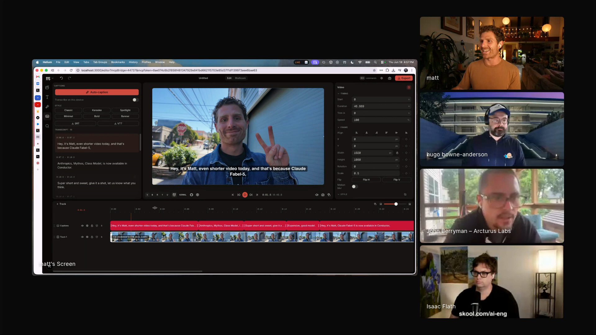

# Matt Palmer - Episode 5 field notes

Matt Palmer led DevRel at [Replit](https://replit.com/) through its transformation from an online IDE into an AI-native product and 200x revenue growth, and now leads developer experience at [Conductor](https://www.conductor.build/). In Episode 5, he used that DevRel and product context to show the personal software stack behind his own daily work: [Nix](https://nixos.org/)-managed dotfiles, a social video dashboard, Conductor worktrees, [Remotion](https://github.com/remotion-dev/remotion) overlays, a browser video editor, an MCP bridge into that editor, and a private skills repository.

Matt's segment ties personal code to compounding habits. Agents make it cheap enough for him to keep small tools alive, and Conductor gives him a place to keep those tools open, branch them, repair them, and improve them as he uses them. *"As someone that loves to build things, now I can just be building things all the time."* [\[00:36:08\]](https://youtube.com/live/6zju7hyCFl0?t=2168) The same optimism carries a product constraint: agent interfaces and MCP servers still break in ways that make the work feel early.

Matt shows MCut, a browser video editor with captions, timeline editing, and an MCP bridge so an agent can work against the same editing session. <a href="https://youtube.com/live/6zju7hyCFl0?t=3252">[00:54:12]</a>

## On working with agents

### What he loves: agents let builders stay in motion

Matt loves agents because they shrink the upfront investment required to find out whether an automation or small product idea is possible. Before agents, a Saturday project could cost an afternoon or several days before he knew whether the thing he wanted to build would work. Now the tedious setup and exploratory coding are cheap enough that he can keep building. *"As someone that loves to build things, now I can just be building things all the time."* [\[00:36:08\]](https://youtube.com/live/6zju7hyCFl0?t=2168)

The educational side feels open to him for the same reason. Nobody has settled the pedagogy, the tooling, or the interface patterns yet, so there is room to teach how the tools work and how to think with them.

### What he finds most frustrating: agent products and MCP still feel underdeveloped

Matt frames the frustration optimistically: the products are early, rough, and still shapeable. He works at Conductor because he wants to improve those interfaces, but he says the day-to-day MCP experience can be brittle. *"I feel like it's a coin toss whether my MCP server is gonna connect."* [\[00:37:20\]](https://youtube.com/live/6zju7hyCFl0?t=2240)

His concrete complaint is configuration drift. He expects an agent to write a local TOML file for one project, but it may write to a global config and spread the MCP server across his machine.

### What worries him in current agent behavior: over-helpful detours that burn tokens

Matt's later answer adds a model-specific frustration. Some agents try too hard to satisfy him instead of asking for the next instruction. *"Codex does these kind of weird things where it seeks to gratify me too much."* [\[00:38:52\]](https://youtube.com/live/6zju7hyCFl0?t=2332)

The detours can be useful, but they also burn tokens and time. He describes coming back after an agent has written an elaborate script with FFmpeg or another workaround and asking what happened.

## Workflows

### Let agents manage personal system configuration, then rebuild the machine from code

Matt manages his Mac through [Nix Home Manager](https://nix-community.github.io/home-manager/) and [nix-darwin](https://github.com/nix-darwin/nix-darwin), with packages and system settings defined as code. He compares Home Manager to Terraform for a laptop and says he would not have learned Nix deeply before agents because the documentation is so dense. *"Can I use an agent to write this and kind of guide me through the entire setup for my Mac? Yeah, absolutely."* [\[00:42:58\]](https://youtube.com/live/6zju7hyCFl0?t=2578)

The payoff is a semi-deterministic laptop setup. When Matt switched jobs and started at Conductor, he pulled down his dotfiles and ran a Nix rebuild script to apply packages and system settings. *"Now I have this deterministic setup."* [\[00:43:11\]](https://youtube.com/live/6zju7hyCFl0?t=2591)

### Keep personal tools open in Conductor and improve them as they break

Matt keeps his everyday tools open inside Conductor projects, then uses agent sessions to fix and extend those tools when he notices a problem. Each Conductor project is a Git repository, and each new workspace creates a Git worktree with its own folder and branch. *"Every time you click that plus icon, we'll skip the initial prompt, you're gonna create essentially a git work tree."* [\[00:46:57\]](https://youtube.com/live/6zju7hyCFl0?t=2817)

That setup lets him run parallel [Codex](https://openai.com/codex/), [Claude Code](https://docs.anthropic.com/en/docs/claude-code), [Cursor](https://cursor.com/), [OpenCode](https://opencode.ai/), or [Pi](https://pi.dev/) sessions against isolated branches. *"I use Conductor kind of as my agent home base."* [\[00:48:44\]](https://youtube.com/live/6zju7hyCFl0?t=2924)

The practice matters because the tools do not die after the first vibe-coded version. Matt keeps the social tools app, video overlay project, Chrome extension, and mobile app nearby, then sends changes through chat when he finds a bug or wants a feature. *"The process of continuous improvement and compounding means that your projects don't die."* [\[00:49:04\]](https://youtube.com/live/6zju7hyCFl0?t=2944)

### Produce videos with browser tools, transcripts, and code-generated overlays

Matt's social tools dashboard processes the videos he records while walking and talking about Conductor or what he is building. The browser app rips audio from video on the client with [MediaBunny](https://mediabunny.dev/), compresses it, uploads it to [AssemblyAI](https://www.assemblyai.com/), generates a transcript, templates a thumbnail frame, adds captions, applies presets, and renders the output in the browser. *"This tool basically does all of the video processing in the browser."* [\[00:45:14\]](https://youtube.com/live/6zju7hyCFl0?t=2714)

He uses the flow to produce assets for Twitter, YouTube, and other sharing surfaces. The thumbnail tool starts from his "what's new" series template, lets him pick a frame, and downloads a PNG or attaches it to the start of the video.

Matt uses a Remotion project in Conductor to create video overlays for his content. He transcribes a video with his social tools, pastes the transcript into an agent, asks it to find the relevant part of the video, and has it create a transparent MOV overlay in a chosen style. *"I have these graphics, like I have a professional video editor making stuff for me, but it's really just AI and code and some clever usage of these tools."* [\[00:51:04\]](https://youtube.com/live/6zju7hyCFl0?t=3064)

He uses overlays to illustrate topics such as the cost of Fable Five versus Composer while keeping the output as code-driven video layers that can be rendered and dropped onto the main edit.

### Give agents access to the same video timeline the human edits

Matt pushed his social tools toward a full browser-based video editor and then exposed that editor through MCP. He used MediaBunny, [WebGPU](https://www.w3.org/TR/webgpu/), and Fable to build a real editor rather than a mockup. *"This isn't just vibe coded stuff."* [\[00:53:09\]](https://youtube.com/live/6zju7hyCFl0?t=3189)

The MCP bridge lets Codex call tools such as `MCut LiveGetSummary`, inspect tracks, see timestamps, trigger transcription, and operate on the same editing session. *"It can actually see the video, it can see the timestamps."* [\[00:54:20\]](https://youtube.com/live/6zju7hyCFl0?t=3260)

He wants the editor API to support the same actions he would take manually. In a talking-head workflow, he wants to ask an agent to add jump cuts from the transcript across screen, camera, and side-by-side tracks. *"If I had an API for exposing this to an agent, I could say add jump cuts based on the transcript."* [\[00:55:31\]](https://youtube.com/live/6zju7hyCFl0?t=3331)

### Keep a private skill library portable and project-scoped

Matt uses a private GitHub repository as a hub for his skills. Because [skills.sh](https://www.skills.sh/) can install from a private repo when Git authentication is available, he can pull the same skills into new projects without making them global. *"This is a private GitHub repo, but I can actually install this via skills.sh into any directory."* [\[01:38:45\]](https://youtube.com/live/6zju7hyCFl0?t=5925)

He intentionally avoids global skills because they pollute context. Instead, he uses an alias such as `skills add` to install the private repo's skills into the current project, and a `skill push` alias to copy a useful project skill back into his private library. *"At any time I can take my private repository and then add skills to these projects."* [\[01:39:22\]](https://youtube.com/live/6zju7hyCFl0?t=5962)

## Skills

### Notion formatting skill

Matt's Notion formatting skill augments the Notion MCP with his preferences for page structure. It tells the agent how he likes Notion pages formatted, including callouts, toggle headings, tables, and colors. *"It's an augmentation of the Notion MCP, because I use Notion a lot."* [\[01:41:31\]](https://youtube.com/live/6zju7hyCFl0?t=6091)

He built it because agents can call the MCP but still produce poor formatting. The skill acts as a reference layer over the tool server rather than a standalone app.

### Thermonuclear code review

Matt uses Thermonuclear code review as a Cursor skill from Eric Z and people on the Cursor team. He likes invoking it with a dramatic slash command, but he also says he read the skill and found it useful for catching code quality problems. *"It's good for making sure that you don't get spaghetti code or files that are over a thousand lines long."* [\[01:42:24\]](https://youtube.com/live/6zju7hyCFl0?t=6144)

The name is part of why he remembers and uses it. *"It's kind of humorous because I like just writing slash thermonuclear code quality review in my projects."* [\[01:42:24\]](https://youtube.com/live/6zju7hyCFl0?t=6144)

### Transitions dev

Matt names Transitions dev as a designer-authored skill he has read and likes. The reason he trusts it is intentionality: a designer made choices, and the skill carries those choices into the agent's design work. *"Transitions dev is another one, it's come from a designer that I've read through that's really good."* [\[01:42:46\]](https://youtube.com/live/6zju7hyCFl0?t=6166)

### Writing revision skill

Matt's own writing revision skill has separate references for general writing and technical writing. The skill directs the agent to read the relevant reference based on the task, because writing technically differs from other writing he does. *"I use this for all of my writing."* [\[01:42:54\]](https://youtube.com/live/6zju7hyCFl0?t=6174)

The skill draws heavily on [*Style* by Williams and Bizup](https://en.wikipedia.org/wiki/Style%3A_Lessons_in_Clarity_and_Grace). Matt had been reading the book and extracting its sentence-level guidance into agent instructions. *"I'm reading through this book and starting to understand the way that good writers construct sentences."* [\[01:44:13\]](https://youtube.com/live/6zju7hyCFl0?t=6253)

### Reviewer Jackson

Matt shows Reviewer Jackson as a Conductor repository skill that reviews code using Jackson's knowledge of the product. He uses it as an example of a useful skill inside a project he does not personally own, and of the kind of skill he might copy into his private repo with `skill push`. *"We have a reviewer Jackson skill that reviews based on Jackson's knowledge about Conductor."* [\[01:40:35\]](https://youtube.com/live/6zju7hyCFl0?t=6035)

## Tools / projects he showed

### Conductor

[Conductor](https://www.conductor.build/) is Matt's agent home base and the product where he leads developer experience. In the demo, it shows projects on the left, workspaces inside those projects, parallel agent sessions, and terminal mode. *"The thing that's unique about Conductor really is that when you create a workspace, when you click this plus icon, you're gonna create essentially a git work tree."* [\[00:46:54\]](https://youtube.com/live/6zju7hyCFl0?t=2814)

The product runs the harnesses offered by labs, including Claude Code, Codex, and Cursor. Hugo adds that OpenCode, Pi, and open-weight models can run through terminal mode, and Matt says native app support for OpenCode and Pi was in progress. *"You can, you can through our big terminal mode."* [\[00:48:16\]](https://youtube.com/live/6zju7hyCFl0?t=2896)

### Nix Home Manager and nix-darwin dotfiles

Matt shows his dotfiles and nix-darwin setup as personal code for managing his Mac. Packages, Homebrew entries, and system configuration live in code, and a build script runs Nix rebuild to apply the configuration. *"I manage my entire Mac with Nix Home Manager."* [\[00:41:42\]](https://youtube.com/live/6zju7hyCFl0?t=2502)

He treats the setup as a laptop-level infrastructure file. *"Home Manager, it's just kind of like Terraform for your laptop."* [\[00:41:49\]](https://youtube.com/live/6zju7hyCFl0?t=2509)

### Social tools dashboard

Matt's social tools dashboard is the V1 app he uses for video processing and content production. It includes a video processor, transcription, thumbnail generation, caption positioning, style presets, and render controls. *"I make a lot of video. I get people that ask me all the time, hey Matt, how do you make so much video? How do you produce content so consistently? The answer is I use a lot of tools to automate things."* [\[00:44:18\]](https://youtube.com/live/6zju7hyCFl0?t=2658)

### MediaBunny

[MediaBunny](https://mediabunny.dev/) is the client-side media library Matt repeatedly praises. His social tools use it to rip audio from video in the browser, and his later video editor also uses it for browser-native editing. *"Using a library called MediaBunny, shout out MediaBunny. It's one of my favorite libraries."* [\[00:45:21\]](https://youtube.com/live/6zju7hyCFl0?t=2721)

The library matters because Matt is avoiding server-side FFmpeg for these demos. *"This is not FFmpeg, this is not server rendering. It's just using MediaBunny, which has blown me away."* [\[00:46:33\]](https://youtube.com/live/6zju7hyCFl0?t=2793)

### AssemblyAI

[AssemblyAI](https://www.assemblyai.com/) handles fast, accurate transcription for Matt's browser video workflow. In the social tools app, client-side audio is compressed and uploaded to AssemblyAI, which returns a transcript in seconds. *"We have pretty good transcription coming from AssemblyAI, and it was in seconds."* [\[00:45:41\]](https://youtube.com/live/6zju7hyCFl0?t=2741)

When Hugo asks about Whisper later, Matt says he defaults to AssemblyAI for new projects because the transcription is fast and accurate. *"Honestly, though, the AssemblyAI transcription, I'm not sponsored anything, but their transcription is very fast and very accurate."* [\[00:57:14\]](https://youtube.com/live/6zju7hyCFl0?t=3434)

### Neon

[Neon](https://neon.com/) appears briefly when Matt's social tools app shows database issues during the live demo. He says the problem may be related to Neon as the provider under the hood, while explicitly saying he is not shading the provider. *"Maybe it's because Neon is the provider under the hood. No shade to Neon."* [\[00:46:26\]](https://youtube.com/live/6zju7hyCFl0?t=2786)

### Remotion overlay project

Matt's [Remotion](https://github.com/remotion-dev/remotion) project, shown as `Matty Video`, runs in Conductor and creates overlay graphics for videos. He treats Remotion as React on video. *"This is just React essentially on this video."* [\[00:49:59\]](https://youtube.com/live/6zju7hyCFl0?t=2999)

The project renders transparent MOV files that Matt drops over his main videos as explanatory graphics.

### MCut browser video editor

MCut is Matt's name for the browser video editor and its MCP server. The editor runs at localhost, includes timeline editing, keyframes, captions, local transcription, and multicam primitives, and exposes editor state through MCP. *"I took these social tools and I thought, what if I could just make this just like an actual video editor? And so I did."* [\[00:52:46\]](https://youtube.com/live/6zju7hyCFl0?t=3166)

The MCP side gives an agent access to the editor. *"Do you have access to MCut, which is what I'm calling it MCP server?"* [\[00:54:04\]](https://youtube.com/live/6zju7hyCFl0?t=3244)

### Whisper

[Whisper](https://openai.com/research/whisper) appears in the MCut demo as local, on-device captioning. Matt triggers transcription from Codex through the MCP bridge, and the editor starts a Whisper model in the browser session. *"It triggered the Whisper model and then it transcribed it on my device."* [\[00:54:44\]](https://youtube.com/live/6zju7hyCFl0?t=3284)

Matt says the local model he spun up for the demo is small and produces poor transcripts. For better local quality, he expects a larger model and often a repair step. *"I think it's a pretty small Whisper model because the transcripts are not very good."* [\[00:57:08\]](https://youtube.com/live/6zju7hyCFl0?t=3428)

### Fable Five

Fable Five is the Fable system Matt used heavily to build the browser video editor. He says he had eight Fable sessions running for a couple of days and used it with WebGPU and MediaBunny to understand how to build the editor. *"I had eight Fable sessions running just nonstop for a couple days."* [\[00:52:28\]](https://youtube.com/live/6zju7hyCFl0?t=3148)

The experience makes him think longer-running loops may soon become practical. *"With Fable, I was waking up and I was like, why didn't I leave this running overnight?"* [\[01:00:55\]](https://youtube.com/live/6zju7hyCFl0?t=3655)

### skills.sh

Matt uses [skills.sh](https://www.skills.sh/) to install a private skills repository into whatever project he is working in. He says many people know skills.sh for public repos, but his setup works with a private repo when Git authentication is available. *"I basically use this as a hub where I can push and then pull skills from."* [\[01:38:54\]](https://youtube.com/live/6zju7hyCFl0?t=5934)

### Notion MCP

Notion MCP is the tool server Matt augments with his Notion formatting skill. The MCP gives the agent access to Notion, while the skill tells it how Matt wants pages formatted. *"It's a pretty simple skill. It just describes basically how I like to format Notion pages."* [\[01:41:37\]](https://youtube.com/live/6zju7hyCFl0?t=6097)

### Style by Williams and Bizup

Matt's writing revision skill is based on [*Style* by Williams and Bizup](https://en.wikipedia.org/wiki/Style%3A_Lessons_in_Clarity_and_Grace). He says the book's early chapters explain how sentence structure affects clarity and how readers interpret information. *"The first few chapters are actually about how we can structure sentences and what is most clear in a sentence."* [\[01:43:28\]](https://youtube.com/live/6zju7hyCFl0?t=6208)

## Principles and explainers

### Personal code became credible when agents made maintenance cheap

Matt used to be skeptical of personal software and of agents touching sensitive system configuration. His current practice changed because agents lowered the cost of maintaining tools that serve only him. *"I used to be extremely skeptical of using agents to edit system configs and touch sensitive stuff. But I do all of these things now."* [\[00:40:54\]](https://youtube.com/live/6zju7hyCFl0?t=2454)

The important unit for him is personal code: dotfiles, content dashboards, browser tools, extensions, and mobile apps that improve his daily work even when they would not yet survive as public products.

### Agent tooling should serve humans through headless interfaces

Hugo says builders should create headless versions of human-facing tools so agents can operate them, and Matt agrees. The MCut demo turns that principle into a concrete editor API: the human can use the browser timeline, and the agent can call tools against the same video state. Matt answers Hugo's point directly: *"A hundred percent."* [\[00:52:28\]](https://youtube.com/live/6zju7hyCFl0?t=3148)

The principle also explains the MCP bridge. Matt wants the agent to have access to the same editing primitives as the user, so future video workflows can ask for transcript-driven cuts instead of only code generation.

### Skills are tools, and only used tools compound

Matt's skills addendum starts from a practical view of skills. Owning many skills does not matter if they are not used well. *"Skills are tools."* [\[01:37:39\]](https://youtube.com/live/6zju7hyCFl0?t=5859)

He ties that idea to personal software and compounding improvement. *"The best skills are the ones you use, the best skills are the ones you improve."* [\[01:37:51\]](https://youtube.com/live/6zju7hyCFl0?t=5871)

### Avoid global skills when they pollute context

Matt intentionally installs skills per project instead of making every skill global. His concern is context pollution: too many globally visible instructions make it harder for the agent to focus on the current job. *"I intentionally avoid doing global skills, because I feel like that kind of pollutes your context."* [\[01:39:07\]](https://youtube.com/live/6zju7hyCFl0?t=5947)

His private repo and `skills add` alias are a compromise. Skills stay portable, but each project gets only the ones Matt chooses to add.

### A skill can encode taste from a book, but it still needs iteration

Matt's writing skill turns lessons from Williams and Bizup into instructions about sentence clarity, subject, action, reader purpose, and technical writing. He says the book pushed him to think formally about writing and made him want an agent that checks those things. *"I didn't even really think about writing formally that way."* [\[01:43:59\]](https://youtube.com/live/6zju7hyCFl0?t=6239)

The skill still produces slop, so Matt treats mistakes as material for future commits. *"I should be looking at all times for mistakes that the agent makes and then pushing updates to this skill."* [\[01:44:39\]](https://youtube.com/live/6zju7hyCFl0?t=6279)

### Model loops may be a near-future workflow rather than today's default

Matt does not think GPT-5-level coding work currently justifies heavy looping for his own use because the process still needs too much work. Fable changed his intuition because he wanted the sessions to run longer while he slept. *"I should be figuring out how to get this thing running longer."* [\[01:01:02\]](https://youtube.com/live/6zju7hyCFl0?t=3662)

He sees loop engineering language as a preview of likely near-future practice. People who talk about loops or goals may be a few months ahead rather than wrong.

## Additional quotations

- On the education gap: *"There is so much to learn, there is so much to teach. Nobody's ever done this before."* [\[00:36:28\]](https://youtube.com/live/6zju7hyCFl0?t=2188)

- On early products: *"The products are not developed. They are not developed products."* [\[00:36:48\]](https://youtube.com/live/6zju7hyCFl0?t=2208)

- On MCP frustration: *"What is going on? Why is this so difficult?"* [\[00:37:38\]](https://youtube.com/live/6zju7hyCFl0?t=2258)

- On MCP reliability: *"The shit just doesn't work half the time."* [\[00:37:10\]](https://youtube.com/live/6zju7hyCFl0?t=2230)

- On Codex detours: *"Sometimes you're like, wow, that was genuinely interesting. Other times I come back and I'm like, what just happened here?"* [\[00:39:01\]](https://youtube.com/live/6zju7hyCFl0?t=2341)

- On the demo plan: *"Really what I want to show y'all is how I go about my day to day and the types of things that I build."* [\[00:39:29\]](https://youtube.com/live/6zju7hyCFl0?t=2369)

- On personal code: *"I guess I'm AI pilled on personal software or really just personal code."* [\[00:40:23\]](https://youtube.com/live/6zju7hyCFl0?t=2423)

- On client-side rendering: *"This is not FFmpeg, this is not server rendering."* [\[00:46:33\]](https://youtube.com/live/6zju7hyCFl0?t=2793)

- On persistent personal tools: *"You can build these apps in real time as you use them."* [\[00:49:41\]](https://youtube.com/live/6zju7hyCFl0?t=2981)

- On browser video editing: *"This is a full video editor."* [\[00:52:53\]](https://youtube.com/live/6zju7hyCFl0?t=3173)

- On Remotion overlays and agents: *"I have a professional video editor making stuff for me, but it's really just AI and code."* [\[00:51:04\]](https://youtube.com/live/6zju7hyCFl0?t=3064)

- On Thermonuclear code review: *"I like just writing slash thermonuclear code quality review in my projects."* [\[01:42:24\]](https://youtube.com/live/6zju7hyCFl0?t=6144)

- On future open source models: *"What happens when open source models are as good as Frontier models today and you can get them really cheap and they're really fast?"* [\[00:56:35\]](https://youtube.com/live/6zju7hyCFl0?t=3395)

- On skill quality: *"If they only have one commit, it's not really doing anything."* [\[01:44:31\]](https://youtube.com/live/6zju7hyCFl0?t=6271)

## Live reactions and follow-ups

### Discord asked about procedural and agentic workflow engines

During Matt's segment, a Discord participant asked whether there was already an engine for mixing procedural and agentic workflows into one pipeline. The question matched the shape of Matt's MCut demo: deterministic browser video tools, an MCP bridge, and an agent that can operate the same timeline.

### Discord linked Remotion after Matt's overlay demo

After Matt showed the Remotion overlay workflow, Discord linked the [Remotion GitHub repository](https://github.com/remotion-dev/remotion). The link maps directly to the part of Matt's demo where a React video project generated transparent MOV overlays for his walkthrough videos.

### Discord shared the Conductor site

After the episode, Discord shared the [Conductor site](https://www.conductor.build/). The linked page describes Conductor as a Mac app for running parallel coding agents in isolated workspaces, which matches Matt's demo of projects, worktrees, and parallel harnesses.
