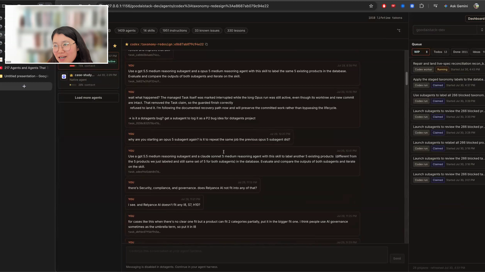

# Chip Huyen - Episode 8 field notes

[Chip Huyen](https://huyenchip.com/) is a writer and computer scientist focused on bringing AI into production. She taught Machine Learning Systems Design at Stanford, founded and sold an AI infrastructure company, and wrote *Designing Machine Learning Systems* and *AI Engineering*, the most-read book on the O'Reilly platform in 2025.

Chip built a cross-provider runner that puts a strong agent in charge of planning and review while large numbers of cheaper agents do the implementation. The selected Good AI Stack project showed 1,409 agents. Her runner can dispatch workers across model providers, collect their results, send the work back through review, and keep the job moving without Chip carrying messages between tabs.

Good AI Stack is Chip's database and interface for exploring AI companies, products, repositories, and case studies. At the end of the subscription week, she spends unused tokens on agents that search the internet and expand it. Agents from different providers apply the same taxonomy skill to each product, compare their answers, and revise the instructions when they disagree. Once the guideline holds up, the supervising agent sends the labeling work to cheaper agents at scale.

Running that many agents moved the bottleneck to Chip's own attention. Every instruction becomes a task record with its agent, status, and evidence, because she cannot remember what is happening across all the tabs and projects. *"I care more about what I think of as human context management."* [[00:56:37]](https://youtube.com/live/NH-ic7-V-jY?t=3397)

Chip shows a runner project with 1,409 agent entries. <a href="https://youtube.com/live/NH-ic7-V-jY?t=2941">[00:49:01]</a>

## On working with agents

### What she loves: building a first version in a day and learning patience

Chip began by saying agents were terrible for her mental health. Hugo caught the contradiction: *"I said, what do you love most? And you said, they're terrible for my mental health, and then went on to say what you love."* [[01:17:17]](https://youtube.com/live/NH-ic7-V-jY?t=4637)

Repeated failures have made Chip more patient and shown her where her own instructions were weak. *"A lot of times, the agents make mistakes. It's not because the agent is stupid, it's because I give them instructions not good enough."* [[01:16:45]](https://youtube.com/live/NH-ic7-V-jY?t=4605)

She can also turn an idea into a working initial version in a day, then let agents continue. *"I can build this thing in, what, a day, the initial versions of it, and I can just let it run."* [[01:17:00]](https://youtube.com/live/NH-ic7-V-jY?t=4620)

### What she finds most frustrating: instructions decay in long contexts

Agents forget constraints as context grows and repeat the same failure patterns. *"Especially with longer context, it keeps forgetting things."* [[01:17:37]](https://youtube.com/live/NH-ic7-V-jY?t=4657)

Chip compares the repetition with grading students who repeatedly made the same mistakes. *"Working with agents is frustrating, but also same as working with humans."* [[01:18:06]](https://youtube.com/live/NH-ic7-V-jY?t=4686)

## Workflows

### Run large multi-agent jobs through a cross-provider runner

Chip puts a strong agent in charge of planning and review, then lets it assign the implementation to many cheaper agents. Her runner can create workers across model providers, keep them running until their assigned work is complete, collect their results, and send those results back to the strong agent. *"I get a very strong agent to make plans and think, and then it assigns tasks to a bunch of cheaper agents to do it."* [[00:50:08]](https://youtube.com/live/NH-ic7-V-jY?t=3008)

The selected project showed 1,409 agents. Chip said her runner has no fixed subagent limit and can launch ten workers from one supervising agent, while the taxonomy job can continue without her interrupting it. *"I just don't look at it anymore."* [[00:50:02]](https://youtube.com/live/NH-ic7-V-jY?t=3002)

Planning, implementation, and review also stay inside the runner. Chip previously copied messages among separate provider tabs; now one agent can ask another to review its plan and receive the response in the same conversation. *"That's why I built my runner, so they can do that in the same place."* [[00:54:28]](https://youtube.com/live/NH-ic7-V-jY?t=3268)

In Good AI Stack, agents from different providers apply the same taxonomy instructions to the same product. The supervising agent compares their labels and revises the skill when they disagree. *"Follow the same guideline, and then compare the results, and then iterate on that. I find this process works really well."* [[00:47:38]](https://youtube.com/live/NH-ic7-V-jY?t=2858) Once the guideline holds up, it distributes the labeling work across a much larger group of cheaper agents.

### Record every instruction with its agent, status, and evidence

Chip's runner detects whether an instruction contains a task, then records the original request, assigned agent, status, and evidence on a task page. *"I can go back and look at the instructions that I gave it, and here's the agent that did it, and I can see the evidence it did it."* [[00:57:49]](https://youtube.com/live/NH-ic7-V-jY?t=3469)

Chip does not inspect every completed task. She returns to the record when the same bug appears again and she needs to know whether an earlier agent completed the work and what evidence it supplied.

### Plan and review long-running work, then check it against the original request

For a complex change, Chip tells the agent to make a plan, ask her questions, get another agent to review the plan, and identify what could go wrong before implementation. *"I give it a process: do this, and then get another to review it, and then do post-mortems."* [[01:05:58]](https://youtube.com/live/NH-ic7-V-jY?t=3958)

The agent must keep checking its plan and implementation against Chip's original instruction. Otherwise, an early misinterpretation becomes a plan, the plan becomes the new source of truth, and the job drifts farther from what she asked for.

### Use recorded failures to decide which model gets the next job

Agents classify failures as planning errors, execution errors, instruction-following failures, or cases where a deterministic script should have replaced agent reasoning. Chip uses the accumulated record to learn which models fail at which kinds of work. *"Over time, track what kind of models are more likely to make certain types of logic errors, and help me decide which agent is better for what type of task."* [[01:03:29]](https://youtube.com/live/NH-ic7-V-jY?t=3809)

## Skills

### Taxonomy labeling skill

Chip's taxonomy skill defines how an agent should assign an AI product to a consistent category. She treats the instructions as a labeling guideline and evaluates them through agreement across providers. *"On these categories, how to get them consistent. So I have a skill, a guideline, for an agent to label, given a product, what category it should be in."* [[00:46:35]](https://youtube.com/live/NH-ic7-V-jY?t=2795)

### Verified front-end skill

The verified front-end skill triggers whenever a task touches the interface. It asks the agent to open a browser, inspect the rendered page visually, improve the result, take a screenshot, and attach that evidence to the pull request. *"It can show it to me, attach to a PR, so I can approve it without having to spin up the branch associated with that PR."* [[01:01:42]](https://youtube.com/live/NH-ic7-V-jY?t=3702)

The browser mechanism depends on the environment: Codex desktop can use its built-in browser, while a terminal session needs a local headless browser.

### Write tests skill

Chip's test-writing skill guides agents away from trivial assertions, excessive regression tests, legacy behavior checks, and tests that merely freeze wording inside skill files. *"Think about how significant this feature is."* [[01:08:46]](https://youtube.com/live/NH-ic7-V-jY?t=4126)

Chip considers test-skill design difficult because agents can generate hundreds of checks for removed copy or freeze the exact wording of a skill.

### Author Skills

Author Skills checks provider guidance and comparable public skills before drafting a new skill. *"Research good external skills to learn from. Don't reinvent."* [[01:14:16]](https://youtube.com/live/NH-ic7-V-jY?t=4456)

It moves detail into referenced files so the main skill instructions do not consume unnecessary context and tells the agent to keep the body concise. *"It uses up a lot of context."* [[01:12:56]](https://youtube.com/live/NH-ic7-V-jY?t=4376)

## Tools / projects she showed

### Good AI Stack

Good AI Stack is Chip's database and interface for exploring AI developer products, case studies, companies, and alternatives. It ranks companies daily, showed Moonshot and Kimi rising in popularity, and let her inspect Cursor alongside competing coding assistants. *"Daily, it ranks all of these random companies."* [[00:46:20]](https://youtube.com/live/NH-ic7-V-jY?t=2780)

The project maps commercial products to their open-source repositories and includes the taxonomy that Chip improves with cross-provider labeling runs.

Chip's website also links [Good AI List](https://goodailist.com/), her public project for discovering open-source AI.

Chip maintains Good AI Stack with `token time compute`, spending unused weekly subscription capacity on background internet research. *"At the end of the week, when I have some free token left, I would let my agent do some scripting on the internet."* [[00:45:20]](https://youtube.com/live/NH-ic7-V-jY?t=2720)

### Cross-provider agent runner

Chip built a runner that lets agents create and supervise subagents across providers without switching tabs. It can start more subagents than the native limit she encounters in an individual provider, then keep workers running until the assigned task finishes. *"With my runner, there's no limit, so it can spin up 10 sub-agents."* [[00:49:25]](https://youtube.com/live/NH-ic7-V-jY?t=2965)

Hugo had seen 217 agents in another project a few days earlier; the selected project showed 1,409.

The runner reconciles provider differences during long jobs:

- Permission levels and sandbox boundaries.
- Questions that a subagent needs to route back to the user.
- Token exhaustion during a run.
- Planning, review, implementation, and result collection across model families.

The runner also includes the task ledger Chip built because she could not remember every task running across her tabs. It detects tasks from instructions, materializes a page for each one, and preserves agent activity and evidence. *"For every time I give it an instruction, it would detect whether it's a task."* [[00:57:26]](https://youtube.com/live/NH-ic7-V-jY?t=3446)

After a strong agent prepares a plan, the runner can send implementation to lower-cost open-weight models such as [DeepSeek](https://www.deepseek.com/). Chip expects distillation to keep producing smaller, cheaper, and faster workers. *"I'm actually very, very bullish on open-source models."* [[00:51:18]](https://youtube.com/live/NH-ic7-V-jY?t=3078)

### [Codex](https://openai.com/codex/)

Chip switches between the Codex CLI and desktop app. Desktop is useful for search, voice, mobile handoff, and its built-in browser. The CLI exposes more of the commands and trace at a glance. *"Desktop usually hides the trace of all the commands that it runs, whereas the CLI is more verbose, but I can see a lot more things at a quick glance."* [[00:53:55]](https://youtube.com/live/NH-ic7-V-jY?t=3235)

Her runner lets Codex create subagents in another provider's environment and participate as planner, worker, or reviewer.

### [Claude Code](https://code.claude.com/docs/en/overview)

Chip uses Claude Code alongside Codex and routes work between them through her runner. She also uses its mobile handoff for heavy workloads so she can close the laptop, leave, and check the run from her phone. *"I can just go out, and I can close my laptop, and it works, which is amazing."* [[01:10:36]](https://youtube.com/live/NH-ic7-V-jY?t=4236)

### [Git and worktrees](https://git-scm.com/docs/git-worktree)

Chip defines a sandbox by the operations and paths an agent can affect. *"I think of sandbox as a constraint of what it can run."* [[01:11:18]](https://youtube.com/live/NH-ic7-V-jY?t=4278)

Git worktrees provide that boundary for code-changing agents. Database-only operations can run without a worktree, but every code change gets an isolated one. *"If it's just pure database changes and no code change, then don't use worktree, but if you touch code, then it has to have a worktree."* [[01:10:52]](https://youtube.com/live/NH-ic7-V-jY?t=4252)

Each agent may modify files inside the current project worktree while paths outside it remain forbidden. *"Then it can only make changes within that worktree."* [[01:11:41]](https://youtube.com/live/NH-ic7-V-jY?t=4301)

### [GitHub](https://github.com/)

Good AI Stack uses the GitHub API to connect a company with its account and repositories. The verified front-end skill attaches screenshots to GitHub pull requests so Chip can approve visual work without checking out the branch.

One failed agent plan performed thousands of searches instead of finding a company's GitHub account once and listing its repositories through the API. *"It does thousands of searches for each company, because it wants to find every single repo with that company."* [[01:00:44]](https://youtube.com/live/NH-ic7-V-jY?t=3644)

## Principles and explainers

### Human attention becomes the bottleneck when agents work in parallel

Model providers continue improving reasoning, subagent creation, and orchestration inside individual agent loops. Chip's attention does not scale with them. *"As humans, I can only attend to two to three tasks at the same time."* [[00:56:46]](https://youtube.com/live/NH-ic7-V-jY?t=3406)

### Task ability and orchestration ability are separate model capabilities

A model that performs an individual task well may still supervise subagents poorly. Chip tests models for both roles and assigns them accordingly. *"Not all models can act well as a super agent."* [[00:52:31]](https://youtube.com/live/NH-ic7-V-jY?t=3151)

### Agent swarms magnify planning errors

Chip expected one company-account search followed by GitHub API retrieval. The agent instead searched separately for every repository associated with each company. Across 4,000 companies and roughly 100 searches per company, the mistaken plan would consume a large token budget. *"It's very, very annoying and very costly if you just leave it unattended."* [[01:00:56]](https://youtube.com/live/NH-ic7-V-jY?t=3656)

### Long runtime is not success

A supervising agent can keep a taxonomy job rolling through subagents indefinitely, but an unconstrained agent can invent unnecessary work. Chip optimizes for completing the assigned task. *"I don't think it's a goal it should run for as long as possible."* [[00:59:24]](https://youtube.com/live/NH-ic7-V-jY?t=3564)

### Deterministic environment choices belong in scripts

The verified front-end skill needs to choose between the desktop app's in-app browser and a local headless browser in the CLI. Chip wanted a script to detect the environment. The first implementation added more natural-language instructions to a skill, creating another opportunity for silent instruction-following failure. *"Agents somehow tend to rely on agents to solve problems that could be solved by a script."* [[01:01:10]](https://youtube.com/live/NH-ic7-V-jY?t=3670)

### Generated tests need product judgment

Agents can mistake a literal request for a durable invariant, such as adding a permanent test that verifies removed website copy never returns. Chip spot-checks generated tests and decides whether a feature warrants lasting coverage. *"It would create a test to check that the text is no longer there, which is totally stupid."* [[01:08:28]](https://youtube.com/live/NH-ic7-V-jY?t=4108)

## Additional quotations

- On invisible infrastructure: *"My thing just works in the background."* [[00:44:24]](https://youtube.com/live/NH-ic7-V-jY?t=2664)

- On scaling after review: *"Once I'm happy, I ask it to spin up a bunch of sub-agents to do it."* [[00:49:46]](https://youtube.com/live/NH-ic7-V-jY?t=2986)

- On escaping manual coordination: *"Oh my gosh, I don't want to do that anymore."* [[00:54:28]](https://youtube.com/live/NH-ic7-V-jY?t=3268)

- On silent failures: *"This usually annoys me tremendously, because you just feel like they fail silently."* [[01:02:42]](https://youtube.com/live/NH-ic7-V-jY?t=3762)

- On unconstrained searches: *"They can just go and search for thousands and thousands of search queries, and never gonna stop."* [[01:03:07]](https://youtube.com/live/NH-ic7-V-jY?t=3787)

- On her everyday stack: *"I don't think I use anything fancy."* [[01:10:13]](https://youtube.com/live/NH-ic7-V-jY?t=4213)

- On agent-era patience: *"I feel like I've just become so much more patient, just from dealing with all the terrible mistakes they make."* [[01:16:30]](https://youtube.com/live/NH-ic7-V-jY?t=4590)

- On why the system is hard to demo: *"I built this for myself, so it's a pretty complex thing. It fit my need. When I show it to people without context, it's a bit hard to follow."* [[01:19:46]](https://youtube.com/live/NH-ic7-V-jY?t=4786)

## Live reactions and follow-ups

### The audience asked for the missing layer of context

A Discord participant asked what the interface was, whether Chip had built it, and what she meant by a runner. Chip saw the question before leaving and agreed that the setup was difficult to follow without its surrounding context. *"We need to take a lot of steps back."* [[01:19:46]](https://youtube.com/live/NH-ic7-V-jY?t=4786)

### Hugo proposed rebuilding the operating pattern from the conversation

Hugo proposed giving the episode audio and transcript to his agent, then building a utility around his own work and organization. *"I am interested in taking the audio and transcript of this livestream, and chatting about it with my agent, and seeing what utility I could build from what you've described for my own purposes and my own organization."* [[01:20:16]](https://youtube.com/live/NH-ic7-V-jY?t=4816)

### Thomas placed Chip's runner at the complex end of an agentic workflow ladder

In the closing discussion, Thomas Wiecki contrasted his lightweight practice of running Codex and Claude Code in parallel with Chip's orchestrated system. Chip's approach becomes useful when a task needs hundreds of variations, but Thomas said the maintenance burden of such a system can be high while his own workflow is still changing. *"That's where you go to a system like Chip."* [[01:26:26]](https://youtube.com/live/NH-ic7-V-jY?t=5186)
