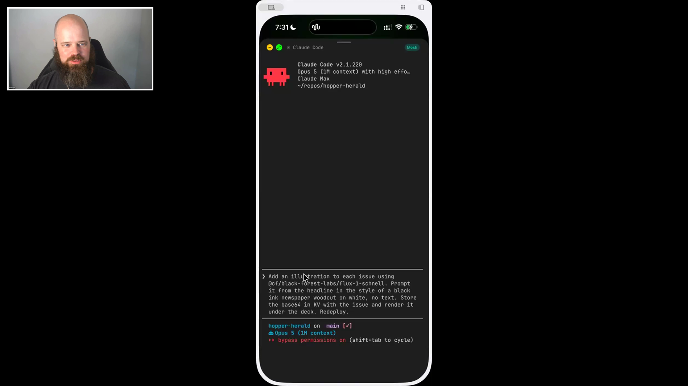

# Tim Hopper - Episode 8 field notes

[Tim Hopper](https://tdhopper.com/) is a machine learning platform engineer and Python developer who has spent more than a decade helping teams shorten feedback loops across machine learning, developer tooling, and production systems. He writes about AI-assisted development, Python tooling, and helping researchers and data scientists spend less time fighting infrastructure.

Tim builds and deploys real software while walking. Before this episode, he used Claude Code from his iPhone to build [Hopper Herald](https://hopper-herald.tdhopper.workers.dev/), a website that generates illustrated magazines with articles, jokes, and puzzles. On stream, he gave the agent another feature to build, put his phone away, and asked it to email him when the work was finished. This is how Tim builds around raising four children: the agent stays focused on the project while he drops in with direction and judgment whenever a few minutes appear.

Tim opens Claude Code on his iPhone during a few free minutes. <a href="https://youtube.com/live/NH-ic7-V-jY?t=1701">[00:28:21]</a>

His operating model gives the agent sustained attention while he contributes brief bursts of direction from a phone: *"The agent kind of gives sustained focus to something and allows me to have much more intermittent focus."* [[00:11:50]](https://youtube.com/live/NH-ic7-V-jY?t=710) From his phone, Tim also uses a [printable-magazine skill](https://github.com/tdhopper/dotfiles2.0/blob/6e19eb1a4814a2677e1bd9c0404d605d72bea34e/.claude/skills/magazine-explainer/SKILL.md) to make booklets for his children. The remote-access stack and Resend completion-email skill keep that work available across walks, soccer practice, bedtime, and sleep.

Agents can produce polished code faster than humans can decide whether the change is a good idea. Tim reviews agent output in GitHub pull requests and draws on 15 years of reading other people's code because polished implementation can conceal a weak design. *"The constraint is not becoming how fast can you open PRs, it's how fast can you decide whether or not those PRs are a good idea."* [[00:07:41]](https://youtube.com/live/NH-ic7-V-jY?t=461)

## On working with agents

### What he loves: agents reopened side projects

Agents let Tim return to personal projects despite tight time constraints and extend what he can build during short intervals. *"It's really reopened for me the ability to do side projects."* [[00:05:02]](https://youtube.com/live/NH-ic7-V-jY?t=302)

The work can continue through short intervals at a child's soccer practice, on a walk, or before bed because the agent retains the project's focus between Tim's prompts.

### What he finds most frustrating: polished code can disguise a bad idea

Agent-written code often looks compelling even when the underlying design is wrong, removing a rough-code signal that once helped reviewers spot weak contributions. *"Agents produce code that looks so good all the time, and things look really compelling a lot, that it's taking a different level of discernment."* [[00:08:12]](https://youtube.com/live/NH-ic7-V-jY?t=492)

Tim has to decide *"what's the right thing to do, and how much to trust what the agent is telling you."* [[00:08:46]](https://youtube.com/live/NH-ic7-V-jY?t=526)

## Workflows

### Turn successful iterations and recurring failures into personal skills

Tim did not begin the printable-magazine project by specifying a generalized skill. He iterated with Claude Code until it produced a magazine he liked, then captured the working process for repeat use. *"When we finally got to one that I liked, we made it reproducible by encoding it as a skill."* [[00:14:25]](https://youtube.com/live/NH-ic7-V-jY?t=865)

The resulting skill can take a vague topic, research it, find images, assemble a web version, and generate a bifold booklet for a normal printer.

Tim maintains his Cloudflare skill by recording failures as short gotchas. *"If something doesn't work, just put a tip in here to remind yourself. Not that it couldn't figure this stuff out, but it just makes it go a little faster."* [[00:19:15]](https://youtube.com/live/NH-ic7-V-jY?t=1155) One skill preserves the process that produced a useful artifact; the other accumulates lessons from repeated deployments.

### Run side projects through persistent phone-accessible agent sessions

Tim leaves project sessions running on a home Mac Mini, reaches them from Moshi over Mosh and Tailscale, and uses Zellij sessions named after project folders. A `C` shortcut opens Claude Code. *"If I have a few minutes of downtime somewhere, I'm pulling out my phone and pulling up Claude Code like this."* [[00:28:21]](https://youtube.com/live/NH-ic7-V-jY?t=1701)

Tim uses Spokenly on iOS to dictate prompts when the environment allows it. Speaking helps him include more detail than typing on a phone, while the transcription system and agent tolerate pauses, restarts, and nonlinear phrasing. *"Speaking also just enables you to say more stuff."* [[00:31:04]](https://youtube.com/live/NH-ic7-V-jY?t=1864)

Pantherbane is not exposed to the public internet. Tim limits remote access to devices on his Tailscale network.

When Tim has to put his children to bed or leaves a task running overnight, he asks the agent to send him an email through Resend after it finishes. *"I wake up the next morning, and I don't have to remember to go check in on the agent. I just have an email telling me what's there."* [[00:33:02]](https://youtube.com/live/NH-ic7-V-jY?t=1982)

The email preserves the result and next action outside the terminal session. The agent also synthesized a walking conversation into preparation notes for the episode.

### Review agent output as pull requests

Tim spends little time in an IDE. He treats the agent's output as a reviewable change in GitHub, opening VS Code only when he needs to investigate the codebase more deeply. *"I almost exclusively am looking at code in GitHub on pull requests. I'm just treating the agent outputs as something to review on there."* [[00:16:06]](https://youtube.com/live/NH-ic7-V-jY?t=966)

## Skills

### [Printable magazine generator](https://github.com/tdhopper/dotfiles2.0/blob/6e19eb1a4814a2677e1bd9c0404d605d72bea34e/.claude/skills/magazine-explainer/SKILL.md)

Tim created a skill that turns a vague topic into a short illustrated magazine for his children. It researches the subject, finds pictures, compiles an online version, and produces a bifold edition that prints on an ordinary printer. *"I have a skill where I can put in a really vague prompt, and it goes out, finds pictures, does the research, and compiles it all together."* [[00:12:42]](https://youtube.com/live/NH-ic7-V-jY?t=762)

His eight-year-old used it to request a magazine about upgrading a high-end remote-control car he did not yet own. Tim described the implementation as highly vibe-coded and had not closely inspected all of its printing instructions. The repository includes the [script that imposes the pages into a foldable booklet](https://github.com/tdhopper/dotfiles2.0/blob/6e19eb1a4814a2677e1bd9c0404d605d72bea34e/.claude/skills/magazine-explainer/scripts/make_booklet.py).

### [Cloudflare site-building skill](https://github.com/tdhopper/dotfiles2.0/blob/6e19eb1a4814a2677e1bd9c0404d605d72bea34e/.claude/skills/cloudflare/SKILL.md)

Tim distilled the repeated choices and failure lessons from his Cloudflare sites into a personal skill. It reflects his own stack and prior projects, including a running gotchas section, rather than presenting itself as a universal deployment recipe. *"This is not one I'd necessarily recommend copying. It's a distillation of the types of things that I've done."* [[00:18:59]](https://youtube.com/live/NH-ic7-V-jY?t=1139)

The skill lets him build and deploy sites from his phone against Cloudflare's Workers, databases, static hosting, model access, and vector-search services. Its [running list of gotchas](https://github.com/tdhopper/dotfiles2.0/blob/6e19eb1a4814a2677e1bd9c0404d605d72bea34e/.claude/skills/cloudflare/references/gotchas.md) preserves fixes that would otherwise need to be rediscovered.

### [Resend completion-email skill](https://github.com/tdhopper/dotfiles2.0/blob/6e19eb1a4814a2677e1bd9c0404d605d72bea34e/.claude/skills/resend-email/SKILL.md)

Tim keeps a skill in his dotfiles that gives the agent access to Resend through an API key. He uses it to create an asynchronous handoff from the agent session to his inbox. *"I can say, send me an email with Resend when this one's done summarizing, letting me know next steps."* [[00:32:55]](https://youtube.com/live/NH-ic7-V-jY?t=1975)

### [PROSE.md](https://github.com/tdhopper/dotfiles2.0/blob/6e19eb1a4814a2677e1bd9c0404d605d72bea34e/.claude/PROSE.md) and [prose-editor subagent](https://github.com/tdhopper/dotfiles2.0/blob/6e19eb1a4814a2677e1bd9c0404d605d72bea34e/.claude/agents/prose-editor.md)

Tim keeps writing rules adapted from writing books in `PROSE.md` and points prose tasks at them from `CLAUDE.md`. His prose-editor subagent audits a draft for violations and reports them instead of rewriting the draft. He also gives agents a shorter editing instruction after they write a skill: *"I just say, omit needless words after you write a skill, and it'll prune probably half the words that it wrote."* [[01:14:55]](https://youtube.com/live/NH-ic7-V-jY?t=4495)

## Tools / projects he showed

### [Claude Code](https://code.claude.com/docs/en/overview)

Claude Code is Tim's primary agent tool. He moved deeply into its terminal interface after March of the previous year and now uses it for work and personal projects. *"You can say the vaguest things, and within seconds, it's gonna go find out what the context is you're talking about."* [[00:06:04]](https://youtube.com/live/NH-ic7-V-jY?t=364)

Tim ran Claude Code remotely from his phone during the demo. On a walk before the episode, it persuaded him to build a first version of Hopper Herald and implemented it while he continued walking.

### [Codex](https://openai.com/codex/)

Tim has explored Codex as its capabilities reached greater parity with Claude Code. At work, he asked Codex to load all the MCPs from his Claude Code setup, and it completed the migration for him. *"This makes it a lot easier to go in both."* [[00:15:48]](https://youtube.com/live/NH-ic7-V-jY?t=948)

### [GitHub](https://github.com/)

GitHub is Tim's main code-reading and review surface for agent work. He opens pull requests there and uses them to judge agent output before reaching for a local editor. *"I do look at code quite a bit, but I almost exclusively am looking at code in GitHub on pull requests."* [[00:16:06]](https://youtube.com/live/NH-ic7-V-jY?t=966)

Tim also keeps most of the skills shown during the segment in his dotfiles repository on GitHub.

### [VS Code](https://code.visualstudio.com/)

VS Code is Tim's fallback when pull-request review reveals a reason to dig through the codebase. His earlier encounter with agent assistance was Copilot tab completion inside VS Code, which did not initially hold his attention.

### [Cursor Agent](https://cursor.com/)

Cursor gave Tim access to workplace agents before Claude Code was available there. He began by pushing beyond tab completion and gradually handing it longer tasks. *"I can go from just tab completion to a little bit more, a little bit more."* [[00:04:28]](https://youtube.com/live/NH-ic7-V-jY?t=268)

### [Tim's dotfiles](https://github.com/tdhopper/dotfiles2.0)

Tim stores most of his personal agent skills in his dotfiles. During the demo, he opened the magazine, Cloudflare, and Resend skill instructions from that collection. *"Most of the things I have are in my dotfiles."* [[00:12:09]](https://youtube.com/live/NH-ic7-V-jY?t=729)

### [yadm](https://yadm.io/)

Tim updates his skills iteratively and version-controls the dotfiles collection with yadm on GitHub.

### [Cloudflare](https://workers.cloudflare.com/)

Cloudflare supplies the hosting and application services behind Tim's recent side projects:

- Workers that run JavaScript serverless code and return websites.
- Databases and static-site hosting.
- Hosted language models and AI integrations.
- A vector store for semantic-search applications.

Tim pays $5 per month for a Workers plan that exceeds the traffic and resource needs of his small sites. *"For $5 a month, and whatever the cost of the domains, I can put up sites and do them from my phone."* [[00:18:45]](https://youtube.com/live/NH-ic7-V-jY?t=1125)

He found Cloudflare's available language models too weak for some tasks, so he sometimes brings an external model API key or delegates parts of an application to Perplexity and Gemini.

### [Hopper Herald](https://hopper-herald.tdhopper.workers.dev/)

Hopper Herald is a web version of Tim's printable magazine generator, built during a walk before the episode and deployed entirely on Cloudflare. A prompt generates a simple online magazine with history, jokes, and a word scramble. During the live demo, Tim asked Claude Code to add a black-ink newspaper woodcut illustration, store it as base64 in a key-value store, render it under the deck, and redeploy. *"It built for me the Hopper Herald, a web version of this magazine generator that I built for my kids."* [[00:20:02]](https://youtube.com/live/NH-ic7-V-jY?t=1202)

The agent independently added a `Surprise me` button. The live site produced magazines about podcasts and Hugo, including an image that represented Hugo as an ominous castle. Tim gave the public address as `hopper-herald.tdhopper.workers.dev`.

### Auction price-estimation site

Tim built a private site for himself and his father-in-law to replace a spreadsheet-based workflow for bidding on returned Sam's Club goods at a local auction house. The agent discovered that it could scrape the auction site's GraphQL endpoint. The app retrieves listings, estimates prices with Perplexity, and uses Gemini image recognition to improve those estimates. *"He'll look items up and see how much he should bid on them, and so I built a whole site that just does it for us."* [[00:23:51]](https://youtube.com/live/NH-ic7-V-jY?t=1431)

Tim also uses the site to experiment with steering cheaper models using stronger model outputs.

### [Moshi](https://getmoshi.app/)

Moshi is the iOS terminal app Tim uses to work with agents from his phone. It is designed to work well with agent sessions, integrates with Mosh, lists Tmux and Zellij windows, and provides completion push notifications through agent hooks. *"Moshi is particularly being developed to work well with agents, and it also works really well with the Mosh shell."* [[00:26:09]](https://youtube.com/live/NH-ic7-V-jY?t=1569)

Moshi includes local voice-to-text, though Tim finds Spokenly's transcription more reliable.

### [Mosh](https://mosh.org/)

Mosh provides persistent remote shell connections. Unlike an SSH session that can drop when a phone passes through a tunnel, Mosh leaves a server running on the target machine so Tim can reconnect to the same Claude Code session. *"Mosh runs like a persistent server on the target device that is able to continue that for you."* [[00:26:42]](https://youtube.com/live/NH-ic7-V-jY?t=1602)

### [Tailscale](https://tailscale.com/)

Tailscale lets Tim reach his home Mac Mini, named Pantherbane, from anywhere through SSH or Mosh without exposing it to the public internet. *"I also have Tailscale running so that I can SSH or Mosh into that Pantherbane from anywhere."* [[00:27:00]](https://youtube.com/live/NH-ic7-V-jY?t=1620)

### [Zellij](https://zellij.dev/)

Zellij is Tim's terminal multiplexer alternative to Tmux. His [`zj` function](https://github.com/tdhopper/dotfiles2.0/blob/6e19eb1a4814a2677e1bd9c0404d605d72bea34e/.config/fish/fish-functions.fish#L117) opens a Zellij window, names it after the current project folder, and leaves it available for direct re-entry from Moshi. His [`c` alias](https://github.com/tdhopper/dotfiles2.0/blob/6e19eb1a4814a2677e1bd9c0404d605d72bea34e/.config/fish/fish-aliases.fish#L4) launches Claude Code. *"When I come back into Moshi, I can jump straight back into that folder, so I keep them open for a lot of my projects."* [[00:27:59]](https://youtube.com/live/NH-ic7-V-jY?t=1679)

The shortcut was broken during the live demo, but the session-navigation pattern remained visible.

### [Spokenly](https://spokenly.app/)

Spokenly is Tim's voice-to-text app on desktop and iOS. It can run locally, which made it usable at work before external transcription services were permitted. *"The Spokenly one I find to be super, super reliable."* [[00:30:39]](https://youtube.com/live/NH-ic7-V-jY?t=1839)

### [Resend](https://resend.com/)

Resend supplies the email API behind Tim's completion-email skill. Its free tier and Tim's API key let agents send summaries and next steps to his inbox. *"I use that to send emails to myself."* [[00:32:20]](https://youtube.com/live/NH-ic7-V-jY?t=1940)

### [cmux](https://cmux.com/)

CMUX is an agent-aware terminal built on Ghostty. Tim opens a vertical tab for each project, then uses horizontal tabs for related work. CMUX can title tabs from agent sessions, embed a browser that the agent can control, and create a workspace already connected to Pantherbane. *"If I put a new horizontal tab in here, it's automatically gonna SSH into that machine. So it's a working session for me."* [[00:38:36]](https://youtube.com/live/NH-ic7-V-jY?t=2316)

During the demo, Tim continued the same Hopper Herald session he had opened through Moshi, asked it to open the deployed site in CMUX, and inspected the newly generated article in the embedded browser.

### [Gemini](https://gemini.google.com/)

Gemini provides image understanding in two of Tim's projects. It recognizes auction listing photos to improve price estimates, and Tim shows it photos of 3D prints to get recommendations for slicer settings.

### [Perplexity](https://www.perplexity.ai/)

Perplexity replaced Cloudflare's hosted models for price estimation in Tim's auction tool after the original results proved unusable. *"It was just abysmal. So it now uses Perplexity to do the price estimates."* [[00:24:08]](https://youtube.com/live/NH-ic7-V-jY?t=1448)

### [Netlify](https://www.netlify.com/)

Netlify was Tim's long-standing service for publishing static websites before he moved recent interactive side projects onto Cloudflare. *"I've always been a huge fan of Netlify as an ability to put up static websites."* [[00:17:01]](https://youtube.com/live/NH-ic7-V-jY?t=1021)

### [Hugo](https://gohugo.io/)

Hugo, the Go static-site generator, powered Tim's historical website stack. He would choose a template, then use his limited HTML and JavaScript knowledge to force it toward the result he wanted.

### [Python Plot](https://pythonplot.com/)

`pythonplot.com` was Tim's website about Python visualizations and one example of the public side projects that helped shape his career. *"That's varied from pythonplot.com, which is a website about Python visualizations."* [[00:11:01]](https://youtube.com/live/NH-ic7-V-jY?t=661)

### Backpacking equipment site

Tim maintained a website about backpacking equipment for tall people as another example of his deliberately eclectic public projects.

### [Should I Get a PhD](https://shouldigetaphd.com/)

`shouldigetaphd.com` collected interviews about people's experiences deciding whether to enter PhD programs. *"I've shared interviews with folks about their experience in PhD programs or not."* [[00:11:17]](https://youtube.com/live/NH-ic7-V-jY?t=677)

### [How I'm Using Agents](https://tdhopper.com/blog/how-im-using-agents/)

Tim's companion article reorganizes his episode segment and links the skills, scripts, configuration files, shell shortcuts, and projects behind the demo.

## Principles and explainers

### Publishing small projects can create career opportunities

As a graduate student, Tim saw people sharing interesting work on Twitter and realized his own work was invisible inside a quiet office. *"I'm actually doing interesting stuff, too, in grad school, just nobody knows about it, because I'm alone in my quiet office."* [[00:10:44]](https://youtube.com/live/NH-ic7-V-jY?t=644) He made a deliberate practice of putting projects online, including Python Plot, a site about backpacking equipment for tall people, and Should I Get a PhD.

### Agent-generated code moves the bottleneck from production to judgment

When agents can open polished pull requests quickly, the scarce skill is deciding whether the proposed change belongs in the system. Tim's years of code and PR review help, but attractive code makes weak designs harder to spot. *"Are we at times allowing ourselves to be deluded by things that look really correct, and maybe aren't correct?"* [[00:07:28]](https://youtube.com/live/NH-ic7-V-jY?t=448)

### Agents can hold sustained focus for intermittently available people

Tim's agent retains project context and executes between his short bursts of attention. That division of attention makes serious side projects compatible with the fragmented schedule of raising four young children. *"The agent kind of gives sustained focus to something and allows me to have much more intermittent focus."* [[00:11:50]](https://youtube.com/live/NH-ic7-V-jY?t=710)

### Modern agents retrieve their own context

Early Cursor Agent sessions required Tim to name every file that belonged in context. Claude Code can now receive a vague request and search the codebase for the relevant context itself. *"You can say the vaguest things, and within seconds, it's gonna go find out what the context is you're talking about."* [[00:06:04]](https://youtube.com/live/NH-ic7-V-jY?t=364)

### Personal skills can preserve the shape of a successful process

Tim's magazine skill began as a successful artifact, while his Cloudflare skill grew from repeated deployments and accumulated gotchas. The skills preserve enough of his own environment and history to accelerate the next run. *"These are throwaway in a lot of ways."* [[00:14:11]](https://youtube.com/live/NH-ic7-V-jY?t=851)

### Cheap integrated infrastructure changes which side projects are worth building

Cloudflare gives Tim hosting, Workers, databases, model access, and vector search within a $5 monthly plan. The low marginal cost lets him build tiny tools for two people or websites that receive two visits a day. *"The ability to build websites on Cloudflare that are really easy and really fast, and also extraordinarily cheap."* [[00:16:52]](https://youtube.com/live/NH-ic7-V-jY?t=1012)

### Agents are unusually tolerant listeners

Tim does not speak linearly and had never considered himself a verbal processor. Modern voice-to-text can wait through pauses, and agents can recover meaning from restarts and mistakes. *"The agents are so forgiving with mistakes and restarts and pauses and various things, that I'm realizing that they listen to me extremely well."* [[00:30:13]](https://youtube.com/live/NH-ic7-V-jY?t=1813)

### Broad agent permissions at home still require human checks

Tim gives personal agents broad power because he enjoys seeing them discover solutions, while retaining a human check on their behavior. *"I tend to play fairly fast and loose at home in terms of giving them a lot of power, and I try to check on them."* [[00:25:32]](https://youtube.com/live/NH-ic7-V-jY?t=1532)

### Strong models can supply evidence that makes cheaper models useful

Tim's auction app separates image recognition from downstream estimation. A strong Gemini vision model identifies what appears in the listing image, then that recognition can become guidance for cheaper models. *"I was having a really strong Gemini image recognition model recognize the images, then use that to see how we could steer and improve the cheaper models."* [[00:41:20]](https://youtube.com/live/NH-ic7-V-jY?t=2480)

### Persona subagent teams can help with the trust problem

Tim briefly names *"teams of persona-type sub-agents"* as one approach he finds useful when deciding whether agent output is trustworthy. [[00:08:59]](https://youtube.com/live/NH-ic7-V-jY?t=539)

## Additional quotations

- On the pace of recent change: *"It's been a super crazy two years, but I think it's also been some of the most fun I've had in my career and in my personal projects."* [[00:05:25]](https://youtube.com/live/NH-ic7-V-jY?t=325)

- On inspecting the magazine skill: *"This skill is a highly vibe-coded skill, in that I haven't done a lot of looking into it."* [[00:13:03]](https://youtube.com/live/NH-ic7-V-jY?t=783)

- On generating printable magazines from a phone: *"Now I can just make this all from my phone."* [[00:14:38]](https://youtube.com/live/NH-ic7-V-jY?t=878)

- On Hugo's effect on data-science podcasting: *"You wiped everybody off the market, because nobody else is doing it anymore."* [[00:21:36]](https://youtube.com/live/NH-ic7-V-jY?t=1296)

- On a dangerous model hierarchy: *"Don't allow Fable to use Fable subagents, which has destroyed my $100 a month Claude Code plan in seconds."* [[00:35:38]](https://youtube.com/live/NH-ic7-V-jY?t=2138)

- On the generated Hugo illustration: *"I don't know why you're an ominous castle."* [[00:39:51]](https://youtube.com/live/NH-ic7-V-jY?t=2391)

- On an agent-originated feature: *"The surprise me button was something that my agent said, 'I thought this would be a fun idea to add a surprise me button.' It wasn't even something I added."* [[00:40:11]](https://youtube.com/live/NH-ic7-V-jY?t=2411)

- On a machine-generated joke: *"Why did the machine go to the doctor? It had a screw loose."* [[00:40:05]](https://youtube.com/live/NH-ic7-V-jY?t=2405)

## Live reactions and follow-ups

### Chip's response: use expensive models to plan and cheaper agents to execute

Chip returned to Tim's warning about Fable subagents during her own segment. She uses a strong model to plan, then sends implementation work to cheaper agents because letting Fable spawn Fable subagents is *"extremely expensive."* [[00:50:08]](https://youtube.com/live/NH-ic7-V-jY?t=3008)

### Verification, judgment, and team norms returned in the closing discussion

Thomas connected Tim's warning about persuasive output to data science: generating numbers is easy, while verifying that they are right remains difficult. *"It's so easy now to create these outputs, but how do I verify?"* [[01:23:49]](https://youtube.com/live/NH-ic7-V-jY?t=5029)

Tim closed with the same constraint at team scale. Agents have *"accelerated the pace at which we can do stupid things,"* [[01:32:00]](https://youtube.com/live/NH-ic7-V-jY?t=5520) so teams need to discuss how they use agents, share what they learn, and agree on common skills and systems. His examples included a [team skill that produces structured pull-request descriptions](https://github.com/tdhopper/dotfiles2.0/blob/6e19eb1a4814a2677e1bd9c0404d605d72bea34e/.claude/skills/creating-pull-requests/SKILL.md) and an `AGENTS.md` configuration that asks an AI code-review tool to review for human reviewability. *"How can we help use the agents to prod people to get their PRs in a way that a human can then look at them?"* [[01:35:54]](https://youtube.com/live/NH-ic7-V-jY?t=5754)
