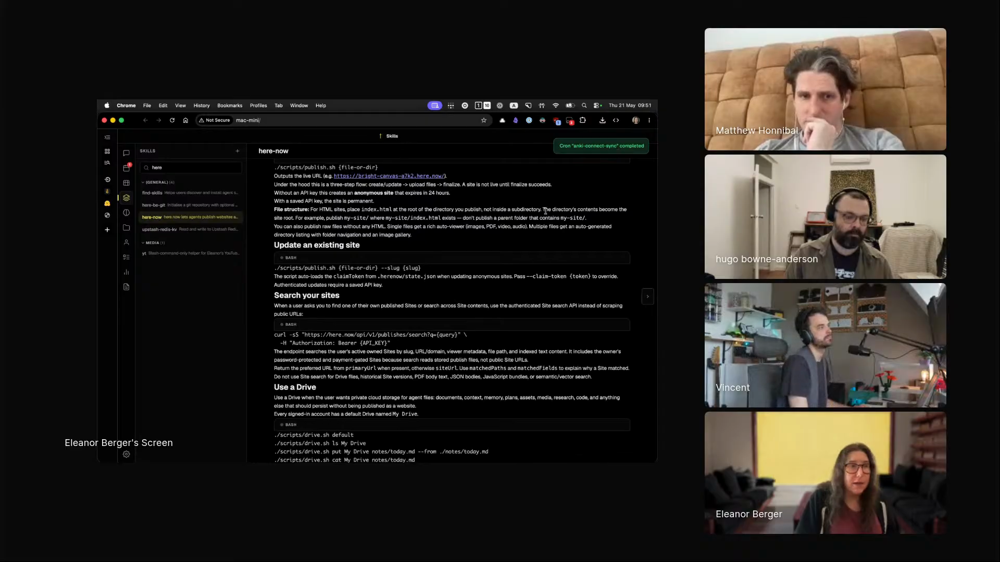

# anki-connect

An agent skill that drives Anki through the AnkiConnect local HTTP API: it turns a request into AnkiConnect actions, runs them with curl and jq, and gates every operation that modifies a note or card behind explicit confirmation.

## who showed it

Eleanor Berger, an AI and software engineering expert and a technical member of staff at Jimini Health, where she works on AI for mental health. She is the creator of agentic ventures, an AI coding and agentic engineering course and community, and was formerly a principal engineering lead at Microsoft and Google.

## what it does

Anki is a spaced-repetition flashcard app. You write cards, and it schedules each one to resurface just before you would forget it, which makes it a long-running workhorse for language learners, medical students, and anyone memorizing for the long term. The catch is upkeep: writing cards, fixing them, reorganizing decks, and reviewing daily is real ongoing work. That upkeep is what this skill hands to an agent.

AnkiConnect is a local HTTP API that a running Anki instance exposes at `127.0.0.1:8765`. The skill maps a user request onto that API: the agent works out which actions to call across decks, notes, cards, models, media, and sync, builds the JSON request, runs it via curl and jq, checks the `error` field on every response, and reports the result back. It carries a full catalog of the AnkiConnect action names so it can translate intent into the right calls.

One rule runs through the whole skill: before anything that adds, updates, deletes, reschedules, or suspends a note or card, the agent asks the user once, with the scope and count spelled out ("Update 125 notes matching query X"). Read-only previews are free; mutations are not.

On the show, Eleanor's framing was lighter. She revises a lot of flashcards every day and now hands that chore to her agent on a schedule:

> *"I'm a little bit, like revising lots of flashcards every day, which is a bit weird. And now I can manage them with my agent and cron jobs for that."* [\[00:49:46\]](https://youtube.com/live/ud2WzkKeDZs?t=2986)

## why it's notable

This is the concrete artifact behind a throwaway line. "Manage them with my agent and cron jobs" sounds casual, but the skill shows what that actually takes: a full mapping of the AnkiConnect action catalog plus a hard confirmation gate, so a cron-scheduled agent never silently mutates a spaced-repetition collection. Anki is exactly the kind of system Eleanor is willing to give an agent: a deterministic domain with an artifact she can observe.

It also sits inside her broader cron pattern, where she under-specifies the schedule and lets the agent decide which parts need an LLM and which can be a plain script:

> *"I create a lot of cron jobs all the time and a lot of them I under-specify, I just say like, no, no, can you please do this like whatever every two hours."* [\[01:00:48\]](https://youtube.com/live/ud2WzkKeDZs?t=3648)

## watch it

- [**00:49:46**](https://youtube.com/live/ud2WzkKeDZs?t=2986): Eleanor hands her daily Anki flashcard review to her agent and cron jobs.
- [**01:00:48**](https://youtube.com/live/ud2WzkKeDZs?t=3648): The cron pattern behind it, under-specified jobs and the agent choosing script versus LLM.

## project and license

The skill is [`anki-connect`](https://github.com/intellectronica/agent-skills/tree/main/skills/anki-connect), from Eleanor's [`intellectronica/agent-skills`](https://github.com/intellectronica/agent-skills) collection. Upstream it is described as a skill "for interacting with Anki through AnkiConnect." It is released under [CC0 1.0 Universal](LICENSE), a public domain dedication (full text in `LICENSE` alongside this folder), so you can run, copy, and adapt it freely. Eleanor both maintains it and demoed it on the show.

## status

Vendored snapshot. The skill files are a frozen copy of [`intellectronica/agent-skills/skills/anki-connect`](https://github.com/intellectronica/agent-skills/tree/main/skills/anki-connect) as of 2026-05-22. The maintained version lives upstream and may have evolved since this snapshot.

Eleanor Berger demos `anki-connect` on Episode 3 of <em>Show Us Your Agent Skills</em>. <a href="https://youtube.com/live/ud2WzkKeDZs?t=2986">[00:49:46]</a>
