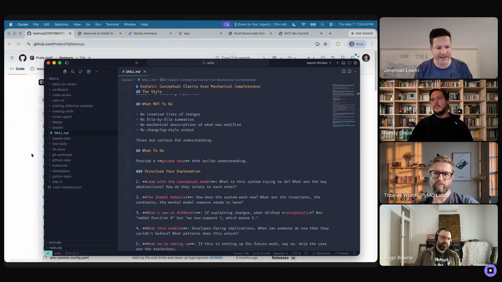

# github-reply

A small skill that shapes the tone of replies to GitHub contributors so
the agent doesn't sandwich a rejection inside a "Great work."

## who showed it

Jeremiah Lowin, founder/CEO of Prefect and core maintainer of FastMCP.

He runs OSS projects that take contributor PRs at volume, and most of
his day-to-day is agent-driven maintenance.

## what it does

Drafts replies on GitHub issues and PRs in Jeremiah's voice.

Concretely, it encodes the small etiquette rules the underlying LLM
keeps getting wrong. The headline one:

> *"Don't say, 'Great work,' followed by a rejection. That's confusing."* [\[00:54:22\]](https://youtube.com/live/Pq3xuChdwxQ?t=3262)

The point isn't impersonation:

> *"It's not because I'm trying to masquerade it as me. I'm usually pretty obvious if I'm using an LLM to draft the reply. It's because I think there's a right way to treat people, and the LLM doesn't do it."* [\[00:54:26\]](https://youtube.com/live/Pq3xuChdwxQ?t=3266)

## why it's notable

It sits inside the broader picture Jeremiah painted of agent-assisted
OSS maintenance.

His pet peeve with off-the-shelf review agents: they treat contributions
as accept-by-default, which is the wrong stance for a framework
maintainer. The agent voice he's mocking: *"If you just do these two things, I will, I will accept it."* [\[00:40:43\]](https://youtube.com/live/Pq3xuChdwxQ?t=2443)

`github-reply` is one of the small, mundane skills that keeps the
agent-driven maintenance loop humane. The agent still drafts the reply,
but it stops doing the thing a human maintainer would never do.

It's also a clean example of his "skills as living documents" idea: a
short file he keeps editing as he notices new tics he doesn't like
[\[00:53:48\]](https://youtube.com/live/Pq3xuChdwxQ?t=3228).

## watch it

- [**00:54:22**](https://youtube.com/live/Pq3xuChdwxQ?t=3262): github-reply, "don't say 'Great work,' followed by a rejection."

## status

The `SKILL.md` here is now the authoritative version, contributed by
Jeremiah from his own setup (replacing the earlier OCR transcription,
which was incomplete and cut off at `### Response Patterns`). The
accompanying `references/examples.md` uses invented cases to illustrate
each response pattern, rather than real reviews.

Jeremiah Lowin demos `github-reply` on Episode 1 of <em>Show Us Your Agent Skills</em>. <a href="https://youtube.com/live/Pq3xuChdwxQ?t=3248">[00:54:08]</a>
