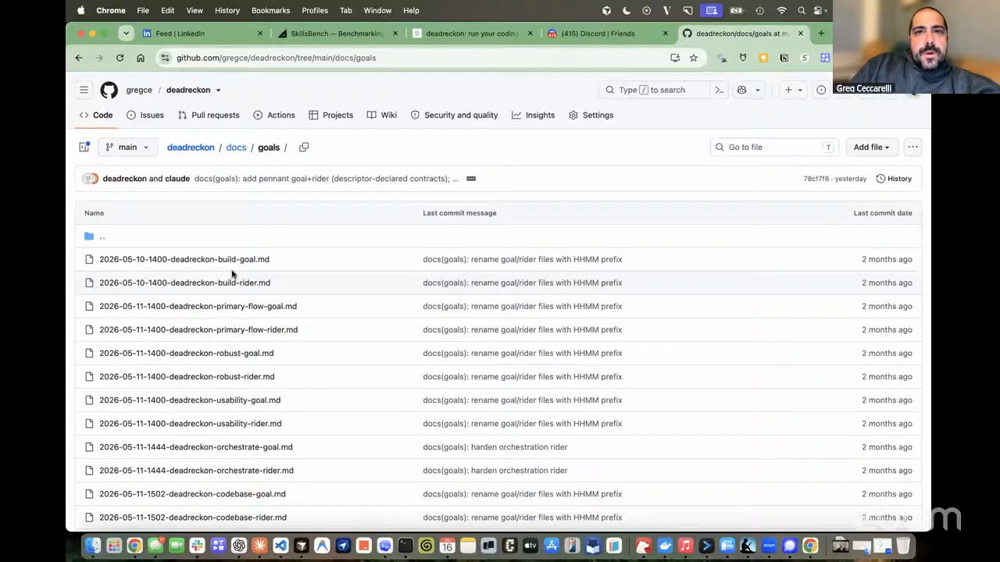

# goal-rider-author

An agent skill for loop engineering that briefs a long-running coding agent with a compact goal, a detailed companion rider, and verifiable conditions for stopping.

## who showed it

[Greg Ceccarelli](https://www.gregceccarelli.com/), co-founder and CPO of [SpecStory](https://specstory.com/).

## what it does

`goal-rider-author` gives an agentic harness enough context and external verification to keep working without repeated human prompts. The harness can run until it satisfies the exit conditions defined before the work begins.

Greg uses **rider** in the addendum sense: a companion document that expands a shorter primary document. The goal is the short spine, covering what to build, what to read first, the operating posture, verification, and stopping conditions. The rider carries the prescriptive detail, including phase plans, schemas, named tests, command signatures, constraints, and out-of-scope work.

The split keeps the agent's primary brief below 4,000 characters while allowing the rider to carry as much implementation detail as the work requires.

Greg published the full pattern and copyable skill in [*Goal Engineering: how I brief coding agents using paired goal+rider documents*](https://www.gregceccarelli.com/goal-engineering).

> *"I got so enamored with goals when they first came out, I created a skill and did a little write-up on what I was calling goal engineering."* [[01:26:13]](https://youtube.com/live/kfCi2EBu-nc?t=5173)

Greg stores each pair in the project's goals directory. The goal points the agent at the rider and the source material it must read. The rider divides the work into phases, names the tests that must fail before implementation, and defines what must pass before the run can stop.

> *"All the reference context is the important bit. It'll break down from this high-level goal a series of phase tasks to execute, and then it won't break the loop until each of these independent verification steps are verified."* [[01:26:55]](https://youtube.com/live/kfCi2EBu-nc?t=5215)

## why it's notable

The goal and rider turn loop engineering into a bounded development practice. The agent chooses implementation details inside a prescriptive execution envelope, while named tests, smoke checks, architecture updates, and stop conditions make completion externally verifiable.

> *"You wanna do a very long unattended run, and you wanna come back, and you wanna know that if it's been running for 20 hours or something, that it's passed what you've predefined as the thing that's gonna allow the harness to break the loop."* [[01:20:27]](https://youtube.com/live/kfCi2EBu-nc?t=4827)

> *"Don't do all the implementation pre-specced and planned. Set a set of criteria that the agent can evaluate with the tools it has access to on your machine or in the cloud, and let it go until it passes your exit criteria."* [[01:33:24]](https://youtube.com/live/kfCi2EBu-nc?t=5604)

## watch it

- [**01:20:27**](https://youtube.com/live/kfCi2EBu-nc?t=4827): Why long unattended runs need predefined conditions that break the loop.
- [**01:26:00**](https://youtube.com/live/kfCi2EBu-nc?t=5160): Greg opens Dead Reckon's directory of paired goal and rider files.
- [**01:26:13**](https://youtube.com/live/kfCi2EBu-nc?t=5173): Greg explains that he turned goal engineering into a skill.
- [**01:26:55**](https://youtube.com/live/kfCi2EBu-nc?t=5215): Reference context, phased tasks, and independent verification steps.
- [**01:33:24**](https://youtube.com/live/kfCi2EBu-nc?t=5604): Define verifiable outcomes and let the agent choose the implementation.

## project and license

The skill is Greg Ceccarelli and SpecStory's published [`goal-rider-author`](https://www.gregceccarelli.com/goal-engineering), described upstream as *"Draft a goal+rider document pair to brief the next agentic turn on a project."* It is licensed under [Apache License 2.0](LICENSE) (full text in `LICENSE` alongside this folder).

## status

Vendored snapshot. The `SKILL.md` here is a frozen copy of Greg's [published skill](https://www.gregceccarelli.com/goal-engineering/skill.md) as of 2026-07-18. The maintained version lives upstream and may have evolved since this snapshot.

Greg Ceccarelli shows Dead Reckon's paired goal and rider files on Episode 7 of <em>Show Us Your Agent Skills</em>. <a href="https://youtube.com/live/kfCi2EBu-nc?t=5175">[01:26:15]</a>
