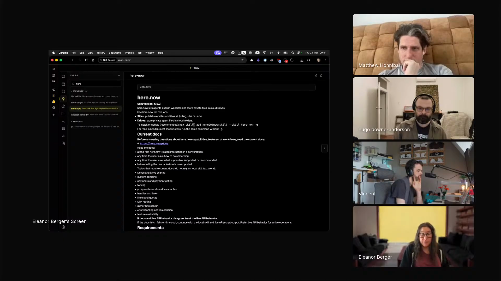

# here-now

A skill, published by the here.now service itself, that lets an agent publish HTML pages, files, and whole sites to live URLs without leaving the terminal, turning "publish this" into a single instruction.

## who showed it

Eleanor Berger, a technical staff member at Jimini Health, where she works on AI for mental health, and the creator of the agentic ventures course and community. She was formerly a principal engineering lead at Microsoft and Google. She generates HTML constantly and runs this skill through her Hermes agent.

## what it does

here.now is a hosting service for HTML, by Eleanor's description like GitHub Gists but for web pages. You hand it a file or a directory and it returns a live URL at `{slug}.here.now`.

> *"it's kind of like gists, but for HTML. And I find that I'm doing a lot of HTML generation these days."* [\[00:45:55\]](https://youtube.com/live/ud2WzkKeDZs?t=2755)

The skill wraps that service for an agent. It bundles two helper scripts, `publish.sh` for sites and `drive.sh` for private cloud storage, alongside the instructions for using them, so the agent can publish a page, update an existing one, or store files in a private Drive on its own. For Eleanor that collapses hosting into one instruction: she used to publish to GitHub Pages by hand, and now she tells the agent to publish and it does.

> *"And so now I just tell it, do a webpage, publish it to here now. Sometimes I won't tell it and it will still publish it there because it knows from my configuration that it's what I expect."* [\[00:49:17\]](https://youtube.com/live/ud2WzkKeDZs?t=2957)

## why it's notable

It is a first-party skill. here.now's way of letting an agent use the service is to publish a skill for it, not to ship an SDK or an API you wire up by hand. The skill carries everything the agent needs: the publish and Drive scripts, the instructions for using them, even the flow for signing a user up and saving an API key. Install it and an agent can put things on the web.

When the integration is that frictionless, publishing stops being a step you think about. Eleanor does it dozens of times a day:

> *"And so I create a lot of HTML pages, like dozens every day, because just every little thing that they do, it's so easy to tell it and do."* [\[00:49:17\]](https://youtube.com/live/ud2WzkKeDZs?t=2957)

## watch it

- [**00:45:55**](https://youtube.com/live/ud2WzkKeDZs?t=2755): Eleanor introduces here.now, like gists but for HTML, and says she generates HTML constantly.
- [**00:46:19**](https://youtube.com/live/ud2WzkKeDZs?t=2779): she has been hand-publishing to GitHub Pages and is glad to hand the job off, *"I have a skill for that, of course."*
- [**00:49:17**](https://youtube.com/live/ud2WzkKeDZs?t=2957): the skill in one line, *"do a webpage, publish it to here now,"* and the agent publishing even when she does not ask.

## project and license

The skill is published by the here.now service itself, in the public repo [heredotnow/skill](https://github.com/heredotnow/skill), which presents it as a way to publish files to the web instantly. The upstream repository declares its license as MIT in its `README.md`. It ships no separate `LICENSE` file, so none is vendored here; the MIT terms are as stated in that [upstream repository](https://github.com/heredotnow/skill). Eleanor demoed the skill on the show as a user of it, not as its author.

## status

Vendored snapshot. The skill files here (`SKILL.md`, `scripts/publish.sh`, `scripts/drive.sh`) are a frozen copy of the `here-now/` bundle in [heredotnow/skill](https://github.com/heredotnow/skill) as of 2026-05-22. The skill notes upstream that it is synced from a private here.now product repo, so the maintained version lives there and may have evolved since this snapshot.

Eleanor Berger demos `here-now` on Episode 3 of <em>Show Us Your Agent Skills</em>. <a href="https://youtube.com/live/ud2WzkKeDZs?t=2957">[00:49:17]</a>
