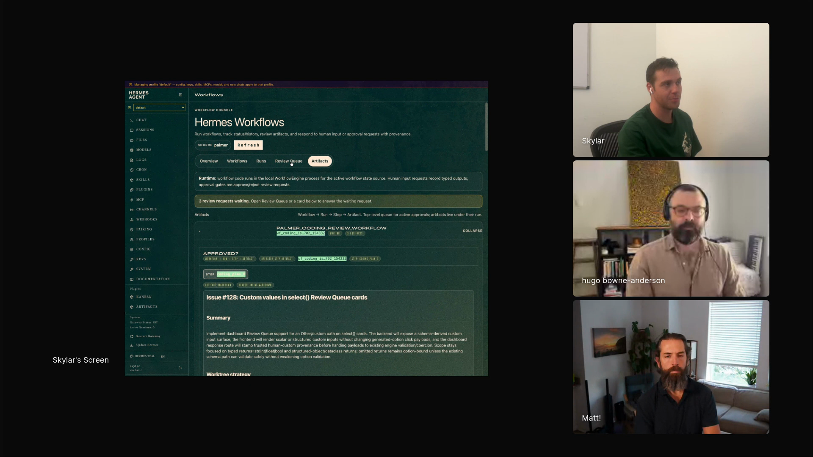

# hermes-workflows-creating

An upstream Hermes skill that tells an agent how to author durable workflow definitions with typed inputs, typed outputs, agent steps, human review gates, artifacts, receipts, and smoke tests.

## who showed it

Skylar Payne is the founder of Wicked Data. In Episode 6, he shows Palmer, his Hermes agent, and the `hermes-workflows` plugin he built so agent work can run through reviewable Python workflows with prompt text no longer carrying the whole process.

## what it does

Hermes is Skylar's always-on personal agent harness. `hermes-workflows-creating` is the authoring skill for Skylar's workflow plugin: it tells the agent how to design a workflow definition with `@workflow`, typed dataclass inputs and outputs, `agent(...)` steps for judgment-heavy work, `bash(...)` steps for deterministic receipts, `ask(...)` gates for human decisions, and `parallel(...)` or `pipeline(...)` for composed work.

Skylar's demo shows why the skill exists. Prompts and skills can say what should happen, but the agent still decides what actually happens inside the current context.

> *"One of the problems is that prompts and skills are effectively suggestions. At the end of the day, it's the agent is mediating what actually happens."* [\[01:03:48\]](https://youtube.com/live/UwAGIkWFQ78?t=3828)

The workflow plugin moves repeated procedures into code. In the content-writing demo, Palmer researches a topic, saves the research as an artifact, proposes possible angles, asks Skylar to choose one, and continues from that human decision.

> *"The sort of like agentic interface here is really just code. And so the agent just writes Python code."* [\[01:05:55\]](https://youtube.com/live/UwAGIkWFQ78?t=3955)

## why it's notable

This is the actual public skill file from Skylar's `hermes-workflows` repo. It captures the authoring rules behind the workflow demo: keep workflow bodies intention-level, make human decisions typed, put artifacts inline in the review queue, add gates before external effects, and record receipts so the run can be inspected later.

The distinctive primitive is `ask(...)`, which makes human decisions a typed part of the workflow contract.

> *"Sometimes I don't want to ask the agent, I want to ask a human to give me the same structured output."* [\[01:07:28\]](https://youtube.com/live/UwAGIkWFQ78?t=4048)

Skylar spends most of his time in the review queue because that is where those human checkpoints collect.

> *"Where I spend most of my time is this review queue. Because this is the stuff where the workflow said, like, hey, ask a human something."* [\[01:08:50\]](https://youtube.com/live/UwAGIkWFQ78?t=4130)

## watch it

- [**01:03:48**](https://youtube.com/live/UwAGIkWFQ78?t=3828): Skylar explains why prompts and skills do not guarantee procedural execution.
- [**01:04:49**](https://youtube.com/live/UwAGIkWFQ78?t=3889): He introduces `hermes-workflows` as an open source Hermes plugin.
- [**01:05:55**](https://youtube.com/live/UwAGIkWFQ78?t=3955): The workflow authoring interface is Python code.
- [**01:07:28**](https://youtube.com/live/UwAGIkWFQ78?t=4048): `ask(...)` becomes the human counterpart to `agent(...)`.
- [**01:08:50**](https://youtube.com/live/UwAGIkWFQ78?t=4130): The review queue becomes the human operating surface.

## project and license

The skill is [`skylarbpayne/hermes-workflows`](https://github.com/skylarbpayne/hermes-workflows), described upstream as *"Code-first durable workflows for agent work, Review Queues, Workflow Workers, and receipts."* It is licensed under [Apache License 2.0](LICENSE) (full text in `LICENSE` alongside this folder). Skylar demoed it on the show; the maintainer is Skylar Payne.

## status

Vendored snapshot. `SKILL.md` is a frozen copy of [`hermes-workflows-creating/SKILL.md`](https://github.com/skylarbpayne/hermes-workflows/blob/main/src/hermes_workflows/plugin_skills/hermes-workflows-creating/SKILL.md) as of 2026-07-03, with a local attribution header added. The maintained version lives upstream and may have evolved since this snapshot.

To use it in Claude Code, copy this folder into `.claude/skills/hermes-workflows-creating/` (project) or `~/.claude/skills/hermes-workflows-creating/` (user). For other harnesses, see your harness's docs for the expected skills directory.

Skylar Payne shows the Hermes workflow review queue on Episode 6 of <em>Show Us Your Agent Skills</em>. <a href="https://youtube.com/live/UwAGIkWFQ78?t=4130">[01:08:50]</a>
