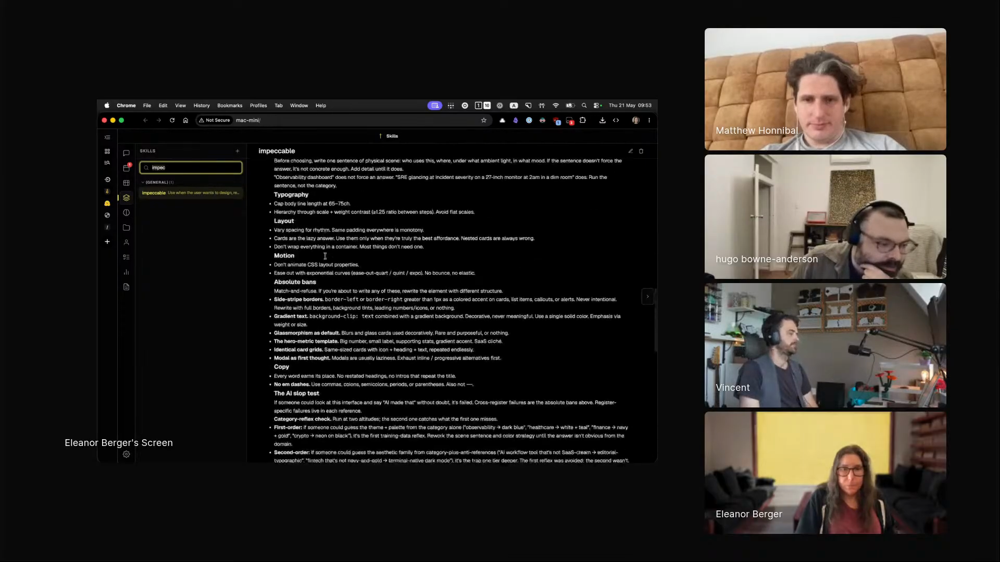

# impeccable

An agent skill that hands a coding agent a full frontend design language: register detection, explicit color, typography, layout and motion laws, an anti-AI-slop discipline, and 23 design sub-commands, so it builds and iterates production-grade interfaces instead of generic ones.

## who showed it

Eleanor Berger is a technical member of staff at Jimini Health, where she recently started working on AI for mental health, and the creator of Agentic Ventures, an AI coding and agentic engineering course and community. She was formerly a principal engineering lead at Microsoft and Google.

## what it does

Eleanor's segment was about a "YOLO" shift in how she works with agents: letting them roam freely within guardrails. Design is the part she cannot do herself, so she delegates it wholesale.

> *"I know absolutely nothing about design. But now thanks to various skills, I can actually do things that look not too bad. The one I use a lot is impeccable."* [\[00:50:17\]](https://youtube.com/live/ud2WzkKeDZs?t=3017)

Impeccable is a large skill. Its `SKILL.md` sets up a per-project design context (a `PRODUCT.md` and optional `DESIGN.md`), classifies the task as either brand or product register, applies a shared set of design laws (OKLCH color strategy, typographic hierarchy, layout rhythm, motion easing, a list of absolute bans, an "AI slop test"), and routes to one of 23 sub-commands such as `craft`, `shape`, `critique`, `audit`, `polish`, and `live`. Each sub-command has its own reference file. Eleanor's description on stream:

> *"Impeccable is huge. If you look at their skill, they have all these things here, like how to optimize. And it's quite an elaborate process where it will sort of set up the design guidelines and then follow them iteratively. But I don't actually know anything about how that's done. I just benefit from the fact that someone developed it."* [\[00:51:27\]](https://youtube.com/live/ud2WzkKeDZs?t=3087)

## why it's notable

The skill is a clean illustration of delegating one half of a task while keeping the other. Eleanor cannot instruct an agent on design, but she can judge the result. The skill carries the instruction half; she keeps the evaluation half.

> *"I look at it like I'm the main, the main customer."* [\[00:52:09\]](https://youtube.com/live/ud2WzkKeDZs?t=3129)

> *"If I look at it and it's it's legible to me, it looks nice to interact with. I'm good with that. It's just I wouldn't know how to instruct an agent how to do it."* [\[00:52:20\]](https://youtube.com/live/ud2WzkKeDZs?t=3140)

It is also a strong reference for what a deeply developed, published skill looks like: an explicit design language, 36 reference files, a documented anti-pattern discipline, and a sub-command router, all in one folder.

## watch it

- [**00:50:02**](https://youtube.com/live/ud2WzkKeDZs?t=3002): Eleanor introduces Impeccable. *"I really love Impeccable. I don't know if people know it already. It's a nice skill for design."*
- [**00:50:17**](https://youtube.com/live/ud2WzkKeDZs?t=3017): Why she reaches for it. *"I'm terrible at design."*
- [**00:51:27**](https://youtube.com/live/ud2WzkKeDZs?t=3087): Scrolling through the skill on screen. How it sets up design guidelines and follows them iteratively.
- [**00:52:09**](https://youtube.com/live/ud2WzkKeDZs?t=3129): How she evaluates a design without knowing design. *"I look at it like I'm the main customer."*

## project and license

The skill is [`pbakaus/impeccable`](https://github.com/pbakaus/impeccable), described upstream as *"The design language that makes your AI harness better at design."* It is licensed under [Apache License 2.0](LICENSE) (full text in `LICENSE` alongside this folder). Eleanor recommended it on the show; the maintainer is Paul Bakaus.

Impeccable itself builds on Anthropic's original `frontend-design` skill, also Apache 2.0. That attribution, and a further one for typography material merged from `ehmo/typecraft-guide-skill`, is recorded in [`NOTICE.md`](NOTICE.md), vendored here alongside the `LICENSE`.

## status

Vendored snapshot. The skill files (`SKILL.md`, `reference/`, `scripts/`, `agents/`) are a frozen copy of [`pbakaus/impeccable/.agents/skills/impeccable`](https://github.com/pbakaus/impeccable/tree/main/.agents/skills/impeccable) as of 2026-05-22. The maintained version lives upstream and may have evolved since this snapshot.

To use it in Claude Code: copy this folder into `.claude/skills/impeccable/` (project) or `~/.claude/skills/impeccable/` (user). For other harnesses, see your harness's docs for the expected skills directory.

Eleanor Berger demos `impeccable` on Episode 3 of <em>Show Us Your Agent Skills</em>. <a href="https://youtube.com/live/ud2WzkKeDZs?t=3087">[00:51:27]</a>
