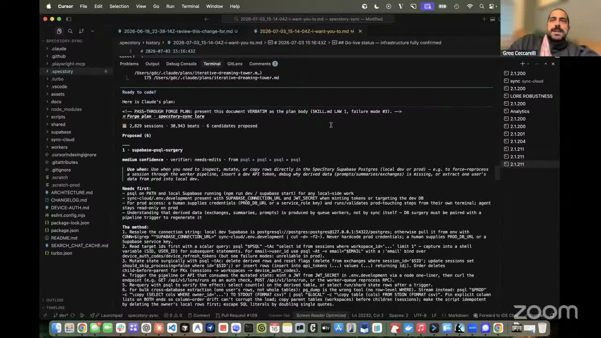

# lore

Lore treats the history left by your coding agents as accumulated working knowledge, then mines it for repeated practices and turns only the patterns you approve into reusable skills.

## who showed it

[Greg Ceccarelli](https://www.gregceccarelli.com/), co-founder and CPO of [SpecStory](https://specstory.com/).

## what it does

Lore means the accumulated knowledge and stories of a person or community. Here, your saved agent sessions are your lore: a record of commands, corrections, decisions, preferences, and verification habits.

SpecStory captures coding sessions from Claude Code, Codex, Cursor, Gemini, and other agent harnesses. Lore parses those sessions into **beats**: a user prompt, the agent's response and actions, and the next user prompt. That final prompt helps distinguish an accepted result from work the user corrected, redirected, or rejected.

> *"That's a beat instead of just a user prompt, agent response, because what it tries to do is see, did you actually accept what came out of the response from your prior prompt and label it."* [[00:20:35]](https://youtube.com/live/kfCi2EBu-nc?t=1235)

Its deterministic engine handles parsing, retrieval, and counting across large session histories. A model then helps identify themes, corroborate recurring practices across sessions and projects, and prepare evidence-backed candidate dossiers. The user reviews those dossiers and chooses which candidates Lore should forge into installed `SKILL.md` packages.

> *"What this skill that's called Lore does is look at all of that fantastic exhaust, and then it has an engine, part deterministic and part based on your local model, to pull out those patterns."* [[00:07:30]](https://youtube.com/live/kfCi2EBu-nc?t=450)

## why it's notable

Lore turns work the user has already done into evidence for future agent behavior. It does not ask a model to infer durable practices from a single session or ingest an entire unfiltered archive at once. The deterministic mining step narrows the corpus, the candidate dossiers show the supporting evidence, and the next-prompt signal helps expose whether an apparent pattern produced an accepted outcome.

The final boundary is human approval. Lore can present, revise, or reject candidates without installing them.

> *"It presents stuff for your review. It will never install anything unless you actually approve it."* [[00:34:00]](https://youtube.com/live/kfCi2EBu-nc?t=2040)

## install it

Lore requires Node.js 22.5 or later. Install the maintained upstream skill with:

```bash
npx skills add specstoryai/getspecstory --skill lore
```

## watch it

- [**00:07:30**](https://youtube.com/live/kfCi2EBu-nc?t=450): Greg explains how Lore mines coding-session exhaust into reusable skills.
- [**00:20:35**](https://youtube.com/live/kfCi2EBu-nc?t=1235): A beat includes the next user prompt so Lore can look for an outcome signal.
- [**00:30:16**](https://youtube.com/live/kfCi2EBu-nc?t=1816): The corroboration engine reduces thousands of sessions to a short candidate list.
- [**00:30:44**](https://youtube.com/live/kfCi2EBu-nc?t=1844): Lore corroborates practices across the full corpus and across projects.
- [**00:34:00**](https://youtube.com/live/kfCi2EBu-nc?t=2040): Candidate dossiers remain behind an explicit approval gate.

## project and license

The skill is [`specstoryai/getspecstory/lore`](https://github.com/specstoryai/getspecstory/tree/dev/lore), described upstream as *"SpecStory Lore - mine your coding histories into a corpus; forge your workflows into skills."* It is licensed under [Apache License 2.0](LICENSE) (full text in `LICENSE` alongside this folder). Greg Ceccarelli demoed it on the show and maintains it with SpecStory.

## status

Vendored snapshot. The skill files are a frozen copy of [`specstoryai/getspecstory/lore`](https://github.com/specstoryai/getspecstory/tree/dev/lore) as of 2026-07-18. The maintained version lives upstream and may have evolved since this snapshot.

<a href="https://youtube.com/live/kfCi2EBu-nc?t=1827"></a>
<sub>Greg Ceccarelli shows Lore's evidence-backed skill candidates on Episode 7 of <em>Show Us Your Agent Skills</em>. <a href="https://youtube.com/live/kfCi2EBu-nc?t=1827">[00:30:27]</a></sub>
