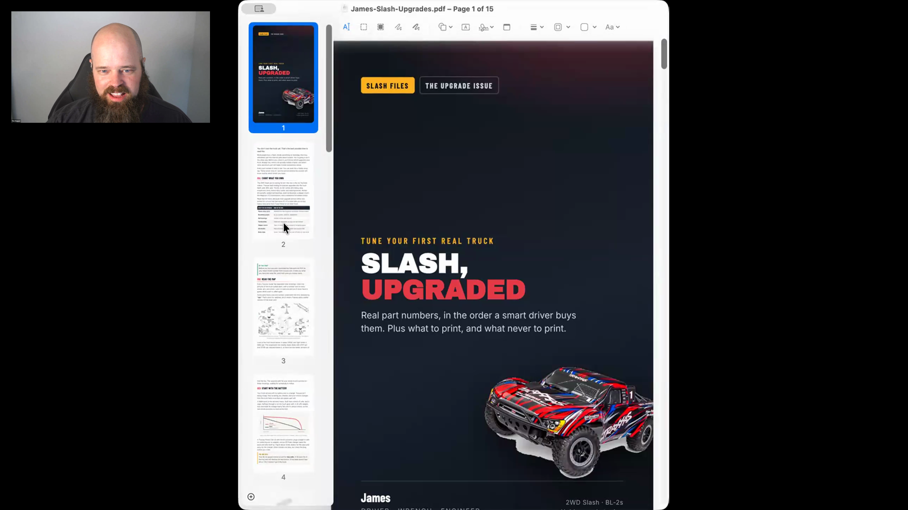

# magazine-explainer

An agent skill that researches a topic and turns it into an illustrated magazine for a particular reader, with a screen-ready PDF and a booklet that can be printed on an ordinary printer.

## who showed it

[Tim Hopper](https://tdhopper.com/) is a machine learning platform engineer and Python developer. He built the skill to make short magazines for his children.

## what it does

Tim can begin with a loose request, such as a magazine for his eight-year-old about upgrading a high-end remote-control car. The agent researches the subject, finds pictures, writes and lays out the issue, then produces both a screen version and a foldable booklet.

> *"I have a skill where I can actually put in a really vague prompt, and it goes out and finds pictures, and does the research, and compiles it all together here."* [[00:12:42]](https://youtube.com/live/NH-ic7-V-jY?t=762)

> *"It generates another one that you can print in just, like, a bi-fold little booklet on just a normal printer."* [[00:12:55]](https://youtube.com/live/NH-ic7-V-jY?t=775)

## why it's notable

Tim did not start by trying to specify a general magazine system. He worked with Claude Code until it produced an issue he liked, then captured that successful process as a repeatable skill.

> *"When we finally got to one that I liked, we made it reproducible, essentially, by encoding it as a skill."* [[00:14:25]](https://youtube.com/live/NH-ic7-V-jY?t=865)

The included `SKILL.md` is Tim's working version. It carries the research, writing, layout, rendering, booklet, and printing process he developed by making magazines for his children.

## watch it

- [**00:12:19**](https://youtube.com/live/NH-ic7-V-jY?t=739): Tim introduces the printable magazines he makes for his children.
- [**00:12:42**](https://youtube.com/live/NH-ic7-V-jY?t=762): A vague prompt becomes a researched and illustrated issue.
- [**00:12:55**](https://youtube.com/live/NH-ic7-V-jY?t=775): The skill also makes a booklet for an ordinary printer.
- [**00:14:11**](https://youtube.com/live/NH-ic7-V-jY?t=851): Tim agrees that sharing the shape is more useful than copying a personal skill.
- [**00:14:25**](https://youtube.com/live/NH-ic7-V-jY?t=865): A successful iteration becomes reproducible.

## source

Tim publishes [`magazine-explainer`](https://github.com/tdhopper/dotfiles2.0/tree/8318f30b82fd147ec11a5bb02dd6755bb13434a6/.claude/skills/magazine-explainer) in his dotfiles. This folder carries the version from commit [`8318f30`](https://github.com/tdhopper/dotfiles2.0/commit/8318f30b82fd147ec11a5bb02dd6755bb13434a6), including the HTML template, design and prose references, evals, and rendering and printing scripts.

## status

Ported from Tim's working files. The skill includes `SKILL.md`, the HTML template, design and prose references, evals, and rendering and printing scripts.

Tim shows the remote-control-car magazine generated for his son. <a href="https://youtube.com/live/NH-ic7-V-jY?t=762">[00:12:42]</a>
