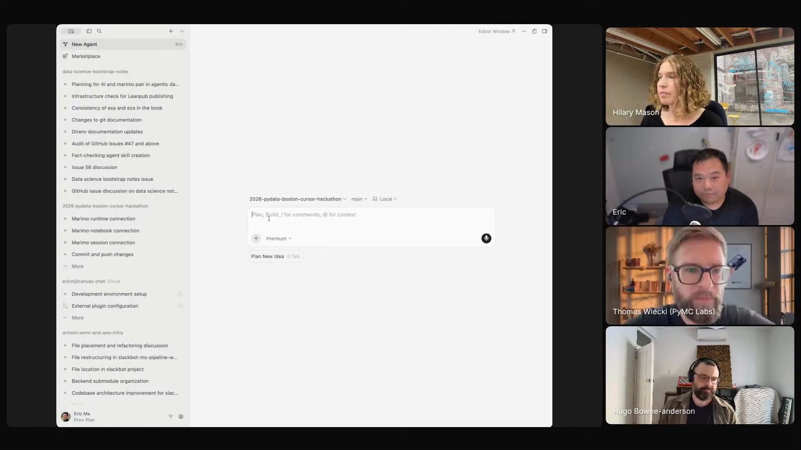

# marimo-pair

An agent skill that pairs markdown instructions with a bash bridge into a reactive Marimo notebook, so a coding agent can drive interactive exploratory data analysis end-to-end while the human steers one plot at a time.

## who showed it

Eric Ma leads research data science and AI at Moderna Therapeutics, where he applies Bayesian methods and AI agents to molecular biology and protein engineering. Early PyMC contributor.

## what it does

Marimo Pair is the centrepiece of Eric's agentic data analysis stack. The architecture, in his own words:

> *"The way Marimo Pair works is it's actually an agent skill that has both a series of markdown files, plus it also has a bash script that is used by the coding agent to reach directly into the Python runtime, into the Python kernel directly. And so that gets really, really cool, that you can do really cool things by interactively, right? It becomes more like a canvas that you actually directly manipulate."* [\[00:16:07\]](https://youtube.com/live/l37PR-OkYKA?t=967)

The bash bridge is what separates this from "ask the agent to write a notebook for me." The agent writes a cell, executes it in the kernel, sees the result, and writes the next cell, all without context-switching back to the human.

The skill respects rules Eric sets in his agent markdown file: literate markdown cells interleaved between code, unique descriptive cell names so he can refer to them mid-collaboration.

On stream, Eric ran a full protein engineering analysis inside it: Plotly heatmaps of single-point mutations, scatter plots of activity versus chirality, line plots of positional effects, and a 3D protein structure viewer built with AnyWidget. He drove the whole thing conversationally and corrected the agent mid-run (for example, fixing a colormap that should have been divergent rather than sequential).

> *"This is all driven by an agent skill, and this is one of many skills that I've used... this one has been mind-blowing for me in the most recent time."* [\[00:37:18\]](https://youtube.com/live/l37PR-OkYKA?t=2238)

## why it's notable

Eric's stance is that exploratory data analysis cannot be delegated:

> *"I don't go into the analysis with a vague question and just ask the agent to do it all for me. That, I think, is irresponsible as a data scientist. Instead, what I'm doing is I'm going in and I'm taking control of the direction that I want to take the analysis in. So the human is very much in the loop."* [\[00:23:27\]](https://youtube.com/live/l37PR-OkYKA?t=1407)

Marimo Pair is the skill that makes "human-in-the-loop EDA via agent" actually fluid. Because Marimo is reactive, cells never go stale the way Jupyter cells can. Because of the bash bridge, the agent does not just generate code, it executes and observes. Because of the markdown layer, the resulting notebook reads as a literate document, not a transcript.

It is the spine of Eric's teaching too: he experimented with UV runnable scripts for plotting in February, switched to Marimo Pair in March, and by April had rewritten his ODSC workshop around it.

## watch it

- [**00:11:57**](https://youtube.com/live/l37PR-OkYKA?t=717): Demo opens.
- [**00:16:07**](https://youtube.com/live/l37PR-OkYKA?t=967): How Marimo Pair works under the hood. Markdown plus a bash bridge into the Python kernel.
- [**00:23:27**](https://youtube.com/live/l37PR-OkYKA?t=1407): Why EDA cannot be delegated. The agent as pair programmer, human in the loop.
- [**00:31:14**](https://youtube.com/live/l37PR-OkYKA?t=1874): Custom 3D protein structure viewer built via AnyWidget from inside Marimo Pair.
- [**00:37:18**](https://youtube.com/live/l37PR-OkYKA?t=2238): Closing frame. "This is all driven by an agent skill... mind-blowing for me in the most recent time."

## project and license

The skill is [`marimo-team/marimo-pair`](https://github.com/marimo-team/marimo-pair), described upstream as *"Drop agents inside running marimo notebook sessions."* It is licensed under [Apache License 2.0](LICENSE) (full text in `LICENSE` alongside this folder). Eric demoed it on the show; the maintainer is the marimo team.

## status

Vendored snapshot. The skill files (`SKILL.md`, `scripts/`, `reference/`) are a frozen copy of [`marimo-team/marimo-pair/skills/marimo-pair`](https://github.com/marimo-team/marimo-pair/tree/main/skills/marimo-pair) as of 2026-05-18. The maintained version lives upstream and may have evolved since this snapshot.

To use it in Claude Code: copy this folder into `.claude/skills/marimo-pair/` (project) or `~/.claude/skills/marimo-pair/` (user). For other harnesses, see your harness's docs for the expected skills directory.

Eric Ma opens his `marimo-pair` demo on Episode 2 of <em>Show Us Your Agent Skills</em>. <a href="https://youtube.com/live/l37PR-OkYKA?t=717">[00:11:57]</a>
