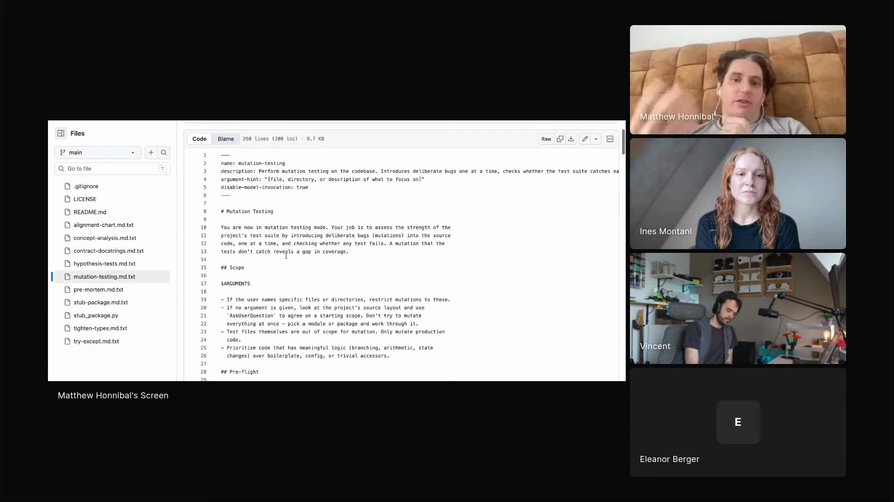

# mutation-testing

An agent skill that measures how strong a test suite really is: it introduces deliberate bugs into the source one at a time, checks whether any test catches each one, and reports the gaps where a mutation slipped through unnoticed.

## who showed it

Matthew Honnibal, computational linguist and co-founder of Explosion, co-author of the spaCy NLP library. He works from Berlin. `mutation-testing` is one of a small set of single-pass code-review skills he showed on the episode, each shipped as a raw `.md.txt` file so you read the source before installing.

## what it does

Matt described the skill in one line:

> *"This skill, for instance, is about asking it to, you know, look at the code and try to introduce problems and then see whether the current tests catch them."* [\[00:15:00\]](https://youtube.com/live/ud2WzkKeDZs?t=900)

It runs a strict apply-test-revert loop against a clean git tree. For each file in scope, the agent picks a handful of mutations from a catalogue (delete a side effect, negate a condition, change a boundary, hardcode a return value, delete a guard clause, swap an operator, modify a default, swap argument order), applies one, runs the test suite, and records whether the mutation was killed (a test failed) or survived (a gap). Every mutation is reverted before the next. The output is a mutation score, a list of survived mutations with the behaviour they leave untested, and an offer to write the missing tests.

## why it's notable

`try-except` and `pre-mortem` audit the code. `mutation-testing` audits the tests: it is the one that asks whether the suite is actually strong enough to catch a bug if one were introduced. That matters because Matt's central worry about agent-written code is reward hacking, agents are rewarded for shortcuts that pass a weak test suite or an LLM judge. A suite that survives mutation testing is one those shortcuts cannot slip through.

It is also one of Matt's "nibble" passes. Rather than asking the agent to get everything right in a single large request, he runs several small, single-purpose operations over the code:

> *"I don't think it's realistic to get it to do everything right the first time. Fundamentally, reasoning isn't free. You can't expect the model to know everything that it knows all up front."* [\[00:14:25\]](https://youtube.com/live/ud2WzkKeDZs?t=865)

## watch it

- [**00:14:10**](https://youtube.com/live/ud2WzkKeDZs?t=850): Bite versus nibble. Why Matt runs several small, focused passes over code instead of one big request.
- [**00:15:00**](https://youtube.com/live/ud2WzkKeDZs?t=900): He describes the `mutation-testing` skill, introduce problems, see whether the current tests catch them.
- [**00:16:24**](https://youtube.com/live/ud2WzkKeDZs?t=984): Reward hacking. Why agents are rewarded for shortcuts that pass weak tests, the failure a strong suite has to resist.

## project and license

The skill is [`honnibal/claude-skills`](https://github.com/honnibal/claude-skills), described upstream as *"Claude skills I'm experimenting with. Please review carefully before use."* It is licensed under [MIT License](LICENSE) (full text in `LICENSE` alongside this folder). Matt demoed it on the show; the maintainer is Matthew Honnibal.

## status

Vendored snapshot. The skill file is a frozen copy of [`honnibal/claude-skills/mutation-testing.md.txt`](https://github.com/honnibal/claude-skills/blob/main/mutation-testing.md.txt) as of 2026-05-22. The maintained version lives upstream and may have evolved since this snapshot.

To use it in Claude Code: copy this folder into `.claude/skills/mutation-testing/` (project) or `~/.claude/skills/mutation-testing/` (user). For other harnesses, see your harness's docs for the expected skills directory.

Matthew Honnibal demos `mutation-testing` on Episode 3 of <em>Show Us Your Agent Skills</em>. <a href="https://youtube.com/live/ud2WzkKeDZs?t=900">[00:15:00]</a>
