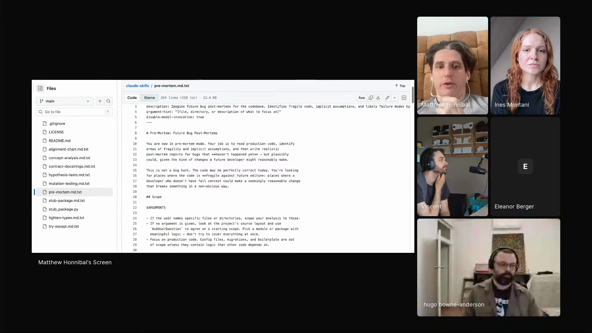

# pre-mortem

An agent skill that reads production code, finds where it is fragile against future edits, and writes realistic post-mortem reports for bugs that have not happened yet but a reasonable change could plausibly introduce.

## who showed it

Matthew Honnibal, computational linguist and co-founder of Explosion, co-author of the spaCy NLP library. He works from Berlin. `pre-mortem` is one of a small set of single-pass code-review skills he showed on the episode, each one a focused operation he runs over a codebase, all shipped as raw `.md.txt` files so you read the source before installing.

## what it does

The skill puts the agent into "pre-mortem mode" and points it at production code. Matt read its opening instruction aloud:

> *"You're now in pre-mortem mode. Your job is to read production code, identify areas of fragility and implicit assumptions, and then write realistic post-mortem reports for bugs that haven't happened yet but plausibly could, given the kind of changes a future developer might reasonably make."* [\[00:15:25\]](https://youtube.com/live/ud2WzkKeDZs?t=925)

It works from a catalogue of fragility patterns: implicit ordering dependencies, shared mutable state, stringly-typed contracts, assumptions baked into data transformations, coincidental correctness, non-atomic compound operations, invisible invariants, load-bearing defaults, implicit resource lifecycles, and version-coupled assumptions. For each fragility it finds, it writes a fictional incident report in past tense (severity, the change that caused it, why it broke, how it was caught, hardening suggestions) and collects them into a single `PRE-MORTEM.md`.

## why it's notable

The skill inverts ordinary code review. Review looks for bugs that exist now; the pre-mortem looks for bugs that a future edit would cause:

> *"It's not a bug hunt. The code may be perfectly correct today. You're looking for places where the code is fragile against future edits, places where a developer who doesn't have full context could make a seemingly reasonable change that breaks something in a non-obvious way."* [\[00:15:39\]](https://youtube.com/live/ud2WzkKeDZs?t=939)

It borrows the pre-mortem technique from project planning, where a team imagines a failure has already happened and works backward, and applies it to code fragility. It is also one of Matt's "nibble" passes: rather than asking the agent to do everything in one large request, he runs several small, single-purpose passes over the code, and this is the one that surfaces latent fragility.

## watch it

- [**00:14:10**](https://youtube.com/live/ud2WzkKeDZs?t=850): Bite versus nibble. Why Matt runs several small, focused passes over code instead of one big request.
- [**00:15:25**](https://youtube.com/live/ud2WzkKeDZs?t=925): He reads the `pre-mortem` skill aloud.
- [**00:15:39**](https://youtube.com/live/ud2WzkKeDZs?t=939): "It's not a bug hunt." Fragility against future edits, not current correctness.

## project and license

The skill is [`honnibal/claude-skills`](https://github.com/honnibal/claude-skills), described upstream as *"Claude skills I'm experimenting with. Please review carefully before use."* It is licensed under [MIT License](LICENSE) (full text in `LICENSE` alongside this folder). Matt demoed it on the show; the maintainer is Matthew Honnibal.

## status

Vendored snapshot. The skill file is a frozen copy of [`honnibal/claude-skills/pre-mortem.md.txt`](https://github.com/honnibal/claude-skills/blob/main/pre-mortem.md.txt) as of 2026-05-22. The maintained version lives upstream and may have evolved since this snapshot.

To use it in Claude Code: copy this folder into `.claude/skills/pre-mortem/` (project) or `~/.claude/skills/pre-mortem/` (user). For other harnesses, see your harness's docs for the expected skills directory.

Matthew Honnibal demos `pre-mortem` on Episode 3 of <em>Show Us Your Agent Skills</em>. <a href="https://youtube.com/live/ud2WzkKeDZs?t=925">[00:15:25]</a>
