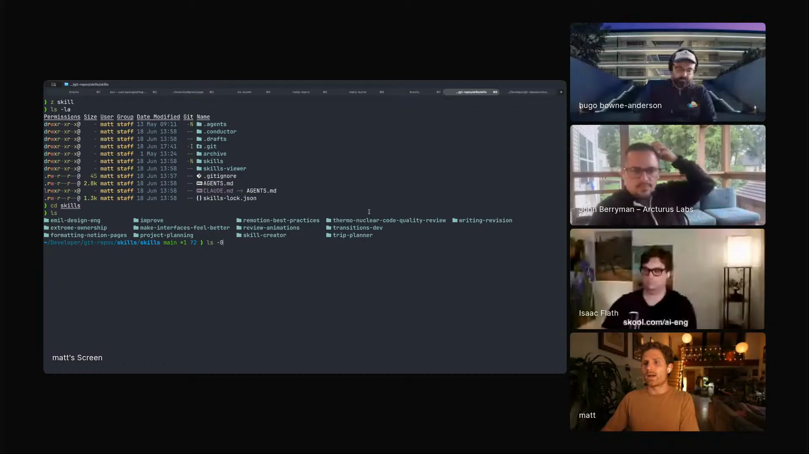

# project-planning

Matt Palmer's private project-planning skill, shown as part of his portable skills library and now ported from the files he shared after the episode.

## who showed it

Matt Palmer leads developer experience at Conductor. He showed this skill as part of the private skill library he installs into projects when he wants a skill available locally.

## what it does

The episode shows `project-planning` as one of Matt's private skill folders, alongside `formatting-notion-pages` and `writing-revision`. The ported skill turns a fresh project idea into an MVP-first plan, researches frameworks and libraries with subagents, and favors official scaffolds, Bun, shadcn/ui, and prebuilt solutions over custom complexity.

The surrounding workflow matters: Matt treats skills as portable project tools. He keeps them in a private GitHub repo, installs them per project, and avoids making every skill global.

> *"this is a private GitHub repo, but I can actually install this via skills.sh into any directory."* [\[01:38:45\]](https://youtube.com/live/6zju7hyCFl0?t=5925)

## why it's notable

`project-planning` belongs to the same pattern as Matt's other personal skills: skills are most useful when they are versioned, improved, and installed where they are actually needed.

> *"the best skills are the ones you use, the best skills are the ones you improve"* [\[01:37:51\]](https://youtube.com/live/6zju7hyCFl0?t=5871)

The value here is that the repo now carries the actual project-planning procedure from Matt's private library, including the reference file the skill tells agents to read before planning.

## watch it

- [**01:37:51**](https://youtube.com/live/6zju7hyCFl0?t=5871): Matt explains that the best skills are the ones you use and improve.
- [**01:38:45**](https://youtube.com/live/6zju7hyCFl0?t=5925): He explains his private GitHub skills repo and `skills.sh` setup.
- [**01:40:38**](https://youtube.com/live/6zju7hyCFl0?t=6038): He switches back to the terminal so the audience can see the skill library flow.

## status

Ported from the files Matt shared after the episode. The skill includes `SKILL.md` plus `references/project-planning.md`.

Matt shows the private skills workflow that includes `project-planning`. <a href="https://youtube.com/live/6zju7hyCFl0?t=6086">[01:41:26]</a>
