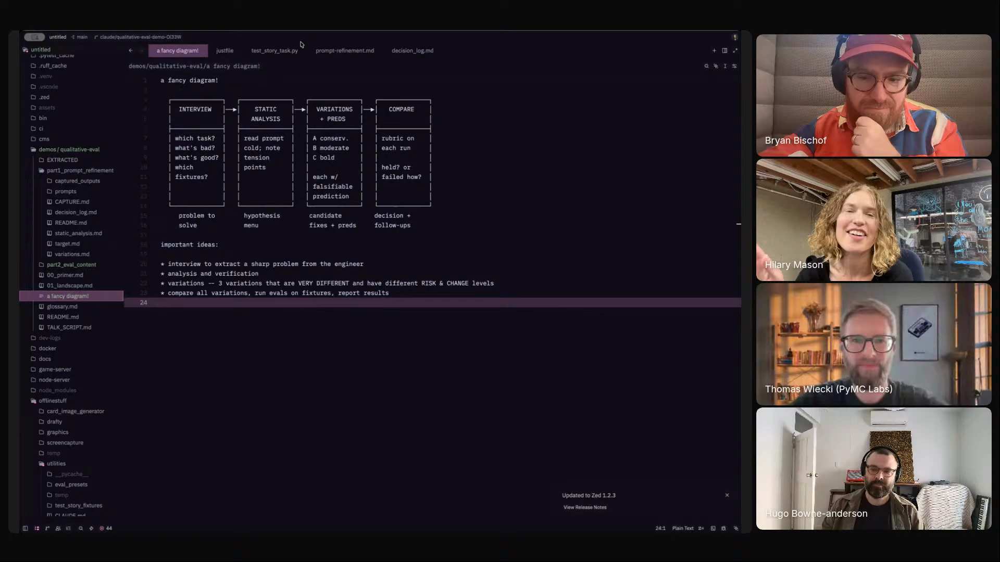

# prompt-refinement

A skill that lifts the agentic-software refinement loop (interview, baseline, variations, eval) into prompt refinement, so the agent stops returning one slightly different version and instead drives toward what you actually want.

## who showed it

Hilary Mason, CEO and co-founder of Hidden Door, an AI-powered interactive storytelling platform where players co-create scenes with AI characters. Previously founded Fast Forward Labs (acquired by Cloudera) and was chief scientist at Bitly.

## what it does

The skill is the engine inside Hidden Door's editorial monitoring pipeline. A Justfile-invoked Python script (their test story task) calls the skill to score scenes against an editorial rubric. Hilary had Claude pull a generic version of the skill out of Hidden Door's context, so it can refine any prompt.

The loop it encodes, in her words.

Interview first, do not take the brief at face value:

> *"first interview the person doing the work. What do they actually want? And this is not trust them when they say something. It is ask questions to come at it from five different directions."* [\[01:01:00\]](https://youtube.com/live/l37PR-OkYKA?t=3660)

Variations, not a single rewrite:

> *"if you ask it at once to give you three very different versions that have different magnitudes of change and risk in the changes, you can actually get multiple variations that are somewhat more creative than if you ask for just one."* [\[01:02:23\]](https://youtube.com/live/l37PR-OkYKA?t=3743)

Score against a rubric you defined before you started, then compare to the baseline:

> *"here is a set of criteria that we are looking for editorially. Compare each output against this set of criteria, score it, run multiple variations, and therefore we get to something that is not going to give you an independent sense of 'this is great,' but it will give you something you can compare to that eval we did at the beginning of the whole process so that you know you have made something better or you have made something worse."* [\[01:03:16\]](https://youtube.com/live/l37PR-OkYKA?t=3796)

The shareable artifact:

> *"it calls this skill. And you said there's a repo we can throw examples in, and I also had Claude sort of pull it out of our context, so anyone could use those for prompt refinement. Though it lost a lot of its personality, so I'll have to go back and edit it again."* [\[01:04:25\]](https://youtube.com/live/l37PR-OkYKA?t=3865)

## why it's notable

Hilary's framing is that LLMs are *"aspirationally very mid"* (biased, samesy), so getting out of the average means bringing sharp intent. The skill is her structural answer: do not ask for a "better version," ask for three at different magnitudes of risk, then score against criteria you wrote before you started. The same pattern Hidden Door uses on their game engine, lifted out so anyone can run it on their own prompts.

Her one-line takeaway on the variations piece:

> *"if anyone is taking one thing away for creative stuff, multiple variations."* [\[01:02:48\]](https://youtube.com/live/l37PR-OkYKA?t=3768)

## watch it

- [**01:01:00**](https://youtube.com/live/l37PR-OkYKA?t=3660): Interview the person doing the work, "ask questions to come at it from five different directions."
- [**01:02:23**](https://youtube.com/live/l37PR-OkYKA?t=3743): Ask for three variations at once with different magnitudes of change and risk.
- [**01:03:16**](https://youtube.com/live/l37PR-OkYKA?t=3796): Eval as a comparison baseline, not pass/fail.
- [**01:04:25**](https://youtube.com/live/l37PR-OkYKA?t=3865): She had Claude pull the skill out of Hidden Door's context so anyone can use it.

## status

Stub. Not yet ported from Hilary's externalised version. She offered it on stream and flagged that the extraction lost some personality, so she plans to edit before sharing.

Hilary Mason presents `prompt-refinement` on Episode 2 of <em>Show Us Your Agent Skills</em>. <a href="https://youtube.com/live/l37PR-OkYKA?t=3660">[01:01:00]</a>
