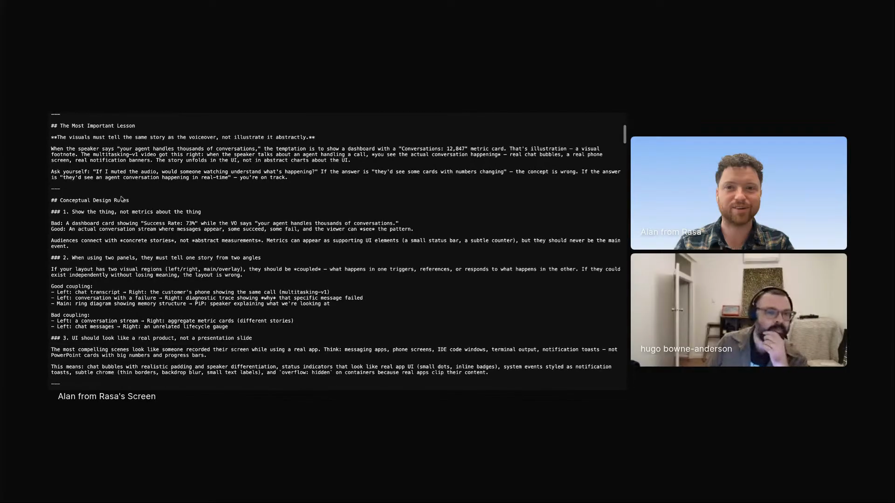

# remotion-video

A skill that encodes one builder's hard-won design judgment for programmatic video, so Claude can turn a few minutes of recorded audio into a finished explainer video, work that used to take a creative agency weeks.

## who showed it

Alan Nichol, co-founder and CTO of Rasa, a developer platform for building AI agents. He has never written a line of Remotion by hand and, by his own account, knows almost nothing about video. He still ships polished explainer videos for Rasa: he records a few minutes of audio between meetings, and the rest is generated, including the version of Alan on screen. Only the voice is real; the talking head is an AI avatar of him, produced with HeyGen. Remotion is the JavaScript library that does the actual rendering; the skill is everything Claude needs to know about what makes a video good.

## what it does

The skill carries none of Remotion's syntax. Claude already writes Remotion fluently; what it lacks is Alan's taste. So the skill is all design judgment.

> *"Claude needs no help whatsoever writing remotion code. So it will just do it. And everything that's in the skill is me telling it like what I want in there and how to do animations and style guides and rules and text."* [\[02:51:08\]](https://youtube.com/live/ud2WzkKeDZs?t=10268)

The talking head in those videos is itself generated. Alan records only audio; the on-screen Alan is an AI avatar produced with HeyGen, and the skill carries the rules for compositing that footage alongside the animation: trimming clips at word boundaries from the transcript, color-grading HeyGen's warm cast, masking its idle-smile artifacts.

> *"It's AI me as well. Yeah, the voice is really my audio, but then the video is generated."* [\[02:49:23\]](https://youtube.com/live/ud2WzkKeDZs?t=10163)

It is a living document, rewritten as Alan learns what he wants out of video.

> *"this is actually an iteration of the skill that I've made since I produced that video that I showed you, but it's really about sort of conceptual design rules."* [\[02:53:16\]](https://youtube.com/live/ud2WzkKeDZs?t=10396)

The rules are concrete: one focal point on screen at a time, distinct layout modes (talking head on one side, animation on the other), canvas safe areas, minimum font sizes, easing functions, and animated text that does not repeat the narration word for word.

> *"there should only be one thing that's the central focal point at any point in time."* [\[03:03:46\]](https://youtube.com/live/ud2WzkKeDZs?t=11026)

Word-level timestamps from Whisper let Claude time on-screen elements to the audio.

> *"I run whisper on the audio so that I've got timestamps so that Cloud knows exactly when the text is coming in so it can like, if it wants to pop up some text or an animation as I'm saying it, it figures out the timing on its own."* [\[02:53:41\]](https://youtube.com/live/ud2WzkKeDZs?t=10421)

## why it's notable

A short explainer video used to mean a multi-week project with a creative agency and a budget to match. Alan now makes them solo, between meetings. The economics shift far enough that videos get made that simply would not have been made before.

> *"it's really like a hundred X reduction in cost to produce these things to the point that like we just wouldn't be doing it. I wouldn't be doing it if, you know, if I couldn't do it solo."* [\[03:05:57\]](https://youtube.com/live/ud2WzkKeDZs?t=11157)

It is also a clean example of a skill whose whole job is to encode taste, not capability. Alan built it in a domain where, by his own account, he is a novice without the vocabulary. The skill is the accumulated record of judgment learned by doing: he made vague subjective requests, watched how Claude turned them into technical choices, and wrote the working vocabulary back into the file. It also builds in a verification loop, since Claude has no video input modality and weak spatial reasoning.

> *"in this skill it says, hey, go and render individual frames throughout this video and then take a look at those, which is good and it's helpful."* [\[03:00:16\]](https://youtube.com/live/ud2WzkKeDZs?t=10816)

And it captures details a non-editor would never think to specify.

> *"easing means when you move a piece of text into a screen, you typically you don't move it at a linear rate. Typically you kind of move it fast and then sometimes you even overshoot and then you go back. And that's really what gives it personality."* [\[03:10:07\]](https://youtube.com/live/ud2WzkKeDZs?t=11407)

## watch it

- [**02:46:00**](https://youtube.com/live/ud2WzkKeDZs?t=9960): Alan introduces the Remotion video work, all built from the command line.
- [**02:49:23**](https://youtube.com/live/ud2WzkKeDZs?t=10163): the voice is Alan's real audio, the on-screen Alan is generated.
- [**02:51:08**](https://youtube.com/live/ud2WzkKeDZs?t=10268): the skill is all taste, Claude needs no help with the code itself.
- [**02:53:16**](https://youtube.com/live/ud2WzkKeDZs?t=10396): Alan opens the skill file in a browser tab and walks the conceptual design rules.
- [**03:00:16**](https://youtube.com/live/ud2WzkKeDZs?t=10816): the render-frames verification loop, and why Claude's spatial reasoning is the weak point.
- [**03:10:07**](https://youtube.com/live/ud2WzkKeDZs?t=11407): what easing is, and why it gives animated text personality.

## status

Stub. Not yet ported from Alan's own repo. He showed the skill on stream as an evolving working document; if he publishes an authoritative version, it will replace this stub.

Alan Nichol demos `remotion-video` on Episode 3 of <em>Show Us Your Agent Skills</em>. <a href="https://youtube.com/live/ud2WzkKeDZs?t=10396">[02:53:16]</a>
