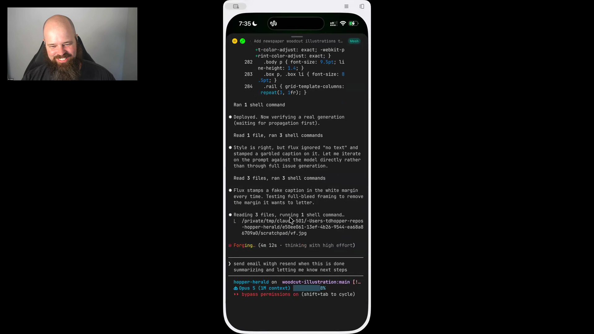

# resend-email

An agent skill for sending email through Resend, including completion summaries that let the human leave a long-running task and receive the result and next steps in their inbox.

## who showed it

[Tim Hopper](https://tdhopper.com/) is a machine learning platform engineer and Python developer. He uses `resend-email` as part of the phone-accessible agent setup that keeps his side projects moving around family life.

## what it does

[Resend](https://resend.com/) is an email API and service. Tim's skill gives the agent access to it through the Resend CLI, using an API key stored in the environment. The agent can send plain text or HTML email, attach files, address multiple recipients, or schedule delivery.

Tim usually sends these emails to himself. When a task will outlast the few minutes he has available, he asks the agent to finish the work and email him a summary and what to do next.

> *"I can say, send me an email with Resend when this one's done summarizing, letting me know next steps."* [[00:32:55]](https://youtube.com/live/NH-ic7-V-jY?t=1975)

## why it's notable

The email moves the handoff out of the terminal session. Tim can put his children to bed or leave a task running overnight without keeping the session in his own working memory.

> *"I wake up the next morning, and I don't have to remember to go check in on the agent, I just have an email telling me, you know, what's there."* [[00:33:02]](https://youtube.com/live/NH-ic7-V-jY?t=1982)

This is a small skill with a clear job: the agent finishes, records the result somewhere Tim already checks, and tells him the next action.

## watch it

- [**00:32:03**](https://youtube.com/live/NH-ic7-V-jY?t=1923): Tim introduces the Resend skill and explains that he emails himself.
- [**00:32:20**](https://youtube.com/live/NH-ic7-V-jY?t=1940): Email becomes the handoff when Tim needs to leave the session.
- [**00:32:55**](https://youtube.com/live/NH-ic7-V-jY?t=1975): The agent sends a completion summary and next steps.
- [**00:33:02**](https://youtube.com/live/NH-ic7-V-jY?t=1982): Tim wakes up to the result instead of remembering to check the agent.

## source

Tim publishes [`resend-email`](https://github.com/tdhopper/dotfiles2.0/tree/8318f30b82fd147ec11a5bb02dd6755bb13434a6/.claude/skills/resend-email) in his dotfiles. This folder carries the `SKILL.md` from commit [`8318f30`](https://github.com/tdhopper/dotfiles2.0/commit/8318f30b82fd147ec11a5bb02dd6755bb13434a6).

## status

Ported from Tim's working files. The skill includes `SKILL.md`.

Tim asks the agent to email him a summary and next steps when its work is done. <a href="https://youtube.com/live/NH-ic7-V-jY?t=1975">[00:32:55]</a>
