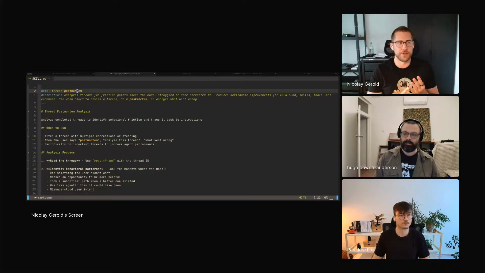

# thread-postmortem

An agent skill that makes the agent introspect a thread that went sideways, trace each misstep back to the instruction that caused it, and propose edits to that instruction, biased toward deletion.

## who showed it

Nico Gerold (Nicolay Gerold), software engineer at Sourcegraph building Amp. He keeps `thread-postmortem` as a local, personal skill, part of how he tunes the harness, the system prompt, and a project's instruction files rather than the application code.

## what it does

When a thread goes wrong, the skill turns the failed conversation into evidence. Nico described the loop:

> *"This is basically a thread postmortem, I call it. So every time when I actually have something weird happen in a thread or in an agent conversation, I actually sit down and try to have the agent analyze or introspect of why it actually did it. And the agents are surprisingly good at it."* [\[01:59:24\]](https://youtube.com/live/ud2WzkKeDZs?t=7164)

The skill reads the thread, identifies the moments of behavioral friction, and traces each one to its source: the system prompt, a tool definition, a loaded skill, or an `AGENTS.md` file. It sorts the friction into named failure types, steering, undo, repetition, confusion, wrong tool, missing context, under-agentic, over-agentic, then proposes a concrete remedy from one of five categories: remove or modify an instruction, change an `AGENTS.md`, add a new skill, build a better tool, or refactor the code.

The skill is written for Amp: it assumes Amp's thread model (the `read_thread` tool) and `~/.config/amp/AGENTS.md`. On another agent or harness the postmortem method carries over, but you would work with your agent to adapt the tool names and paths so they fit what you actually use.

## why it's notable

The skill debugs the agent's *instructions*, not its code. A failed thread becomes a postmortem of the context the agent was given, which is where Nico thinks a surprising share of failures actually originate.

The sharpest design choice is the bias toward deletion. Left alone, agents accrete instructions; this skill is built to push the other way:

> *"I basically tell it to always default to removing because that's usually like agents always like to add new stuff instead of removing things."* [\[02:02:16\]](https://youtube.com/live/ud2WzkKeDZs?t=7336)

So the default remedy is REMOVE or MODIFY before adding, on the reasoning that more instructions mean more conflicts and more confusion.

## watch it

- [**01:59:04**](https://youtube.com/live/ud2WzkKeDZs?t=7144): Nico introduces it as a skill he keeps locally, and notes how much better models have got at introspection.
- [**01:59:24**](https://youtube.com/live/ud2WzkKeDZs?t=7164): "A thread postmortem, I call it." What the skill is for.
- [**02:02:16**](https://youtube.com/live/ud2WzkKeDZs?t=7336): Default to removing. Pushing back on the agent's tendency to pile on new instructions.

## status

Stub. Not yet ported from Nico's own files. He keeps `thread-postmortem` as a local, personal skill; if he publishes an authoritative version, it will replace this stub.

Nicolay Gerold demos `thread-postmortem` on Episode 3 of <em>Show Us Your Agent Skills</em>. <a href="https://youtube.com/live/ud2WzkKeDZs?t=7200">[02:00:00]</a>
