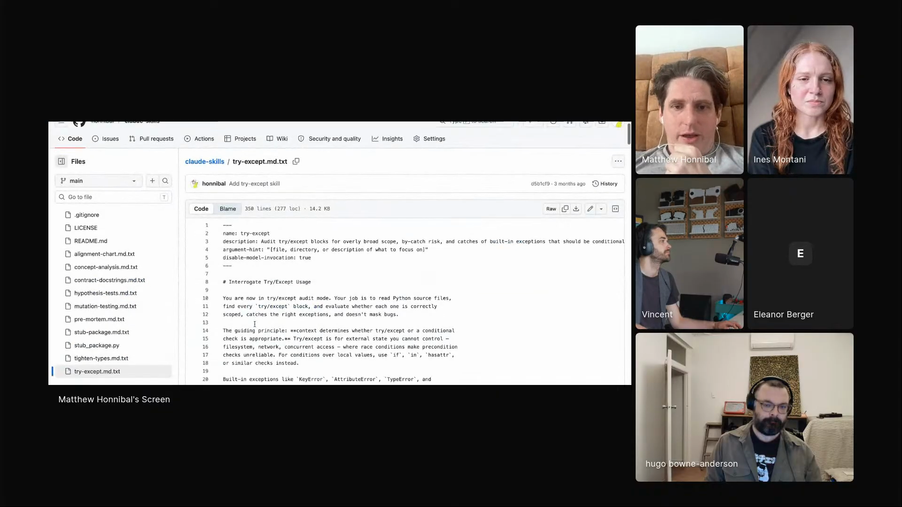

# try-except

An agent skill that reads a Python codebase, finds every `try/except` block, and tightens each one so the `try` covers only the operation that can actually fail and the `except` catches the right exception instead of masking a bug.

## who showed it

Matthew Honnibal, computational linguist and co-founder of Explosion, co-author of the spaCy NLP library. He works from Berlin. On the show he walked through a small set of skills that each run one focused pass over a codebase, and he ships them as raw `.md.txt` files so you have to read the source before installing.

## what it does

The skill puts the agent into a single, narrow mode: audit exception handling, and nothing else. Matt read its core instruction aloud:

> *"In try/except audit mode, your job is to read Python source files, find every try/except block, evaluate whether each one is correctly scoped, catches direct exceptions, and doesn't mask bugs."* [\[00:16:08\]](https://youtube.com/live/ud2WzkKeDZs?t=968)

For every block it finds, the skill works through a checklist: is `try/except` even the right mechanism here, or should this be an `if`/`in`/`hasattr` check; is the `try` block minimally scoped, or does it wrap setup and processing that could raise unrelated exceptions; is the `except` clause too broad; does the handler quietly swallow the failure. It tightens each block and flags the most valuable cases, where narrowing a broad catch would surface an exception that was being silenced.

## why it's notable

Matt singles out exception handling as the single worst thing agents do to Python code, and he has a theory of why:

> *"I think it's one of the most, the biggest problems that Claude introduces in code. I think that this is actually due to reward hacking, where during training... one of the ways that it can cheat the long-term objective in order for the short-term gain is to introduce bare excepts and things."* [\[00:16:24\]](https://youtube.com/live/ud2WzkKeDZs?t=984)

A bare `except` makes a test suite pass and an LLM judge sign off, while hiding a maintainability problem a human only discovers later. The skill is a targeted countermeasure: a deterministic, repeatable pass that goes looking for exactly the shortcut the model is rewarded for taking.

## watch it

- [**00:12:09**](https://youtube.com/live/ud2WzkKeDZs?t=729): Matt opens his skills repo and explains why he ships the files as raw `.md.txt`, so hidden HTML comments cannot smuggle instructions past you.
- [**00:16:08**](https://youtube.com/live/ud2WzkKeDZs?t=968): He reads the `try/except` audit skill aloud.
- [**00:16:24**](https://youtube.com/live/ud2WzkKeDZs?t=984): Why misused `try/except` is the biggest problem Claude introduces in code, traced back to reward hacking during training.

## project and license

The skill is [`honnibal/claude-skills`](https://github.com/honnibal/claude-skills), described upstream as *"Claude skills I'm experimenting with. Please review carefully before use."* It is licensed under [MIT License](LICENSE) (full text in `LICENSE` alongside this folder). Matt demoed it on the show; the maintainer is Matthew Honnibal.

## status

Vendored snapshot. The skill file is a frozen copy of [`honnibal/claude-skills/try-except.md.txt`](https://github.com/honnibal/claude-skills/blob/main/try-except.md.txt) as of 2026-05-22. The maintained version lives upstream and may have evolved since this snapshot.

To use it in Claude Code: copy this folder into `.claude/skills/try-except/` (project) or `~/.claude/skills/try-except/` (user). For other harnesses, see your harness's docs for the expected skills directory.

Matthew Honnibal demos `try-except` on Episode 3 of <em>Show Us Your Agent Skills</em>. <a href="https://youtube.com/live/ud2WzkKeDZs?t=968">[00:16:08]</a>
