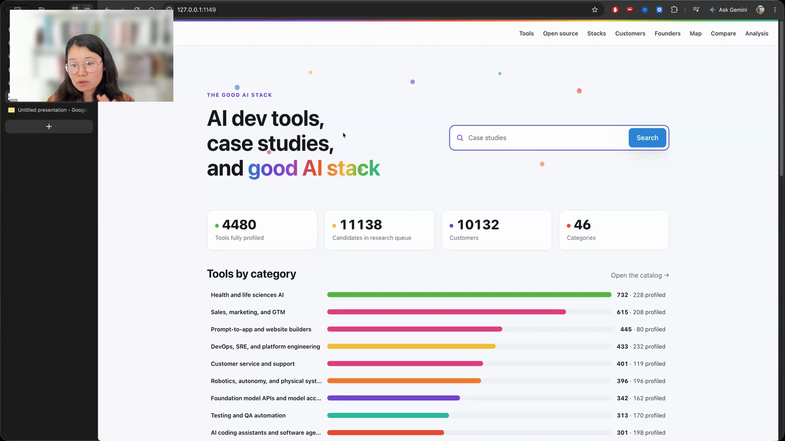

# verified-frontend

An agent skill for opening frontend changes in a browser, inspecting the rendered page, fixing visible problems, and returning screenshots with the work.

## who showed it

[Chip Huyen](https://huyenchip.com/) is a writer and computer scientist focused on bringing AI into production. She uses a verified frontend skill whenever an agent changes an interface.

## what it does

Chip's skill opens the changed site in a browser, inspects the rendered page visually, improves it, then captures a screenshot that can travel with the pull request.

> *"I want the agent to spin up the browser, inspect the site, the page, visually, every pixel."* [[01:01:33]](https://youtube.com/live/NH-ic7-V-jY?t=3693)

The browser depends on where the agent is running. Chip described using the built-in browser in a desktop app and a local headless browser from a terminal or CI environment. She wanted a script to detect that environment instead of making the agent reason through the choice each time.

> *"Agents somehow tend to rely on agents to solve problems that could be solved by a script."* [[01:01:10]](https://youtube.com/live/NH-ic7-V-jY?t=3670)

## why it's notable

The screenshot lets Chip review the visible result without checking out and running every branch herself.

> *"It can show it to me, attach to a PR, so I can approve it without having to spin up the branch associated with that PR."* [[01:01:42]](https://youtube.com/live/NH-ic7-V-jY?t=3702)

We are sharing the shape of Chip's skill so you can adapt it to your own tools and purposes. The included `SKILL.md` tells the agent to build the working version with its human. Browser tools, start commands, routes, viewports, visual standards, and evidence handling all come from the local project.

Earlier in the episode, Hugo described why that distinction matters:

> *"I think we should be sharing the shape of skills, not the skills, because what that will allow us to do, like a few bullet points of what it does, it'll allow me to, given the shape, I can share it with my agent, and then modulate it to how I work."* [[00:13:34]](https://youtube.com/live/NH-ic7-V-jY?t=814)

## watch it

- [**01:01:10**](https://youtube.com/live/NH-ic7-V-jY?t=3670): Chip explains when a script should replace agent reasoning.
- [**01:01:20**](https://youtube.com/live/NH-ic7-V-jY?t=3680): Chip introduces her verified frontend skill.
- [**01:01:33**](https://youtube.com/live/NH-ic7-V-jY?t=3693): The agent opens a browser and inspects the rendered page.
- [**01:01:42**](https://youtube.com/live/NH-ic7-V-jY?t=3702): Screenshot evidence travels with the pull request.
- [**01:02:03**](https://youtube.com/live/NH-ic7-V-jY?t=3723): The browser mechanism changes across desktop, terminal, and CI environments.

## status

We are sharing the shape of this skill so you can adapt it to your own tools, standards, and purposes. The included `SKILL.md` helps an agent and its human build that local version. As we discussed in the episode, we think sharing the shape is more useful than sharing the actual skill, which may be tightly fitted to one person's tools and workflow.

Chip explains how visual inspection and screenshot evidence fit into her frontend work. <a href="https://youtube.com/live/NH-ic7-V-jY?t=3702">[01:01:42]</a>
