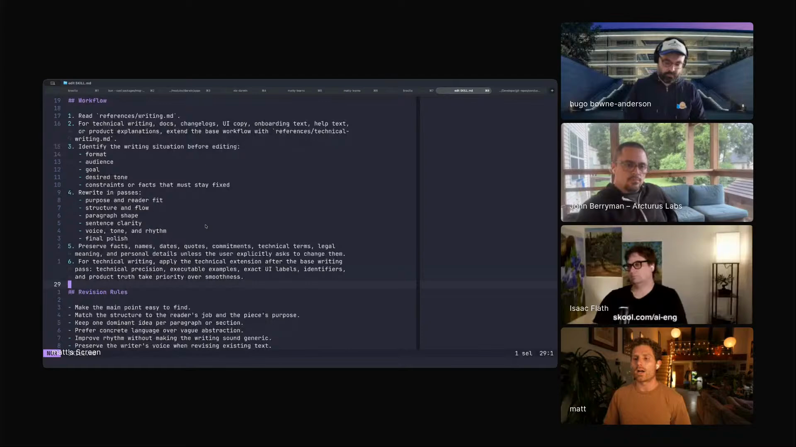

# writing-revision

A writing revision skill that routes ordinary writing and technical writing through separate references, drawing on sentence-level clarity principles from Williams and Bizup's *Style*.

## who showed it

Matt Palmer leads developer experience at Conductor. He showed `writing-revision` as one of the private skills he uses constantly and keeps portable across projects.

## what it does

Matt's skill treats writing revision as a skill with references, not as a single prompt. The skill chooses different guidance for general writing and technical writing because those tasks ask different things of the reader.

> *"I use this for all of my writing."* [\[01:43:03\]](https://youtube.com/live/6zju7hyCFl0?t=6183)

> *"the skill is basically a directory and it says read references writing or for technical writing read references technical writing because often those are different things"* [\[01:43:11\]](https://youtube.com/live/6zju7hyCFl0?t=6191)

## why it's notable

The skill encodes a serious writing source into agent behavior. Matt describes reading *Style* by Williams and Bizup, then turning the book's guidance about sentence structure, subjects, actions, and reader purpose into an agent skill.

> *"you have to make the main point easy to find. You have to match the structure to the reader's job and the piece's purpose."* [\[01:44:04\]](https://youtube.com/live/6zju7hyCFl0?t=6244)

He also frames the skill as something that should improve over time as the agent makes mistakes.

> *"I'm like, I should just have an agent that does these things. And that's largely what I've derived this writing skill from."* [\[01:44:22\]](https://youtube.com/live/6zju7hyCFl0?t=6262)

## watch it

- [**01:42:56**](https://youtube.com/live/6zju7hyCFl0?t=6176): Matt names `writing-revision` as one of his own skills.
- [**01:43:03**](https://youtube.com/live/6zju7hyCFl0?t=6183): He says he uses it for all of his writing.
- [**01:43:11**](https://youtube.com/live/6zju7hyCFl0?t=6191): He describes the reference split between writing and technical writing.
- [**01:44:22**](https://youtube.com/live/6zju7hyCFl0?t=6262): He explains why he derived the skill from the book's sentence-level guidance.

## status

Stub. Not yet ported from Matt's own files. Matt demoed `writing-revision` on the show, but the original skill file was not shown on camera or was not legible enough to reconstruct. If Matt publishes an authoritative version or opens a PR, it will replace this stub.

Matt opens the `writing-revision` skill and describes its references. <a href="https://youtube.com/live/6zju7hyCFl0?t=6176">[01:42:56]</a>
