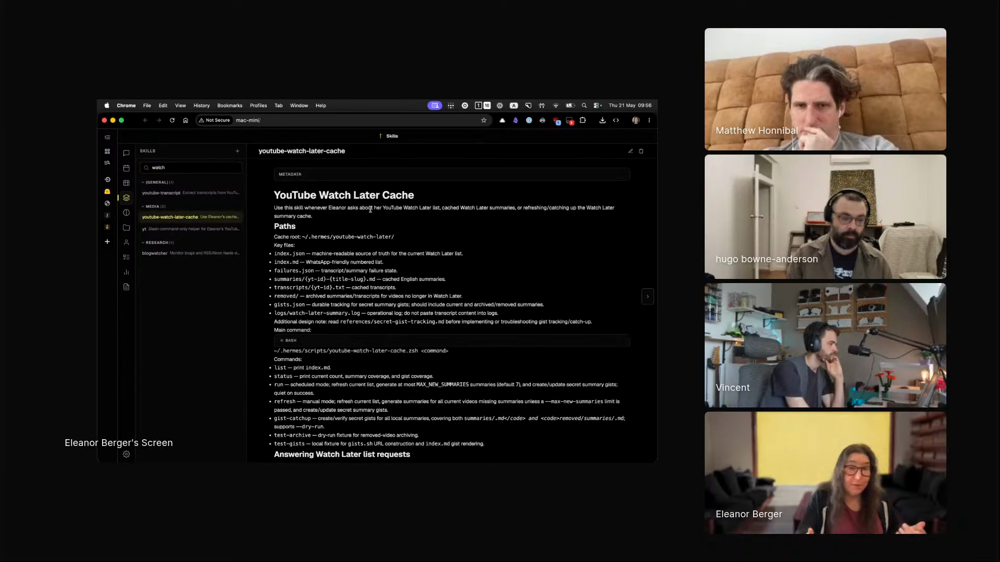

# youtube-watch-later-gist-summaries

An agent skill that reads a user's YouTube Watch Later playlist, summarises every video from its transcript, and publishes each summary as a secret GitHub gist, returning a list of shareable links.

## who showed it

Eleanor Berger, AI and software engineering expert and a technical member of staff at Jimini Health, where she works on AI for mental health. She is the creator of agentic ventures, an AI coding and agentic engineering course, and was formerly a principal engineering lead at Microsoft and Google. On the show she demoed Hermes, the locally-run agent harness she delegates everyday tasks to.

## what it does

The point is delegation: Eleanor does none of this work herself. She collects videos in her YouTube Watch Later faster than she can watch them, and instead of triaging the backlog by hand, she just asks her Hermes agent in plain language and it does the rest:

> *"And so now I can tell it something like, what's on my YouTube watch later. And it will."* [\[00:54:03\]](https://youtube.com/live/ud2WzkKeDZs?t=3243)

From that one request, the skill walks the playlist, fetches a transcript for each video, writes a compact English summary, and publishes one secret GitHub gist per video, returning a list of `Channel — Title — link` entries so the backlog becomes scannable. Because YouTube has no public playlist API, the agent drives a browser session Eleanor is already logged in to:

> *"I told it, I want you to regularly go use your browser because YouTube unfortunately doesn't have an API. So it's good it has access to a live browser with my YouTube logged in."* [\[00:53:38\]](https://youtube.com/live/ud2WzkKeDZs?t=3218)

It is deliberately browser-tool agnostic, carries its own transcript-fetching instructions rather than depending on another skill, keeps playlist order, and maintains a working manifest so a run can resume after a failure rather than creating duplicate gists.

## why it's notable

Eleanor did not write this skill. She asked her agent for the capability in a brief chat message, and the agent invented the implementation, including the caching design and the third-person phrasing she would never have used herself:

> *"I would never refer to myself in the third person, but it's just I asked very briefly in the chat and it invented this way to do it and it did a pretty good job."* [\[00:54:50\]](https://youtube.com/live/ud2WzkKeDZs?t=3290)

> *"Realizing it will have a script doing this and it will maintain like a cache of the things it already did. A very sophisticated behavior that I didn't really define myself."* [\[00:55:03\]](https://youtube.com/live/ud2WzkKeDZs?t=3303)

It is a concrete artifact of an agent authoring its own reusable skill from an under-specified request, caching, manifest, failure handling, and all, then keeping it around to invoke later.

## watch it

- [**00:52:57**](https://youtube.com/live/ud2WzkKeDZs?t=3177): Eleanor describes the ever-growing Watch Later backlog and why she wanted summaries.
- [**00:53:38**](https://youtube.com/live/ud2WzkKeDZs?t=3218): She recounts asking Hermes, from her phone on public transport, to browse her logged-in YouTube and summarise the list.
- [**00:54:50**](https://youtube.com/live/ud2WzkKeDZs?t=3290): She reads the skill the agent wrote, spotting third-person phrasing and a caching design she never specified.

## project and license

The skill is published as a [public GitHub Gist](https://gist.github.com/intellectronica/a13f611b8785d33e603ae946961650e4) by Eleanor Berger, described in its own frontmatter as *"Use when a user wants an agent to summarise every video in their YouTube Watch Later playlist, publish one secret GitHub gist per summary with gh, and return channel/title/gists.sh summary links."* It is licensed under [MIT](LICENSE) (full text in `LICENSE` alongside this folder). Eleanor demoed it on the show; the skill itself was written by her Hermes agent, which the frontmatter credits as the author. We asked Eleanor for it after the episode, and she chatted with that agent over Discord, where it added the task to its own kanban board and published this gist for us to vendor.

## status

Vendored snapshot. The skill file is a frozen copy of the [gist](https://gist.github.com/intellectronica/a13f611b8785d33e603ae946961650e4) as of 2026-05-22. The maintained version lives upstream and may have evolved since this snapshot.

To use it in Claude Code: copy this folder into `.claude/skills/youtube-watch-later-gist-summaries/` (project) or `~/.claude/skills/youtube-watch-later-gist-summaries/` (user). For other harnesses, see your harness's docs for the expected skills directory.

Eleanor Berger demos `youtube-watch-later-gist-summaries` on Episode 3 of <em>Show Us Your Agent Skills</em>. <a href="https://youtube.com/live/ud2WzkKeDZs?t=3290">[00:54:50]</a>
