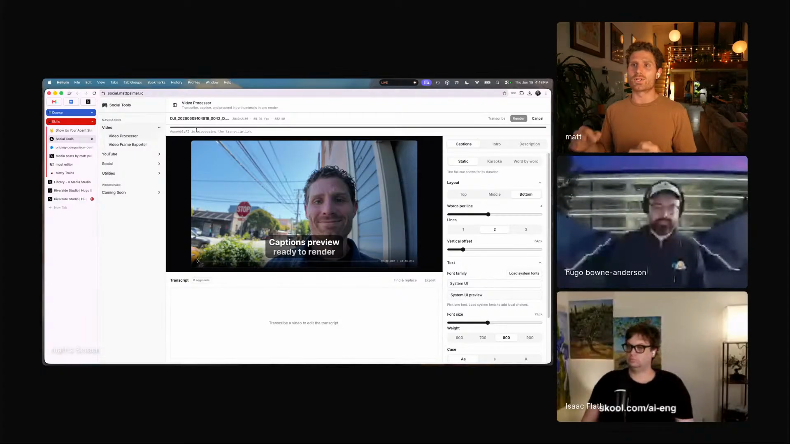
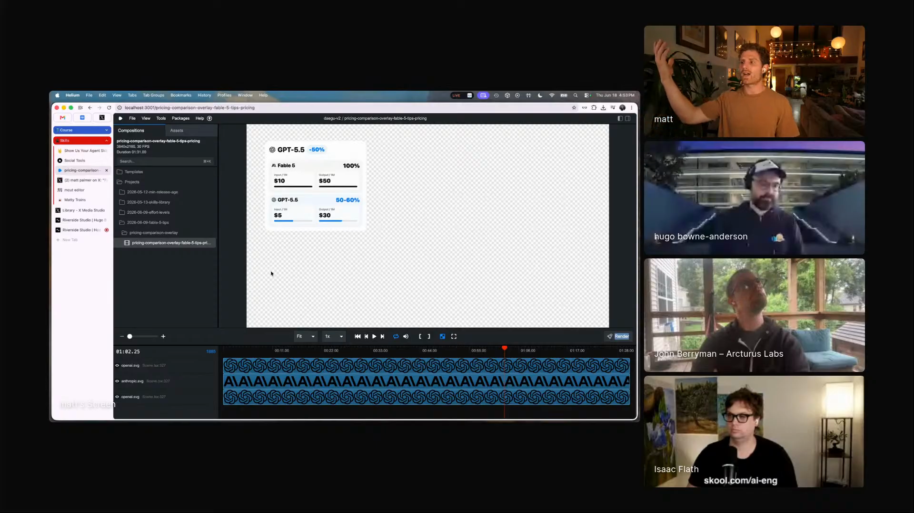
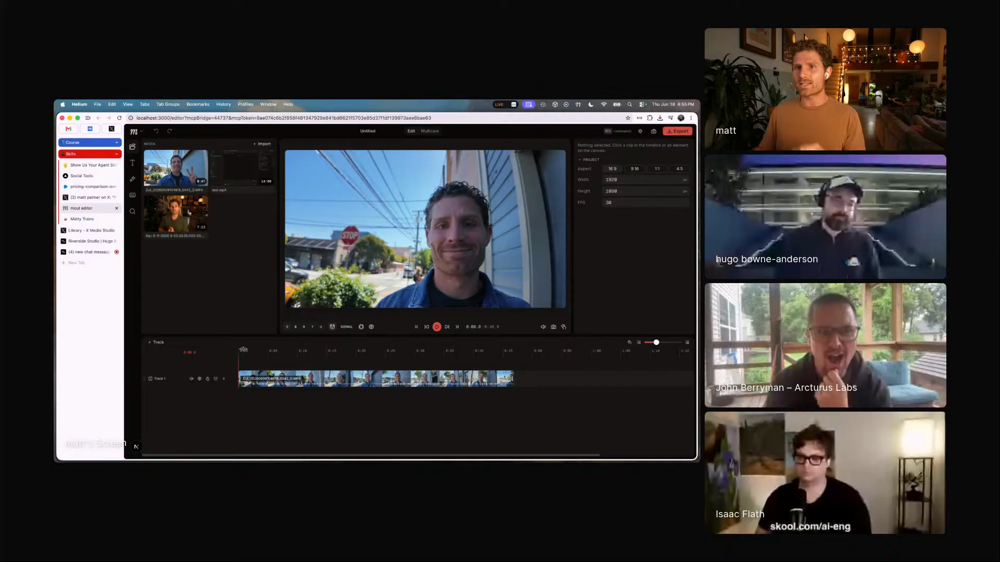
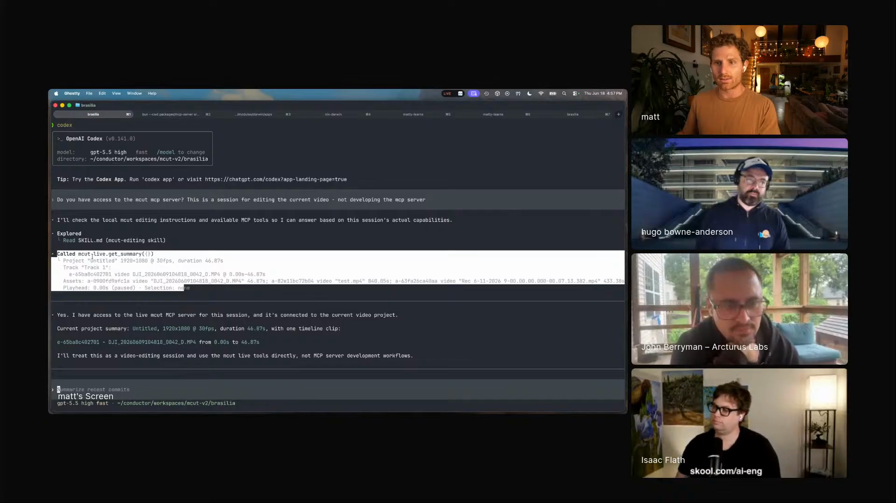

# agent-editable-video-timelines

A browser video-editing workflow where the human edits through a visual timeline and the agent edits through the same underlying state and tools. Captured from Matt Palmer's Episode 5 segment, where his MCut editor runs locally in the browser, exposes video tracks and timestamps through MCP, triggers transcription, and points toward transcript-driven jump cuts across screen, camera, and side-by-side layouts.

## who showed it

Matt Palmer leads developer experience at Conductor. Before Conductor, he led DevRel at Replit through its shift from online IDE to AI-native product, and he spends a lot of his own time building personal tools for video, content, system setup, and agent workflows.

## the premise

Matt makes a lot of video, and his starting point is the daily reality of producing content: transcripts, thumbnails, captions, overlays, talking-head cuts, and the repeated polishing work that makes a video usable.

> *"I make a lot of video. I get people that ask me all the time, hey Matt, how do you make so much video? How do you produce content so consistently? The answer is I use a lot of tools to automate things."* [\[00:44:27\]](https://youtube.com/live/6zju7hyCFl0?t=2667)

The workflow starts with browser-native media tools, then pushes one step further: if the editor has a real timeline model, expose that model to an agent so the agent can inspect and operate on the same edit the human sees.

Matt's social tools dashboard processes video in the browser: audio extraction, transcription, thumbnails, captions, presets, and rendering. <a href="https://youtube.com/live/6zju7hyCFl0?t=2721">[00:45:21]</a>

## principles

### 1. Build the visual tool first, then expose the same state to agents

Matt does not begin with a prompt that says "edit this video." He builds an editor a human can use, then exposes the editor's internal state through tools. That means the agent sees tracks, timestamps, media context, captions, and transcript state instead of guessing from a file path.

> *"I really wanted to push it and say, what if we could expose this entire video editor as an API?"* [\[00:53:46\]](https://youtube.com/live/6zju7hyCFl0?t=3226)

The design target is shared control: the same timeline can be driven visually by Matt or programmatically by the agent.

### 2. Keep media work close to the browser when possible

The first version of Matt's content tooling already runs heavy media tasks on the client. MediaBunny rips audio from video in the browser, the app sends compressed audio to AssemblyAI, and the browser renders the captioned result.

> *"this tool basically does all of the video processing in the browser"* [\[00:45:19\]](https://youtube.com/live/6zju7hyCFl0?t=2719)

> *"This is not FFmpeg, this is not server rendering. It's just using MediaBunny, which like has blown me away."* [\[00:46:35\]](https://youtube.com/live/6zju7hyCFl0?t=2795)

That constraint matters because the later MCut demo stays in the same world: local browser editor, local bridge, local transcription, visible state.

### 3. Use code-generated overlays where code is the better creative medium

Before MCut, Matt shows a Remotion project he keeps open in Conductor. He transcribes a video, gives the transcript to an agent, asks it to find the relevant moment, and generates a transparent MOV overlay in a particular style.

> *"This is just React essentially on this video."* [\[00:50:22\]](https://youtube.com/live/6zju7hyCFl0?t=3022)

> *"I have these graphics, like I have a professional video editor making stuff for me, but it's really just AI and code and some like clever usage of these tools."* [\[00:51:06\]](https://youtube.com/live/6zju7hyCFl0?t=3066)

This is the bridge from static agent output to editable video timelines. Code is good at making structured overlays. The editor is good at composing those overlays into the final video.

Matt's Remotion project generates transparent MOV overlays that can be dropped onto the main video. <a href="https://youtube.com/live/6zju7hyCFl0?t=3066">[00:51:06]</a>

### 4. Make the timeline real before the agent touches it

Matt is careful to distinguish MCut from a mockup. It has a browser timeline, animations, keyframes, zoomable tracks, captions, transcription, and multicam primitives.

> *"this is a full video editor."* [\[00:52:55\]](https://youtube.com/live/6zju7hyCFl0?t=3175)

> *"This isn't just like vibe coded stuff."* [\[00:53:11\]](https://youtube.com/live/6zju7hyCFl0?t=3191)

The agent API is only useful because the underlying object is useful. If the timeline cannot represent edits precisely, the MCP bridge only exposes a toy.

MCut is a browser video editor with timeline editing, animations, keyframes, captions, and local media primitives. <a href="https://youtube.com/live/6zju7hyCFl0?t=3175">[00:52:55]</a>

### 5. Give the agent editor tools, not a vague creative mandate

The MCP bridge gives Codex tools such as `MCut LiveGetSummary`, media context, transcription checks, and session access. Matt explicitly creates a separate editing session so the agent does not confuse "edit the video" with "develop the editor."

> *"This is a session for editing the video, just to be clear, because it can get confused about developing in the actual development folder."* [\[00:54:04\]](https://youtube.com/live/6zju7hyCFl0?t=3244)

> *"it can actually see the video, it can see the timestamps"* [\[00:54:22\]](https://youtube.com/live/6zju7hyCFl0?t=3262)

The difference is concrete: the agent can call tools against the open editor session and trigger the same actions a human would otherwise click.

Codex talks to MCut through an MCP bridge and can inspect video tracks, timestamps, and editor state. <a href="https://youtube.com/live/6zju7hyCFl0?t=3262">[00:54:22]</a>

### 6. Treat transcripts as edit data

Matt's end goal is transcript-driven editing. A transcript becomes a map from spoken content to timeline operations: captions, jump cuts, multicam switches, side-by-side layouts, and cleanup.

> *"I could say add jump cuts based on the transcript"* [\[00:55:35\]](https://youtube.com/live/6zju7hyCFl0?t=3335)

That is why the editor API needs timestamps and transcript state. The agent should be able to turn a text-level instruction into timeline edits, while the human can still review and finish the cut visually.

## what a session looks like

1. **Process source media.** Start with a raw video in the browser. Extract audio, generate or upload a transcript, produce captions, and set up thumbnail or overlay assets.
2. **Create structured visual assets.** Use code, such as Remotion, when the right artifact is a styled overlay or animation that should render as a transparent video layer.
3. **Open the editable timeline.** Load the video into a real editor with tracks, keyframes, captions, and media state the human can inspect.
4. **Expose the editor session to an agent.** Connect an MCP bridge to the running editor, not just to the codebase that builds the editor.
5. **Ask for a scoped edit.** Start with operations the editor can represent precisely: transcribe this clip, inspect tracks, add captions, locate a timestamp, or add jump cuts based on the transcript.
6. **Review in the timeline.** The human stays in the visual editor and finishes the last pass manually when taste, pacing, or visual rhythm needs judgment.

The reusable loop is: make media state structured, expose it as editor tools, let the agent operate on the same timeline, then keep the human in the editor for review and finishing.

## anti-patterns

- **Asking an agent to "edit the video" with no editor state.** That invites generic scripts, FFmpeg detours, and guesses about what the user wanted.
- **Giving the agent only the codebase.** Matt separates the editing session from the development folder because the task is to edit media, not modify the app.
- **Flattening AI output into a bitmap or final render too early.** The last 10 percent of creative work needs editable layers, tracks, captions, and timing.
- **Treating transcripts as summaries.** Transcript data becomes powerful when it maps words to timestamps and timeline operations.
- **Building a fake editor around an MCP demo.** The bridge matters because the editor has real timeline primitives underneath it.
- **Removing the human from the finish.** The workflow automates setup and structured edits, but the human still reviews the timeline and owns the final cut.

## what you need

The workflow is tool-agnostic in principle. Matt's current setup, which is the one demoed on the show:

- **A browser media stack.** Matt uses MediaBunny for browser-side media processing, including audio extraction and rendering work that otherwise might go through server-side FFmpeg.
- **A transcription path.** Matt uses AssemblyAI in his social tools and local Whisper in the MCut demo. The important requirement is timestamped transcript state the editor and agent can use.
- **A code-driven overlay path.** Matt uses Remotion as React for video, generating transparent MOV overlays from transcript-guided agent work.
- **A real timeline editor.** MCut has tracks, animations, keyframes, captions, transcription, and multicam primitives.
- **An agent bridge into the live editor.** Matt uses an MCP bridge so Codex can call tools against the open MCut session.
- **A separate editing session.** The agent needs to know it is operating the video editor, not developing the editor's source code.
- **A human review surface.** The browser timeline remains the place where Matt can inspect, adjust, and finish the edit.

## watch it

- [**00:44:27**](https://youtube.com/live/6zju7hyCFl0?t=2667): Matt explains why his video workflow exists: consistent content production needs tools.
- [**00:45:19**](https://youtube.com/live/6zju7hyCFl0?t=2719): The social tools dashboard processes video in the browser.
- [**00:46:35**](https://youtube.com/live/6zju7hyCFl0?t=2795): MediaBunny replaces server-side FFmpeg for this browser workflow.
- [**00:50:22**](https://youtube.com/live/6zju7hyCFl0?t=3022): Remotion as React on video.
- [**00:51:06**](https://youtube.com/live/6zju7hyCFl0?t=3066): AI and code generate transparent overlay graphics.
- [**00:52:55**](https://youtube.com/live/6zju7hyCFl0?t=3175): MCut appears as a full browser video editor.
- [**00:53:11**](https://youtube.com/live/6zju7hyCFl0?t=3191): Matt points to keyframes and timeline primitives.
- [**00:54:04**](https://youtube.com/live/6zju7hyCFl0?t=3244): Matt connects Codex to the MCut MCP server.
- [**00:54:22**](https://youtube.com/live/6zju7hyCFl0?t=3262): Codex sees the video, tracks, and timestamps.
- [**00:55:35**](https://youtube.com/live/6zju7hyCFl0?t=3335): The target workflow: add jump cuts from the transcript.

## see also

- [`workflows/agents-that-follow-you/`](../agents-that-follow-you) for John Berryman's adjacent pattern: one agent following the human across apps, websites, and physical places.
- This pairs with Matt's broader personal-tools workflow: keeping side projects open, maintained, and compounding over time.
- [MediaBunny](https://mediabunny.dev/) for browser-side media processing.
- [Remotion](https://github.com/remotion-dev/remotion) for React-based video generation.
