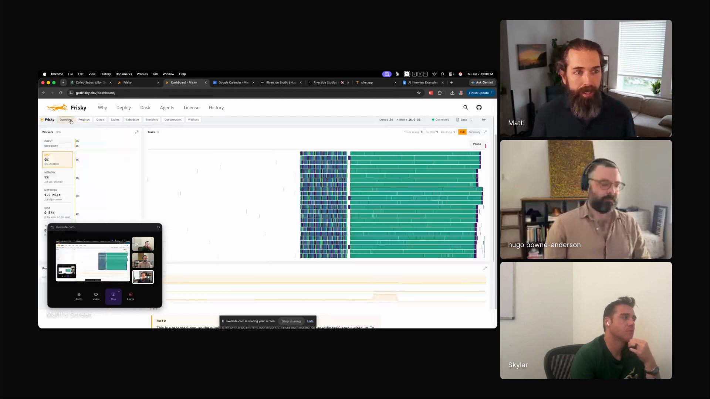

# agent-feedback-systems

Matt Rocklin's workflow is to give agents feedback systems before giving them long turns: benchmarks, telemetry, fresh-agent review, and targeted checks that let the human review evidence instead of reading every generated line. Captured from Matt's Episode 6 segment, where he explains how he can leave agents running because the work starts with feedback the agent can use and evidence the human can inspect later.

## who showed it

Matt Rocklin writes software in the open-source Python data and compute ecosystem, including Dask and Coiled. His Episode 6 segment focuses on broad context, handwritten `AGENTS.md` files, feedback systems, and code review without reading every generated line.

## the premise

Matt optimizes for long agent turns. He writes the task and context, gives the agent enough feedback to test its own work, then comes back to review the evidence.

> *"I like sit and think and I like write down a markdown file. Then I like give it to it and I walk away."* [\[00:09:20\]](https://youtube.com/live/UwAGIkWFQ78?t=560)

The planning step starts with the feedback signal. Before the agent changes the system, it should know what will show whether the work is succeeding.

> *"Before you start any work, you need to figure out what's going to tell you if you're doing a good job or not."* [\[00:22:51\]](https://youtube.com/live/UwAGIkWFQ78?t=1371)

Matt shows Frisky's dashboard and telemetry, one of the feedback systems agents can inspect while changing a distributed system. <a href="https://youtube.com/live/UwAGIkWFQ78?t=1733">[00:28:53]</a>

## principles

### 1. Define the feedback before the work starts

The agent should not start from a task alone. It should start from the task plus the feedback that will tell it whether the work is moving in the right direction.

> *"My workflow is these five phases, planning, execution. In planning, I make it focus on building live feedback systems."* [\[00:22:34\]](https://youtube.com/live/UwAGIkWFQ78?t=1354)

Matt names the payoff directly: the agent can work for longer because it has something to check while the human is away.

> *"I get to walk away for an hour or two and still have productivity happen."* [\[00:23:01\]](https://youtube.com/live/UwAGIkWFQ78?t=1381)

### 2. Give the agent enough context to interpret the feedback

Matt uses large, handwritten `AGENTS.md` files. They carry project principles, system concepts, performance constraints, and tool notes that every later agent can use.

> *"And in terms of managing what I tell it, like I have very large agents.md files."* [\[00:16:55\]](https://youtube.com/live/UwAGIkWFQ78?t=1015)

Skylar asks how much of the file is handwritten. Matt's answer is short.

> *"All of it."* [\[00:17:38\]](https://youtube.com/live/UwAGIkWFQ78?t=1058)

The file is maintained. Matt says he returns every few weeks to refactor it, then later tasks need less steering.

> *"Every few weeks I sort of go by and I refactor agents.md."* [\[00:17:55\]](https://youtube.com/live/UwAGIkWFQ78?t=1075)

We reconstructed part of the file Matt showed on-screen: [AGENTS-reconstructed.md](AGENTS-reconstructed.md). It is not the original file, but it captures the visible parts of the workflow section:

> **Workflow**
>
> I like work to proceed in the following phases:
>
> **Phase 1: Planning**
>
> We make a plan together. You ask questions to make sure that we're aligned.
>
> In the plan make sure you have a way to get live feedback about the thing we're building.
>
> Feedback is critical to iterating to success.
>
> **Phase 2: Execution**
>
> You do work to implement the plan, raising concerns along the way if something comes up.
>
> **Phase 3: Testing and Iteration**
>
> Use our feedback systems to get feedback about how well our system works. Iterate given that feedback.
>
> **Phase 4: Self review**
>
> Review our work so far and see if there is anything you can clean up or simplify. Don't use other agents at this phase. Do this yourself.
>
> **Phase 5: Agent Review**
>
> Spawn a fresh-context review agent, not a fork of this conversation. Give it the current working directory, goal, and useful pointers like the diff, commit range, relevant files, and tests.
>
> Tell it to inspect the repo independently, be critical, and report findings first.

### 3. Make the system inspectable to the agent

Matt's Frisky example is a distributed-computing system with dashboards, telemetry, benchmarks, tests, and a documented CLI. Those tools let the agent inspect the system it is changing.

> *"What I find is if I have a good feedback system, a benchmark, a test suite, something. And the agents have access to that. They tend to converge a lot more effectively than if they don't have that."* [\[00:29:04\]](https://youtube.com/live/UwAGIkWFQ78?t=1744)

He separates agent observability from system observability. Watching the agent is different from giving the agent enough system state to debug its own changes.

> *"AI observability often means observing your agents rather than giving your agents observability over the system that they're building."* [\[00:31:22\]](https://youtube.com/live/UwAGIkWFQ78?t=1882)

### 4. Review the concern, not the whole diff

Matt says he reads code early in a project, when the first pattern is being set. After that, he reviews by asking for the evidence that matches his concern.

> *"But like after the first couple days, I don't read code."* [\[00:39:19\]](https://youtube.com/live/UwAGIkWFQ78?t=2359)

If he is worried about complexity, he asks for the algorithm. If he is worried about speed, he asks for benchmarks. If he is worried about duplication, he asks how the new system differs from existing ones.

> *"I think it's important to think about what it is that you're concerned about."* [\[00:38:33\]](https://youtube.com/live/UwAGIkWFQ78?t=2313)

### 5. Turn repeated review questions into reusable checks

Matt watches for questions he keeps asking agents. When the same question repeats, he tries to encode it as a feedback mechanism, a standing question, or a hook.

> *"The change that you just made, is it worth the code complexity that you added?"* [\[00:19:33\]](https://youtube.com/live/UwAGIkWFQ78?t=1173)

Later he gives a concrete hook idea: show the additions and deletions, then ask whether the change was worth it.

> *"Here's additions and deletions, is what you've just done worth it?"* [\[00:39:49\]](https://youtube.com/live/UwAGIkWFQ78?t=2389)

Fresh-agent review is part of the same habit. The first agent builds, and another agent checks the result.

> *"People know to ask for a fresh agent to come in and review things."* [\[00:23:13\]](https://youtube.com/live/UwAGIkWFQ78?t=1393)

## what a session looks like

1. **Write the task and context.** Capture what the agent is changing, what project rules matter, and what parts of the system it should inspect.
2. **Name the feedback signal.** Decide what will show progress before implementation starts: a benchmark, a test, telemetry, a CLI command, a profiler run, a fresh-agent review, or a targeted written explanation.
3. **Let the agent work against that signal.** The agent can take a longer turn because it has feedback it can use without asking the human at every step.
4. **Review the evidence.** Ask for the output that answers the concern: benchmark results for speed, an algorithm explanation for complexity, telemetry for runtime behavior, or a comparison against existing systems for redundancy.
5. **Bring in a fresh reviewer.** Have another agent review the result, the evidence, and the final state.
6. **Promote repeated worries.** If the same review question appears again, move it into `AGENTS.md`, a hook, a checklist, or another feedback step.

## anti-patterns

- **Starting with implementation only.** The agent needs a way to tell whether the work is getting better before it starts changing the system.
- **Using broad context without feedback.** Context helps the agent reason, but the session still needs tests, telemetry, benchmarks, or review questions that ground the work.
- **Reading every generated line by default.** If the concern is speed, complexity, duplication, or slop, ask for evidence that answers that concern.
- **Letting review questions stay in chat.** A question you ask every week belongs in an instruction file, hook, benchmark, or review step.
- **Treating a fresh-agent review as optional polish.** Matt names it as a standard closing step, because the first agent has been deep in the implementation.

## what you need

The workflow is harness-agnostic in principle. Matt's setup in the episode uses:

- **Written task context.** Matt writes the plan and context before handing the work to the agent.
- **Hand-maintained `AGENTS.md` files.** These files carry project principles, system concepts, and recurring constraints.
- **Agent-visible feedback.** Tests, benchmarks, profilers, dashboards, telemetry, documented CLIs, and fresh-agent review all count when the agent can use them.
- **A review habit based on concerns.** The human decides what would build confidence, then asks for that evidence.
- **A place to encode repeated checks.** Hooks, standing prompts, checklists, and instruction files keep the same question from being retyped every session.

## watch it

- [**00:08:52**](https://youtube.com/live/UwAGIkWFQ78?t=532): Matt says he structures agent work so he can write and think, then let agents go.
- [**00:09:20**](https://youtube.com/live/UwAGIkWFQ78?t=560): The long-turn loop: write the markdown file, hand it to the agent, walk away.
- [**00:16:55**](https://youtube.com/live/UwAGIkWFQ78?t=1015): Large `AGENTS.md` files as reusable context.
- [**00:17:38**](https://youtube.com/live/UwAGIkWFQ78?t=1058): Skylar asks how much is handwritten, and Matt says all of it.
- [**00:22:34**](https://youtube.com/live/UwAGIkWFQ78?t=1354): Planning starts with live feedback systems.
- [**00:22:51**](https://youtube.com/live/UwAGIkWFQ78?t=1371): The feedback question: what will tell you whether the work is good?
- [**00:23:13**](https://youtube.com/live/UwAGIkWFQ78?t=1393): Fresh-agent review as a standard step.
- [**00:28:53**](https://youtube.com/live/UwAGIkWFQ78?t=1733): Frisky dashboard and telemetry as agent-visible system state.
- [**00:31:22**](https://youtube.com/live/UwAGIkWFQ78?t=1882): Observability for agents versus observability of agents.
- [**00:38:33**](https://youtube.com/live/UwAGIkWFQ78?t=2313): Review starts with the specific concern.
- [**00:39:19**](https://youtube.com/live/UwAGIkWFQ78?t=2359): Matt says he does not read code after the first couple of days.
- [**00:39:49**](https://youtube.com/live/UwAGIkWFQ78?t=2389): A hook idea that asks whether the additions and deletions were worth it.

## see also

- [Matt Rocklin's writing](https://matthewrocklin.com/) for his longer-form posts on agents, feedback systems, and engineering practice.
- [Frisky and Xarray Example](https://matthewrocklin.com/frisky-xarray/) for the Rust, telemetry, and agent-feedback project Matt discusses in the segment.
- [Dask](https://www.dask.org/) for the distributed-computing project behind Matt's scheduling and systems context.
