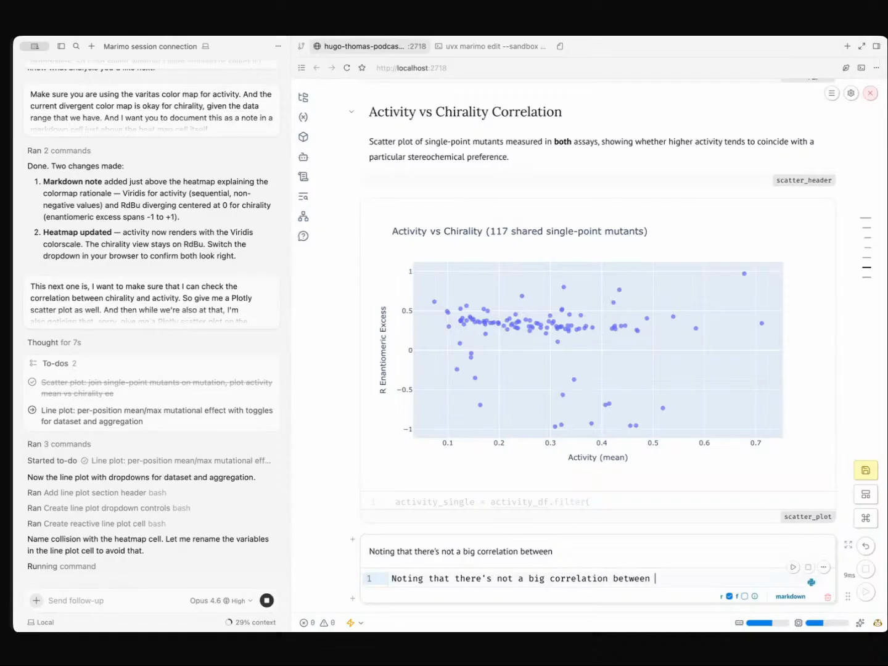
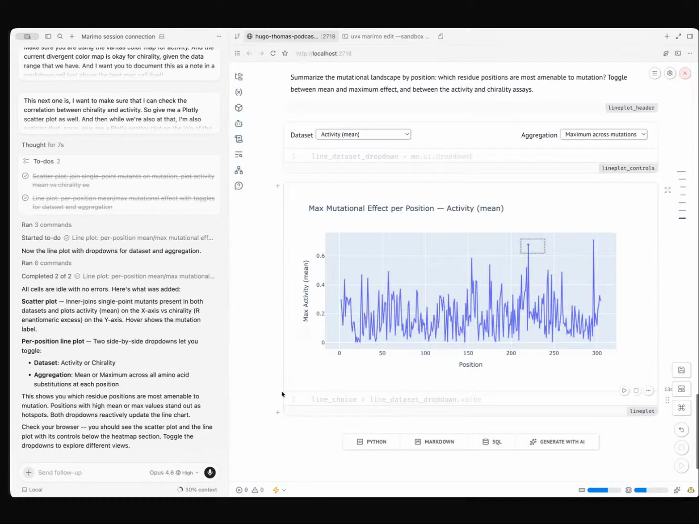
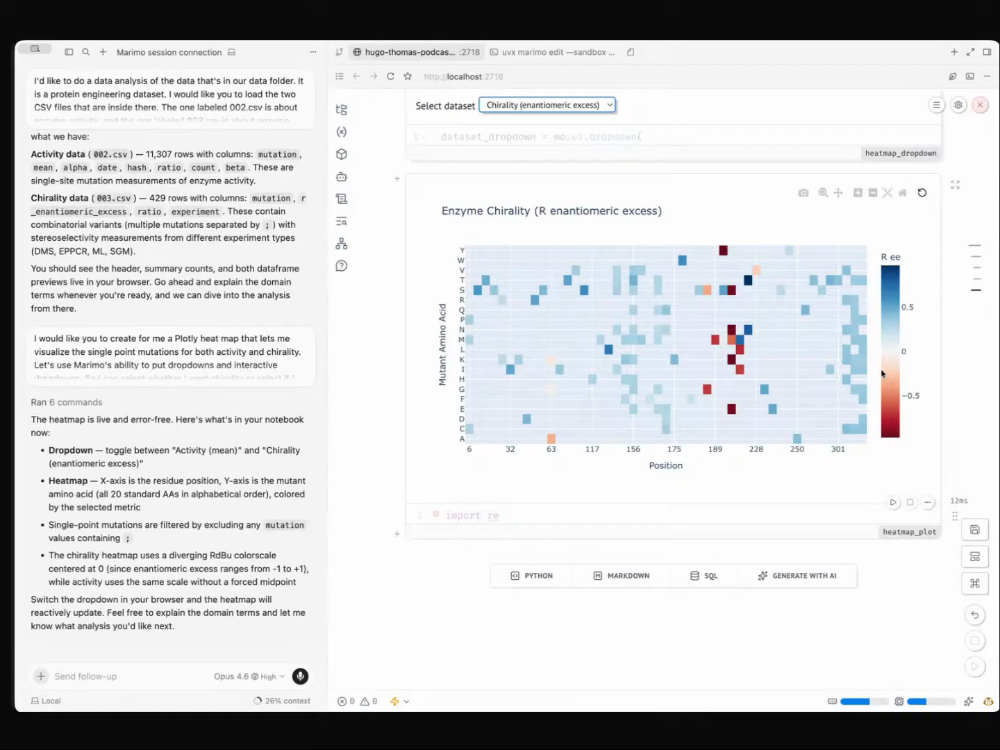

# Agentic data science

Eric Ma's workflow is not "ask an agent to analyze a dataset." It is a way for a scientist to stay in charge of exploratory analysis while a coding agent handles the notebook mechanics: loading data, rendering plots, wiring widgets, correcting cells, and keeping the notebook readable.

The agent renders the next plot, the human picks the next question, and every claim is backed by an artifact. Captured from Eric's episode 2 demo, where he ran a full protein engineering analysis this way in roughly twenty minutes.

This is Eric's workflow. The agent skill Eric uses to make it fluid (Marimo Pair) is described in [`skills/marimo-pair/`](../../skills/marimo-pair).

## who showed it

Eric Ma leads research data science and AI at Moderna Therapeutics, where he applies Bayesian methods and AI agents to molecular biology and protein engineering. Early PyMC contributor.

## the premise

Eric splits data science work into two buckets:

> *"Data science activities usually get split up into one of two big buckets. One is the load the data context into my head kind of activity, and then the other is I just got this routine optimization thing that I need a machine to automate... the latter is where you go Karpathy mode or auto research mode, where you just go, 'Hey, go optimize this for me in a loop and let it run for 14 hours.' But that's an extremely small fraction of what needs to be done, right?"* [\[00:24:19\]](https://youtube.com/live/l37PR-OkYKA?t=1459)

Exploratory data analysis sits firmly in the first bucket. Loading context into a human head is not something you delegate. The workflow below is what Eric does instead.

## why it works

- The agent removes notebook friction: creating cells, wiring controls, rendering plots, and keeping the notebook readable.
- The human keeps the scientific question: what to ask next, what would count as evidence, and what interpretation is justified.
- Each artifact changes the next question. The heatmap leads to a correlation plot, the correlation plot leads to per-position effects, and the position plot leads to the protein structure.
- The workflow can jump from CSVs to custom scientific interfaces in the same session, because the agent makes the JavaScript and widget layer cheap enough to use live.

The goal is not to generate a dashboard. The goal is to shorten the time between "I have a question" and "I can see the evidence that changes my next question."

## principles

### 1. The human directs, one question at a time

> *"I don't go into the analysis with a vague question and just ask the agent to do it all for me. That, I think, is irresponsible as a data scientist. Instead, what I'm doing is I'm going in and I'm taking control of the direction that I want to take the analysis in. So the human is very much in the loop."* [\[00:23:27\]](https://youtube.com/live/l37PR-OkYKA?t=1407)

No "analyze this dataset for me." Every step is a specific question the human has decided is worth asking next, voiced to the agent, rendered immediately.

### 2. One plot at a time, each building on the last

> *"I'm gaining my analysis one plot at a time, right? That's the big one. I know I'm thinking about what is the next most logical question that I want to answer, and I have a plot. And what is the plot that I can use to answer that question?"* [\[00:27:45\]](https://youtube.com/live/l37PR-OkYKA?t=1665)

In the demo, Eric moved from a heatmap of single-point mutations, to a scatter of activity versus chirality, to a per-position line plot, to a 3D protein structure viewer. Each plot answered a question the previous one raised. No batch dashboards, no "make me five charts."

<table>
  <tr>
    <td width="50%"> Step 2: activity vs chirality across mutants, after the heatmap raised the question of whether the two correlate. <a href="https://youtube.com/live/l37PR-OkYKA?t=1722">[28:42]</a></td>
    <td width="50%"> Step 3: max mutational effect per position. Collapses the heatmap onto sequence position to surface hot spots. <a href="https://youtube.com/live/l37PR-OkYKA?t=1800">[30:00]</a></td>
  </tr>
</table>

### 3. Every claim needs an artifact

> *"you have to have artifacts that back the claims that you have... if you're gonna make a claim, you need to make a plot."* [\[00:28:19\]](https://youtube.com/live/l37PR-OkYKA?t=1699)

Narrative without a backing plot or table does not count. This is a guardrail against the agent (or the human) sliding into plausible-sounding summaries that are not actually supported by the data on screen.

### 4. The agent is a pair programmer, not a delegate

> *"This is treating the coding agent really as a pair programmer, not as a thing that just does the whole thing for me."* [\[00:29:12\]](https://youtube.com/live/l37PR-OkYKA?t=1752)

Eric corrects the agent mid-run. In the demo, the agent's first colormap choice did not fit the activity heatmap (a 0-to-1 quantity). Eric stopped, named the distinction (chirality is divergent, running from -1 to +1, so a divergent colormap is appropriate, but activity is not), and asked for Viridis on the activity heatmap while keeping the divergent colormap on chirality. The agent is fast and competent at the rendering layer; the human has to bring domain judgment about encodings, units, and what would actually mislead a reader.

Step 1, at the moment of the correction: the chirality heatmap. Divergent (-1 to +1) is right here; the parallel activity heatmap, on a 0-to-1 scale, is where Eric called for Viridis instead. <a href="https://youtube.com/live/l37PR-OkYKA?t=1520">[25:20]</a>

### 5. Voice the question, let the agent render it

The interaction is conversational. The human says what they want to see in natural language, the agent produces the cell, the kernel renders it, and the next question follows from looking at the result. This is what makes one-plot-at-a-time tractable: each cycle is short enough that the friction does not push you back toward batch thinking.

## what a session looks like

Pick a dataset you actually want to understand. Open a reactive notebook with an agent bridge. Then loop:

1. **Decide the next question.** Not "what should I explore" but "what specifically do I want to know next, given what I just saw."
2. **Voice the plot that would answer it.** Be specific about encoding when it matters (linear vs log, sequential vs divergent colormap, what goes on which axis).
3. **Read the result.** Does the chart actually answer the question, or did the agent take a shortcut? Is the encoding faithful?
4. **Correct if needed.** Wrong colormap, wrong aggregation, wrong axis range. Tell the agent and have it redo the cell.
5. **Leave a note.** A markdown cell alongside the plot capturing what you concluded, or what you still want to check.
6. **Go back to step 1.** The result you just read should change what you want to ask next.

Eric's notebook from the episode 2 demo is vendored at [`reference/demo.py`](reference/demo.py): the finished artifact from a session of this shape, with the heatmap, scatter, line plot, and 3D structure viewer in one Marimo app. For the texture of how a session actually unfolds, every ask, every response, every correction, see Eric's [Cursor session log](https://github.com/ericmjl/2026-pydata-boston-cursor-hackathon/blob/main/demos/live-run/session-log.md) from a parallel run on the same dataset.

The discovery that came out of his demo was specifically a product of this loop. Eric did not just ask for another chart; he moved to a representation that matched the biology. By coloring the 3D structure by per-position mutational effect (a question that only got asked after the line plot raised it), it became visible that the best-performing mutations cluster outside the active site, far from the substrate.

> *"are the best performing mutations happening near where the substrates are, or are they happening outside? That's an important protein engineering decision that we might want to be able to make..."* [\[00:35:18\]](https://youtube.com/live/l37PR-OkYKA?t=2118)

Step 4, the encoding that made the answer visible: 3D structure colored by per-position mutational effect, in the protein structure widget. <a href="https://youtube.com/live/l37PR-OkYKA?t=2220">[37:00]</a>

That insight did not come from asking the agent "find interesting patterns." It came from stepping through plots until the right encoding made the answer visible.

> *"This is all driven by an agent skill, and this is one of many skills that I've used... this one has been mind-blowing for me in the most recent time."* [\[00:37:18\]](https://youtube.com/live/l37PR-OkYKA?t=2238)

## anti-patterns

- **"Analyze this dataset for me."** Walks the agent into batch mode, which is the second bucket above. Use it for hyperparameter sweeps, not for understanding.
- **Accepting the first chart without reading it.** The agent is fast and confident. Wrong colormap, misleading axis range, and dropped categories all render just as quickly as correct ones.
- **Narrative without artifacts.** A summary cell that draws a conclusion the plots do not support is the failure mode this workflow exists to prevent.
- **Treating the agent as oracular.** It will get encodings, units, and aggregations wrong if you do not name them. The human's job is to catch those, not to hope.
- **Out-of-order Jupyter cells.** Stale state from re-running cells in a non-linear order is a quiet correctness bug. This is part of why a reactive notebook matters here:

> *"Your cells can go stale in Jupyter Notebooks, but they will never go stale in Marimo Notebooks... I've been burned by stale cells before. And I've seen colleagues been burned by redefined variables as well."* [\[00:15:27\]](https://youtube.com/live/l37PR-OkYKA?t=927)

## what you need

The workflow itself is tool-agnostic. The principles work with any reactive notebook plus an agent that can read and write into it. Eric's current setup, which is the one demoed on the show:

- **A reactive notebook with an agent bridge.** Eric uses [Marimo Pair](https://github.com/marimo-team/marimo-pair), itself an agent skill: a series of markdown instruction files plus a bash bridge that lets the coding agent reach into a running Marimo notebook's Python kernel. A vendored snapshot lives at [`skills/marimo-pair/`](../../skills/marimo-pair).
- **A coding agent harness.** Eric runs Cursor as his primary harness. Any harness that supports agent skills works.
- **Agent rules that codify how you want to work.** This is the load-bearing piece. An agent's default behavior is not this workflow. To get literate markdown interleaved with code, unique cell names you can refer to mid-session, hidden code cells, and edits routed through Marimo Pair rather than direct writes to the `.py` file, you have to tell the agent. Eric does this in his [`AGENTS.md`](reference/AGENTS.md), vendored here. Without an explicit rules file, you will spend half the session correcting style and tool use instead of asking the next question, and the workflow will silently degrade into "ask the agent to write a notebook for me." Read his version; it is short.
- **Setup walkthrough.** The [hackathon repo README](https://github.com/ericmjl/2026-pydata-boston-cursor-hackathon/blob/main/README.md) has the full install path, including `npx skills install marimo-team/marimo-pair`, starting Marimo with `uvx marimo edit --sandbox --no-token`, and the "Hello!" sanity check that confirms the agent can reach the kernel.

Before Marimo Pair, Eric ran a similar workflow with UV runnable scripts and PEP 723 inline metadata: each script produced a plot, and he kept running notes alongside in a `journal.md` file. The principles carried; the tool changed.

## watch it

- [**00:15:27**](https://youtube.com/live/l37PR-OkYKA?t=927): Why reactive notebooks. Stale cells as a correctness bug.
- [**00:23:27**](https://youtube.com/live/l37PR-OkYKA?t=1407): Why EDA cannot be delegated. Human in the loop.
- [**00:24:19**](https://youtube.com/live/l37PR-OkYKA?t=1459): The two buckets framing. Context-loading vs optimization.
- [**00:27:45**](https://youtube.com/live/l37PR-OkYKA?t=1665): One plot at a time. The cadence of the loop.
- [**00:28:19**](https://youtube.com/live/l37PR-OkYKA?t=1699): Artifacts back claims. The non-negotiable.
- [**00:29:12**](https://youtube.com/live/l37PR-OkYKA?t=1752): Pair programmer, not delegate. Eric correcting a colormap mid-run.
- [**00:35:18**](https://youtube.com/live/l37PR-OkYKA?t=2118): Discovery emerges from stepwise visualization, not from "find me patterns."
- [**00:37:18**](https://youtube.com/live/l37PR-OkYKA?t=2238): "All driven by an agent skill." The closing frame.

## see also

- [`skills/marimo-pair/`](../../skills/marimo-pair) for the agent skill that makes this workflow fluid.
- Eric's [hackathon repo](https://github.com/ericmjl/2026-pydata-boston-cursor-hackathon), upstream source for the vendored [`reference/`](reference) files plus the session log, hackathon setup, and additional demo material.
