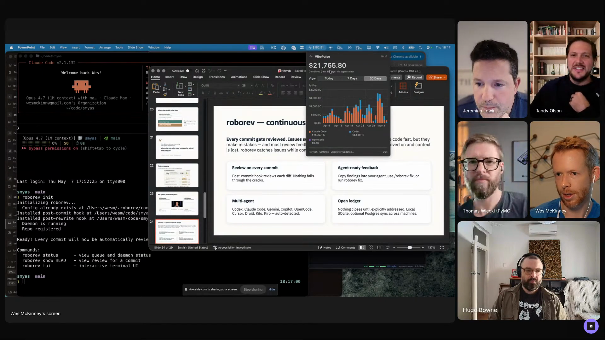
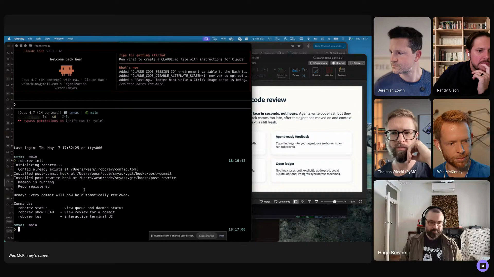
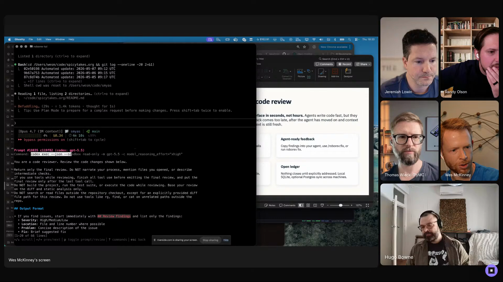
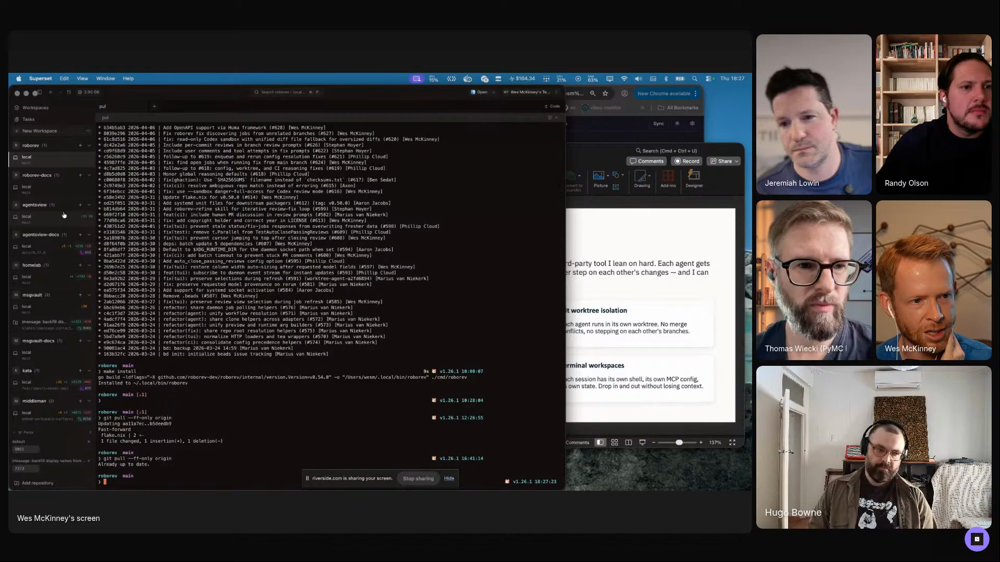
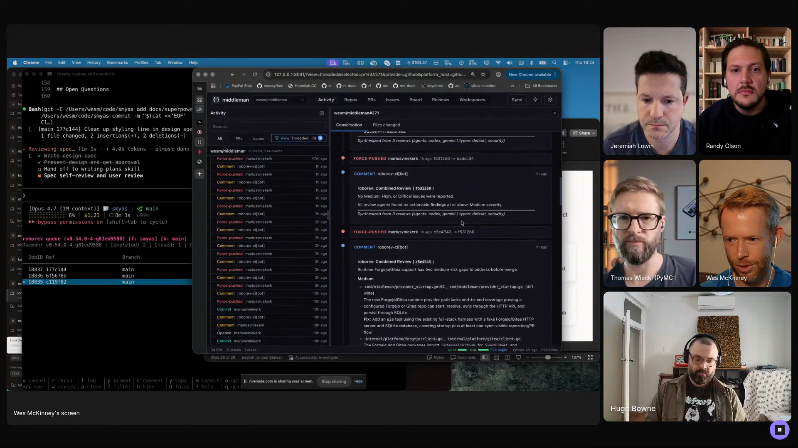

# agentic-software-factory

Wes McKinney ships about a million lines of agent-generated code in six months by running four or five projects in parallel and almost never reading code himself. He has built the support stack to make that volume safe: a background code reviewer that reads every commit, a queue of open review items, a skill the agent invokes to drain the queue, a worktree-per-project terminal manager, a local GitHub dashboard, a local issue tracker, and a cross-session database for finding context from previous runs. Captured from his episode 1 segment, where he reports averaging 1.3 to 1.4 billion tokens a day and one unattended Superpowers plan that ran for fourteen hours without stopping. By the time a PR merges, the code has been read by agents four or five times, minimum.

## who showed it

Wes McKinney is the creator of pandas and the author of *Python for Data Analysis*. He is currently at Posit.

## the premise

Wes opens the segment with the framing he is borrowing from Jesse Vincent (creator of the Superpowers skills framework):

> *"The difference between vibe coding and agentic engineering is planning, architecture, and caring about the output."* [\[00:11:53\]](https://youtube.com/live/Pq3xuChdwxQ?t=713)

His own gloss on why he stopped doing the unstructured version:

> *"I've been building systems to do agentic engineering and not just vibe coding. I think when I started out, it was just like, 'Okay, I'm gonna open Claude Code in the terminal and type prompts and see what happens.' And at a certain point, you're like, 'Wait, okay, this is not creating things that are good.' Like, how do we manage all this at scale? Like, if you work on six projects in parallel, like, how do you keep the train from crashing into the side of a mountain?"* [\[00:11:59\]](https://youtube.com/live/Pq3xuChdwxQ?t=719)

The factory below is his answer. It is a series of pieces (a background code reviewer, a ledger of open issues, a fix skill that drains the ledger, a worktree-per-project terminal manager, a local GitHub dashboard, a local issue tracker, an agent-session database) that hang together because they were built to solve one problem: keep quality control intact while the volume of generated code lapses past the point where line-by-line human review is even possible.

Wes's macOS widget on stream: a three-quarters Claude / one-quarter Codex split over the last 30 days, and a $21,765.80 figure for what the same volume would cost at API rates. The asymmetric generator / reviewer split is the lever the rest of the factory hangs off. <a href="https://youtube.com/live/Pq3xuChdwxQ?t=974">[00:16:14]</a>

## principles

### 1. Commit every turn so review can be asynchronous

The first hard rule, written into every project's `CLAUDE.md` / `AGENTS.md`:

> *"I run RoboRev init to add post-commit hooks to this repository. And so now, like, whenever the agents commit, and I ask my agents to commit every turn, like, that's a hard rule that's in all of my Claude.md or Agents.md."* [\[00:15:49\]](https://youtube.com/live/Pq3xuChdwxQ?t=949)

The mechanism is the post-commit hook. Without commits, the review daemon never fires. Without commits-every-turn as a rule, the agent ends up batching many changes into one commit and the hook misses the intermediate states that are usually the ones with bugs. The rule is the precondition for everything downstream.

Wes runs `roborev init` in the show repo on stream. The CLI installs the post-commit hook that triggers the background review on every commit, then prints the available commands (`roborev` opens the queue TUI, `roborev push` shows results for the current commit). <a href="https://youtube.com/live/Pq3xuChdwxQ?t=935">[00:15:35]</a>

### 2. Review every commit asynchronously, with the strongest reviewer model

Wes uses Claude Code and Codex roughly three-to-one for *generation*, but the reviewer is fixed:

> *"You see Codex did the review. So if we look at the review prompt, you can see that it's using Codex with Codex Exec, GPT 5.5, model reasoning xHigh with this prompt, like, 'You're a code reviewer,' here's the review prompt, and it inlines the code change... I found that the Codex is like the strongest code reviewer out there, at least GPT 5.5, the model specifically, is the strongest."* [\[00:18:52\]](https://youtube.com/live/Pq3xuChdwxQ?t=1132)

Reviews land in the background, never block generation. The reviewer model is allowed to be expensive (reasoning xHigh) because it runs once per commit, not once per token. The asymmetry (cheaper, faster generator; slower, smarter reviewer) is the throughput lever.

Wes opens the literal review prompt RoboRev sends to Codex: a "you are a code reviewer" instruction with the diff inlined, run by `codex exec` against GPT-5.5 at high reasoning effort. The model name and reasoning level are visible on the agent command line just above the prompt. <a href="https://youtube.com/live/Pq3xuChdwxQ?t=1130">[00:18:50]</a>

### 3. Drain the ledger explicitly

Reviews accumulate in a ledger of open items. Fixes do not happen automatically. The agent has to invoke the fix skill to drain it:

> *"If you invoke the RoboRev fix skill, it will look in the ledger, pick up all the open reviews, fix them, and then commit the fixes."* [\[00:19:34\]](https://youtube.com/live/Pq3xuChdwxQ?t=1174)

For long runs, the drain itself gets scheduled inside the implementation plan:

> *"For very large plans, I'll ask the Superpowers implementation skill called sub-agent driven development to invoke the RoboRev fix skill like every five tasks so that it will pause and then address code review feedback that has piled up while it's implementing."* [\[00:21:12\]](https://youtube.com/live/Pq3xuChdwxQ?t=1272)

Explicit drains mean the ledger can run as far behind as you choose and still be a reliable place to look. The pattern works for fourteen-hour unattended Superpowers runs because the queue is bounded by how often the drain skill fires, not by reviewer throughput.

### 4. The human audits structure, not lines

> *"I almost don't read code now. Essentially, my approach with RoboRev is, like, it's like my code reader. So, like, the mantra is, like, RoboRev reads every line of code that is generated. And so, and it gets read multiple times. And so, like, whenever I push up a pull request, the branch gets re-reviewed. And so by the time I'm merging a pull request into a repository, the code has all been read by agents like four or five times, like minimum."* [\[00:27:14\]](https://youtube.com/live/Pq3xuChdwxQ?t=1634)

What is left for the human is the level above line-correctness:

> *"I look at the code in terms of structural detail. Like, does it look right? Like, is it too complex? Does it need to be simplified? Like, does it have scope creep that's inappropriate? I ask all those types of questions, and often will pose those questions to the agent... sometimes the agents will go off the rails and build something that's completely inappropriate, and so then you have to nuke that."* [\[00:27:52\]](https://youtube.com/live/Pq3xuChdwxQ?t=1672)

The unit of human attention is the structure of the change, not the diff. Wes's most common move when something looks off is to pose the structural question back to the agent.

### 5. Run spec interviews in parallel across projects

The throughput is not just from one project running fast. It is from several running at once, each at a different phase:

> *"I work on four or five projects during the day, I'll run parallel spec interviews with Superpowers, and so I'll be bouncing from different terminals... I'll just participate in these spec interviews, build the implementation spec with Superpowers, and then set it implementing."* [\[00:20:36\]](https://youtube.com/live/Pq3xuChdwxQ?t=1236)

The human is the bottleneck during spec interviews (those need decisions) and almost absent during implementation runs (those just need review-drain triggers). Parallelism across projects amortizes the human across phases that need very different attention.

Wes's Superset workspace alongside the slide that introduces it. The left pane lists Git worktrees one per project; each worktree carries its own stack of terminals (Claude Code, Codex, RoboRev), so switching projects switches the whole stack at once. <a href="https://youtube.com/live/Pq3xuChdwxQ?t=1550">[00:25:50]</a>

### 6. A single pane of glass over the flaky web UI

GitHub.com works for one repo at a time, slowly. Across half a dozen projects with agents pushing commits all day, it falls over. Wes's response is Middleman, a local dashboard:

> *"Middleman has a threaded activity view, which if you've ever been a maintainer on open source projects, it's just a godsend to be able at a glance see like all the activity, the pushes, the reviews, comments, the commits that are happening on different pull requests without having to like go visit the pull request on GitHub."* [\[00:22:09\]](https://youtube.com/live/Pq3xuChdwxQ?t=1329)

And, on the design choice that motivates the whole thing:

> *"The activity is shown in reverse chronological order. Like the new activity is at the top of the pull request, which seems kind of obvious to me. I think the joke is that GitHub is in leagues with big scroll. Like they just really want you to have to scroll to the bottom of a pull request with like 100 comments."* [\[00:24:21\]](https://youtube.com/live/Pq3xuChdwxQ?t=1461)

Threaded reverse-chrono activity, inline diff viewer, merge-without-leaving-the-app. The orchestration tool needs to be as fast as the agent fleet it is watching.

Middleman showing a single PR with threaded review activity from RoboRev passes, force-pushes, and human comments in reverse chronological order. Wes merges from this dashboard without opening GitHub.com. <a href="https://youtube.com/live/Pq3xuChdwxQ?t=1362">[00:22:42]</a>

### 7. The decision budget, not the agents, is the ceiling

The bottleneck on running an agent factory is not compute, not tokens, not reviewer throughput. It is the human's daily capacity for the decisions only they can make:

> *"I'm thinking about ideas for how I could turn this into more of an automated software factory and build even more software, but the trouble is that I'm bandwidth limited in terms of my ability to make decisions throughout the day. And so I feel like I'm already in all these spec interviews, like I'm already at my decision-making bandwidth. Like I can't make any more decisions, you know? It's like, 'Don't ask me another question. I can't make another decision today.'"* [\[00:30:04\]](https://youtube.com/live/Pq3xuChdwxQ?t=1804)

The architecture is biased toward preserving that budget: async review, ledger drains, structural-only audit, single pane of glass. Every component exists to avoid spending a decision on something that does not require one.

## what a session looks like

What a single project's loop looks like, from the human's seat:

1. **Switch to the worktree for the project you are picking up.** Wes's terminal manager (Superset) puts each project in its own Git worktree with a stack of terminals pre-attached: Claude Code or Codex in one pane, the RoboRev TUI in another, and a Superpowers session in a third. Switching projects means switching the whole stack of terminals together.
2. **Sit through a Superpowers spec interview.** This is a multi-turn conversation with the agent about what you want built: scope, constraints, edge cases, file layout, whether the existing module is the right place for the new feature. You type answers to its questions. It writes an implementation plan as you go. This is the slow part and the part that needs your attention. Wes's stated tradeoff is that the slowness here is the price of caring about the output downstream.
3. **Set the plan implementing and walk away.** Hand the plan off to Superpowers' sub-agent-driven execution mode. For plans over roughly twenty tasks, instruct the implementation skill to invoke `RoboRev fix` every five tasks so the review queue stays drainable mid-run. Then leave: a seven-task plan might run 20-30 minutes; a 45-task plan can run fourteen hours.
4. **Glance at the RoboRev TUI while implementation runs.** Each commit the agent makes fires a post-commit hook that kicks off a background code review (Codex Exec, GPT-5.5, reasoning xHigh). The TUI shows the ledger of open and closed reviews; you do not have to do anything yet, since reviews accumulate without blocking the implementation that is generating them.
5. **Drain the ledger at a natural break.** When the implementation pass finishes, or before you push a branch, type the trigger that invokes `RoboRev fix`. It reads the open review items, applies the fixes, and commits them. The TUI clears.
6. **Push the branch and review at the structural level.** Open Middleman (Wes's local dashboard, not GitHub.com). Look at the PR-level diff and ask: too complex? scope creep? wrong approach entirely? Pose those questions back to the agent if the answer is unclear; nuke the branch and start over if it built the wrong thing. You almost never read the line-by-line, because the branch will have been re-reviewed by the time you see it and the code has been read by agents four or five times minimum.

Across projects, this loop runs in four or five worktrees at once, each at a different phase. While project A is in a spec interview consuming your attention, project B is two hours into an unattended implementation with `RoboRev fix` draining every five tasks, and project C is sitting at "branch pushed, awaiting structural review." You switch worktrees when a project hits a decision boundary: a spec interview reaching a fork, an implementation finishing, a structural review needing a yes-or-no. The bottleneck is your decision-making bandwidth, not the agents' throughput, which is why principle 7 lives at the end of the principles list.

The worked example from the segment is the *Spicy Takes dashboard* spec, kicked off live. Wes asks the agent for *"a simple dashboard showing frequency of recent spicy takes on the spicytakes.org repository"* [\[00:17:55\]](https://youtube.com/live/Pq3xuChdwxQ?t=1075), then watches Superpowers write the implementation spec while RoboRev reviews the spec commits in the background. He notes that a typical seven-task plan would run another 20-30 minutes unattended after he stops watching.

## anti-patterns

- **Trying to read every line yourself.** The throughput only scales because the human is up-stack from line-correctness. Read every line and the system collapses back to one-person bandwidth.
- **Synchronous review.** A reviewer that blocks generation caps throughput at the reviewer's pace. Async is the whole point.
- **Letting the ledger pile up indefinitely.** Reviews that never get drained are not improving the code, they are a guilt-inducing list. The fix skill, explicitly invoked, is what closes the loop.
- **Skipping commit-every-turn.** Hooks fire on commits. No commit means no review. The `CLAUDE.md` rule is what wires the whole thing together.
- **Spec-ing and implementing on the same project at the same time.** You burn decision budget twice. Better to overlap spec on project A with implementation on project B.
- **Orchestrating from the GitHub web UI.** Slow, single-repo, scroll-to-the-bottom. If you cannot see all your projects in reverse-chrono order on one screen, the parallelism stops paying off.
- **Trusting the agent's first take on structure.** Agents will sometimes build something completely inappropriate. The human's job is to notice that and nuke it; not noticing is how scope creep ships.

## what you need

The pattern is tool-agnostic in principle. Wes's actual stack, which is the one demoed on the show:

- **An async code-review daemon with a post-commit hook.** Wes uses RoboRev, which he built. It installs hooks per repo via `roborev init`, runs a TUI showing the ledger of open and closed reviews, supports CI review on pull requests, and exposes a `RoboRev fix` skill the agent invokes to drain the ledger.
- **A reviewer model that is stronger than the generator.** Wes pairs Claude Code / Codex generation with Codex Exec running GPT-5.5 at reasoning xHigh for the review prompt.
- **A `CLAUDE.md` / `AGENTS.md` with a hard "commit every turn" rule.** The rule is what makes the post-commit hook reliable.
- **A worktree-per-project terminal workspace.** Wes uses Superset, a third-party terminal workspace manager that creates Git worktrees and stacks the per-project terminals (Claude Code, Codex, RoboRev) inside each worktree's pane.
- **A spec-driven implementation framework that can run unattended for hours.** Wes uses Superpowers (Jesse Vincent's framework). The spec interview is slow on purpose; Wes's tradeoff: *"it generates amazing software, but it also takes a long time to generate very detailed implementation plans. The idea is that it doesn't really trust leaving that much up to the agent in terms of making decisions."* [\[00:26:33\]](https://youtube.com/live/Pq3xuChdwxQ?t=1593). The implementation skill needs a sub-agent-driven mode that can interleave a fix-drain step every N tasks.
- **A cross-session observability layer.** Wes uses Agents View, which he built: a session database with full-text search across previous agent sessions and token-usage analytics, with web and desktop clients. It lets him find context from previous runs and watch token spend across projects.
- **A local dashboard over your repos.** Wes uses Middleman, which he built: threaded reverse-chronological activity view across all projects, inline diff viewer, merge-PR-without-leaving-the-app, with RoboRev wired up as a CI reviewer on the PRs themselves.
- **A local-first issue tracker.** Wes uses [`kata`](https://github.com/wesm/kata), which he built after Beads *"destroyed some of my Git repositories, very annoyingly."* [\[00:13:25\]](https://youtube.com/live/Pq3xuChdwxQ?t=805). Per-project `kata init`; agents read `kata quickstart` to learn the commands.
- **A terminal that handles many panes per worktree.** Wes was on Ghosty during the demo.

A note on the reviewer model: Wes' generate / review split (Claude Code or Codex for generation, GPT-5.5 specifically for review) is the configuration he tested into. Other strong-reviewer combinations are reasonable; the load-bearing piece is that the reviewer is at least as strong as the generator and is allowed to be slower.

## watch it

- [**00:09:42**](https://youtube.com/live/Pq3xuChdwxQ?t=582): Wes reveals the stack and starts the screen share.
- [**00:09:52**](https://youtube.com/live/Pq3xuChdwxQ?t=592): A million lines of agent-generated code across a dozen projects in six months; spicytakes.org as one of them.
- [**00:11:19**](https://youtube.com/live/Pq3xuChdwxQ?t=679): The 1.3 to 1.4 billion tokens per day number, and the Jesse Vincent framing of vibe coding vs agentic engineering.
- [**00:15:49**](https://youtube.com/live/Pq3xuChdwxQ?t=949): RoboRev intro and the commit-every-turn rule.
- [**00:16:16**](https://youtube.com/live/Pq3xuChdwxQ?t=976): The Claude / Codex split widget and the $21k/month-at-API-rates aside.
- [**00:19:03**](https://youtube.com/live/Pq3xuChdwxQ?t=1143): The reviewer setup: Codex Exec, GPT-5.5, reasoning xHigh, and why Codex is the strongest reviewer.
- [**00:20:36**](https://youtube.com/live/Pq3xuChdwxQ?t=1236): Parallel spec interviews across four or five projects.
- [**00:21:12**](https://youtube.com/live/Pq3xuChdwxQ?t=1272): RoboRev fix every five tasks; the fourteen-hour unattended Superpowers plan.
- [**00:21:58**](https://youtube.com/live/Pq3xuChdwxQ?t=1318): Middleman intro: GitHub is dying, single pane of glass.
- [**00:24:21**](https://youtube.com/live/Pq3xuChdwxQ?t=1461): "GitHub is in leagues with big scroll." Reverse-chrono activity view.
- [**00:24:52**](https://youtube.com/live/Pq3xuChdwxQ?t=1492): Kata, built after Beads destroyed some of his Git repos.
- [**00:25:37**](https://youtube.com/live/Pq3xuChdwxQ?t=1537): Superset, the worktree-per-project terminal manager.
- [**00:27:14**](https://youtube.com/live/Pq3xuChdwxQ?t=1634): "I almost don't read code now." Four or five reads minimum before merge.
- [**00:27:52**](https://youtube.com/live/Pq3xuChdwxQ?t=1672): Structural-only human audit: complexity, scope creep, "nuke that."
- [**00:30:04**](https://youtube.com/live/Pq3xuChdwxQ?t=1804): The decision-budget ceiling. "I can't make another decision today."

## see also

- [`workflows/personal-agent-harness/`](../personal-agent-harness) for Eleanor Berger's analogous operating model on the personal-software side; she pairs the same GPT-5.5 reviewer with a different perimeter (hardware isolation rather than line-by-line review).
- [`workflows/eval-driven-charts/`](../eval-driven-charts) for Randy Olson's generator-evaluator workflow; the structural cousin to the generate-review split, applied to data visualization rather than code.
- Jesse Vincent's Superpowers framework, the spec-interview-and-sub-agent-driven-implementation framework the factory sits on top of.
- [`wesm/kata`](https://github.com/wesm/kata) for the local issue tracker.
