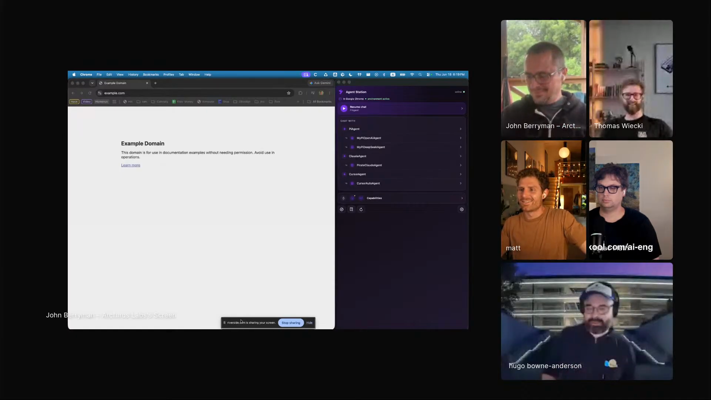
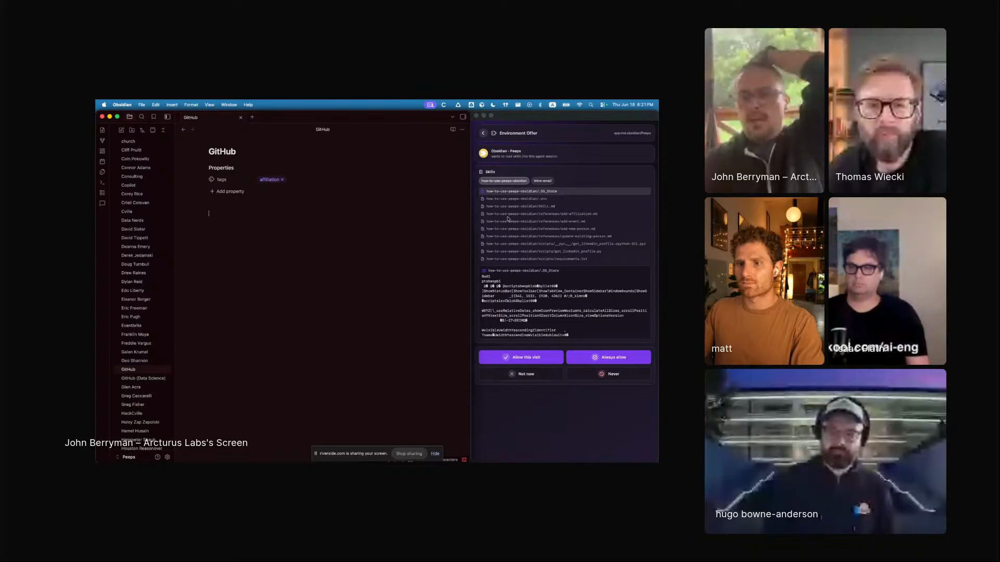
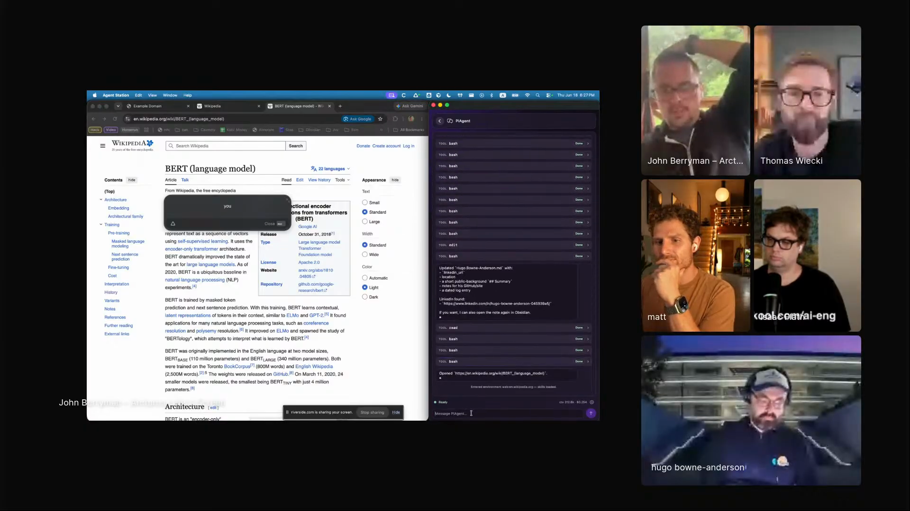
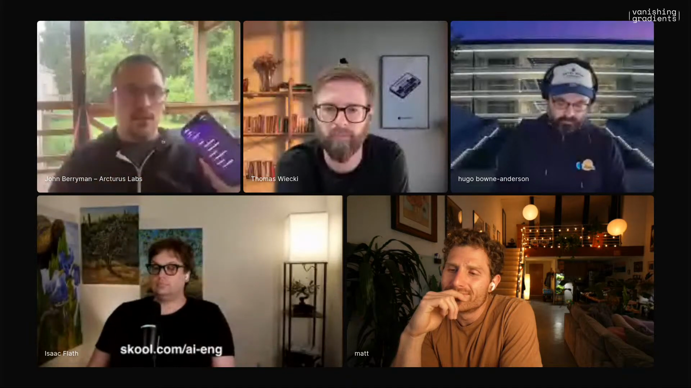

# agents-that-follow-you

A portable agent harness that moves with the human across apps, websites, and physical places, picking up the local affordances of each environment. Captured from John Berryman's episode 5 segment, where Rook follows him into Obsidian, reads local skills, moves to a Wikipedia page, and points toward phone-based place context such as a grocery store.

## who showed it

John Berryman is an AI product and engineering consultant and the founder of Arcturus Labs. He works with startups and product teams on practical AI systems, retrieval, AI-native product design, and agent interfaces. Before Arcturus, he worked on early GitHub Copilot and code search infrastructure at GitHub.

## the premise

John's starting point is that most agent work still lives in the wrong place. The dominant harness sits in the terminal and operates on code, while many useful tasks happen in apps, websites, notes, stores, and the rest of daily life.

> *"By and large, our agent harness lives in the terminal and works on code."* [\[00:13:08\]](https://youtube.com/live/6zju7hyCFl0?t=788)

Rook is John's answer: a personal client that wraps agent runtimes, follows the active environment, and lets each environment expose what the agent can do there. Obsidian contributes vault navigation and local skills. Wikipedia contributes a page-specific discovery action. A future grocery store could contribute inventory, aisle layout, and substitutions.

> *"I wanted to take my agent with me anywhere I go and let it be able to do any task that is addressable in text and APIs."* [\[00:17:56\]](https://youtube.com/live/6zju7hyCFl0?t=1076)

Rook on the right side of John's screen: a portable client over multiple agent runtimes, built so the same agent can move with him. <a href="https://youtube.com/live/6zju7hyCFl0?t=984">[00:16:24]</a>

## principles

### 1. Treat the current app or site as the agent's environment

Rook watches where John is working and changes what the agent knows how to do. When he opens Obsidian, the agent recognizes the vault and gets the local skills for navigating John's people records.

> *"Whenever it follows me to a new environment, it gets the superpowers of that environment."* [\[00:18:47\]](https://youtube.com/live/6zju7hyCFl0?t=1127)

The environment is not decorative context. It is the unit that decides which capabilities, state, and permissions become available.

Rook follows John into Obsidian and picks up local vault affordances rather than staying in a generic chat or terminal session. <a href="https://youtube.com/live/6zju7hyCFl0?t=1127">[00:18:47]</a>

### 2. Let local skills handle known apps, and protocols handle unknown systems

John distinguishes between local apps he controls and systems that need safer bridges. Obsidian can be driven locally because it has a CLI and the local skill knows how to use it. Unknown external systems need an MCP or another explicit tool bridge.

> *"Obsidian has a CLI and so it knows about that from the skill."* [\[00:20:30\]](https://youtube.com/live/6zju7hyCFl0?t=1230)

For a reader, the principle is to avoid one universal integration story. Known local tools can expose small local skills. Unknown or external systems need a protocol boundary.

### 3. Make skills visible, but do not pretend visibility is enough

When Rook enters an environment, John says the skills are transparent enough to read. He also says that reading them is hard, like reading end-user license agreements. The user can inspect the mechanism, but the interface still needs better security and legibility.

> *"It's all very transparent. So if you're concerned you can read the skill."* [\[00:19:10\]](https://youtube.com/live/6zju7hyCFl0?t=1150)

> *"We've got to really lock down security eventually. It's hard to read, this is like end user license agreement files."* [\[00:19:16\]](https://youtube.com/live/6zju7hyCFl0?t=1156)

The workflow depends on permission and trust because every environment can add new capabilities to the agent.

### 4. Give websites affordances, not just content

John wants the same pattern on the web. A page should be able to send state to the user's agent, receive requests back, and let the user reshape the page. His Wikipedia demo is the small version: open the BERT page, find the model-size passage, and highlight it.

> *"It can follow me into a lot more places."* [\[00:23:47\]](https://youtube.com/live/6zju7hyCFl0?t=1427)

The page is no longer just text for the model to scrape. It becomes an environment with page-specific actions.

John moves Rook from Obsidian to the web and has the Wikipedia skill highlight the original BERT model-size passage, the simplest visible version of a page that gives an agent local affordances. <a href="https://youtube.com/live/6zju7hyCFl0?t=1498">[00:24:58]</a>

### 5. Recover missing capabilities in the session

During the LinkedIn attempt, John notices the vanilla Pi agent does not come with search. Hugo points out that Pi can write its own search tool and hot-load it in the same session, and John confirms that this appears to be what happened.

> *"Pi agent does not come by default with search. So that's gonna make it really hard to... holy crap."* [\[00:22:44\]](https://youtube.com/live/6zju7hyCFl0?t=1364)

A portable agent harness should not require every capability to exist before the task begins. It should be able to notice a missing affordance, create or load the tool it needs, and continue.

### 6. Let physical places contribute their own context

John's final move is the phone. Rook should not only follow the desktop. When John enters a grocery store, the phone can provide location, the store can provide inventory and aisle layout, and the agent can combine that with John's shopping list.

> *"Okay, Kroger skill, use what you know about this location to plan the ideal path through this place to get out of here."* [\[00:28:02\]](https://youtube.com/live/6zju7hyCFl0?t=1682)

The principle generalizes beyond Kroger. A home, a workplace, a store, or a web page can each become an environment that adds local state and local actions to the same personal agent.

John moves the workflow from desktop apps into phone and place context: the phone can carry the agent into physical environments such as a grocery store. <a href="https://youtube.com/live/6zju7hyCFl0?t=1682">[00:28:02]</a>

## what a session looks like

There are six moves in John's demo:

1. **Enter an app environment.** John opens Obsidian. Rook recognizes the active app and vault, exposes local skills, and accepts a scoped permission for the visit.
2. **Ask for an action in that environment.** John asks Rook to open Hugo's page in the people vault, then to track Hugo down on LinkedIn and add what it learns to the document.
3. **Move to a web environment.** John opens Wikipedia, allows the page environment, asks for BERT, then asks the agent to find and highlight a specific passage on the page.
4. **Carry the same agent to the phone.** Rook lives on John's phone, so the same personal context can move with him into physical environments.
5. **Let the place add affordances.** In the grocery-store example, the environment would add inventory, aisle structure, item locations, and substitutions.
6. **Merge personal and local context.** The agent combines John's own data, such as an Obsidian shopping list, with the current environment's state.

The reusable loop is: enter an environment, grant scoped permission, let that environment expose local affordances, ask the agent to act, then carry the same agent to the next environment.

## anti-patterns

- **Keeping the agent trapped in the terminal.** Code is only one environment. If the task lives in Obsidian, Wikipedia, a browser tab, or a store, the harness has to move there.
- **Treating every integration as an MCP server.** Known local apps can often be driven by a small skill and a CLI. Unknown systems need stricter tool boundaries.
- **Inventing one global skill pile.** The point is local affordances. Each environment should expose what is relevant there, instead of dumping every possible capability into every session.
- **Assuming transparency solves security.** A readable skill file helps, but John is explicit that people still need better security and permissioning.
- **Making web pages passive documents.** If a site only gives the agent text to read, the user is stuck with summarization. The more interesting pattern is a page that accepts requests and can change.
- **Skipping the human permission moment.** John explicitly allows the Obsidian environment for the visit before asking it to act.

## what you need

The pattern is harness-agnostic in principle. John's current setup, which is the one shown on the episode:

- **A portable agent client.** John uses Rook, a Swift client that wraps multiple runtimes behind one interface and follows the active environment.
- **An agent runtime that accepts tools and skills.** John spends most of the demo in [Pi](https://pi.dev/), because he can add tools, skills, and startup parameters.
- **A message protocol between clients and runtimes.** Rook talks through Agent Client Protocol, which John describes as a way of unifying messages back and forth between clients.
- **Environment detection.** The harness needs a notion of the active app, website, or place.
- **Local environment skills.** Obsidian works locally because the environment has skills and the app has a CLI.
- **Protocol or tool bridges for unfamiliar systems.** John expects unknown systems to require MCP or an equivalent bridge.
- **Scoped permissioning.** The user grants an environment access for the current visit.
- **A phone client for place context.** The physical-environment version needs location, reverse geocoding, and a way for places to contribute local data.

## watch it

- [**00:13:08**](https://youtube.com/live/6zju7hyCFl0?t=788): John names the constraint: the agent harness mostly lives in the terminal and works on code.
- [**00:14:05**](https://youtube.com/live/6zju7hyCFl0?t=845): English-authored skills change how John thinks about bespoke loops.
- [**00:16:24**](https://youtube.com/live/6zju7hyCFl0?t=984): Rook appears on screen as John's portable agent client.
- [**00:17:56**](https://youtube.com/live/6zju7hyCFl0?t=1076): John states the ambition: take the agent anywhere he goes.
- [**00:18:47**](https://youtube.com/live/6zju7hyCFl0?t=1127): Rook follows him into Obsidian and gains the environment's superpowers.
- [**00:20:30**](https://youtube.com/live/6zju7hyCFl0?t=1230): Obsidian works locally because the skill knows about the CLI.
- [**00:22:44**](https://youtube.com/live/6zju7hyCFl0?t=1364): The LinkedIn attempt reveals a missing search capability and Pi appears to recover.
- [**00:24:13**](https://youtube.com/live/6zju7hyCFl0?t=1453): John invokes the Wikipedia skill.
- [**00:25:36**](https://youtube.com/live/6zju7hyCFl0?t=1536): John clarifies that "open agent protocol" is a placeholder for something he thinks should exist.
- [**00:27:02**](https://youtube.com/live/6zju7hyCFl0?t=1622): Rook lives on John's phone as his personal agent.
- [**00:28:02**](https://youtube.com/live/6zju7hyCFl0?t=1682): The Kroger example shows how a physical place could add inventory, aisle layout, and substitutions.
- [**00:29:31**](https://youtube.com/live/6zju7hyCFl0?t=1771): John generalizes the pattern: environments can add skills like a personal version of the place.

## see also

- [`workflows/personal-agent-harness/`](../personal-agent-harness) for Eleanor Berger's adjacent pattern: an always-on personal agent on separate hardware, accessed through chat, with autonomy granted gradually.
- [`workflows/local-first-agents/`](../local-first-agents) for another Pi-centered workflow where the harness itself is deliberately thin and reshaped by the operator.
