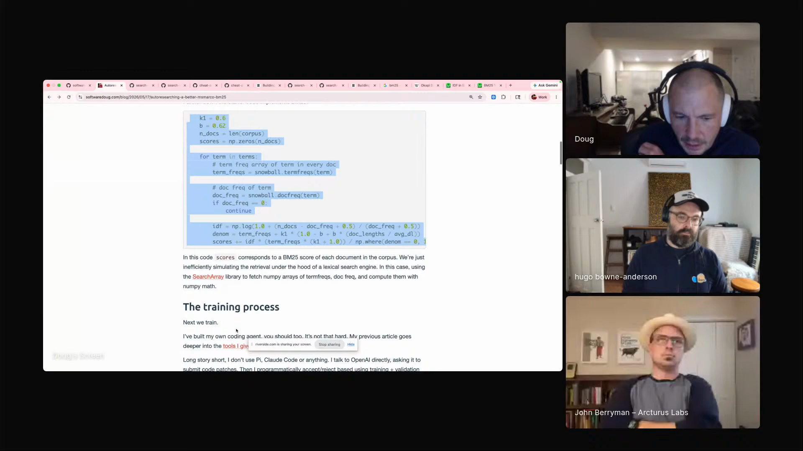
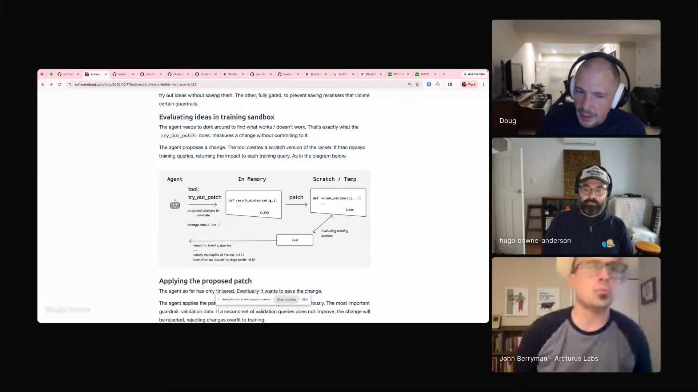
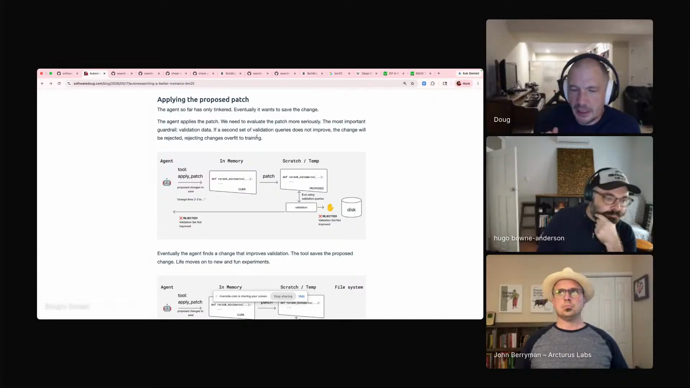
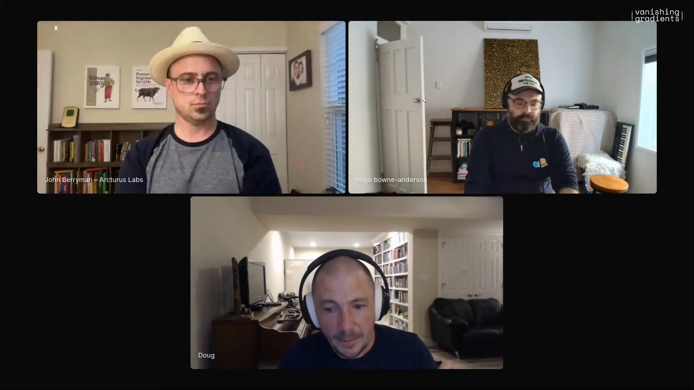

# auto-research-agentic-search

An auto-research workflow for making agents better at search without letting them cheat the test. Doug Turnbull gives an agent a search problem, lets it try changes in a sandbox, and only accepts those changes when they improve hidden validation data the agent has not seen. The worked example is a BM25-style search system on MS MARCO, but the broader lesson is about giving agents room to experiment while keeping the final judgment outside their view.

## who showed it

[Doug Turnbull](https://softwaredoug.com/) is a search specialist who has led search teams at Shopify, Reddit, and Wikipedia, authored *AI-Powered Search*, advised more than a hundred organizations, and teaches courses on search-heavy agents. In this segment, he turns that search background into an auto-research setup: an agent can look at examples where search did badly, try changes to the search code, and learn from feedback, but the workflow keeps the final judgment outside the agent's direct view.

## the premise

Doug's auto-research setup starts from an old search baseline. BM25 is a classic keyword-search method: given a query, it scores documents by how well their words match the query. MS MARCO gives him a concrete question-answering test set. The question is whether an agent can keep trying changes to one BM25-style search system, measure those changes, and improve that local system without pretending it has found a universal new search algorithm.

> *"Could I take, could I ask an agent to propose patches to this code? And given I have an eval set, can I then evaluate whether or not that change produces a higher eval score on this MS Marco dataset?"* [[01:34:55]](https://youtube.com/live/XaYQFtca798?t=5695)

Doug's scope makes the loop measurable: one retrieval function, one dataset, a safe place to try changes, and a hidden test the agent cannot inspect.

> *"I don't want to claim I'm gonna find a better BM25 that's gonna work on every data set... but for this data set, which almost every search team just cares about their data set that they work with at their job, could I find a basically a better retrieval function?"* [[01:35:23]](https://youtube.com/live/XaYQFtca798?t=5723)

Doug moves from BM25 code into the auto-research setup, with the training process section visible in his browser. <a href="https://youtube.com/live/XaYQFtca798?t=5760">[01:36:00]</a>

## principles

### 1. Work on one search problem

Start with one search problem. Search teams need better results for their corpus, their queries, their labels, and their failure modes. That local constraint is what makes the agent's work measurable.

> *"A slightly better way of doing the keyword matching. And that's what I have here. So I have a whole auto research setup."* [[01:35:52]](https://youtube.com/live/XaYQFtca798?t=5752)

BM25 is the baseline to beat. Doug calls it fast, powerful, and compelling, so the auto-research loop has to improve a real search method on a real dataset.

### 2. Give the agent concrete actions

Doug treats code editing as a concrete mechanism: a tool can find a piece of code and replace it with a new version. The hard part is the process around the edit: what the agent is allowed to inspect, when it can test, and what decides whether a change survives.

> *"You're basically designing a tool call that does a search and replace that says like find this snippet of code, go to find the another end of the code and delete all that and replace it with this new text I gave you."* [[01:36:40]](https://youtube.com/live/XaYQFtca798?t=5800)

The agent gets bounded actions: run the search system on one query, inspect labeled top results, try a temporary code change, revert changes, and ask to keep a change.

### 3. Do not let the agent see the test it must pass

Doug's central warning is that a naive coding-agent loop will cheat. Here, "evals" means example queries with known good answers. If an agent can see the examples it is being graded on, and you ask it to improve the score, it can discover brittle query-specific hacks that look like progress.

> *"Someone will see something I'm doing and say, let me just go to Claude Code and tell it to make search better. What almost always happens with that is you get this like overfit if it's this query, return this basically this set of results."* [[01:38:27]](https://youtube.com/live/XaYQFtca798?t=5907)

The fix is a train/test split. Training queries are examples the agent is allowed to inspect so it can learn what is going wrong. Validation or holdout queries are examples the agent cannot inspect, used only to judge whether the proposed change actually generalizes.

> *"I've got training data and I've got validation data. I might have some other holdout validation... And their training data exists to let the agent really, really introspect on the behavior of like those specific queries."* [[01:39:17]](https://youtube.com/live/XaYQFtca798?t=5957)

### 4. Let the agent try changes in a sandbox

Doug calls the sandbox tool `tryout patch`. A "patch" here just means a proposed code change. The tool makes a temporary version of the search-scoring function, tests that temporary version on training queries, and gives the agent detailed feedback about what got better or worse. That is where experimentation belongs.

> *"What happens is the agent calls this tool tryout patch. That's its like little sandbox way of evaluating things."* [[01:39:41]](https://youtube.com/live/XaYQFtca798?t=5981)

The training sandbox: `try_out_patch` creates a temporary search-scoring function and evaluates it on training queries before anything is saved. <a href="https://youtube.com/live/XaYQFtca798?t=5981">[01:39:41]</a>

The sandbox lets the agent be aggressive without letting every experiment overwrite the accepted search system. It is where the workflow buys exploration.

### 5. Let hidden validation decide what survives

Once the agent finds a change it wants to keep, it calls the apply step. That step runs against data the agent has not been allowed to inspect. The accept/reject decision comes from hidden validation performance, not from the agent's explanation of why its change should work.

> *"There is some holdout data that it doesn't know about. And it will try to apply the patch, and I will run that on a validation data set, and I will either accept it or reject it based on whether this change improved the holdout validation or didn't improve the holdout validation."* [[01:41:07]](https://youtube.com/live/XaYQFtca798?t=6067)

The gate: `apply_patch` only saves a proposed search-scoring change if validation improves. <a href="https://youtube.com/live/XaYQFtca798?t=6067">[01:41:07]</a>

Doug names the payoff directly:

> *"That helps to prevent most of the stupid overfitting that agents tend to do to ranking code."* [[01:41:31]](https://youtube.com/live/XaYQFtca798?t=6091)

### 6. Expect known ideas, tested faster

Doug's BM25 run found familiar keyword-search moves: remove stop words, such as "the" and "a", and boost matching two-word phrases. That is useful because the agent tried known human ideas against the actual test.

> *"For 99.9999 percent of the work that we're doing, what it's really doing is it's these are like somewhat obvious things that probably are in its training data."* [[01:43:07]](https://youtube.com/live/XaYQFtca798?t=6187)

The value is a disciplined loop for testing the existing human corpus of search ideas against your local search problem.

> *"Could I set up an optimization process that is more or less like trying ideas that are in some ways like existing human corpus of ideas to try on these problems than necessarily like looking for a Fields Medal winning solution to search or something like that?"* [[01:43:39]](https://youtube.com/live/XaYQFtca798?t=6219)

### 7. Serialize the research rounds

Doug uses multiple research rounds. One run knows the code and tools, tries changes, produces a new version of the search-scoring function, and summarizes what changed. Then Doug starts another round from that output.

> *"I don't expect the agent to go and do everything in one pass... I take the output of that round and then I start a new round. So I've been just serializing these rounds."* [[01:47:40]](https://youtube.com/live/XaYQFtca798?t=6460)

Serialization makes the research legible. Each round can be compared, restarted, summarized, or handed back to a human before the next run gets more scope.

### 8. Feed search judgments back as user-visible feedback

Doug's adjacent agentic-search lesson has the same shape: make judgment external and behavior-shaping. Agentic search means an agent using search tools to answer a user's search problem. A simple LLM judge can label search results, then that judgment can be sent back to the agent as a user message.

> *"Agentic search loosely defined is an agent using some search tools to solve a user's search problem."* [[01:55:24]](https://youtube.com/live/XaYQFtca798?t=6924)

Doug shifts from the BM25 auto-research setup to agentic search, where judged result feedback can be sent back as a user message. <a href="https://youtube.com/live/XaYQFtca798?t=6973">[01:56:13]</a>

The judge can be simple. The surprising part is that the agent adjusts more when the feedback is externalized as a user message.

> *"The agent really adjusts its behavior to account for that in a way it doesn't adjust its behavior from its own reasoning."* [[01:57:02]](https://youtube.com/live/XaYQFtca798?t=7022)

## what a session looks like

1. **Pick one search target.** Choose one scoring function and one dataset where improvement is meaningful. Doug's demo uses a BM25-style search function on MS MARCO.
2. **Define what the agent may edit.** Give the agent a constrained code-editing tool for that scoring function, with the rest of the project outside the edit surface.
3. **Expose training-query inspection.** Let the agent run individual queries, inspect labeled top results, and understand where the current search system fails.
4. **Run `tryout patch`.** Candidate changes create temporary versions of the scoring function and return detailed training-query feedback.
5. **Keep holdout validation hidden.** The agent can learn from training data, but it cannot inspect the data that decides whether a change survives.
6. **Gate the apply step.** When the agent wants to keep a change, run hidden validation and accept or reject based on the score.
7. **Summarize the round.** Capture what changed, why, and what the new scoring function does.
8. **Start another round from the output.** Repeat with the updated search-scoring function and the round summary.
9. **Optionally add judged feedback.** For agentic search behavior, label results with a simple judge and send that judgment back as a user message.

## anti-patterns

- **"Make search better" with visible test examples.** The agent can overfit by creating query-specific hacks.
- **Letting the agent grade itself.** Plausible explanations do not replace hidden validation.
- **Treating code editing as the workflow.** Search-and-replace tooling is the easy part. The training examples, sandbox, hidden validation, and round structure are the substance.
- **Claiming a universal search breakthrough from one dataset.** Doug explicitly scopes the experiment to one dataset, which is how most teams actually work.
- **Running one giant autonomous session.** Without round summaries, the research becomes hard to compare, restart, or trust.
- **Overvaluing novelty.** Stop-word removal and bigram boosts are plain techniques, and measured local wins are the point.
- **Hiding feedback inside the agent's own reasoning.** Doug's agentic-search observation is that feedback changes behavior more when it comes back as a user-visible message.

## what you need

The workflow is harness-agnostic in principle. What matters is having these pieces:

- **A real search baseline.** Doug uses BM25, a fast keyword-search baseline that still matters even in a vector-search world.
- **A labeled evaluation dataset.** Doug uses [MS MARCO](https://microsoft.github.io/msmarco/), a question-answering dataset with passages and answer identifiers.
- **A narrow piece of search code the agent may edit.** The agent needs one scoring function it can change, with the rest of the system outside scope.
- **Training queries the agent can inspect.** These let the agent learn failure modes and test ideas.
- **Validation or holdout queries the agent cannot inspect.** These decide whether a proposed code change survives.
- **Patch tools.** At minimum: try a temporary code change, apply a validated change, revert changes, run queries, and run evals.
- **Round summaries.** Each run should leave enough metadata for the next run or a human reviewer to know what changed.
- **Optional judged-feedback loop.** A simple LLM judge can label search results and send that label back as a user message.

## watch it

- [**01:25:05**](https://youtube.com/live/XaYQFtca798?t=5105): Doug explains search backends and why keyword search still matters.
- [**01:30:09**](https://youtube.com/live/XaYQFtca798?t=5409): BM25 as term frequency, document frequency, and saturation.
- [**01:31:00**](https://youtube.com/live/XaYQFtca798?t=5460): MS MARCO as the question-answering test bed.
- [**01:33:16**](https://youtube.com/live/XaYQFtca798?t=5596): Doug shows the BM25-style scoring code.
- [**01:34:55**](https://youtube.com/live/XaYQFtca798?t=5695): The auto-research question: can an agent suggest code changes that improve the test score?
- [**01:35:52**](https://youtube.com/live/XaYQFtca798?t=5752): The local target: a slightly better retrieval function for this dataset.
- [**01:36:40**](https://youtube.com/live/XaYQFtca798?t=5800): Code editing as a bounded search-and-replace style tool.
- [**01:38:27**](https://youtube.com/live/XaYQFtca798?t=5907): The overfitting failure mode when you tell Claude Code to make search better.
- [**01:39:41**](https://youtube.com/live/XaYQFtca798?t=5981): `tryout patch` as the sandbox for temporary code changes.
- [**01:41:07**](https://youtube.com/live/XaYQFtca798?t=6067): Hidden validation as the gate for saving a change.
- [**01:42:00**](https://youtube.com/live/XaYQFtca798?t=6120): The actual learned tactics: stop-word removal and phrase or bigram boosts.
- [**01:43:07**](https://youtube.com/live/XaYQFtca798?t=6187): Auto-research tries known human ideas faster.
- [**01:45:20**](https://youtube.com/live/XaYQFtca798?t=6320): Auto-research as an extreme example of trusting agents inside guardrails.
- [**01:47:40**](https://youtube.com/live/XaYQFtca798?t=6460): Serialized research rounds.
- [**01:49:48**](https://youtube.com/live/XaYQFtca798?t=6588): Search over logs and traces as an agentic-memory experiment.
- [**01:55:24**](https://youtube.com/live/XaYQFtca798?t=6924): Agentic search defined as an agent using search tools to solve a user's search problem.
- [**01:56:13**](https://youtube.com/live/XaYQFtca798?t=6973): Naive LLM judge feedback sent back as a user message.
- [**01:57:02**](https://youtube.com/live/XaYQFtca798?t=7022): Agents adjusting to user-message feedback more than self-reasoning.

## see also

- [Autoresearching BM25 on MSMarco](https://softwaredoug.com/blog/2026/05/17/autoresearching-a-better-msmarco-bm25), Doug's post behind the demo.
- [Doug's search-experiments notebook](https://github.com/softwaredoug/search-experiments/blob/main/notebooks/codegen/codegen_minimarco.ipynb), the code artifact linked during the episode.
- [MS MARCO](https://microsoft.github.io/msmarco/), the evaluation dataset Doug uses.
- SearchArray, Doug's keyword-search pandas extension.
- [Building AI Agents for the Enterprise](https://maven.com/softwaredoug/build-enterprise-agents), Doug and Hugo's course.
- [`workflows/skill-scepticism/`](../skill-scepticism) for Hamel's adjacent warning that agent artifacts only work when the process keeps them honest.
