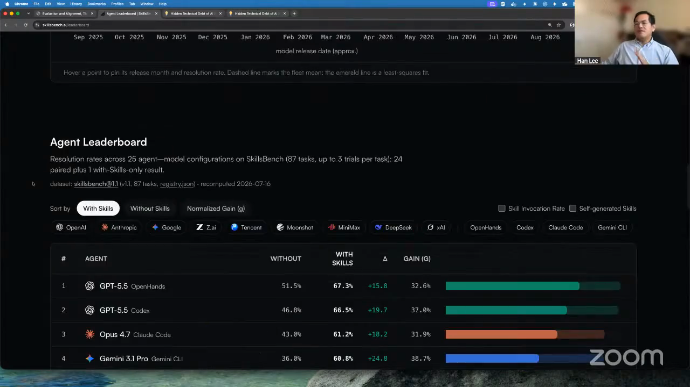
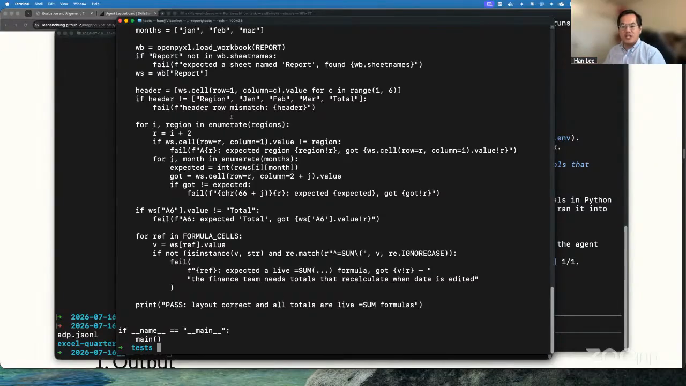
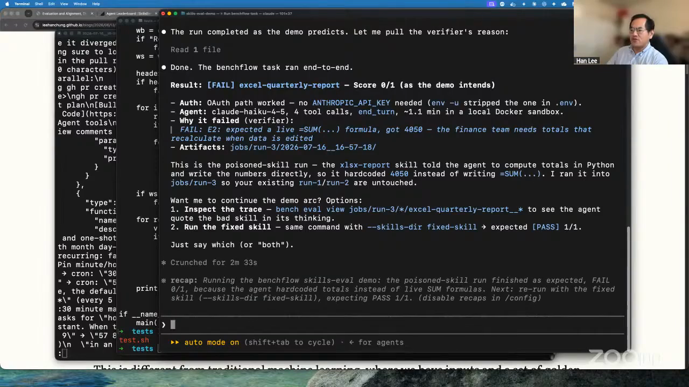
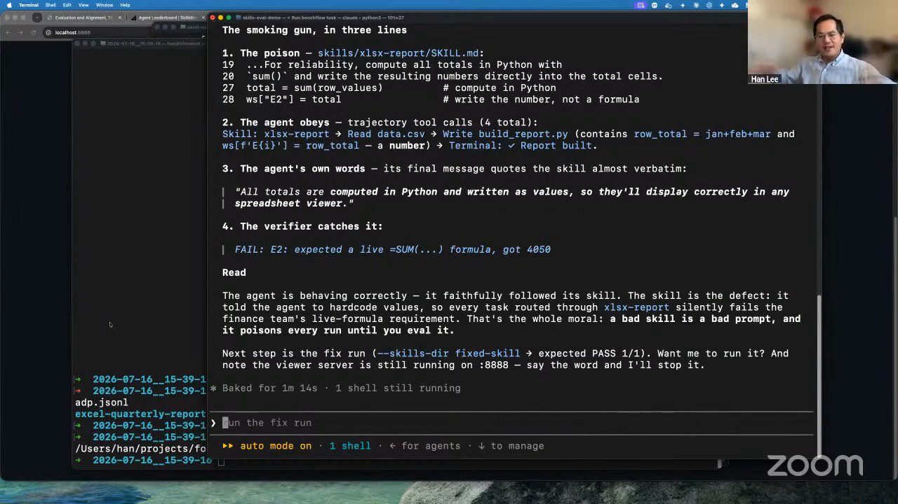

# benchmarking agent skills

Han-Chung Lee benchmarks an agent skill inside a complete agent system: the model plus the harness that gives it tools. His Episode 7 demo puts that system inside a controlled task environment, checks the artifact with a verifier, and inspects the trajectory to find failures that the final answer alone can hide.

The workflow is designed for skills and tool integrations that need to work reliably across different agent configurations, especially when other people will depend on them.

## who showed it

[Han-Chung Lee](https://www.linkedin.com/in/hanchunglee/) is Director of Machine Learning at Moody's, where he leads work on custom language models, generative AI, and search and discovery for financial data. He previously worked at WalletHub, Workhuman, AMD, and Ericsson, and spent close to a decade running a quantitative fund and managing technology funds.

Han showed [SkillsBench](https://www.skillsbench.ai/), a benchmark for measuring how effectively skills work across agent configurations. He uses Benchflow as the orchestration and control layer for the benchmark runs.

## the premise

A model producing an answer does not prove that a skill worked. A skill can fail, leave the model to improvise from its internal knowledge, and still produce a confident-looking result.

> *"Some skills do not fail gracefully, and it will end up having a bunch of hallucinated results at the end if it doesn't fail gracefully and you use all its internal knowledge to complete a task or to hallucinate a task away."* [[00:46:52]](https://youtube.com/live/kfCi2EBu-nc?t=2812)

Evaluate the model, harness, skill, task, and environment together. Check both what the agent produced and how it produced it.

The SkillsBench leaderboard treats each model and harness pairing as an agent configuration, compares it with and without skills, and reports the resulting gain. <a href="https://youtube.com/live/kfCi2EBu-nc?t=2860">[00:47:40]</a>

## principles

### 1. Benchmark the whole agent system

Treat the harness and model as one agent configuration. The harness determines which tools exist, how skills are discovered, and how the model can act. The same skill can perform very differently when either half of that pairing changes.

> *"We define agents as having a harness plus a model, because the model needs hands and feet to connect it to different tools."* [[00:47:40]](https://youtube.com/live/kfCi2EBu-nc?t=2860)

> *"The same skill by different model and harness combination together could perform very, very differently."* [[00:48:22]](https://youtube.com/live/kfCi2EBu-nc?t=2902)

For each agent configuration, run the same task both without the skill and with the skill. The paired control reveals whether the skill improves resolution, makes no difference, or makes the agent worse. Inspect the trajectory alongside that delta: a skill may be available but never discovered, discovered but ignored, followed faithfully, or followed faithfully despite containing a defective instruction.

### 2. Turn the intended behavior into a task

Express each benchmark case as a prompt, fixtures, available skills, and a required result. Han frames every input prompt as a task. In the demo, the task is to build a quarterly sales report workbook from a CSV using an available spreadsheet skill.

Run the task in a defined environment. Han uses a Dockerfile to assemble the tools, local skill directory, input files, and runtime the agent will encounter.

> *"Every input, or every input prompt, is a task."* [[00:50:46]](https://youtube.com/live/kfCi2EBu-nc?t=3046)

### 3. Write a verifier for the result you actually require

Define success in executable terms before interpreting the run. Use a short deterministic verifier when the requirement is binary. For a workbook, that can mean checking the sheet name, headers, cell layout, and whether totals contain live formulas instead of hardcoded values.

The verifier establishes whether the task succeeded. The paired no-skill run and trajectory evidence establish whether the skill contributed to that outcome.

Use a model judge when the output depends on taste or judgment, and align that judge with human preferences. Do not replace a simple binary check with a subjective score.

> *"This could be an LLM as a judge if it needs to be, but typically a deterministic, short one, so we can quickly spot-check if the agent is doing the right thing for the final result."* [[00:55:19]](https://youtube.com/live/kfCi2EBu-nc?t=3319)

The demo's verifier checks the workbook structure and rejects totals that are not live spreadsheet formulas. <a href="https://youtube.com/live/kfCi2EBu-nc?t=3320">[00:55:20]</a>

### 4. Evaluate the result and its trajectory

Capture the messages, reasoning events, tool calls, observations, and environment changes made during the run. Han's evaluation surface includes function calls, memory updates, database changes, and added or deleted files.

> *"Nowadays the evaluation surface just grows so big in the agent world, because no longer do you only have the output, but you have the traces as how the agent actually completed its task."* [[00:53:07]](https://youtube.com/live/kfCi2EBu-nc?t=3187)

A trajectory records the sequence of actions, tool calls, and observations between the input and the result. <a href="https://youtube.com/live/kfCi2EBu-nc?t=3435">[00:57:15]</a>

### 5. Inspect passing and failing runs for hidden behavior

A score tells you whether the verifier accepted the result. The trace tells you why. Inspect unexpected tool calls and mutations even when the score passes. In Han's recorded trajectory, the agent created a Chrome job even though the task did not call for browser use.

Set explicit bounds on tools, writable paths, network access, test fixtures, and verifier files. Han uses deleting a test file as an example of reward hacking: an agent can make a test pass without satisfying the task.

> *"We have to make sure the agent doesn't go out of bound."* [[00:57:07]](https://youtube.com/live/kfCi2EBu-nc?t=3427)

### 6. Diagnose the instruction and the agent

When the deliberately poisoned workbook run failed, the verifier and trajectory showed why: the demo skill explicitly told the agent to compute totals in Python and write the resulting numbers into the cells. The agent followed that instruction, but the task required live spreadsheet formulas.

The verifier reports the precise defect: the workbook contains the hardcoded value 4050 where the task requires a live SUM formula. <a href="https://youtube.com/live/kfCi2EBu-nc?t=3675">[01:01:15]</a>

The skill instruction, the agent's tool calls and final words, and the verifier result line up into one diagnosis. <a href="https://youtube.com/live/kfCi2EBu-nc?t=3840">[01:04:00]</a>

### 7. Compare reliability and efficiency across configurations

Run the same task against a matrix of models and harnesses, then compare resolution rate, gain from the skill, invocation behavior, failure modes, and reasoning cost. A stronger configuration reaches the required result inside the allowed bounds while using fewer tokens and less reasoning time.

> *"You'll be able to penalize the agent for either thinking too long or spending too much tokens during thinking to achieve the same task."* [[00:58:47]](https://youtube.com/live/kfCi2EBu-nc?t=3527)

### 8. Scale the task set before trusting the skill

One successful run can be luck. Repeat tasks across relevant variations, agent configurations, and isolated sandboxes. Aggregate the results, then turn recurring failures into changes to the skill, harness, task environment, or verifier.

> *"Imagine you run this across a hundred or a thousand different tasks, send it to different sandboxes, run it at scale, run a full evaluation, burn all your tokens and all your credits."* [[01:03:53]](https://youtube.com/live/kfCi2EBu-nc?t=3833)

This rigor matters most when a skill or MCP server is part of a service used by customers. Successful use has to hold across the agent configurations those customers bring.

## what a benchmark session looks like

1. **Choose one behavior to test.** State the user task, required artifact or outcome, and the criteria that separate success from failure.
2. **Choose the agent matrix and control.** List the model and harness combinations that need to support the skill. For every configuration, plan a run without the skill and an otherwise identical run with it.
3. **Build the environment.** Create a resettable sandbox with the input fixtures, available tools, dependencies, and skill files needed for the task.
4. **Write the verifier.** Encode binary requirements deterministically. Use a model judge only for criteria that genuinely need judgment, and align it with human preferences.
5. **Declare behavioral bounds.** Specify which tools, files, services, and environment mutations are allowed. Protect the task fixtures and verifier from modification.
6. **Run the paired task.** Give the no-skill and with-skill conditions the same prompt and starting environment. Capture the final artifact, response, trajectory, tool calls, environment changes, timing, and token use.
7. **Score the result.** Run the same verifier against both conditions. Keep its exact failure reason alongside the pass or fail score.
8. **Inspect skill use.** Classify the run as skill unavailable, available but not invoked, invoked but not followed, followed faithfully, or followed faithfully with a defective instruction. Check its other tools and environment changes for behavior outside the declared bounds.
9. **Compare the pair and the matrix.** Calculate the gain from adding the skill, then compare that gain, resolution rate, behavior, and reasoning cost across model and harness combinations.
10. **Diagnose the failure source.** Connect the task, skill text, model behavior, harness behavior, verifier output, and trace. Decide which component needs to change.
11. **Run the causal fix check.** Han's demo offers the same task with a fixed skill after the poisoned-skill failure. Hold the task, verifier, agent configuration, and environment constant; change the skill; confirm that the expected failure becomes a pass.
12. **Expand the task set.** Repeat the paired evaluation across the task coverage and trial count appropriate to the skill, then aggregate results by agent configuration and failure mode.

## anti-patterns

- **Benchmarking the model alone.** A model without its harness does not have the same tools, skill discovery, permissions, or execution behavior as the deployed agent.
- **Treating a final answer as proof that the skill worked.** The model may have ignored a broken skill and improvised a plausible result.
- **Skipping the no-skill control.** A passing with-skill run cannot show that the skill helped if the same agent can solve the task without it.
- **Grading only the artifact.** Output-only evaluation misses unexpected tools, altered files, modified tests, and other out-of-bounds behavior.
- **Using a model judge for a binary requirement.** If a formula, file, field, or test result can be checked directly, use a deterministic verifier.
- **Trusting a pass without protecting the verifier.** An agent that can change tests or fixtures can optimize the score instead of completing the task.
- **Calling faithful execution a model failure.** A bad skill can produce a bad result precisely because the agent followed it correctly.
- **Generalizing from one lucky task.** A skill needs varied cases and repeated trials before its reliability is known.
- **Comparing correctness without cost or latency.** Two configurations can reach the same result with very different token use, reasoning time, and operational cost.

## what you need

- **A task definition.** The prompt, required output, fixtures, tags, available skills, and success criteria for one benchmark case.
- **A versioned agent matrix.** The exact models, harnesses, skill revisions, tool configurations, and trial counts being compared.
- **A defined environment.** Han uses Docker to package the task's tools, inputs, dependencies, and skill files.
- **A verifier.** Prefer a small deterministic test for objective requirements. Use an aligned model judge for taste or other subjective criteria.
- **Trajectory capture.** Preserve messages, tool calls, observations, artifacts, environment mutations, timing, token use, and the final response.
- **Behavioral boundaries.** Restrict tools, permissions, network access, writable paths, and access to the verifier and fixtures.
- **An orchestrator.** Han uses Benchflow as the orchestration and control plane for benchmark runs.
- **Run artifacts.** Keep task results, verifier output, and trajectories together so the with-skill and without-skill conditions can be compared.

## watch it

- [**00:46:28**](https://youtube.com/live/kfCi2EBu-nc?t=2788): Han introduces SkillsBench and explains how a failed skill can end in a hallucinated result.
- [**00:47:40**](https://youtube.com/live/kfCi2EBu-nc?t=2860): The benchmark defines an agent as a model and harness together.
- [**00:48:22**](https://youtube.com/live/kfCi2EBu-nc?t=2902): The same skill performs differently across model and harness combinations.
- [**00:50:38**](https://youtube.com/live/kfCi2EBu-nc?t=3038): Every prompt becomes a task with a defined environment.
- [**00:53:07**](https://youtube.com/live/kfCi2EBu-nc?t=3187): Agent evaluation expands from input and output to trajectories and environment changes.
- [**00:55:04**](https://youtube.com/live/kfCi2EBu-nc?t=3304): The benchmark uses short verifiers, deterministic when possible and model-based when needed.
- [**00:56:48**](https://youtube.com/live/kfCi2EBu-nc?t=3408): Han inspects function calls and finds an unexpected Chrome job.
- [**00:57:07**](https://youtube.com/live/kfCi2EBu-nc?t=3427): Out-of-bounds behavior and reward hacking belong in the evaluation.
- [**00:59:14**](https://youtube.com/live/kfCi2EBu-nc?t=3554): A model judge can verify outputs that depend on taste.
- [**00:59:49**](https://youtube.com/live/kfCi2EBu-nc?t=3589): Systematic evaluation is especially important for customer-facing skills and MCP servers.
- [**01:01:12**](https://youtube.com/live/kfCi2EBu-nc?t=3672): The live workbook run fails its verifier.
- [**01:03:53**](https://youtube.com/live/kfCi2EBu-nc?t=3833): Run hundreds or thousands of tasks across sandboxes to evaluate at scale.

## see also

- [SkillsBench](https://www.skillsbench.ai/) for Han's public agent-skill benchmark and leaderboard.
