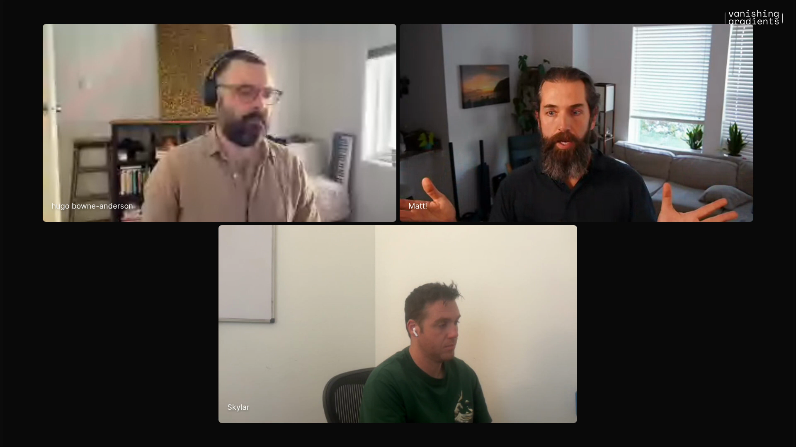

# company-context-agents

Matt Rocklin's workflow is to give agents enough company context to work across the business: accounting, contracts, customers, product, engineering, legal, logs, and support. The incredible part is the breadth. An agent that is decent across all of those domains can notice gaps no single specialist is likely to see, because the useful answer often lives between departments. Captured from Matt's Episode 6 segment, where he describes agents finding missed billing, improving legal documents, and helping him run Coiled with a few hours a week of human attention.

## who showed it

Matt Rocklin writes software in the open-source Python data and compute ecosystem, including Dask and Coiled. His Episode 6 segment moves between broad context, handwritten `AGENTS.md` files, feedback systems, and the way agents can help run a small software company. In his June 2026 post ["Updated Thoughts on AI"](https://matthewrocklin.com/ai-2026-06/), he makes the same claim in writing: the biggest recent gains are coming from broad context, cross-domain reasoning, and feedback systems.

## the premise

Matt spends only a few hours a week on Coiled and runs much of the company with agents. The workflow depends on giving those agents the context of the whole company. This is powerful because companies are usually split across people and systems: the lawyer sees the contract, accounting sees the invoice, engineering sees product behavior, support sees the customer pain, and no one person naturally holds all of it at once.

> *"I spend like five to 10 hours a week on this company that makes, million or two a year. And I run it mostly with agents."* [\[00:12:28\]](https://youtube.com/live/UwAGIkWFQ78?t=748)

The important object is a company-context directory. It gives agents a shared surface for accounting, engineering, customers, legal, insurance, and other parts of the business.

> *"I've got a directory that like describes the company and it's got sections for accounting, sections for engineering, sections for customers, sections for legal, sections for insurance, everything."* [\[00:13:38\]](https://youtube.com/live/UwAGIkWFQ78?t=818)

Matt explains the value of broad company context: agents can connect contracts, usage, accounting, product, and legal in one pass. <a href="https://youtube.com/live/UwAGIkWFQ78?t=863">[00:14:23]</a>

Matt's blog post puts the same idea plainly: the surprising value is "super-human breadth." In the post, he describes agents connected to code, logs, support channels, customer activity, contracts, legal forms, and QuickBooks. The payoff is the same as the episode example: agents can reason across the company boundary lines that make human collaboration slow.

## principles

### 1. Put the whole company where the agent can read it

The agent needs more than the codebase. It needs the surrounding business context: customers, contracts, billing, product usage, legal docs, insurance, support, logs, and the operating assumptions that usually live in people's heads.

> *"The agents actually understand the full company way that historically no individual has."* [\[00:13:53\]](https://youtube.com/live/UwAGIkWFQ78?t=833)

### 2. Ask for cross-functional gaps

The valuable finds are often between departments. Matt's concrete example is a billing gap that required sales context, accounting context, product context, customer usage context, and contract context at the same time. In the blog post he adds the business consequence: Coiled makes more money because agents found customers who should have been billed and bugs in the billing code.

> *"They, for example, found that there were customers that we had contracts for that we were not billing, but that were using us a bunch because they understood like our sales process and our accounting system and our product."* [\[00:14:03\]](https://youtube.com/live/UwAGIkWFQ78?t=843)

### 3. Give broad context before a narrow prompt

The prompt can still ask a specific question. The difference is that the question is asked inside a large context surface, so the agent can bring in evidence from other parts of the company.

> *"What I found was quite valuable was giving agents not like a very focused prompt, but like a lot of very broad context."* [\[00:14:23\]](https://youtube.com/live/UwAGIkWFQ78?t=863)

### 4. Use agents in adjacent domains

Matt's legal example is about company-specific legal work. The agent can operate in legal language while also understanding the company, its product, and its customers.

> *"We can also speak Legalese."* [\[00:13:30\]](https://youtube.com/live/UwAGIkWFQ78?t=810)

The result was a legal document tuned to the company instead of a detached template.

> *"Our legal document now is actually like far more well tuned to the company."* [\[00:14:59\]](https://youtube.com/live/UwAGIkWFQ78?t=899)

### 5. Value rare combinations across domains

Matt's claim is that an agent can be useful across several domains at once.

> *"Because they're a B plus at all of those things simultaneously, they're kind of able to operate in a superhuman way."* [\[00:14:39\]](https://youtube.com/live/UwAGIkWFQ78?t=879)

That combination is rare in a human organization: a useful programmer who is also useful enough at contracts, accounting, product, support, and customer context to notice mismatches between them. Human specialists go deeper, but the handoff between specialists is expensive. The agent's advantage is that it can hold the surrounding context in one working session.

## what a session looks like

1. **Collect the company surface.** Put the relevant business context in files the agent can read: customer notes, contracts, billing rules, usage data, legal templates, product docs, engineering docs, insurance notes, and support history.
2. **Name the business question.** Ask for a concrete result: find billing gaps, improve the master services agreement, compare contract terms to product behavior, or identify mismatches between customer commitments and implementation.
3. **Tell the agent to use the whole company.** Point it at the broad context directory before asking it to answer the narrow question.
4. **Make it cite the source trail.** The output should show which contracts, customer records, billing data, product facts, or legal clauses support each finding.
5. **Review with the owning function.** A billing issue needs accounting review, a legal rewrite needs legal review, a product commitment needs product or engineering review.
6. **Update the company context.** If the agent found a missing rule, stale doc, or hidden operating assumption, move that back into the company directory so the next agent starts smarter.

## anti-patterns

- **Department-only prompting.** If the agent only sees legal docs, accounting files, or code, it will miss the gap that crosses those boundaries.
- **Generic document generation.** A useful MSA session tunes the artifact against the actual company.
- **Treating non-code context as irrelevant to technical agents.** In this workflow, customer contracts and billing rules are part of the system.
- **Accepting cross-domain conclusions without source trails.** Broad context helps agents find things, but the human review still needs the underlying documents.
- **Letting company knowledge stay scattered.** If the agent has to rediscover the same context each time, the workflow does not compound.

## what you need

This workflow is harness-agnostic. Matt describes the shape of the operating model rather than a specific toolchain.

- **A company-context directory.** The central object is a readable directory that describes the company across functions.
- **Source documents.** Contracts, billing records, customer notes, product usage, legal templates, engineering docs, insurance notes, support records, logs, and operational dashboards should be available to the agent when relevant.
- **A narrow question inside broad context.** The question gives the session direction. The broad context gives the agent room to connect things.
- **Review owners.** Cross-functional findings still need human review from the responsible domain.
- **A maintenance habit.** When the agent finds missing context, add it back to the directory.

## watch it

- [**00:12:28**](https://youtube.com/live/UwAGIkWFQ78?t=748): Matt says he spends five to ten hours a week on a company making a million or two a year, and runs it mostly with agents.
- [**00:13:00**](https://youtube.com/live/UwAGIkWFQ78?t=780): The Coiled master services agreement as the legal example.
- [**00:13:30**](https://youtube.com/live/UwAGIkWFQ78?t=810): Agents let builders "speak Legalese."
- [**00:13:38**](https://youtube.com/live/UwAGIkWFQ78?t=818): The company directory with accounting, engineering, customers, legal, insurance, and everything else.
- [**00:13:53**](https://youtube.com/live/UwAGIkWFQ78?t=833): Agents can understand the full company in a way no individual historically has.
- [**00:14:03**](https://youtube.com/live/UwAGIkWFQ78?t=843): The missing-billing example across contracts, usage, sales, accounting, and product.
- [**00:14:23**](https://youtube.com/live/UwAGIkWFQ78?t=863): Broad context beats a very focused prompt for this kind of work.
- [**00:14:39**](https://youtube.com/live/UwAGIkWFQ78?t=879): The value of being B-plus across several domains at once.
- [**00:14:59**](https://youtube.com/live/UwAGIkWFQ78?t=899): The legal document is better tuned to the company.

## see also

- [`workflows/agent-feedback-systems/`](../agent-feedback-systems/) for Matt's adjacent workflow about giving agents live feedback systems before long turns.
- [Updated Thoughts on AI](https://matthewrocklin.com/ai-2026-06/) for Matt's written version of the same argument: broad context, cross-domain reasoning, and feedback systems.
- [Matt Rocklin's writing](https://matthewrocklin.com/) for his longer-form posts on agents, systems, and engineering practice.
- [Coiled](https://www.coiled.io/) for the company Matt references in the segment.
- [Dask](https://www.dask.org/) for the open-source distributed-computing project behind much of Matt's work.
