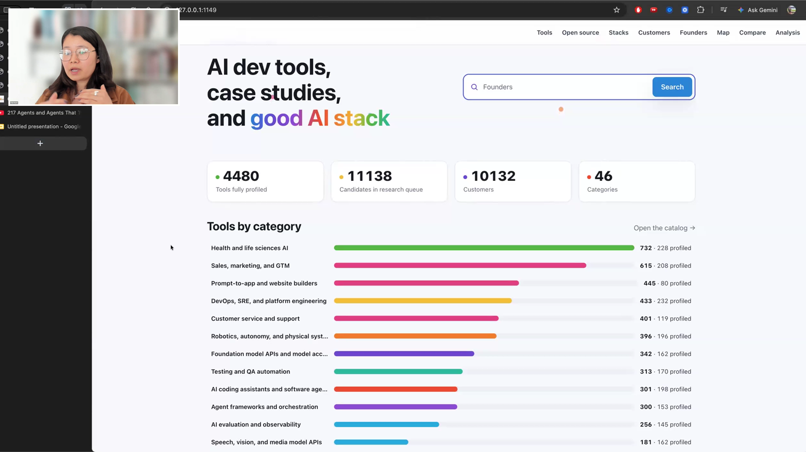
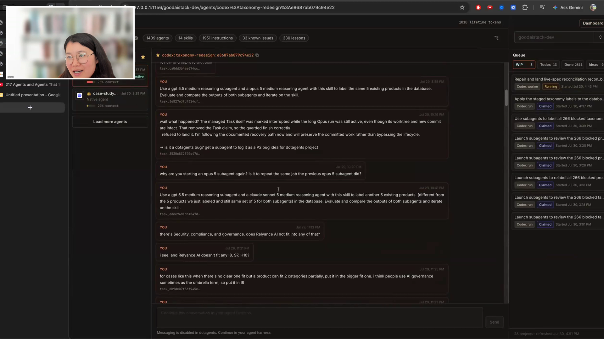
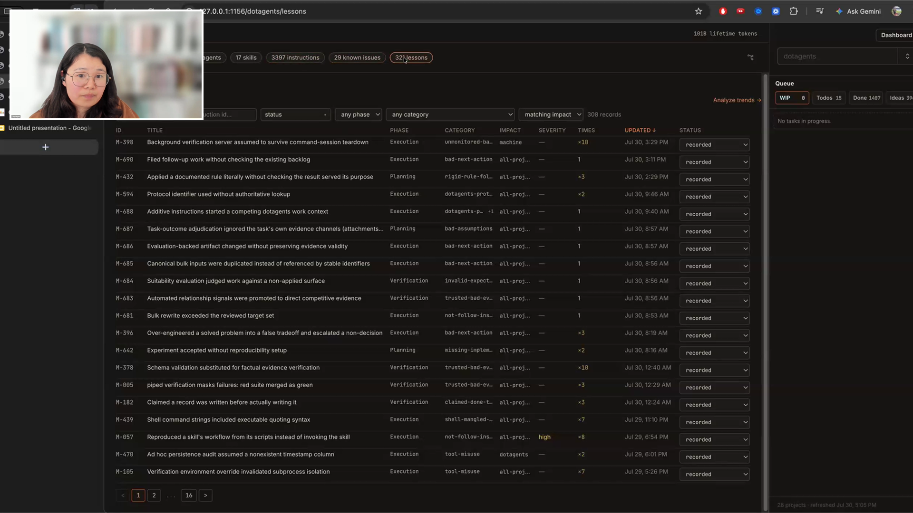

# Cross-provider agent swarms

Chip Huyen showed a project that had used 1,409 agents. Her runner puts a strong model such as Fable or Codex in charge of planning and review, then hands implementation to cheaper agents such as Sonnet, GPT-5.4, DeepSeek, or Kimi. It collects their work, sends it back through review, and keeps the original instruction, assigned agent, status, and evidence for every task. Chip can launch a large job, stop carrying messages between tabs, and return later to see what happened.

Chip joins Hugo, Tim, and Thomas before showing her cross-provider runner. <a href="https://youtube.com/live/NH-ic7-V-jY?t=2652">[00:44:12]</a>

## who showed it

[Chip Huyen](https://huyenchip.com/) is a writer and computer scientist focused on bringing AI into production. She taught Machine Learning Systems Design at Stanford, founded and sold an AI infrastructure company, and wrote *Designing Machine Learning Systems* and *AI Engineering*.

## the premise

Chip separates the work of understanding and supervising a task from the repeated implementation. A capable agent writes or reviews the plan, then delegates bounded pieces to faster, cheaper workers.

> *"I get a very strong agent to make plans and think, and then it assigns tasks to a bunch of cheaper agents to do it."* [\[00:50:08\]](https://youtube.com/live/NH-ic7-V-jY?t=3008)

Chip used the runner to maintain Good AI Stack, a directory of 4,480 AI tools divided into 46 categories. She gives the same labeling instructions to agents from different providers, compares their answers, fixes the guideline where they disagree, then sends the larger labeling job to cheaper agents.

> *"Follow the same guideline, and then compare the results, and then iterate on that. I find this process works really well."* [\[00:47:38\]](https://youtube.com/live/NH-ic7-V-jY?t=2858)

Good AI Stack's dashboard shows 4,480 fully profiled tools across 46 categories. <a href="https://youtube.com/live/NH-ic7-V-jY?t=2858">[00:47:38]</a>

## principles

### 1. Test the instructions before multiplying the workers

Two agents can follow an unclear guideline consistently when they share the same model biases. Chip deliberately brings in different providers, compares their labels, and revises the guideline where their answers diverge. Scale comes after this small cross-provider test.

> *"If you get the same agent of the same model, they have a lot of biases. They have similar biases, so they might make the same mistakes, so they might have similar results, but the guideline is not very good."* [\[00:47:48\]](https://youtube.com/live/NH-ic7-V-jY?t=2868)

### 2. Give planning and implementation to different classes of agent

The supervisor spends expensive reasoning on the plan, worker selection, review, and deciding whether the job is finished. Cheaper agents perform the repeated implementation. This preserves the strongest model's attention for decisions that affect every downstream worker.

> *"I feel like it's very wasteful to use strong models like Fable to do actual implementations."* [\[00:50:39\]](https://youtube.com/live/NH-ic7-V-jY?t=3039)

The selected runner project showed 1,409 agent entries. This is the project total displayed in the interface, not a count of concurrently active agents. <a href="https://youtube.com/live/NH-ic7-V-jY?t=2941">[00:49:01]</a>

### 3. Evaluate models for orchestration as well as task performance

A model that completes an individual task well may still supervise workers poorly. Chip distinguishes task ability from orchestration ability and gives the supervisory role to models that can plan, delegate, collect results, and keep workers moving.

> *"Not all models can act well as a super agent."* [\[00:52:31\]](https://youtube.com/live/NH-ic7-V-jY?t=3151)

### 4. Keep planning, review, and handoffs inside the runner

Chip previously copied plans and review comments between provider tabs. Her runner lets one agent request another agent's review and address it in the same conversation. The human sets the task and answers questions that need judgment, while routine agent-to-agent handoffs stay inside the system.

> *"That's why I built my runner, so they can do that in the same place."* [\[00:54:28\]](https://youtube.com/live/NH-ic7-V-jY?t=3268)

### 5. Build the human's memory into the system

Chip can only attend to a few tasks at once. Her runner detects tasks in her instructions and records the original request, assigned agent, status, and evidence. She does not inspect every completed task. She uses the ledger when a bug returns or a result needs to be reconstructed.

> *"I care more about what I think of as human context management."* [\[00:56:37\]](https://youtube.com/live/NH-ic7-V-jY?t=3397)

### 6. Optimize for finishing the assigned task

An agent that can keep creating subagents can also invent indefinite work. Chip keeps the original instruction available, asks the supervisor to identify assumptions, and checks the evolving plan and implementation against that instruction. Long runtime is useful only while it moves the assigned task toward completion.

> *"I don't think it's a goal it should run for as long as possible, because it can make up indefinite things for it to do."* [\[00:59:24\]](https://youtube.com/live/NH-ic7-V-jY?t=3564)

### 7. Turn expensive failures into routing information

One agent mistakenly searched separately for every repository associated with each company. Across 4,000 companies, that could have triggered roughly 100 searches per company. Chip records planning errors, execution errors, and instruction-following failures as lessons, then uses the history to decide which model should receive similar work.

> *"Over time, track what kind of models are more likely to make certain types of logic errors, and help me decide which agent is better for what type of task."* [\[01:03:29\]](https://youtube.com/live/NH-ic7-V-jY?t=3809)

The Lessons table records named failures and their phase, category, impact, severity, recurrence count, update time, and status. <a href="https://youtube.com/live/NH-ic7-V-jY?t=3801">[01:03:21]</a>

## what a session looks like

Chip showed and described three connected session shapes. They share the same runner, but they do not form one mandatory sequence.

### Improve a repeatable guideline

Chip demonstrated this loop with the taxonomy used by Good AI Stack:

1. **Choose one bounded example.** Give the same product and labeling guideline to agents from different providers.
2. **Compare their answers.** Agreement is useful evidence. Disagreement exposes an ambiguous or incomplete instruction.
3. **Revise the guideline.** Update the instruction and repeat the small comparison.
4. **Scale after the guideline holds up.** Ask the supervisor to distribute the larger labeling job to cheaper workers.

### Execute a large job

Chip described this as the general operating pattern for work that benefits from many agents:

1. **Preserve the original instruction.** Keep the user's request available so a generated plan does not silently become the new source of truth.
2. **Choose the supervisor and workers.** Give planning and review to a model with orchestration ability. Reserve faster, cheaper models for repeated implementation.
3. **Review the plan when the job is complex.** Chip asks the agent to make a plan, ask her questions, get another agent to review it, identify assumptions, and consider what could go wrong. In the episode, she described this process while explaining how she built the runner.
4. **Dispatch the implementation.** Once the plan or guideline holds up, the supervisor creates workers across providers.
5. **Collect, verify, and continue until the assigned task is done.** Workers return results to the supervisor, which can review them and assign follow-up work without the human relaying messages between tabs.

For a reproducible implementation, define an explicit finish condition before delegation. This is a proposed safeguard based on Chip's warning about agents inventing indefinite work. She did not show a formal finish-condition schema.

### Operate the surrounding system

The task ledger and failure lessons support many runs rather than appearing as fixed stages inside each one:

- **Materialize detected tasks.** Store the original instruction, assigned agent, status, and evidence. The human can inspect exceptions without keeping every run in working memory.
- **Record failure lessons.** Classify planning, execution, and instruction-following failures, then use the history when choosing models for later work.
- **Isolate code-changing workers.** Chip requires a Git worktree when an agent touches code and restricts its changes to that worktree.
- **Design for provider edge cases.** Chip identified permission differences, subagent questions, and token exhaustion as details a cross-provider runner must account for. The episode did not show how her runner resolves each one.

## anti-patterns

- **Scaling an untested instruction.** One ambiguity or incorrect assumption becomes hundreds of inconsistent or expensive results.
- **Using the strongest model for every implementation task.** It spends expensive reasoning and latency on repeated work that a cheaper worker can perform.
- **Choosing a supervisor from task benchmarks alone.** Individual task ability does not establish that a model can plan, delegate, or recover from worker failures.
- **Making the human carry agent messages between tabs.** Manual copying turns the human into the orchestration layer and caps the number of jobs they can supervise.
- **Rewarding runtime instead of completion.** A supervisor can invent more searches, subtasks, and refinements indefinitely.
- **Treating a generated plan as the original request.** An early misinterpretation becomes the new source of truth and pulls every worker farther from the user's intent.
- **Using another agent where a script can make the decision.** Chip's verified front-end skill needed deterministic environment detection. Adding another natural-language instruction created another silent failure point.
- **Ignoring provider differences.** Permission models, user questions, sandbox boundaries, and token exhaustion need explicit handling in a cross-provider runner.

## what you need

The workflow is tool-agnostic in principle. Chip's runner is a system built around her own projects, so the components below describe the roles it performs rather than a copyable package.

- **A cross-provider runner.** It must create workers in more than one provider, route their questions and results, and return completed work to a supervising agent.
- **At least two providers.** Provider diversity is useful during instruction testing because models from the same provider may share biases and failure modes.
- **A supervisor selected for orchestration.** The model needs to plan, delegate, review results, and recover when a worker fails or runs out of tokens.
- **A pool of cheaper workers.** These agents perform the repeated implementation after the plan or guideline has been tested.
- **A task ledger.** Preserve the original instruction, assigned agent, status, and evidence so the human can inspect exceptions later.
- **Failure records.** Classify recurring planning, execution, and instruction-following errors so future model routing can improve.
- **Isolation for code-changing workers.** Chip uses a Git worktree for every task that touches code and restricts the agent to changes inside that worktree.
- **Provider-specific permission rules.** A runner needs to translate different permission systems without granting every worker unrestricted access or blocking every operation for human approval.

Chip did not publish the runner's implementation in the episode. A new implementation still needs contracts for task identity, worker inputs and results, concurrency, retries, question escalation, permission mapping, and token-exhaustion recovery. Those contracts are proposed implementation requirements, not mechanics Chip demonstrated on screen.

## watch it

- [**00:46:35**](https://youtube.com/live/NH-ic7-V-jY?t=2795): Chip introduces the taxonomy problem inside Good AI Stack.
- [**00:47:38**](https://youtube.com/live/NH-ic7-V-jY?t=2858): Agents from different providers apply the same guideline and compare results.
- [**00:48:24**](https://youtube.com/live/NH-ic7-V-jY?t=2904): The cross-provider runner connects Codex and Claude workers.
- [**00:49:01**](https://youtube.com/live/NH-ic7-V-jY?t=2941): Chip opens a project with 1,409 agents.
- [**00:50:08**](https://youtube.com/live/NH-ic7-V-jY?t=3008): Strong agents plan, cheaper agents implement.
- [**00:52:31**](https://youtube.com/live/NH-ic7-V-jY?t=3151): Task ability and orchestration ability are separate.
- [**00:54:28**](https://youtube.com/live/NH-ic7-V-jY?t=3268): Chip explains why she stopped carrying review messages between tabs.
- [**00:56:37**](https://youtube.com/live/NH-ic7-V-jY?t=3397): Human context management becomes the bottleneck.
- [**00:57:35**](https://youtube.com/live/NH-ic7-V-jY?t=3455): An instruction becomes a task record with status and evidence.
- [**00:59:24**](https://youtube.com/live/NH-ic7-V-jY?t=3564): Long runtime is not the objective.
- [**01:00:44**](https://youtube.com/live/NH-ic7-V-jY?t=3644): One planning error multiplies into thousands of unnecessary searches.
- [**01:03:21**](https://youtube.com/live/NH-ic7-V-jY?t=3801): Failure lessons inform future model routing.
- [**01:05:43**](https://youtube.com/live/NH-ic7-V-jY?t=3943): Plan, ask questions, get another agent to review, and examine failure scenarios.
- [**01:06:46**](https://youtube.com/live/NH-ic7-V-jY?t=4006): Check the implementation against the original instruction.

## see also

- [`workflows/plan-review-implementation-review/`](../plan-review-implementation-review) for a smaller plan, review, implementation, and review loop.
- [`workflows/agentic-software-factory/`](../agentic-software-factory) for another way to separate implementation from independent review.
- [Good AI List](https://goodailist.com/) for Chip's public directory of open-source AI projects.
