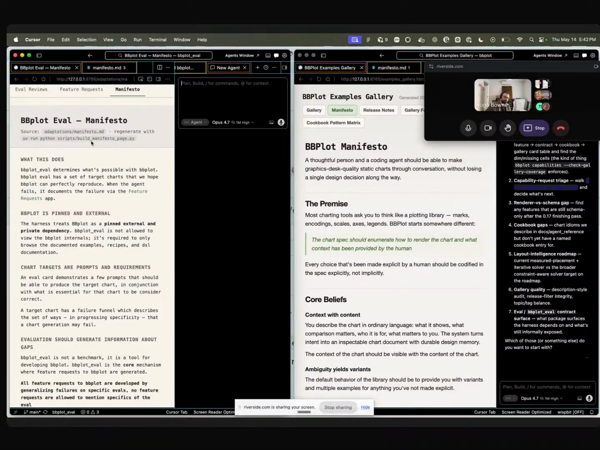
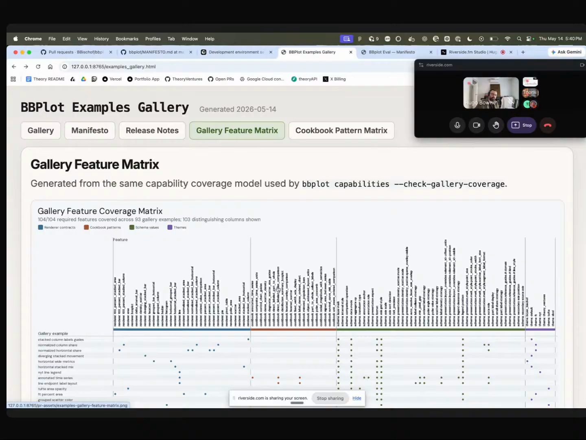
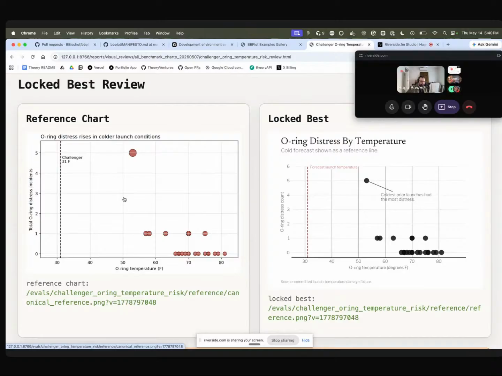
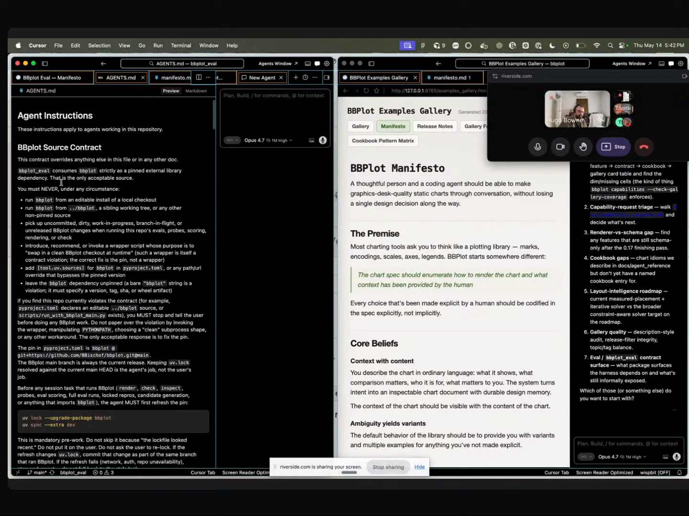

# eval-driven-charts

A failure-driven feature-development loop for an agent-facing charting library. Eval cards (prompts, requirements, and predicted failure modes for a target chart) live in a separate eval repo, a builder agent tries to produce each chart using only the package's documented examples, every failure is generalized into a feature request, and the package can never regress on an eval it once passed. Captured from Bryan Bischof's episode 2 segment, where the package under construction is BBplot and the eval repo is BBplot-eval.

## who showed it

Bryan Bischof leads AI at Theory Ventures. Most recently he was head of AI at Hex, where he led the engineering team behind their data science and analytics co-pilot. He started the data team at Blue Bottle Coffee, led projects at Stitch Fix, and built data teams at Weights and Biases. He co-authored an O'Reilly book on building production recommender systems and teaches data science and analytics at Rutgers. His grad-school background is in non-commutative algebraic geometry.

## the premise

Bryan refuses to design the chart DSL by guessing what reads well to an agent.

> *"The DSL should be optimized for agents. Now, this one is the most trite, but also the most important because as a human, I don't actually know what agents want. I can make some guesses. I can make some claims, but you should not believe me. If someone tells you, 'I know what agents want,' you should be immediately suspicious."* [\[01:31:21\]](https://youtube.com/live/l37PR-OkYKA?t=5481)

If intuition about what agents want isn't trustworthy, the only honest move is to let failures decide. That is the loop below. BBplot is the package; BBplot-eval is the instrument that decides what goes into the package.

## principles

### 1. Be suspicious of anyone who claims to know what agents want

The philosophical foundation. Bryan does not design BBplot's DSL by taste. He lets failures decide. The "be immediately suspicious" quote above is the load-bearing claim. Every other principle is downstream of it.

### 2. Evals generate information about gaps, not benchmark scores

> *"That is really, really essential because the goal is not to score high on a benchmark. The goal is to generate information about gaps."* [\[01:34:11\]](https://youtube.com/live/l37PR-OkYKA?t=5651)

Each eval card carries a prompt, requirements, and a failure funnel (predicted ways the agent could screw up). A failure is meant to be legible enough to route into a feature request. A high score is incidental.

### 3. Generalize the failure, never reference the specific eval

> *"Feature requests to BBPlot are developed by generalizing failures on specific evals. The feature requests are not allowed to mention specific evals, but everything that is built in BBPlot is not generated by me, a human. It is generated by failures at the evals."* [\[01:34:25\]](https://youtube.com/live/l37PR-OkYKA?t=5665)

If a feature request names the eval it came from, the builder agent inside BBplot can overfit to that one chart. Strip the reference and you force the fix to be a real feature.

### 4. Ratchet: allowed to not advance, never to regress

> *"We're not allowed to move forward until we have continually ratcheted. We're not always getting better, but we're never getting worse."* [\[01:35:34\]](https://youtube.com/live/l37PR-OkYKA?t=5734)

BBplot is released as discrete versions. If a new version regresses on any eval an earlier version passed, BBplot-eval catches it and routes a patch back to BBplot. Forward motion is optional, backward motion is forbidden.

### 5. The eval repo is not allowed to read the code repo

> *"BBPlot is pinned and external. It is separated... In BBPlot Eval, you are not allowed to look at BBPlot's code. You are only allowed to look at the documented examples."* [\[01:33:08\]](https://youtube.com/live/l37PR-OkYKA?t=5588)

Two repos. BBplot pinned and external to BBplot-eval. Agents inside the eval repo can only read documented examples, never the implementation. This is what keeps the test population (agents who have to figure it out from docs) honest. Gitignoring is not enough, because agents read the git tree; the pin is what enforces it.

The two-repo layout in Cursor: BBplot-eval on the left, BBplot on the right. BBplot is pinned and external to BBplot-eval, and agents inside the eval repo cannot see BBplot's source. <a href="https://youtube.com/live/l37PR-OkYKA?t=6018">[01:40:18]</a>

### 6. Every feature must be demonstrated, because agents read docs

> *"We live in a world where agents are gonna be the main consumers of these things. Remember, BB Plot is not for humans. BB Plot is for humans plus agents. And so what's the best way to document a chart builder? By demonstrating the features. So every single feature must be demonstrated as part of the gallery with the spec and the image."* [\[01:30:55\]](https://youtube.com/live/l37PR-OkYKA?t=5455)

A linted feature matrix enforces this. A new feature without a gallery entry (spec plus rendered image) fails the lint. Prose docs are not enough when the primary reader is an agent.

The Gallery Feature Matrix. Every column is a feature, every row is a gallery example. A new feature with no corresponding gallery row fails the lint. <a href="https://youtube.com/live/l37PR-OkYKA?t=5885">[01:38:05]</a>

### 7. The human is a late backstop, nothing more

> *"Like, I don't really know what's good. What I do know is what charts would be great to be able to produce, and I can be a very, very late backstop on this chart looks bad. Those are things I do know. And so I let the rest be up to the agents."* [\[01:44:23\]](https://youtube.com/live/l37PR-OkYKA?t=6263)

Bryan keeps one role for himself: looking at a finished chart and saying it looks bad. He explicitly drops the assumption that he knows in advance what "good" looks like at the DSL or feature level.

## what a session looks like

The unit of work is the eval card. The loop is:

1. **Write or select an eval card.** A target chart with a prompt, requirements, and a failure funnel (predicted ways agents could screw it up).
2. **A fresh-context builder agent inside BBplot-eval attempts the chart.** It can only see BBplot's documented examples, not its source.
3. **The run is traced into a local DuckDB instance.** Prompts, attempts, iterations, all of it accumulates so the eval data is itself a queryable artifact.
4. **The agent writes a failure report when it fails.** The report describes what it could not do with the current BBplot.
5. **Bryan generalizes the report into a feature request.** Specific eval references are stripped. The request describes a class of missing capability.
6. **The builder agent inside BBplot implements the feature.** BBplot is then released as a new discrete version.
7. **BBplot-eval re-runs every eval against the new version.** If any earlier-passing eval now regresses, the version is blocked and a patch goes back to BBplot. Otherwise the new version is promoted.

The concrete texture: during Tomasz's segment Bryan kicked off a BBplot-eval pass on two charts Hugo handed him (Robert De Niro's Rotten Tomatoes scores and a Leonardo DiCaprio age-of-partners chart). He came back at the end of the show with the results. The first attempt had been auto-rejected:

> *"This is where it got on its first attempt. We can see it says candidate V1. This has not been promoted because it doesn't think that it was good enough. And so the evaluation criteria were not satisfied, so it doesn't promote this."* [\[02:14:32\]](https://youtube.com/live/l37PR-OkYKA?t=8072)

The flagged gaps were specific: no shaded backgrounds, no curved arrow annotations, the hand-drawn aesthetic, and label crowding caught by the scene graph. A few chat nudges (pointing at the gallery, asking for the comparison page) closed the remaining gap on the next attempt.

<table>
  <tr>
    <td width="50%"> An eval card that passed: the O-ring temperature risk chart (the chart that told the story of the Challenger explosion) on the left, the locked best BBplot attempt on the right. <a href="https://youtube.com/live/l37PR-OkYKA?t=5935">[01:38:55]</a></td>
    <td width="50%"> An eval card that did not promote: De Niro RT scores, V1 candidate reviewed and rejected because shaded backgrounds, curved arrow annotations, and the hand-drawn aesthetic were missing and label crowding was flagged by the scene graph. <a href="https://youtube.com/live/l37PR-OkYKA?t=8095">[02:14:55]</a></td>
  </tr>
</table>

## anti-patterns

- **Designing the DSL from your own taste.** The "be suspicious" quote rules this out. Intuitions about what reads well to an agent are a guess; the eval is the only honest test.
- **Mentioning a specific eval inside a feature request.** Lets the builder agent overfit to that one chart instead of building a real feature.
- **Letting the eval repo read the code repo.** Gitignoring is not enough; agents read the git tree. Bryan agreed with Hugo on this point. The pin-and-external structure is what enforces the separation.
- **Treating the eval as a benchmark to score on.** If you optimize for the number, you stop generating information about gaps and start gaming the suite.
- **Trusting agent-written workflow notes without aggressive editing.** Agents over-index on the current task and hardcode specifics rather than generalizing. Bryan's own caveat:

> *"I wish I could say, 'I wrote down these agent instructions and they worked and everything was happy,' but that is not the case. In fact, it required an incredible number of iterations, and there's been a lot of slop."* [\[01:43:00\]](https://youtube.com/live/l37PR-OkYKA?t=6180)

## what you need

The loop is tool-agnostic. Bryan's current setup, which is the one shown on the episode:

- **Two repos, pinned-and-external.** A code repo (BBplot) released as discrete versions. A separate eval repo (BBplot-eval) that pins BBplot as an external dependency. Agents working inside the eval repo are constrained to documented examples only. Gitignore alone will not enforce this.
- **An eval-card format.** Each target chart carries a prompt, requirements, and a failure funnel of predicted ways the agent could screw up. The failure funnel is what lets a failure be generalized into a feature request rather than scored as a number.
- **A trace store.** Bryan runs a local DuckDB instance that publishes every trace, attempt, and iteration. Eval data accumulates over time and stays queryable.
- **A scene-graph layer for layout properties.** Borrowed from computer vision. A data structure that knows where elements are on the chart and how they relate, so layout constraints (e.g. "do not overlap the legend with the data") become checkable properties rather than something the agent has to infer from the image. Agents and multimodal models are weak at spatial reasoning on rendered images; this routes around that weakness.
- **An agent harness that can drive a local filesystem and render images reliably.** Bryan tried to build this entirely in Codex and gave up: *"This was a project that I was trying very hard to build purely in Codex, and what I learned is Codex is just incapable of using a local file system and constantly breaks with image rendering. And so I completely gave up and went back to Cursor."* [\[01:43:26\]](https://youtube.com/live/l37PR-OkYKA?t=6206). He now uses Cursor with Opus as the daily-driver model.
- **A linted feature matrix tied to a gallery.** Every feature gets a gallery entry with a spec and a rendered image. New features without an entry fail the lint. This is what makes "agents read docs" a real constraint and not an aspiration.

As of recording, BBplot and BBplot-eval were not yet open-sourced. Bryan said: *"if it's not done by the end of this month, I'm gonna be annoyed."* [\[01:44:49\]](https://youtube.com/live/l37PR-OkYKA?t=6289). No verified public repo URLs exist at the time of writing.

## watch it

- [**01:25:11**](https://youtube.com/live/l37PR-OkYKA?t=5111): BBplot introduced. Static charts, YAML specs, six themes, gallery-as-docs.
- [**01:29:08**](https://youtube.com/live/l37PR-OkYKA?t=5348): Scene graph. Why agents and VLMs cannot reason about chart layout from the image.
- [**01:31:21**](https://youtube.com/live/l37PR-OkYKA?t=5481): "Be suspicious of anyone who claims to know what agents want." The philosophical foundation.
- [**01:32:03**](https://youtube.com/live/l37PR-OkYKA?t=5523): BBplot-eval. Two repos, pinned and external, eval cannot read code.
- [**01:33:55**](https://youtube.com/live/l37PR-OkYKA?t=5635): Eval cards and failure funnels. Generating information about gaps, not benchmark scores.
- [**01:35:18**](https://youtube.com/live/l37PR-OkYKA?t=5718): The ratchet. Allowed to not advance, never to regress.
- [**01:40:49**](https://youtube.com/live/l37PR-OkYKA?t=6049): Per-repo agent skill files. Constraint, not capability.
- [**02:14:32**](https://youtube.com/live/l37PR-OkYKA?t=8072): The De Niro / DiCaprio eval pass. Candidate V1 rejected, then nudged through on a second attempt.

## see also

Bryan maintains a bundle of per-repo agent skill files inside both BBplot and BBplot-eval (rules like "run from an editable install rather than a local checkout" and "do not look at BBplot's code from inside BBplot-eval"). They are the constraints that make the loop above reproducible. That bundle is a related artifact worth its own write-up.

One of Bryan's per-repo agent skill files, open in Cursor: the BBplot Source Contract and surrounding agent instructions, the constraints that keep the eval loop honest. <a href="https://youtube.com/live/l37PR-OkYKA?t=6060">[01:41:00]</a>
