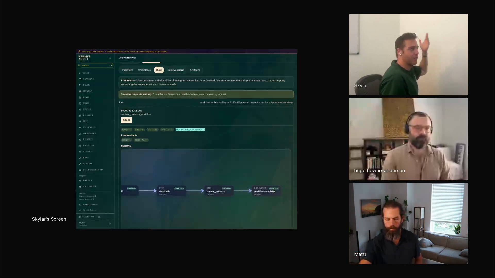

# hermes-dynamic-workflows

Skylar Payne uses Hermes, his always-on personal agent harness, to turn agent work into workflows with typed steps, saved artifacts, review cards, and triggers. Palmer, his Hermes agent, handles coding jobs that must use worktrees, content-writing jobs where it researches angles and Skylar chooses one, and trip-planning jobs that wait until the next hotel or activity decision. The workflow can ask Skylar for a typed decision, save the artifact, resume later from a trigger, and keep a trace of what worked.

A Hermes workflow run as a DAG: the content creation workflow has completed steps for visual aids, content artifacts, and workflow completion. <a href="https://youtube.com/live/UwAGIkWFQ78?t=4095">[01:08:15]</a>

## who showed it

Skylar Payne is the founder of Wicked Data. He spent ten years building AI systems at Google, LinkedIn, and startups, and now helps engineering teams build AI systems they can understand and improve. In Episode 6, he shows Palmer, his Hermes agent, plus [`hermes-workflows`](https://github.com/skylarbpayne/hermes-workflows), the workflow plugin he built to give that agent stricter structure, human checkpoints, artifacts, and traces.

## the premise

Skylar is trying to make agents follow a process when the process matters. In coding, that means every agent touching a repo needs its own worktree or checkout. A prompt can say that. A skill can say that. But the instruction still sits inside the agent's context with everything else, and sometimes the agent skips it. Then Skylar has to clean up the repo by hand.

> *"One of the problems is that prompts and skills are effectively suggestions. At the end of the day, it's the agent is mediating what actually happens."* [\[01:03:48\]](https://youtube.com/live/UwAGIkWFQ78?t=3828)

On screen, Skylar shows a content-writing workflow. Palmer starts with topic research, saves the research as an artifact, proposes possible angles, and puts a selection card in the review queue. Skylar chooses the angle, submits it, and the workflow engine keeps running. The same machinery handles coding plans, where Skylar can approve a markdown-rendered plan or request changes, and trip planning, where the workflow waits until the next hotel or activity trigger appears.

> *"I started thinking about how really the thing we want here is maybe a workflow that has agent steps in it."* [\[01:04:13\]](https://youtube.com/live/UwAGIkWFQ78?t=3853)

Skylar shows the Hermes Workflows dashboard: runs, artifacts, and a review queue where human decisions resume the workflow. <a href="https://youtube.com/live/UwAGIkWFQ78?t=4130">[01:08:50]</a>

## principles

### 1. Move repeated procedures out of prompt text

Skylar built the plugin after agent instructions kept failing at the same procedural boundary. The workflow gives the agent a runnable structure for the steps that usually live in prompt or skill text.

> *"The performance of a certain skill or prompt isn't constant. It depends on what else is in the context."* [\[01:04:02\]](https://youtube.com/live/UwAGIkWFQ78?t=3842)

### 2. Make code the workflow interface

The agent writes Python against a small set of workflow primitives. That gives the workflow typed input, typed output, saved step outputs, and composable control flow.

> *"The sort of like agentic interface here is really just code. And so the agent just writes Python code."* [\[01:05:55\]](https://youtube.com/live/UwAGIkWFQ78?t=3955)

### 3. Give agent steps typed boundaries

The `agent` primitive runs a named subagent with a prompt and a return type. The surrounding workflow also has structured input and output, so the run has a typed contract across calls.

> *"If you want to run something as a subagent, basically, you just call agent, you give it a name, give it the prompt, you can tell it a type to return."* [\[01:06:17\]](https://youtube.com/live/UwAGIkWFQ78?t=3977)

### 4. Treat human decisions as first-class steps

Skylar added `ask` as the human counterpart to `agent`. The workflow can request structured output from a person, then continue from that decision.

> *"Sometimes I don't want to ask the agent, I want to ask a human to give me the same structured output."* [\[01:07:28\]](https://youtube.com/live/UwAGIkWFQ78?t=4048)

### 5. Compose loops from work and checks

The primitives are useful because they compose. Agent steps, human asks, `parallel`, and `pipeline` can become loops where one step does work and another checks it.

> *"It's really you have something to do and then you have something to check."* [\[01:07:51\]](https://youtube.com/live/UwAGIkWFQ78?t=4071)

### 6. Put human review in a queue

The review queue is where Skylar spends most of his time. It collects the places where a workflow has asked for a decision: select a content angle, approve a coding plan, or request changes.

> *"Where I spend most of my time is this review queue. Because this is the stuff where the workflow said, like, hey, ask a human something."* [\[01:08:50\]](https://youtube.com/live/UwAGIkWFQ78?t=4130)

The approval surface supports both acceptance and correction.

> *"If I like it, I could click approve. Or I can say, no, not that. Do X instead. And then I could request changes."* [\[01:10:21\]](https://youtube.com/live/UwAGIkWFQ78?t=4221)

### 7. Let long-running work resume from triggers

Some workflows should wait for the next touchpoint and resume from an event. Skylar uses trip planning as the example: hotel booking, activities, and later decisions happen when the trigger appears.

> *"The workflow that's running has no process that's continuously running. It's all working off triggers."* [\[01:11:01\]](https://youtube.com/live/UwAGIkWFQ78?t=4261)

### 8. Turn daily feedback into traces

Each structured step and human decision becomes data. Skylar expects those traces to help with prompt optimization or distillation into smaller models.

> *"Each of these steps has a structured output and we've layered human feedback into it."* [\[01:11:43\]](https://youtube.com/live/UwAGIkWFQ78?t=4303)

> *"That now allows me to easily sample traces for outline drafting."* [\[01:12:03\]](https://youtube.com/live/UwAGIkWFQ78?t=4323)

## what a session looks like

1. **Choose a repeated procedure.** Pick work where the steps matter: coding plans that must use worktrees, content workflows that need angle selection, or trip planning that needs future touchpoints.
2. **Define typed inputs and outputs.** Make the workflow accept structured input and return structured output, so the run has a contract.
3. **Add agent steps.** Use `agent` for work that can be delegated to a named subagent with a prompt and return type.
4. **Add human gates.** Use `ask` when the next step needs a person to choose, approve, reject, or provide a structured answer.
5. **Compose the run.** Use `parallel` for independent work, `pipeline` for ordered work, and loops when the workflow needs a work step and a check step.
6. **Save artifacts.** Store research, plans, drafts, and step outputs so the human can inspect what happened without reconstructing the run from chat.
7. **Work the review queue.** The human reviews cards, approves good plans, requests changes, or supplies missing decisions. The workflow engine resumes from that decision.
8. **Use triggers for long-running projects.** Let the workflow sleep between hotel decisions, activity planning, coding approvals, or later checkpoints.
9. **Reuse the traces.** Structured outputs plus human feedback become a record that can later support prompt tuning, evaluation, or distillation.

## anti-patterns

- **Encoding a brittle process only in a prompt.** If a skipped step creates cleanup work, make the step part of an executable workflow.
- **Making every step an agent step.** Human decisions need their own primitive, because some choices should be made by the person who owns the outcome.
- **Letting artifacts disappear into chat.** Saved step outputs make the run inspectable and reusable.
- **Keeping long-running workflows alive as processes.** Trigger-based runs fit projects that naturally wait between decisions.
- **Treating the review queue as a dashboard afterthought.** The queue is the operating surface where the human keeps the workflow moving.
- **Collecting feedback without structure.** The trace becomes useful later because the step outputs and human responses are typed.

## what you need

Skylar shared the implementation after the episode: [`skylarbpayne/hermes-workflows`](https://github.com/skylarbpayne/hermes-workflows). The pattern can travel, but his version is built as a Hermes plugin.

- **Hermes.** Skylar built this as a Hermes dashboard plugin because he wanted something Palmer could use directly.
- **[`hermes-workflows`](https://github.com/skylarbpayne/hermes-workflows).** Skylar's open source plugin provides workflow execution, review queues, artifacts, human feedback, and trigger-based continuation.
- **Workflow primitives.** `agent`, `ask`, `parallel`, and `pipeline` are the core operations Skylar showed.
- **Typed inputs and outputs.** Each workflow and step should have enough structure that outputs can be reviewed, stored, sampled, and reused.
- **A review surface.** Humans need a queue for approvals, selections, change requests, and structured answers.
- **Artifact storage.** Research, plans, drafts, and other step outputs need durable storage inside the run. Skylar's related [`artifactd`](https://github.com/skylarbpayne/artifactd) repo is the Hermes artifact workspace he showed earlier in the segment.
- **Optional code inspection links.** Skylar's coding workflows include a VS Code SSH link when the human wants to inspect suspicious or surprising work.

## watch it

- [**01:03:48**](https://youtube.com/live/UwAGIkWFQ78?t=3828): Skylar explains why prompts and skills can fail as procedural guarantees.
- [**01:04:13**](https://youtube.com/live/UwAGIkWFQ78?t=3853): He names the core idea: workflows with agent steps.
- [**01:04:49**](https://youtube.com/live/UwAGIkWFQ78?t=3889): `hermes-workflows` is shown as an open source Hermes plugin.
- [**01:05:55**](https://youtube.com/live/UwAGIkWFQ78?t=3955): The agentic interface is Python code.
- [**01:06:17**](https://youtube.com/live/UwAGIkWFQ78?t=3977): `agent` runs a named subagent with typed output.
- [**01:07:28**](https://youtube.com/live/UwAGIkWFQ78?t=4048): `ask` requests structured output from a human.
- [**01:07:51**](https://youtube.com/live/UwAGIkWFQ78?t=4071): Loops compose from something to do and something to check.
- [**01:08:36**](https://youtube.com/live/UwAGIkWFQ78?t=4116): The dashboard shows the DAG and saved artifacts.
- [**01:08:50**](https://youtube.com/live/UwAGIkWFQ78?t=4130): The review queue becomes the human operating surface.
- [**01:10:21**](https://youtube.com/live/UwAGIkWFQ78?t=4221): Skylar approves or requests changes on a markdown-rendered coding plan.
- [**01:11:01**](https://youtube.com/live/UwAGIkWFQ78?t=4261): Trigger-based workflows keep trip planning moving without a continuously running process.
- [**01:11:43**](https://youtube.com/live/UwAGIkWFQ78?t=4303): Structured steps plus human feedback become trace data.
- [**01:13:04**](https://youtube.com/live/UwAGIkWFQ78?t=4384): Skylar clarifies that the system is implemented for Hermes.
- [**01:17:36**](https://youtube.com/live/UwAGIkWFQ78?t=4656): Coding workflows include a VS Code SSH link for code inspection.

## see also

- [`skylarbpayne/hermes-workflows`](https://github.com/skylarbpayne/hermes-workflows) for the open source Hermes plugin Skylar showed.
- [`skylarbpayne/artifactd`](https://github.com/skylarbpayne/artifactd) for Skylar's related artifact workspace for generated HTML documents.
- [`workflows/personal-agent-operations/`](../personal-agent-operations) for Skylar's always-on Palmer workflow across community operations, wedding planning, artifacts, and Obsidian memory.
- [`workflows/agent-feedback-systems/`](../agent-feedback-systems) for Matt Rocklin's adjacent pattern: define feedback before letting agents take long turns.
