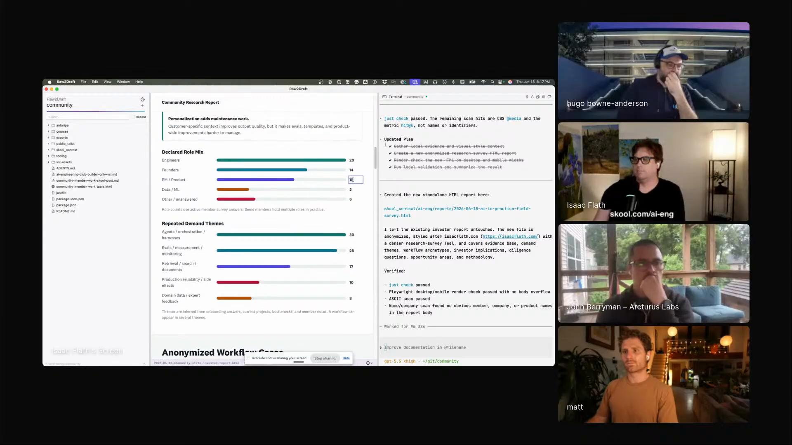
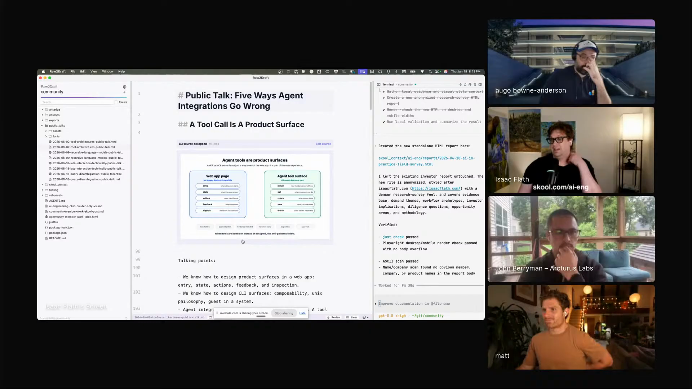
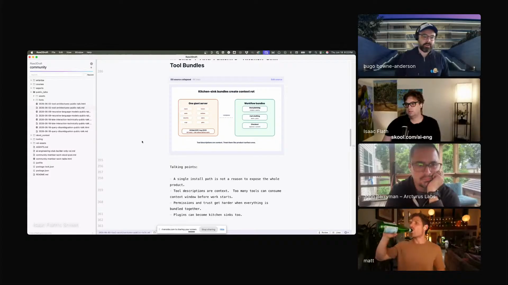
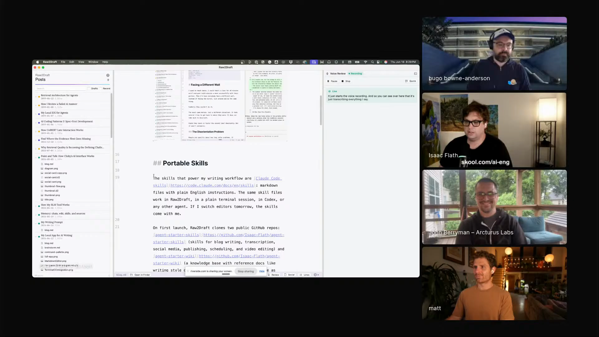

# human-editable-ai-artifacts

A workflow for asking agents to make rich artifacts that stay editable by humans: HTML reports, markdown presentations, D3 and D2 diagrams, screenshots, and voice-reviewed drafts. Captured from Isaac Flath's Episode 5 segment, where Raw2Draft lets Codex produce an artifact, render and check it locally, then leave Isaac a clean surface for the final human pass.

## who showed it

Isaac Flath is an AI and product engineer who builds local tools for writing, teaching, private knowledge, and real workflows. In Episode 5 he showed Raw2Draft, a personal app that combines a local editor, Codex, skills, rendered artifacts, voice review, and file-system context.

## the premise

Isaac's premise is that agent output is most useful when it gives the human a strong starting point without trapping the final work inside an uneditable render. Raw2Draft creates HTML, diagrams, presentations, and prose drafts, but it keeps the source nearby and makes the rendered artifact easy to touch.

> *"I can have it create HTML, I can have it create this nice interface, but I can also manually edit it."* [\[01:15:10\]](https://youtube.com/live/6zju7hyCFl0?t=4510)

The workflow is about preserving the last-mile editing surface. Isaac wants the model to get most of the way there, then stop in a form where he can finish the work himself.

> *"It's ninety percent of the way there. Let me do the last ten percent manually."* [\[01:25:52\]](https://youtube.com/live/6zju7hyCFl0?t=5152)

Isaac shows a generated HTML report where text, numbers, and labels can be edited directly in the rendered page. <a href="https://youtube.com/live/6zju7hyCFl0?t=4497">[01:14:57]</a>

## principles

### 1. Make generated output directly editable

The important property is not that the artifact is HTML. It is that the artifact is still a place where the human can make small final edits without asking the agent to rewrite the whole thing.

> *"Any text anywhere in here, I can edit and change."* [\[01:14:57\]](https://youtube.com/live/6zju7hyCFl0?t=4497)

Raw2Draft uses the browser's editable text behavior temporarily, then saves the result back into the artifact.

> *"It adds a content editable HTML attribute on it, lets me edit it, saves back to the HTML and removes that back."* [\[01:15:37\]](https://youtube.com/live/6zju7hyCFl0?t=4537)

### 2. Keep the source plain, even when the artifact is rich

Isaac's default working surface is markdown. That keeps the human-readable source simple while still allowing the built artifact to contain diagrams, slides, links, code, and talking points.

> *"Mostly the most common thing I do is I work in a markdown file."* [\[01:16:35\]](https://youtube.com/live/6zju7hyCFl0?t=4595)

For presentations, a build step turns the markdown file into a presentation, with speaker notes visible while he works.

> *"There's a skill that does build step basically, and that build step turns the presentation into a presentation."* [\[01:18:19\]](https://youtube.com/live/6zju7hyCFl0?t=4699)

The source stays markdown, while Raw2Draft renders diagrams and presentation material inline. <a href="https://youtube.com/live/6zju7hyCFl0?t=4595">[01:16:35]</a>

### 3. Use code-backed visuals when you want the agent to help

Isaac uses D3, D2, Mermaid, and related inline code blocks because the agent can write the code and the local app can render the result. The human describes the visual intent and keeps the output inspectable.

> *"I really don't want to write D3 code."* [\[01:17:06\]](https://youtube.com/live/6zju7hyCFl0?t=4626)

When Hugo asks whether Isaac knew D3 before, Isaac's answer is the point of the workflow.

> *"No, and I still don't. I just describe what I want and it comes out okay."* [\[01:19:46\]](https://youtube.com/live/6zju7hyCFl0?t=4786)

D3-backed slides are visible in the writing surface, so the generated code becomes a rendered artifact Isaac can judge. <a href="https://youtube.com/live/6zju7hyCFl0?t=4786">[01:19:46]</a>

### 4. Run visual checks before the human final pass

Generated visual artifacts need their own review loop. Isaac uses model critique on screenshots and diagrams before treating the artifact as ready for human review.

> *"It looks for like overlapping labels and a whole bunch of other criteria and does a little bit of a feedback loop to get it closer before I look at it."* [\[01:20:37\]](https://youtube.com/live/6zju7hyCFl0?t=4837)

He uses the same pattern for video and diagram critique.

> *"Often it'll take a screenshot or it'll look at a diagram and it sends it to Gemini to critique it."* [\[01:30:37\]](https://youtube.com/live/6zju7hyCFl0?t=5437)

### 5. Preserve a manual last mile

Isaac's frustration with generated images and design artifacts is that they can be close but hard to finish. A flat image might look good while destroying the layers, handles, and object boundaries the human needs for final edits.

> *"I can generate an image and then I'll just upload it as a flat image to you. And I'm like, well now I can't move anything."* [\[01:25:52\]](https://youtube.com/live/6zju7hyCFl0?t=5152)

The workflow succeeds when the final ten percent is easy to enter. It fails when the agent output looks polished but cannot be meaningfully adjusted.

### 6. Use voice when critique is easier to point at than type

Raw2Draft lets Isaac highlight or look at a section, speak a critique, transcribe it, and write that review back to a markdown file. Then the agent applies the critique to the active file.

> *"It's like a point and talk interface."* [\[01:26:50\]](https://youtube.com/live/6zju7hyCFl0?t=5210)

The critique can be precise about editing moves.

> *"This is throat clearing. We don't need it. You can just start with the point."* [\[01:27:34\]](https://youtube.com/live/6zju7hyCFl0?t=5254)

Voice review pairs spoken critique with the current text selection, then writes the review into a markdown file for the agent to apply. <a href="https://youtube.com/live/6zju7hyCFl0?t=5210">[01:26:50]</a>

### 7. Ask the model for plainness, then add taste yourself

Isaac does not ask the model to produce finished taste. For writing, he wants deletion, clarity, and a plain base, because the human can add judgment after the model has removed the bloat.

> *"I'm trying to get it to cut as much out as possible and be as plain as possible, because I'm gonna add the taste in."* [\[01:52:02\]](https://youtube.com/live/6zju7hyCFl0?t=6722)

That rule generalizes beyond prose. The agent should produce an artifact that is clear enough to edit, not an over-styled final object that resists human finishing.

## what a session looks like

1. **Start from a plain source file.** Use markdown, HTML, or another source format the human can read and version.
2. **Ask the agent to generate the rich artifact.** Let it write the report, diagram, presentation, screenshot, or draft against local context.
3. **Render locally.** Open the artifact in the same environment where the source and agent session are still visible.
4. **Inspect the rendered result.** Look at layout, labels, evidence, repetition, and whether the artifact communicates the intended point.
5. **Edit directly when the fix is small.** Change text, numbers, labels, or obvious copy in the rendered surface instead of sending a full rewrite request.
6. **Run model critique on visual artifacts.** Use screenshots or diagram renders to catch overlaps, unclear labels, and visual clutter.
7. **Use voice review when pointing is faster.** Highlight or look at the problem area, speak the critique, and have the agent apply it to the active file.
8. **Do the human taste pass last.** Once the model has made the artifact plain, clear, and structurally useful, finish the piece by hand.

## anti-patterns

- **Flattening too early.** A flat image or polished render can remove the layers and handles needed for final edits.
- **Letting the agent rewrite the whole artifact for small fixes.** Direct edits are faster and less risky when only a label, sentence, or number needs to change.
- **Hiding the source file.** The workflow depends on keeping the markdown, HTML, or code-backed source close to the rendered artifact.
- **Skipping visual checks.** A human should not be the first system to notice overlapping labels or broken layout.
- **Asking for finished style too early.** Isaac's workflow works because the model produces a plain starting point and the human adds taste after.
- **Building an artifact with no obvious manual entry point.** If the human cannot finish the last ten percent, the agent output is less useful than it looks.

## what you need

The workflow is harness/tool-agnostic in principle. Isaac's current setup, which is the one demoed on the show:

- **A local editor or app with active-file context.** Isaac uses Raw2Draft, a personal app that knows the current file and nearby project context.
- **An agent with project skills.** Isaac describes the app as Codex running with skills in it.
- **Plain source files.** Markdown is Isaac's default because it can hold prose, talking points, links, and code blocks without hiding the source.
- **A renderer for rich artifacts.** Raw2Draft renders HTML reports, presentations, D3, D2, Mermaid, and related inline blocks.
- **A direct edit path for rendered output.** The key feature is not just rendering, but making the rendered text editable and saving it back.
- **Visual review tooling.** Isaac uses screenshots and Gemini critique to check diagrams and visuals.
- **Voice transcription for review.** Isaac uses AssemblyAI for voice review and word-level timestamps.
- **A habit of final human editing.** The workflow depends on the human doing the last pass instead of asking the agent to fake finished taste.

## watch it

- [**01:13:59**](https://youtube.com/live/6zju7hyCFl0?t=4439): Isaac introduces Raw2Draft as a personal app running Codex with skills.
- [**01:14:57**](https://youtube.com/live/6zju7hyCFl0?t=4497): He shows an HTML report where any text can be edited.
- [**01:15:37**](https://youtube.com/live/6zju7hyCFl0?t=4537): He explains the contenteditable implementation.
- [**01:16:35**](https://youtube.com/live/6zju7hyCFl0?t=4595): The workflow moves into markdown as the everyday source surface.
- [**01:18:19**](https://youtube.com/live/6zju7hyCFl0?t=4699): A build skill turns markdown presentations into presentation output.
- [**01:19:46**](https://youtube.com/live/6zju7hyCFl0?t=4786): Isaac says he still does not know D3, he describes what he wants.
- [**01:20:37**](https://youtube.com/live/6zju7hyCFl0?t=4837): Visual checks look for overlapping labels and other diagram problems.
- [**01:25:52**](https://youtube.com/live/6zju7hyCFl0?t=5152): Isaac names the last-ten-percent problem for generated artifacts.
- [**01:26:50**](https://youtube.com/live/6zju7hyCFl0?t=5210): Voice review appears as a point-and-talk interface.
- [**01:27:34**](https://youtube.com/live/6zju7hyCFl0?t=5254): He critiques throat clearing and asks the agent to start with the point.
- [**01:30:37**](https://youtube.com/live/6zju7hyCFl0?t=5437): Screenshots and diagrams can be sent to Gemini for critique.
- [**01:52:02**](https://youtube.com/live/6zju7hyCFl0?t=6722): Isaac explains why he asks AI writing to become plain before he adds taste.

## see also

- [`workflows/agent-editable-video-timelines/`](../agent-editable-video-timelines) for Matt Palmer's adjacent workflow where an agent operates on a human-facing video timeline.
- [`workflows/personal-tools-that-dont-die/`](../personal-tools-that-dont-die) for the personal-software maintenance loop that keeps custom tools worth improving.
- [D3](https://d3js.org/) for code-backed data visualizations.
- [D2](https://d2lang.com/) and [Mermaid](https://mermaid.js.org/) for diagram formats that can live inside source files.
- [AssemblyAI](https://www.assemblyai.com/) for the transcription service Isaac names in the episode.
- [Gemini](https://gemini.google.com/) for the visual critique model Isaac mentions.
